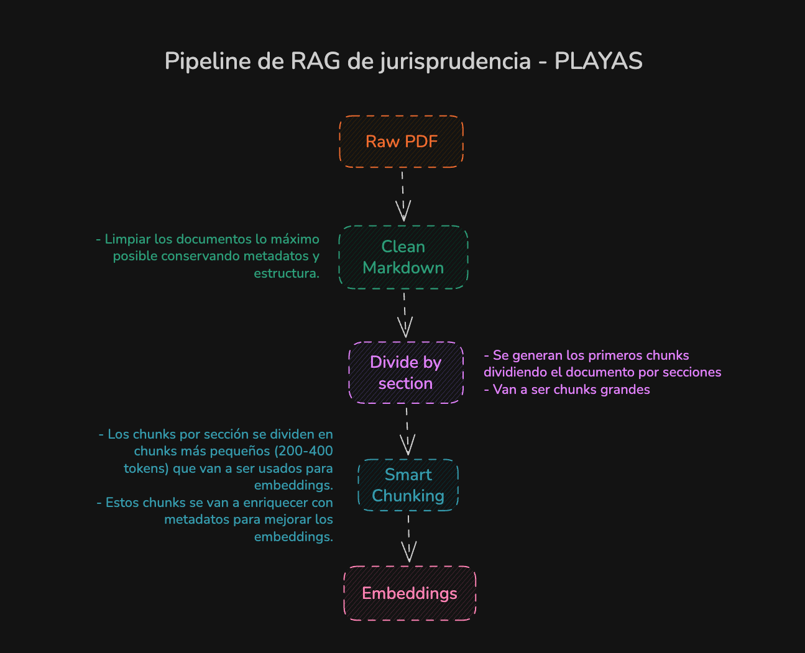

# ATLAS

**Sistema agéntico de apoyo para la orientación normativa y jurisprudencial sobre playas en Colombia.**

Agente conversacional de **jurisprudencia y normativa colombiana sobre playas y dominio público marítimo-terrestre**. Procesa sentencias en PDF (Consejo de Estado, Tribunales Administrativos) y normativa (decretos, reglamentos), los indexa semánticamente diferenciados por `doc_type` y los expone como un agente **LangGraph** sobre una API FastAPI consumida por un frontend Next.js con autenticación, historial de conversaciones, calificación de respuestas y panel de administración.

- [Registro de archivos indexados](docs/archivos-indexados.md)
- [Estructura típica de sentencias](docs/DOCUMENT_SECTIONS.md)
- [Configuración manual de Firebase](docs/firebase-config-manual.md)
- [Scripts operacionales y utilidades](docs/SCRIPTS.md)

---

## Arquitectura

Tres capas independientes que comparten `data/` y servicios externos (ChromaDB, Ollama, Firebase, proveedor LLM):

```
┌──────────────────────┐     ┌──────────────────────────────────┐     ┌──────────────────┐
│  Pipeline de ingesta │  →  │  Agente LangGraph + API FastAPI  │ ←→  │ Frontend Next.js │
│  (paquete `ingest/`) │     │     (paquete `rag/backend/`)     │     │ (`rag/frontend/`)│
└──────────────────────┘     └──────────────────────────────────┘     └──────────────────┘
```

`rag/backend` e `ingest/` son **paquetes Python independientes** dentro del workspace `uv`: no comparten código, solo el directorio `data/` y los servicios externos. El frontend (`rag/frontend`, Bun) habla con la API por SSE para streaming y directamente con Firestore para historial/feedback.

---

## Pipeline de ingesta



El pipeline soporta dos tipos de documento (`doc_type`), cada uno con su propia subcarpeta en todas las capas:

| Tipo | Carpeta | Estrategia de seccionado |
|---|---|---|
| `jurisprudencia` | `data/{capa}/jurisprudencia/` | 4 secciones canónicas de sentencia |
| `normativa` | `data/{capa}/normativa/` | 1 unidad por `Artículo N` |

1. **PDF/MD → Markdown** (`data/bronze/<tipo>/`) — Docling con OCR, tablas e imágenes; limpieza exhaustiva de encabezados, pies y numeraciones. La normativa puede entrar directamente como Markdown.
2. **Bronze → Silver** (`data/silver/<tipo>/`) — normalización, fusión con metadatos legales del CSV (`raw/<tipo>/metadata.csv`, opcional) y seccionado por tipo:
   - **Jurisprudencia**: `split_by_sections()` — 4 secciones canónicas (`Contexto del caso`, `Desarrollo procesal`, `Análisis del tribunal`, `Decisión`).
   - **Normativa**: `split_by_articles()` — 1 unidad por artículo, arrastrando jerarquía `TÍTULO`/`CAPÍTULO` como metadatos.
3. **Silver → Gold** (`data/gold/<tipo>/`) — chunking de ~1000 tokens (200 de overlap) y enriquecimiento con LLM (resumen, keywords, entidades), inyectado en la metadata. El `chunk_id` incluye el tipo (`{stem}_art{N}_c{idx}` para normativa).
4. **Gold → ChromaDB** — embeddings con Ollama (`embeddinggemma`) e indexación. Cada chunk lleva `doc_type` en sus metadatos, permitiendo filtrar jurisprudencia y normativa en el retriever. En runtime el retriever combina **BM25 (30%) + vector (70%)** con fusión RRF.

---

## Agente RAG (LangGraph)

El sistema **no es un pipeline RAG fijo**: es un agente compilado en LangGraph con memoria multi-turno (`MemorySaver`) y una tool de recuperación que el LLM invoca solo cuando hace falta.

**Grafo principal** (proveedores con tool calling — OpenAI, OpenRouter, Gemini estándar):

```
START → enrich_query → agent ⇆ tools(retrieve) → END
```

- `enrich_query` reescribe la consulta con terminología jurídica para mejorar el recall.
- `agent` decide si invocar la tool `retrieve` (consulta jurídica) o responder directo (saludo, meta-pregunta).
- `tools.retrieve` corre el `HybridEnsembleRetriever` y devuelve fragmentos como `ToolMessage` + actualización de `sources` en el state.
- El agente vuelve con los docs en contexto y responde citando `[docN]`.

**Grafo fallback** (proveedores sin tool calling, p. ej. Gemma):

```
START → enrich_query → retrieve_forced → generate → END
```

`build_graph()` elige uno u otro según `get_active_provider().supports_structured_output`.

**Memoria** — el `thread_id` (UUID del frontend) persiste el historial en `MemorySaver` mientras viva el proceso. Si el servidor reinicia, el endpoint hidrata el estado desde `conversations/{id}/messages` en Firestore usando el `conversation_id`.

**Streaming SSE** — `/api/query/stream` emite eventos `status` (etapa del nodo), `token` (tokens del LLM en vivo) y un `sources` final con fuentes agrupadas y métricas de contexto.

**Selección de proveedor LLM** — `rag/core/llm_factory.py` resuelve en orden: `OPENAI_API_KEY` → `OPENROUTER_API_KEY` → `GOOGLE_API_KEY`.

---

## Integración Firebase

Autenticación, historial, calificaciones y roles viven en Firebase. El backend usa **Firebase Admin SDK** (`rag/backend/rag/api/firebase_admin.py`); el frontend usa el SDK cliente (`rag/frontend/lib/firebase.ts`).

> **Antes de ejecutar el proyecto** hay que configurar manualmente Firebase Console (Auth, reglas, índices, service account, roles): seguir paso a paso [`docs/firebase-config-manual.md`](docs/firebase-config-manual.md).

**Modelo en Firestore:**

| Colección                             | Propósito                                                                   |
| ------------------------------------- | --------------------------------------------------------------------------- |
| `users/{uid}`                         | `email`, `displayName`, `role` (`user`/`admin`/`super-admin`), `createdAt`. |
| `conversations/{id}`                  | `userId`, `threadId`, `title`, `createdAt`, `updatedAt`, `messageCount`.    |
| `conversations/{id}/messages/{msgId}` | `role`, `text`, `sources?`, `createdAt`.                                    |
| `feedback/{id}`                       | Calificaciones de conversación (tone, length, usability, overall).          |
| `message_feedback/{id}`               | Calificaciones por mensaje (pertinence, accuracy, expectedAnswer).          |

Las reglas (`docs/firebase/firestore.rules`) garantizan que cada usuario solo acceda a sus conversaciones, que el campo `role` no sea mutable desde el cliente y que el feedback solo lo lean los admins. `docs/firebase/firestore.indexes.json` versiona los índices compuestos requeridos.

`rag/api/auth.py` ofrece tres dependencias FastAPI: `get_optional_user` (token opcional), `get_current_user` (obligatorio) y `require_admin` (verifica `role` en Firestore).

---

## Estructura del repositorio

```
rag_playas/
├── rag/                          ← Dominio de serving (producto)
│   ├── backend/                  ← Subproyecto Python (paquete `rag`)
│   │   ├── rag/
│   │   │   ├── core/             ← agent, tools, retriever, llm_factory, ...
│   │   │   ├── api/              ← FastAPI: main, auth, firebase_admin, routes/
│   │   │   ├── tools/            ← utilidades de ChromaDB/Firestore
│   │   │   └── evaluation/       ← scripts RAGAS
│   │   └── tests/                ← tests del backend (+ integration/)
│   └── frontend/                 ← Next.js 16 (React 19, Bun) — autocontenido
├── ingest/                       ← Dominio de ingesta (independiente)
│   ├── pdf_to_md/, loaders.py, sections*.py, splitter_and_enrich.py, ...
│   ├── scripts/                  ← run_pipeline.sh (pipeline de datos)
│   ├── tools/                    ← utilidades de S3 + diagnóstico LLM
│   └── tests/                    ← tests de ingest
├── infra/                        ← Dominio de infraestructura
│   ├── terraform/                ← Terraform (EC2 Chroma + Ollama)
│   ├── docker/                   ← Dockerfiles + nginx.conf
│   └── scripts/                  ← ec2_*.sh, sagemaker-*.sh, deploy
├── data/                         ← Staging (frontera ingest↔rag, gitignored)
│   ├── raw/  bronze/  silver/  gold/   ← cada capa: jurisprudencia/ + normativa/
├── docs/                         ← guías + docs/firebase/ (rules, indexes, manual)
├── docker-compose.yml            ← stack de despliegue (backend + frontend + nginx)
└── Makefile
```

`uv` gestiona el workspace Python (raíz, con los miembros `rag/backend` e `ingest`); `bun` gestiona el frontend Node, autocontenido en `rag/frontend/`. El paquete `rag` se importa igual que antes (`rag.api.main`), expuesto con `PYTHONPATH=rag/backend`. El `.env` es único y vive en la raíz.

---

## Requisitos

- Python 3.12+, [`uv`](https://docs.astral.sh/uv/)
- [Bun](https://bun.sh/)
- Docker (para ChromaDB o despliegue completo)
- Ollama (local o en EC2)
- Cuenta de Firebase con Auth + Firestore habilitados
- API key de al menos un proveedor LLM: OpenAI, OpenRouter o Gemini

Diseñado para Linux. Compatible con WSL aplicando `dos2unix scripts/*.sh`.

---

## Instalación

```bash
curl -LsSf https://astral.sh/uv/install.sh | sh
git clone https://github.com/jpospinalo/rag_playas.git
cd rag_playas
uv sync --group dev
bun install
cp .env.example .env
```

Luego configurar Firebase siguiendo [`docs/firebase-config-manual.md`](docs/firebase-config-manual.md) y completar las variables de entorno descritas abajo.

---

## Variables de entorno

**Object storage compartido (`.env` en la raíz, usado por `ingest` y `rag/backend`):**

Estas variables implementan un contrato **S3-compatible**. Si `S3_ENDPOINT_URL` queda vacío, boto3 usa AWS S3; si se define un endpoint explícito, el mismo código funciona con MinIO local o cualquier proveedor compatible.

| Variable | Default | Descripción |
|----------|---------|-------------|
| `S3_BUCKET_NAME` | — | Bucket lógico compartido por ingest y backend |
| `S3_ENDPOINT_URL` | — | Endpoint explícito S3-compatible, por ejemplo `http://localhost:9000` |
| `S3_REGION` | `us-east-1` | Región del provider |
| `S3_ACCESS_KEY_ID` | — | Access key explícita |
| `S3_SECRET_ACCESS_KEY` | — | Secret key explícita |
| `S3_SESSION_TOKEN` | — | Token temporal opcional |
| `S3_ADDRESSING_STYLE` | `auto` | `auto`, `virtual` o `path` |
| `S3_VERIFY_SSL` | `true` | `true`, `false` o ruta a un CA bundle |
| `MINIO_ROOT_USER` | — | Usuario raíz para MinIO local en Docker Compose |
| `MINIO_ROOT_PASSWORD` | — | Password raíz para MinIO local en Docker Compose |

Para desarrollo local con MinIO, `.env.example` ya viene preparado con `S3_ENDPOINT_URL`, `S3_ADDRESSING_STYLE=path` y `S3_VERIFY_SSL=false`.

**Backend y proveedores LLM (`.env` en la raíz):**

| Variable | Default | Descripción |
|----------|---------|-------------|
| `CHROMA_HOST` | `localhost` | Host de ChromaDB |
| `CHROMA_PORT` | `8000` | Puerto de ChromaDB |
| `CHROMA_COLLECTION` | `rag_playas` | Nombre de la colección |
| `OLLAMA_BASE_URL` | `http://localhost:11434` | URL de Ollama |
| `OLLAMA_EMBEDDING_MODEL` | `embeddinggemma:latest` | Modelo de embeddings |
| `OLLAMA_RERANKER_MODEL` | `mistral` | Modelo reranker (opcional) |
| `OPENAI_API_KEY` | — | API key de OpenAI (máxima prioridad) |
| `OPENAI_MODEL` | `gpt-5.4-mini` | Modelo de OpenAI |
| `OPENROUTER_API_KEY` | — | API key de OpenRouter (segunda prioridad) |
| `OPENROUTER_MODEL` | `gpt-5.4-mini` | Modelo de OpenRouter |
| `GOOGLE_API_KEY` | — | API key de Gemini (tercera prioridad) |
| `GEMINI_MODEL` | `gemini-3.1-flash-lite` | Modelo de Gemini |
| `FIREBASE_SERVICE_ACCOUNT_PATH` | `firebase-service-account.json` | Ruta al service account |
| `QUERY_ENRICHMENT_ENABLED` | `true` | Activar reescritura de consultas |
| `QUERY_ENRICHMENT_HYDE` | `false` | Activar HyDE (fragmento hipotético) |

Orden de prioridad de proveedores LLM: **OpenAI** → **OpenRouter** → **Gemini** → error.

**Frontend (`rag/frontend/.env.local`):**

| Variable | Descripción |
|----------|-------------|
| `NEXT_PUBLIC_API_URL` | URL del backend (`http://localhost:8080` en local, `/api` con Docker) |
| `NEXT_PUBLIC_FIREBASE_API_KEY` | Firebase SDK Web |
| `NEXT_PUBLIC_FIREBASE_AUTH_DOMAIN` | Firebase SDK Web |
| `NEXT_PUBLIC_FIREBASE_PROJECT_ID` | Firebase SDK Web |
| `NEXT_PUBLIC_FIREBASE_STORAGE_BUCKET` | Firebase SDK Web |
| `NEXT_PUBLIC_FIREBASE_MESSAGING_SENDER_ID` | Firebase SDK Web |
| `NEXT_PUBLIC_FIREBASE_APP_ID` | Firebase SDK Web |

Cómo obtener cada una: secciones 4 y 5 de [`docs/firebase-config-manual.md`](docs/firebase-config-manual.md).

---

## Infraestructura en AWS

Dos instancias EC2 (recomendado con IP elástica). La carpeta `infra/terraform/` provisiona ambas con Terraform:

| Máquina  | Tipo        | Almacenamiento | Puerto | Servicio    |
| -------- | ----------- | -------------- | ------ | ----------- |
| ChromaDB | `t3.medium` | 12 GB gp3      | 8000   | ChromaDB    |
| Ollama   | `t3.large`  | 20 GB gp3      | 11434  | Ollama      |

```bash
cd infra/terraform/ && terraform init && terraform apply
```

Setup manual alternativo: `bash infra/scripts/ec2_chroma_db.sh` y `bash infra/scripts/ec2_ollama_embeddings.sh`.

---

## Ejecución

```bash
# Pipeline de datos (ingesta) + indexación en ChromaDB
make pipeline

# API FastAPI (docs interactivas en http://localhost:8080/docs)
make app

# Frontend (http://localhost:3000)
make frontend
```

La documentación de los endpoints está disponible automáticamente en `/docs` y `/redoc` (Swagger UI / ReDoc generadas por FastAPI).

---

## Docker

El proyecto tiene dos stacks Compose separadas para poder desplegar la ingesta y el RAG de forma independiente. Ambas usan `.env` en la raíz, construyen cada servicio desde su propio Dockerfile en `infra/docker/` y levantan un object storage **S3-compatible** local con **MinIO** más un bootstrap idempotente del bucket.

### Stack de ingesta

Levanta `ingest`, `minio`, `minio-bootstrap`, `chroma` y `ollama`. El contenedor `ingest` ejecuta el pipeline bronze/silver/gold y, por defecto, indexa la capa gold en Chroma (`INGEST_RUN_INDEXER=true`).

```bash
docker compose -f docker-compose.ingest.yml up --build

# Sólo servicios base, si se quiere ejecutar ingest manualmente después
docker compose -f docker-compose.ingest.yml up -d --build minio minio-bootstrap chroma ollama
docker compose -f docker-compose.ingest.yml run --rm ingest
```

`minio-bootstrap` espera a MinIO y crea `S3_BUCKET_NAME` con `mc mb --ignore-existing`, de modo que reiniciar la stack no rompe el flujo local.

### Stack RAG

Levanta `backend`, `frontend`, `minio`, `minio-bootstrap`, `chroma` y `ollama`. Sin nginx, el frontend queda en `http://localhost:3000` y la API en `http://localhost:8080`; por eso `NEXT_PUBLIC_API_URL` usa `http://localhost:8080` como default en este Compose.

```bash
docker compose -f docker-compose.rag.yml up -d --build

docker compose -f docker-compose.rag.yml logs -f

docker compose -f docker-compose.rag.yml down
```

`ollama` descarga automáticamente `OLLAMA_EMBEDDING_MODEL` (`embeddinggemma:latest` por defecto) si `OLLAMA_AUTO_PULL=true`. MinIO, Chroma y Ollama usan volúmenes persistentes con nombre fijo (`rag-playas-minio-data`, `rag-playas-chroma-data` y `rag-playas-ollama-data`) para que, en el mismo host Docker, la stack RAG pueda reutilizar lo indexado por la stack de ingesta.

Si quieres apuntar a AWS S3 o a otro proveedor cloud, cambia `S3_ENDPOINT_URL`, `S3_REGION`, credenciales y `S3_ADDRESSING_STYLE` en `.env`; no hace falta tocar código.

> `docker-compose.yml` se conserva como stack legado con `backend`, `frontend` y `nginx` para despliegues con reverse proxy.

---

## CI/CD

Dos workflows de GitHub Actions en `.github/workflows/`:

| Workflow | Trigger | Jobs |
|----------|---------|------|
| `ci.yml` | Push a `main`/`develop`, PRs a `main` | `quality` (Ruff lint + format check) → `test` (unit tests + Codecov) |
| `tests.yml` | Mismos triggers | Unit tests con cobertura en Python 3.12 |

Type checking (`mypy`) está deshabilitado en CI debido a errores pendientes en módulos de producción.

---

## Comandos útiles

```bash
make install          # dependencias Python
make lint / format    # ruff
make test             # pytest unitarios
make test-cov         # pytest + cobertura HTML
make test-integration # tests con servicios reales (Chroma + Ollama)
make pipeline         # pipeline completo de ingesta
make app / frontend   # API / frontend
make clean            # eliminar artefactos generados
make help             # listar todos los targets
```
