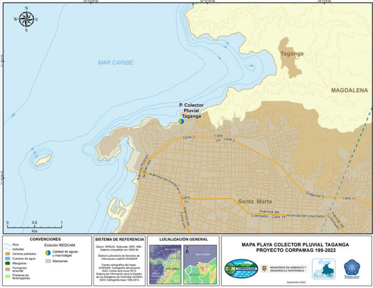

as de inteligencia artificial.

REPÚBLIC

Victoria en línea f Despacho Tribunal Administrativo del Magdalena

INNOVACIÓN

"bELERTIGA

## TRIBUNAL ADMINISTRATIVO DEL MAGDALENA DESPACHO

## Magistrada ponente: MARÍA VICTORIA QUIÑONES TRIANA

Santa Marta D.T.C.H., dieciséis (16) de diciembre de dos mil veinticinco (2025)

| Radicado         | 47001233300020210019800                                                                                                                                                                                                                                                                                                                                                                                                                                                                                                                                                                                                                                                   |
|------------------|---------------------------------------------------------------------------------------------------------------------------------------------------------------------------------------------------------------------------------------------------------------------------------------------------------------------------------------------------------------------------------------------------------------------------------------------------------------------------------------------------------------------------------------------------------------------------------------------------------------------------------------------------------------------------|
| Medio de control | Protección de los derechos e intereses colectivos (L1437/2011)                                                                                                                                                                                                                                                                                                                                                                                                                                                                                                                                                                                                            |
| Demandante       | Carlos Alberto Zúñiga Mejía, José Luis Cantillo Quiroga, Denys Amalfi Rodríguez Hernández, Claudia Vinueza y Eda Andrea Asís Mattos                                                                                                                                                                                                                                                                                                                                                                                                                                                                                                                                       |
| Demandado        | Nación - Ministerio de Ambiente y Desarrollo Sostenible - Distrito de Santa Marta - Empresa de Servicios Públicos de Santa Marta (ESSMAR) - Departamento Administrativo Distrital de Sostenibilidad Ambiental (DADSA)                                                                                                                                                                                                                                                                                                                                                                                                                                                     |
| Vinculado        | Nación - Ministerio de Vivienda, Ciudad y Territorio - Ministerio de Defensa - Dirección General Marítima (DIMAR) - Policía Nacional - Corporación Autónoma Regional del Magdalena (CORPAMAG) - Empresa Distrital de Desarrollo y Renovación Urbano Sostenible de Santa Marta (EDUS) - Instituto de Investigaciones Marinas y Costeras 'José Benito Vives de Andréis' (INVEMAR) - INTERASEO S.A. E.S.P.                                                                                                                                                                                                                                                                   |
| Tema             | Protección del ambiente marino-costero de la Bahía de Taganga por vertimientos de aguas residuales y pluviales a través del colector Bastidas-Mar Caribe y su conexión con el colector de la carrera . Se accede parcialmente a las pretensiones de la demanda porque se probó la existencia de vertimientos contaminantes que afectan la Bahía de Taganga, existe una amenaza real y continuada a los derechos colectivos, y las entidades responsables han omitido adoptar medidas suficientes para evitar o mitigar el daño. Todo ello obliga a impartir órdenes estructurales para cesar el riesgo, mitigar la contaminación y garantizar la protección ambiental. |

CONSTANCIA: Esta providencia integra el proyecto piloto institucional de la Rama Judicial para el uso responsable de herramientas de inteligencia artificial ,  en cumplimiento de la Ley 2430  de  2024,  la  Sentencia  T-323  de  2024  y  el  Acuerdo  PCSJA-12243. El  acápite  de antecedentes  fue redactado con apoyo de Microsoft 365 Copilot , respetando los principios de transparencia, autonomía humana y trazabilidad. De conformidad con lo indicado en el artículo 10 del citado Acuerdo, se dejará expresamente indicado en una nota de pie de página, los usos dados a los sistemas de IA generativa que apoyaron esta labor judicial.

OF COLON

La sala de decisión, resuelve en primera instancia, la demanda interpuesta por los señores Carlos Alberto Zúñiga Mejía, José Luis Cantillo Quiroga y las señoras Denys Amalfi Rodríguez Hernández, Claudia Vinueza y Eda Andrea Asís Mattos en contra de la Nación - Ministerio de Ambiente y Desarrollo Sostenible, Distrito de Santa Marta, Empresa de Servicios Públicos de Santa Marta  y Departamento Administrativo  Distrital  de  Sostenibilidad  Ambiental ,  una  vez  verificada  la inexistencia  de  irregularidades  que  pudieran  afectar  el  trámite  impartido,  así como la competencia, legitimación y la caducidad para el ejercicio del medio de control.

## I.
1. ANTECEDENTES

## 1.1. Posición de la parte demandante.
1. En síntesis, se señalan las siguientes situaciones fácticas :
2. Afirmó que el Corregimiento de Taganga, reconocido como Comunidad Indígena Taganga, sufre afectaciones medioambientales producto del sistema de drenaje pluvial 'Bastidas - Mar Caribe' diseñado para evacuar las aguas de escorrentía de la ciudad de Santa Marta, trayendo consigo el arrastre de basuras, sedimentos, carbón, químicos, combustibles y demás residuos producto de las aguas lluvias que desembocan en la bahía de Taganga generando contaminación y afectaciones en la actividad turística del corregimiento.
3. Así mismo, manifestó que los trabajos de conexión del colector pluvial de la  al  colector  pluvial  Bastidas  -  Mar  Caribe  no  cuenta  con  estudios ambientales  previos,  ni  tampoco  existen  planes  de  manejo,  prevención  y mitigación de impactos, ni licencia ambiental que determine las implicaciones sobre el ecosistema marino, la economía pesquera y turística, la salud de los habitantes y visitantes de Taganga.
4. Señaló que, de las graves consecuencias que ha traído este vertimiento de aguas sedimentadas a la bahía de Taganga, se encuentra la contaminación con metales pesados como el plomo y el cadmio, cuya acumulación en la carne de los peces puede ocasionar enfermedad o muerte para las personas de acuerdo con su concentración. Además, mencionó que la alcaldía dispuso de la apertura del túnel en el cual desembocan las aguas de escorrentía, con lo cual se está trasgrediendo  lo  dispuesto  en  la  normatividad  del  Plan  de  Ordenamiento Territorial, en adelante POT.
5. En síntesis, se señalan las siguientes pretensiones :
6. Se declare la bahía de Taganga como una entidad sujeta de derechos a la protección,  conservación,  mantenimiento  y  restauración  a  cargo  del  Estado Colombiano, Alcaldía Distrital de Santa Marta, Ministerio de Vivienda, Ciudad y Territorio, Ministerio de Ambiente y Desarrollo Sostenible.
7. Que, se ordene al Estado Colombiano y la Alcaldía Distrital de Santa Marta, la  expedición  de  un  documento  público,  que  exponga  un  cronograma  y estrategias de recuperación de la bahía de Taganga y sus playas en el corto y mediano plazo.

8. Además, solicitó  ordenar  a  las  entidades  demandadas  a  suspender  los trabajos de conexión del colector pluvial de la al colector pluvial Bastidas Mar Caribe.
9. Por último, que se ordene a las entidades demandadas a designar una comisión  de  guardianes  de  la  bahía  de  Taganga  y  sus  playas,  cuyo  objetivo consista en establecer una misión prioritaria relacionada con la crisis ambiental, social y económica subyacente al proyecto de la conexión pluvial de la al colector pluvial Bastidas - Mar Caribe.
10. En relación con los derechos e intereses colectivos amenazados o vulnerados, la parte actora estima que las entidades públicas han puesto en grave e inminente riesgo, los derechos colectivos al goce de un ambiente sano, protección de la diversidad e integridad del ambiente, conservación de áreas de especial importancia ecológica, a la seguridad y salubridad pública.
11. Por otra parte, se advierte que, en la oportunidad procesal correspondiente no presentaron alegatos de conclusión .

## 1.2. Posición de la parte demandada

## 1.2.1. Ministerio de Ambiente y Desarrollo Sostenible.
12. La entidad contestó  la demanda en la oportunidad legal correspondiente, oponiéndose a todas y cada una de las pretensiones, alegando por un lado que, los hechos manifestados por la parte demandante sobre la presunta afectación y  contaminación  a  la  bahía  de  Taganga  no  obedecen  a  las  competencias legalmente asignadas al Ministerio de Ambiente y Desarrollo Sostenible, dado que sus funciones radican principalmente en fijar las políticas ambientales a nivel nacional, y son las Corporaciones Autónomas  Regionales las entidades encargadas de ejecutar dichas políticas en el área de su jurisdicción.
13. En ese orden, propuso la excepción de falta de legitimación en la causa por  pasiva  y  ausencia  de  amenaza  y/o  vulneración  de  derechos  e  intereses colectivos por parte del Ministerio de Ambiente y Desarrollo Sostenible.
14. En  el  escrito  de alegatos  de  conclusión , la entidad  reiteró los argumentos expuestos en la contestación de la demanda frente a la limitación de su competencia, asegurando que le corresponde fijar las políticas ambientales a nivel nacional, mientras que las Corporaciones Autónomas Regionales son las encargadas de ejecutarlas en el área de su jurisdicción.

## 1.2.2. DADSA.
15. Manifestó  sobre los hechos expuestos por el actor que no le constan, y se opuso a la prosperidad de las pretensiones argumentando que esta entidad no ha causado perjuicio colectivo alguno a los accionantes, por el contrario, la competencia de los perjuicios en torno al colector pluvial mencionado, obedece al  Distrito  de  Santa  Marta  por  intermedio  de  la  ESSMAR  E.S.P.,  solicitando consigo la vinculación de las entidades INVEMAR, DIMAR Y CORPAMAG.
16. Aseguró que el DADSA ejerce como máxima autoridad ambiental en el área urbana y a su vez como entidad rectora de la política ambiental, ecoturística y del sistema ambiental en jurisdicción del Distrito de Santa Marta, aseverando con esto que el colector pluvial está por fuera de las competencias de la entidad dado  que  legalmente  no  cuenta  con  facultades  sobre  las  zonas  marítimas. Contrario sensu la Corporación Autónoma Regional del Magdalena - CORPAMAG tiene  la  competencia  sobre  el  Mar  Caribe  y  especialmente  sobre  la  zona  de afectación en la bahía de Taganga.
17. Propuso las excepciones de inexistencia de responsabilidad de la entidad, buena fe y falta de vinculación de entidades competentes.
18. En  el  escrito  de alegatos  de  conclusión , la entidad  reiteró los argumentos  expuestos  en  el  escrito  de  contestación,  manifestando  que,  han adelantado actuaciones en el marco de sus competencias tal como la imposición de medidas preventivas de suspensión de actividades a establecimientos con aparente injerencia y afectación al colector pluvial en cuestión, además, precisó que  corresponde  a  la  Policía  la  vigilancia  y  seguimiento  de  las  actividades suspendidas.

## 1.2.3. ESSMAR E.S.P.

19. La contestación fue presentada por fuera del término de traslado de la demanda.
20. En el escrito de alegatos de conclusión , la empresa de servicios públicos reiteró  los argumentos expuestos en la contestación de la demanda afirmando que la obra colector pluvial Bastidas - Mar Caribe es diseñada y ejecutada por el  Distrito  de  Santa  Marta,  sin  perjuicio  de  los  mantenimientos  y  limpieza realizados por ESSMAR E.S.P. por medio del convenio empresarial suscrito con la operadora ATESA E.S.P.

## 1.2.4. Distrito de Santa Marta.
21. El apoderado del Distrito de Santa Marta manifestó  en la contestación de la demanda que los hechos relatados por la parte demandante obedecen a apreciaciones subjetivas y carecen de sustento probatorio, igualmente, se opuso a la prosperidad de las pretensiones, argumentando que el colector pluvial la es un proyecto diseñado para generar múltiples beneficios pluviales a diferentes barrios y sectores de la ciudad, además, que al estar en funcionamiento ambos colectores, tanto el de la carrera como el colector Bastidas - Mar Caribe, no habrá una suma de caudales que puedan generar posibles inundaciones.

22. Ahora, en cuanto al rompeolas ubicado en la bahía de Taganga, advirtió que a partir de un estudio se pudo demostrar que capacidad de descarga de este es menor que lo que transporta el canal, la cual debe ser lo contrario para evitar represamientos en el canal, por lo que se propuso la abertura mínima que se debe hacer para que la capacidad de descarga en el rompeolas sea mayor a la capacidad del canal, esto es, una demolición de cm.
23. Conforme  con  lo  anterior,  propuso  las  excepciones  de  inexistencia  de vulneración  de  los  derechos  colectivos  -  orfandad  probatoria,  y  análisis preliminar del comportamiento del flujo a la salida del colector pluvial Bastidas - Mar Caribe.
24. En el escrito de alegatos de conclusión , el ente territorial manifestó que, el objetivo del colector pluvial Bastidas - Mar Caribe es proporcionar a la ciudad  un  sistema  de  drenaje  pluvial  suficiente  para  evacuar  las  aguas  de escorrentía que originaban grandes inundaciones en diferentes sectores, de igual forma,  se  refirió  a  la  demolición  del  rompeolas  del  colector  en  cuestión, afirmando que esta decisión obedece a unos estudios realizados por hidráulicos, en los cuales se analizó el comportamiento del colector y se concluyó que el caudal de descarga era menor que el caudal de transporte dadas las dimensiones del rompeolas.

## 1.3. Posición de la parte vinculada

## 1.3.1.  Instituto  de  Investigaciones  Marinas  y  Costeras  'José  Benito Vives de Andréis'

25. El Instituto se opuso a las pretensiones de la demanda  manifestando que esta es una corporación civil sin ánimo de lucro, cuya misión primordial es realizar investigación básica y aplicada de los recursos naturales renovables, el medio ambiente y los ecosistemas costeros y oceánicos de los mares adyacentes al territorio nacional, por cuanto la entidad no tiene competencia para realizar acciones administrativas de mitigación o recuperación que detengan o compensen los derechos colectivos probablemente afectados.
26. En todo caso, hizo alusión a los estudios realizados en la zona marinocostera de Santa Marta por los vertimientos de aguas residuales, y los análisis realizados en la bahía de Taganga.
27. Con sustento en lo anterior, propuso la excepción de falta de legitimación por pasiva.
28. En el escrito de alegatos de conclusión ,  la  entidad  argumentó   que carece de competencia para ofrecer soluciones a la problemática alegada por la parte actora, afirmando que los hechos resultan lejanos a INVEMAR y que no tuvo ninguna intervención en los mismos.

## 1.3.2. Corporación Autónoma Regional del Magdalena

29. La entidad vinculada no se opuso a las pretensiones , por considerar que no es responsable de la presunta vulneración de los derechos invocados por el demandante,  no  obstante,  explicó las acciones que  se  han  adelantado relacionadas con el objeto de la acción popular, esto es, la imposición de una medida  preventiva  a  la  ESSMAR  E.S.P.  y  a  su  vez  el  inició  de  un  proceso administrativo  sancionatorio  ambiental  en  contra  de  la  misma  entidad  por vertimientos no autorizados al Mar Caribe, aclarando que, si bien CORPAMAG no tiene competencia administrativa sobre el colector pluvial Bastidas - Mar Caribe, el  artículo  208  de  la  Ley  1450  de  2011  establece  que  las  Corporaciones Autónomas ejercerán sus funciones de autoridad ambiental en las zonas marinas hasta el límite de las líneas de base recta establecidas en el Decreto 1436 de 1984.
30. Finalmente, propuso como excepción la falta de legitimación en la causa por pasiva, por carecer de jurisdicción y competencia frente al lugar indicado por la parte actora donde ocurren los hechos de la acción popular.
31. En  el  escrito  de alegatos  de  conclusión ,  argumentó   que  el  de septiembre de 2021 expidió acto administrativo que aperturó medida preventiva a la ESSMAR E.S.P., y que, posteriormente, el de noviembre de 2021 inició el proceso administrativo sancionatorio ambiental en contra de la misma entidad por vertimiento no autorizados al Mar Caribe. También, se refirió a sus funciones de administrar el territorio del Departamento del Magdalena a excepción del área urbana del Distrito de Santa Marta.

## 1.3.3. Empresa Distrital de Desarrollo y Renovación Urbano Sostenible de Santa Marta

32. Se opuso a la totalidad de las pretensiones de la demanda  y propuso como excepción la falta de legitimación en la causa por pasiva, al encargarse solamente de la planeación, contratación y ejecución de proyectos de renovación urbana en el Distrito de Santa Marta.

## 1.3.4. Nación - Ministerio de Defensa - Dirección General Marítima

33. La Capitanía de Puerto de Santa Marta argumentó  en su contestación de la demanda que las fuentes contaminantes que ingresan a la bahía de Taganga son ajenas al control de la autoridad marítima, por cuanto sus funciones van encaminadas al control del tráfico marítimo, protección al medio marino y la gestión de gente de mar y naves, entre otras, lo cual impide ejercer control e injerencia frente a la operatividad del colector pluvial. En últimas, propuso la excepción de falta de legitimación en la causa por pasiva y la excepción genérica.

34. En  el  escrito  de alegatos  de  conclusión ,  la  entidad  mantuvo los argumentos expresados en su contestación, al tiempo que afirmó que, dentro del  acervo  probatorio  causado  durante  el  trámite  de  la  presente  acción constitucional, no obra prueba alguna que conduzca al fallador sobre la certeza de vulneración a los derechos colectivos por parte de dicha entidad, por lo que se  deberá  desvincular  a  ésta  al  momento  de  emitir  sentencia  de  primera instancia.

## 1.3.5. Policía Nacional.
35. La Policía Nacional se opuso a la prosperidad de las pretensiones , aunque expuso dentro de los argumentos de defensa que la institución realiza campañas preventivas y educativas ambientales con el fin de concientizar a la ciudadanía de  los  buenos  hábitos  y  sanos  comportamientos  de  convivencia.  Finalmente propuso  como  excepciones  la  falta  de  legitimación  en  la  causa  por  pasiva  e inexistencia de la obligación.
36. En  el  escrito  de alegatos  de  conclusión ,  la  entidad  reiteró   los argumentos expuestos en la contestación de la demanda frente a las gestiones adelantadas con el personal ambiental, a fin de concientizar a la ciudadanía de los buenos hábitos y sanos comportamientos de connivencia.

## 1.3.6. INTERASEO S.A.S. E.S.P.

37. La empresa prestadora de servicios públicos se opuso a la prosperidad de las pretensiones , indicando que implementaron un plan de limpieza de rejillas, sumideros y canales pluviales con el cual intervinieron y recolectaron residuos de box culverts y 13 sumideros de sistema de alcantarillado del Distrito.
38. Propuso  como  excepciones  la  inexistencia  de  la  obligación  legal  y contractual de la prestación de recolección y/o limpieza en el sistema de drenaje del  Colector  Pluvial  Bastidas  -  Mar  Caribe,  cumplimiento  de  las  obligaciones legales y contractuales a cargo del prestador de aseo en la zona indicada en la demanda, falta de motivación respecto a la vinculación de INTERASEO S.A.S. E.S.P., y falta de legitimación en la causa por pasiva.

## 1.3.7. Ministerio de Vivienda, Ciudad y Territorio.
40. La entidad se opuso a las pretensiones de la demanda  exponiendo que, dentro del ejercicio de sus funciones como rector de la política pública de agua potable y saneamiento básico, se ha concentrado en brindar lineamientos frente a  los  requerimientos  técnicos  que  deben  tener  en  cuenta  las  entidades territoriales  al  momento  de  formular  sus  proyectos.  Igualmente,  propuso  las excepciones  de  falta  de  legitimación  en  la  causa  por  pasiva,  y  falta  de demostración  en  la  afectación  de  los  derechos  por  parte  del  Ministerio  de Vivienda, Ciudad y Territorio.

## 1.4. Posición del Ministerio Público

## 1.4.1. Concepto Procuraduría Judicial II Agraria y Ambiental de Santa Marta.
40. El  Procurador  Ambiental   solicitó  que  se  ordene  la  protección  de  los derechos colectivos invocados por los demandantes, así mismo, que se disponga que la financiación le corresponda al Distrito de Santa Marta.
41. En todo caso, indicó que debe contemplarse la necesidad de profundizar y  precisar  los  estudios  respecto  de  la  capacidad  hidráulica  del  canal  pluvial colector Bastidas, las obras complementarias que deben realizarse para evitar las escorrentías de aguas servidas del alcantarillado sanitario y las necesarias para evitar el ingreso de residuos sólidos al canal pluvial.

## 1.4.2. Concepto Agente del Ministerio Público

42. Con base en los documentos allegados al proceso, el Ministerio Público indicó que fue posible verificar el vertimiento de aguas residuales a través del colector pluvial Bastidas - Mar Caribe hacia la bahía de Taganga, por lo menos durante los años 2017-2021. Por ende, consideró que se debe acceder al amparo de los derechos colectivos invocados.

## II. CONSIDERACIONES.
44. La sala abordará el estudio de las consideraciones en las siguientes partes: 2.1.) generalidades de la acción popular, 2.2.) problema jurídico y tesis de la sala, 2.3.) análisis del caso en concreto, 2.4.) conclusión y 2.5.) condena en costas.

## 2.1. Generalidades de la acción popular.
44. La  Constitución  Política  en  su  artículo  88  preceptúa  que  el  legislador regulará las acciones populares cuya finalidad es la protección de los derechos e intereses colectivos relacionados con el patrimonio, el espacio, la seguridad y la salubridad pública, la moral administrativa, el ambiente, la libre competencia económica y otros de estirpe similar.
45. Por  lo  anterior,  la  Ley  472  de  1998  en  su  artículo  2°  al  cumplir  este mandato del constituyente advirtió que las acciones populares son los medios procesales  para  la  protección  de  tales  derechos  e  intereses  y  las  cuales  se promueven con el objetivo de evitar el daño contingente, hacer cesar el peligro, la amenaza, la vulneración o agravio o restituir las cosas a su estado anterior cuando fuere posible.

46. El artículo 9 ibídem prevé que este medio de control procede contra toda acción u omisión de las autoridades públicas o de los particulares, que hayan violado o amenacen violar los derechos e intereses colectivos.

47. El consejo de Estado  al clarificar los elementos o requisitos sustanciales para que proceda la acción popular, ha establecido los siguientes: i) una acción u omisión de la parte demandada; ii) un daño contingente, peligro, amenaza, vulneración o agravio de derechos o intereses colectivos; peligro o amenaza que no es en modo alguno el que proviene de todo riesgo normal de la actividad humana y iii) la relación de causalidad entre la acción u omisión y la señalada afectación de tales derechos e intereses; dichos supuestos deben ser demostrados de manera idónea en el proceso respectivo.

## 2.2. Problema jurídico y tesis de la sala.
48. Corresponde a la sala determinar si con la construcción, funcionamiento y conexión del colector pluvial Bastidas - Mar Caribe y su empalme con el colector pluvial de la carrera, así como con la apertura del túnel de descarga hacia la bahía de Taganga, se han vulnerado los derechos e intereses colectivos al goce de un ambiente sano, a la existencia del equilibrio ecológico, a la seguridad y salubridad  pública  y  a  la  protección  de  las  áreas  de  especial  importancia ecológica,  en  razón  de  los  vertimientos  de  aguas  pluviales  y  residuales  que arrastran residuos sólidos, sedimentos y sustancias contaminantes al ecosistema marino.

49. En caso afirmativo, deberá establecer esta corporación si las entidades demandadas y vinculadas, de acuerdo con sus competencias, son responsables de  dicha  afectación  ambiental  y  si  están  obligadas  a  adoptar  medidas  de mitigación,  restauración  o  adecuación  de  las  obras  de  infraestructura  para prevenir la continuación del daño ecológico en la bahía de Taganga.

50. Además, corresponde al tribual determinar si hay lugar a declarar la bahía de  Taganga  como  entidad  sujeta  de  derechos  a  la  protección,  conservación, mantenimiento y restauración a cargo del Estado.

51. Tesis de la sala: acceder parcialmente a las pretensiones de la demanda, en cuanto a la vulneración de los derechos colectivos al goce de un ambiente sano, a la existencia del equilibrio ecológico, a la seguridad y salubridad pública, y a la protección de las áreas de especial importancia ecológica, derivada de los vertimientos  de  aguas  pluviales  y  residuales,  que  arrastran  residuos  sólidos, sedimentos y sustancias contaminantes hacia el ecosistema marino de la bahía de Taganga.

Asimismo, se determina que las entidades demandadas y vinculadas, en ejercicio de sus competencias constitucionales, legales y reglamentarias, son responsables  de  la  afectación  ambiental  y  deberán  adoptar  medidas  de mitigación,  restauración  y  adecuación  de  las  obras  de  infraestructura  para prevenir la continuación del daño ecológico en la bahía de Taganga. Las medidas deberán  articularse  de  manera  urgente  y  coordinada,  con  base  en  un  plan integral  de  recuperación  y  manejo  que  contemple  la  reparación  ecológica progresiva, así como la implementación de acciones de control y monitoreo de vertimientos, infraestructura hidráulica y gestión de residuos.

Sin embargo, se niega la pretensión de declarar a la bahía de Taganga como sujeto de derechos, ya que tal declaración no se encuentra respaldada por el marco normativo vigente ni por la interpretación constitucional actual en relación con los derechos colectivos y la naturaleza jurídica de los ecosistemas.

## 2.3. Análisis del caso en concreto.
52. En el presente asunto, los actores populares pretenden que se protejan los derechos colectivos de los residentes y vecinos de la bahía de Taganga, al goce de un ambiente sano, protección de la diversidad e integridad del ambiente, conservación  de  áreas  de  especial  importancia  ecológica,  a  la  seguridad  y salubridad pública.

53. Por ende, solicitaron que, se declare la bahía de Taganga como un entidad sujeto de derechos a la protección, conservación, mantenimiento y restauración; que  se  expida  un  documento  que  contenga  el  cronograma  y  estrategias  de recuperación de la bahía de Taganga y sus playas en el corto y mediano plazo; que se suspendan los trabajos de conexión del colector pluvial de la al colector pluvial Bastidas - Mar Caribe; y, que se ordene a las entidades demandadas a designar una comisión de guardianes de la bahía de Taganga y sus playas.

54. En  ese  sentido,  advierte  la  sala  que,  la  inconformidad  de  la  parte demandante  versa  primordialmente  sobre  la  contaminación  a  la  bahía  de Taganga producto de los desechos arrastrados por las aguas de escorrentía que recorren el colector pluvial Bastidas - Mar Caribe y que se conectó también con el  colector pluvial de la, tales como basuras, sedimentos, aguas negras y demás residuos.

55. Así  las  cosas,  a  efectos  de  resolver  el  problema  jurídico  planteado  en líneas anteriores, la sala se referirá a los hechos mencionados con la finalidad de determinar la vulneración o no de los derechos que fueron invocados en la demanda, de conformidad con lo que se encontró probado en el trámite de este asunto.

56. Entonces, del análisis integral de las pruebas obrantes en el expediente, cuya validez y autenticidad no fueron controvertidas por las partes, se desprende un cuadro probatorio suficiente para demostrar la ocurrencia de vertimientos de aguas residuales a través del colector pluvial Bastidas - Mar Caribe, situación que ha sido constatada por la autoridad ambiental competente y por diversos informes técnicos allegados al proceso.

57. En efecto, de los actos administrativos expedidos por CORPAMAG , se evidenció que durante los años 2017 a 2021 se realizaron múltiples diligencias de inspección ocular, a partir de las cuales se verificó la descarga directa de aguas  residuales  al  colector  pluvial  que  desemboca  en  el  mar  Caribe.  Tales vertimientos carecen de tratamiento previo, al no existir elemento probatorio - que acredite su conducción por el emisario submarino. En razón de ello, tanto el Distrito de Santa Marta como las empresas Metroagua S.A. E.S.P. y ESSMAR E.S.P. han sido objeto de medidas preventivas y sancionatorias, conforme consta en la Resolución 5136 del de noviembre de 2021 , que a su vez cita como antecedentes la Resolución 860 del de abril de 2017, el concepto técnico del de octubre de 2021, los reportes de contingencias del de septiembre de 2021 y las comunicaciones 9264 y 9312 de octubre de 2021, remitidas por Inversiones Marina Turística S.A. y la Capitanía del Puerto, respectivamente.
58. De igual manera, el informe técnico de CORPAMAG del de noviembre de 2021 dio cuenta de inspecciones realizadas en distintos meses de los años 2020 y  2021,  donde  se  constataron  puntos  específicos  de  descarga  de  aguas residuales  domésticas  al  colector,  como  un  manhole  en  el  barrio  Ondas  del Caribe y un box culvert conectado al sistema pluvial, lo cual motivó la Resolución 4844 del de noviembre de 2021, mediante la cual se impuso medida preventiva a la ESSMAR consistente en la suspensión inmediata del uso de los canales y drenajes pluviales para realizar vertimientos de aguas residuales al mar Caribe .
59. El  concepto  técnico  CPT-CAM-012-21 ,  expedido  por  el  INVEMAR, confirmó la degradación de la calidad del agua en la bahía de Santa Marta y en sectores  como  el  río  Manzanares,  evidenciando  altas  concentraciones  de nitratos, coliformes termotolerantes y enterococos fecales, todos ellos indicadores  de  contaminación  por  vertimientos  de  origen  doméstico.  Dicho informe  advierte,  además,  que  esta  situación  se  ha  presentado  de  manera recurrente  en  los  registros  históricos,  especialmente  durante  los  periodos lluviosos,  afectando  playas  como  Los  Cocos,  Playa  Blanca,  El  Rodadero, Taganga, Salguero y Pozos Colorados, las cuales no cumplen con los estándares nacionales ni internacionales de calidad para uso recreativo.
60. A su turno, el informe RedCam 2021  reportó que las concentraciones microbiológicas  en  las  playas  del  Distrito  se  incrementan  durante  la  época lluviosa,  superando  los  límites  establecidos  para  actividades  de  contacto primario.  Se  señala  que  tales  excedencias  obedecen  a  los  rebosamientos  de redes de alcantarillado, descargas de los ríos Manzanares, Gaira y Buritaca, y al arrastre  de  residuos  por  escorrentías.  Incluso  se  advierte  que  playas  de  alta afluencia turística, como El Rodadero, Buritaca, Salguero y Taganga, presentan incumplimiento  reiterado  de  los  criterios  de  calidad  y  exposición  a  riesgos sanitarios para los bañistas.
61. A  lo anterior se suman  los  registros  fotográficos   aportados  por INTERASEO S.A.S. E.S.P., que muestran la acumulación de residuos sólidos y desechos  en  los  colectores  pluviales,  pese  a  los  operativos  de  limpieza ocasionales.  Así  también  se  observan  las  fotografías   presentadas  por  los actores populares que denotan la presencia de gran cantidad de desechos sólidos (basuras) que contaminan el lecho marino y sus aguas.

Rios

Isóbatas

Centros poblados

Cuerpos de agus y macroaigas

Manglares

Formación arrecital

Praderas de Manzanas.5

CONVENCIONES

Santa Marta

Avenida del 64. Para la fecha del mayo y 27 de julio de 2022 se recolectaron muestras de  aguas  en  la  estación  playa  colector  pluvial  de  Taganga,  ubicada  en  las coordenadas geográficas 11° 15'.9' y 74° 12'.6', y, como consta en el concepto técnico, durante las salidas de campo se midieron parámetros in situ (temperatura, salinidad,  pH  y  oxígeno  disuelto)  y  se  colectaron  muestras  de agua para el análisis de nutrientes inorgánicos disueltos y microbiológicos.
65. Se indicó en el concepto técnico que está evidenciado el ingreso de aguas residuales a través del colector pluvial de Taganga durante el mes de julio de 2022,  sin  embargo,  de  la  comparación  de  esos  resultados  con  los  reportes históricos en el área de influencia del Emisario Submarino, sector cercano a la estación  del  estudio  realizado,  los  valores  de  amonio  fueron  inferiores  a  la máxima concentración reportada en esa zona.
66. En  todo  caso,  sobre  la  presencia  de  microrganismos  indicadores  de contaminación fecal, señaló el concepto:

Taganga

62. Por otra parte, la Policía Ambiental acreditó la realización esporádica de actividades pedagógicas con la comunidad, pero sin evidencia de actuaciones contravencionales ni sancionatorias, lo que revela la insuficiencia de las acciones de control . Pluvial Taganga
63. Finalmente,  es  preciso  analizar  el  concepto  técnico  CPT-CAM-008-22 rendido  por  INVEMAR  en  cumplimiento  de  lo  ordenado  en  el  curso  de  este proceso, en el cual se estudió la calidad del agua y la presencia de macroalgas en la desembocadura del Colector Pluvial Bastidas en la bahía de Taganga:

Calle calle

'Los  resultados  de  microrganismos  indicadores  de  contaminación fecal se presentan en la Tabla 6-3. Durante los meses de mayo y julio,  las  concentraciones  de  Coliformes  termotolerantes  -  CTE, estuvieron entre.900 NMP/100 mL y mayor a 16.000 NMP/100 mL, superando  el  criterio  de  calidad  de  la  legislación  nacional  para contacto  primario  (200  NMP/100  mL;  Mecales  -  EFE  estuvieron entre 500 UFC/100 mL y mayor a 600 UFC/100 mL, indicando un riesgo de contraer enfermedades gastrointestinales al superar  la  referencia  de  UFC/100  mL  permitidas  para aguas de baño (EPA, 2012; Tabla 6-3 ), un 10% de probabilidad de  contraer  enfermedades  gastrointestinales  y  3,9%  de probabilidad de contraer enfermedades respiratorias agudas al  superar  la  referencia  de  500  UFC/100  mL  de  la  OMS (2003). Sin  embargo,  al  comparar  estos  resultados  con  los reportados en el área de influencia del Emisario Submarino, estas concentraciones fueron inferiores al máximo valor histórico registrado en la zona en el 2019 para los CTE (3.500.000 NMP/100 mL) y para los EFE (61.000 UFC/100 mL; (INVEMAR CORPAMAG, 2020).'. De acuerdo con lo mencionado, se obtuvo como conclusiones lo siguiente:

'· Los análisis de variables fisicoquímicas y microbiológicas en la Playa  Colector  Pluvial  evidenciaron  una  calidad  del  agua inadecuada debido a las altas concentraciones de ortofosfatos y de microorganismos indicadores de contaminación fecal , como los Coliformes termotolerantes (CTE) y Enterococos fecales (EFE).

· Durante los dos meses de monitoreo las concentraciones de bacterias superaron las referencias nacionales e internacionales  para  contacto  primario,  indicando  que  ha habido aportes de aguas residuales al cuerpo de agua marino a través del Colector Pluvial .

- El litoral colindante al Colector Pluvial Bastidas presenta comunidades de algas similares a las encontradas en monitoreos anteriores  en  las  estaciones  Emisario  Submarino  y  Playa  de  Los Cocos, los cuales se caracterizaron por la presencia de algas verdes como Ulva Lactuca., al igual que los otros sectores, esta localidad también presenta una categoría de Estatus ecológico bajo.'. En un caso similar al asunto de la referencia, donde se analizó la calidad del  agua  en  la  bahía  de  Cartagena,  el  consejo  de  Estado   se  refirió  a  la normativa que se ha desarrollado sobre los límites permisibles vertimientos al ecosistema marino así:

'78.  Otro  aspecto  directamente  relacionado  con  la  presente  litis,  es  el  lento desarrollo de la normatividad sobre límites permisibles de contaminantes en los vertimientos líquidos arrojados a los océanos.

79. Sobre el particular, debe recordarse que el artículo 72 del Decreto 1594 de 1984   estableció  los  siguientes  parámetros  genéricos  sobre  vertimientos  en cuerpos de agua:
80. Conforme a lo dispuesto en el artículo 1° y en el capítulo IV de la norma ibidem, el  Decreto  1594  regulaba 'las aguas  superficiales,  subterráneas, marinas y estuarinas, incluidas las aguas servidas' , señalando los criterios de calidad para varios de sus usos, de los cuales el MADS, en su contestación de la demanda, destacó los siguientes:

| Referencia                                     | Usuario existente             | Usuario nuevo                 |
|------------------------------------------------|-------------------------------|-------------------------------|
| PH                                             | 5 a 9 unidades                | 5 a 9 unidades                |
| Temperatura                                    | < 40°C                        | <40°C                         |
| Material flotante                              | Ausente                       | Ausente                       |
| Grasas y aceites                               | Remoción £ 80% en carga       | Remoción > 80% en carga       |
| Sólidos suspendidos, domésticos o industriales | Remoción > 50% en carga       | Remoción > 80% en carga       |
| Demanda bioquímica de oxígeno                  | Demanda bioquímica de oxígeno | Demanda bioquímica de oxígeno |
| Para desechos domésticos                       | Remoción > 30% en carga       | Remoción > 80% en carga       |
| Para desechos industriales                     | Remoción > 20% en carga       | Remoción > 80% en carga       |

'los criterios de calidad admisibles para la destinación del recurso para fines  recreativos  mediante  contacto  primario...  '(Artículo  42);  'los criterios de calidad admisibles para la destinación del recurso para fines recreativos  mediante  contacto  secundarlo..."  (Artículo  43);  y'  los criterios  de  calidad  admisibles  para  la  destinación  del  recurso  para preservación de flora fauna, en aguas dulces, frías o cálidas y en aguas marinas o estuarinas..." (Artículo 45)' .

- 81 . Aunado  a  lo  anterior,  el  artículo  3° de  esa  norma ,  en  lo  atinente  a prohibiciones específicas, establecía que:
- 'Artículo 3o. En ningún caso podrá autorizarse el vertimiento al mar de las siguientes sustancias:
1. Mercurio o compuestos de Mercurio.
2. Cadmio o compuestos de Cadmio.
3. Compuestos químicos halogenados.
4. Materiales en cualquiera de los estados sólidos, líquidos, gaseosos o seres vivientes, producidos para la guerra química y/o biológica.
5. Cualquier otra sustancia o forma de energía que a juicio de la Dirección General  Marítima  y  Portuaria  no  se  deba  verter  al  mar  por  su  alto  poder contaminante'.
- 82.Este decreto, por más de años, señaló los criterios mínimos ambientales que acataron quienes vertieron aguas residuales a los océanos, resaltando que, en  el  año  2010,  el  Gobierno  nacional  se  comprometió  a  actualizar  esos estándares.

83. Precisamente, en la Política Nacional para la Gestión Integral del Recurso Hídrico  (PNGIRH)  de  2010,  el  Estado  reconoció  la  necesidad  de  ' generar  las condiciones  para  el  fortalecimiento  institucional  de  la  GIRH ',  mediante  líneas estratégicas tendientes a 'integrar, armonizar y optimizar la normativa relativa a la  gestión  integral  del  recurso  hídrico  (…)' y 'establecer  y  aplicar  criterios  y estándares de calidad del recurso hídrico para usos con necesidad de reglamentación'.

84. Por eso, el Decreto 3930 de 2010 , en sus capítulos VI y VII, impulsó la actualización  de  la  normatividad  contenida  en  el  Decreto  1594  de  1984. Específicamente, su artículo 28 ordenó que:

' Artículo 28. Fijación de la norma de vertimiento . Modificado por el art. 1, Decreto Nacional 4728 de 2010 El Ministerio de Ambiente, Vivienda y Desarrollo  Territorial  fijará  los  parámetros  y  los  límites  máximos permisibles de los vertimientos a las aguas superficiales, marinas, a los sistemas de alcantarillado público y al suelo . El Ministerio de Ambiente, Vivienda y Desarrollo Territorial dentro de los dos (2)  meses,  contados  a  partir  de  la  fecha  de  publicación  de  este  decreto, expedirá las normas de vertimientos puntuales a aguas superficiales y a los sistemas de alcantarillado público. Igualmente, el Ministerio de Ambiente, Vivienda y Desarrollo Territorial deberá establecer las normas de vertimientos al suelo y aguas marinas, dentro de los veinticuatro (24) meses, contados a partir de la fecha de publicación de este decreto'.

85.  Para  el  efecto,  y  mientras  se  cumplía  el  anterior  mandato,  el  Gobierno nacional fijó el siguiente régimen de transición:

'Artículo  76.  Régimen  de  transición.  El  Ministerio  de  Ambiente,  Vivienda  y Desarrollo Territorial fijará mediante resolución, los usos del agua, criterios de calidad para cada uso, las normas de vertimiento a los cuerpos de agua, aguas , alcantarillados públicos y al suelo y el Protocolo para el Monitoreo marinas de los Vertimientos en Aguas Superficiales, Subterráneas. Mientras el Ministerio de Ambiente, Vivienda y Desarrollo Territorial expide  las  regulaciones  a  que  hace  referencia  el  inciso  anterior,  en ejercicio de las competencias de que dispone según la Ley 99 de 1993, continuarán transitoriamente vigentes los artículos a 48, artículos 72 a 79 y artículos 155, 156, 158, 160, 161 del Decreto 1594 de 1984 '.

86. Además, la norma precisó los escenarios en que debería aplicarse el principio de rigor  subsidiario  para  vertimientos ,  el  alcance  de  la  responsabilidad  del 'Por el cual se reglamenta parcialmente el Título I de la Ley 9ª de 1979, así como el Capítulo II del Título

VI -Parte III- Libro II del Decreto-ley 2811 de 1974 en cuanto a usos del agua y residuos líquidos y se dictan otras disposiciones'

'Artículo  29.  Rigor  subsidiario  de  la  norma  de  vertimiento.  La  autoridad  ambiental  competente  con fundamento en el Plan de Ordenamiento del Recurso Hídrico, podrá fijar valores más restrictivos a la norma de vertimiento que deben cumplir los vertimientos al cuerpo de agua o al suelo.

Así  mismo,  la  autoridad  ambiental  competente  podrá  exigir  valores  más  restrictivos  en  el  vertimiento,  a aquellos  generadores  que  aun  cumpliendo  con  la  norma  de  vertimiento,  ocasionen  concentraciones  en  el cuerpo receptor, que excedan los criterios de calidad para el uso o usos asignados al recurso. Para tal efecto, deberá realizar el estudio técnico que lo justifique.

prestador del servicio público domiciliario de alcantarillado y el deber de toda persona natural o jurídica de solicitar y tramitar ante la autoridad ambiental competente el respectivo permiso de vertimientos cuando su actividad o servicio genere residuos líquidos en las  aguas  marinas , entre otros aspectos relacionados con el caso que nos ocupa.

87.Esa disposición fue modificada por el Decreto 4728 de de diciembre de 2010, en el sentido de ampliar los términos otorgados al entonces Ministerio de Ambiente, Vivienda y Desarrollo Territorial para tal cometido, así:

'Artículo 1°. El artículo 28 del Decreto 3930 de 2010 quedará así:

" Artículo  28.  Fijación  de  la  norma  de  vertimiento .  El  Ministerio  de Ambiente, Vivienda y Desarrollo Territorial fijará los parámetros y los límites máximos permisibles de los vertimientos a las aguas superficiales, marinas, a los sistemas de alcantarillado público y al suelo.

El Ministerio de Ambiente Vivienda y Desarrollo Territorial dentro de los diez (10) meses, contados a partir de la fecha de publicación de este decreto, expedirá las normas de vertimientos puntuales a aguas superficiales y a los sistemas de alcantarillado público.

Igualmente, el Ministerio de Ambiente Vivienda y Desarrollo Territorial deberá establecer las normas de vertimientos al suelo y aguas marinas, dentro de los treinta y seis (36) meses, contados a partir de la fecha de publicación de este decreto ".

88.Posteriormente, en las secciones, 21, 22, 23 y 24 del capítulo del título III del Decreto 1076 de 2015 , el presidente de la Republica compiló las normas sobre conservación y preservación de las aguas y sus cauces, vertimientos por uso  doméstico,  municipal,  agrícola,  riego,  drenaje  y  uso  industrial;  y  las determinaciones sobre prohibiciones, sanciones, caducidad, control y vigilancia. Sin  embargo,  en  esa  oportunidad  tampoco  se  cumplió  con  el  propósito  de regular los vertimientos a los mares, señalado en la PNGIRH de 2010.

89.Esta grave omisión fue subsanada por el Ministerio de Ambiente y Desarrollo Sostenible, a través de la Resolución N° 0883 del de mayo de 2018, 'Por la cual se establecen los parámetros y los valores límites máximos permisibles en los  vertimientos  puntuales  a  cuerpos  de  aguas  marinas,  y  se  dictan  otras disposiciones'.

90.Conforme con lo dispuesto en su artículo 1°, el objeto de esa reglamentación es ' establecer los parámetros y los valores límites máximos permisibles, así como los parámetros objeto de análisis y reporte que deberán cumplir quienes realizan vertimientos puntuales a las aguas marinas'.

Parágrafo. En el cuerpo de agua y/o tramo del mismo o en acuíferos en donde se asignen usos múltiples, los límites  a  que  hace  referencia  el  presente  artículo,  se  establecerán  teniendo  en  cuenta  los  valores  más restrictivos de cada uno de los parámetros fijados para cada uso.

vigente  y  contar  con  el  respectivo  permiso  de  vertimiento  o  con  el  Plan  de  Saneamiento  y  Manejo  de Vertimientos -PSMV reglamentado por la Resolución 1433 de 2004 del Ministerio de Ambiente, Vivienda y Desarrollo Territorial, o la norma que lo modifique, adicione o sustituya.

Igualmente, el prestador será responsable de exigir respecto de los vertimientos que se hagan a la red de alcantarillado, el cumplimiento de la norma de vertimiento al alcantarillado público.

Cuando el prestador del servicio determine que el usuario y/o suscriptor no está cumpliendo con la norma de vertimiento  al  alcantarillado  público  deberá  informar  a  la  autoridad  ambiental  competente,  allegando  la información  pertinente,  para  que  esta  inicie  el  proceso  sancionatorio  por  incumplimiento  de  la  norma  de vertimiento al alcantarillado público.

Artículo 41. Requerimiento de permiso de vertimiento. Toda persona natural o jurídica cuya actividad o servicio genere vertimientos a las aguas superficiales, marinas, o al suelo, deberá solicitar y tramitar ante la autoridad ambiental competente, el respectivo permiso de vertimientos. (…)'.Para  tal  efecto,  el  capítulo  III  de  la  norma ibidem señaló  los  límites microbiológicos permisibles en vertimientos puntuales de aguas residuales (ARD y ARnD) a cuerpos de aguas marinas. El capítulo IV dispuso los parámetros de ingredientes activos de plaguicidas de las categorías toxicológicas IA, IB y II en los  vertimientos  puntuales  de  aguas  residuales  no  domésticas  -  ARnD.  Su capítulo  V  contiene  los  parámetros  fisicoquímicos  que  deben  cumplir  los prestadores del servicio público de alcantarillado. Además, el capítulo VI versó sobre los parámetros de los vertimientos puntuales de ARnD a cuerpos de aguas marinas.

92. Cabe resaltar que dicha norma fijó estándares diferenciales para cada sector productivo.  Así,  son  disimiles  los  límites  para:  i)  agroindustria,  ganadería  y acuicultura; ii) hidrocarburos; iii) minería; iv) puertos marítimos; v) elaboración de productos alimenticios y bebidas y vi) fabricación y manufactura de bienes; y para vi) otro tipo de industrias.

93.En este orden de ideas, la Resolución número 0883 reguló las sustancias y los niveles de concentración permisibles en los mares a partir del 1º de enero de  2019.  Además,  la  reglamentación  contempló cuáles son  las  autoridades ambientales responsables de realizar ese seguimiento y control, así como las encargadas de denegar o declarar la caducidad de los permisos de vertimiento.

94.Igualmente, indicó que los responsables de los vertimientos pueden solicitar a  la  autoridad  ambiental  competente  la  exclusión  de  algunos  parámetros, siempre  y  cuando  los  estudios  técnicos  certificados  demuestren  que  esos residuos no se encuentran presentes en sus aguas residuales.

95.En conclusión, esta última norma sustituyó los parámetros establecidos en 1984 y complementó la reglamentación de control de la contaminación hídrica contenida en el Decreto Único Reglamentario del Sector Ambiente y Desarrollo Sostenible.

69. Retomando  el  análisis  del  caso  concreto,  y  del  conjunto  probatorio valorado, se concluye que en el colector pluvial Bastidas-Mar Caribe efectivamente se presentan vertimientos de aguas residuales sin tratamiento, acompañados de desechos sólidos que contaminan el lecho marino, configurándose  un  deterioro  ambiental  sostenido  y  persistente.  Si  bien  el INVEMAR  ha  manifestado  la  necesidad  de  realizar  mayores  muestreos  para precisar  el  impacto  directo  del  colector,  esta  corporación  considera  que,  en aplicación del principio de precaución, no se requiere certeza científica absoluta para adoptar medidas de protección.

70. En este tipo de acciones populares, donde se discuten derechos colectivos asociados al medio ambiente sano, la salubridad pública y el equilibrio ecológico, la carga  probatoria  se flexibiliza a favor de  la protección efectiva.  En consecuencia, los elementos recaudados resultan suficientes para amparar los derechos colectivos invocados, disponiendo las medidas necesarias que permitan a las entidades públicas y empresas vinculadas actuar de manera coordinada y articulada en la prevención y mitigación de los impactos ambientales derivados de los vertimientos identificados.

71. Si bien es cierto que en los últimos años las autoridades ambientales y las empresas  prestadoras  han  adoptado  medidas  orientadas  a  mitigar  esta problemática -incluyendo planes de manejo, operativos de limpieza y algunas obras  puntuales-,  ello  no  permite  afirmar  que  los  hechos  se  encuentren superados,  pues  la  contaminación  evidenciada  no  solo  persiste,  sino  que  se mantiene  sedimentada  en  el  lecho  marino  y  continúa  recibiendo  aportes derivados de rebosamientos y fallas estructurales no resueltas. En consecuencia, las acciones adoptadas hasta ahora, aunque positivas, no han sido suficientes para revertir ni restaurar el daño ya ocasionado al ecosistema costero ni para impedir de manera definitiva la continuidad del fenómeno contaminante.

72. Así, demostrada la persistente afectación al derecho colectivo al goce de un ambiente sano, a la salubridad pública y al equilibrio ecológico, es deber de este tribunal adoptar decisiones que garanticen la cesación de la vulneración y la  recuperación progresiva de las condiciones naturales del área afectada. En armonía con lo previsto en la Ley 99 de 1993, el Decreto 1076 de 2015 y la Ley 142  de  1994,  la  responsabilidad  de  implementar  medidas  de  corrección, mitigación y restauración recae en las entidades y autoridades con competencia en materia de saneamiento básico, vertimientos y control ambiental, sin que la falta de capacidad presupuestal pueda ser excusa para desatender la protección de los derechos colectivos.

73. En ese orden de ideas, la orden afectará al que por ley le corresponde asumir la protección, esto es:

-  Al Ministerio de Ambiente: entidad pública encargada de definir la política nacional ambiental y promover lo recuperación, conservación, protección, ordenamiento, manejo, uso y aprovechamiento de los recursos naturales renovables,  a  fin  de  asegurar  el  desarrollo  sostenible  y  garantizar  el derecho de todos los ciudadanos a gozar y heredar un ambiente sano.
-  Distrito de Santa Marta: artículos 280 y 317 de la Constitución y Ley 136 de 1996.
-  DIMAR:  ejerce  la  autoridad  en  todo  el  territorio  marítimo,  dirigiendo, coordinando y controlando las actividades marítimas, fluviales y costeras con  seguridad  integral  y  vocación  de  servicio,  con  el  propósito  de contribuir al desarrollo de los intereses marítimos y fluviales de la Nación.
-  DADSA:  entidad  pública  del  orden  distrital  que  vela  por  el  equilibrio ambiental en Santa Marta, promoviendo un desarrollo sostenible mediante  la  regulación  y  protección  de  nuestros  recursos  naturales  y territorios. A través de políticas, planes y acciones, asegura que el uso del agua, el suelo y el aire se realice de manera responsable para el bienestar de todos.
-  CORPAMAG: la Corporación Autónoma Regional del Magdalena, en su área de jurisdicción como máxima autoridad ambiental encargado de administrar el ambiente y los recursos naturales.
-  ESSMAR: como empresa prestadora del servicio público de alcantarillado en el Distrito de Santa Marta, tiene competencias directas en la causa del problema, por lo que sus acciones deben ser estructurales, continuas y verificables.
-  Policía  Nacional:  tiene  competencias  concretas  de  apoyo,  vigilancia  y control que son indispensables para que las medidas sean efectivas.

74. Con base en el acervo probatorio allegado al proceso, la Sala advierte que la contaminación de la Bahía de Taganda genera una grave afectación de los derechos colectivos al goce de un ambiente sano y a la existencia del equilibrio ecológico del entorno marino. Además, la situación evidenciada afecta la salud pública de las poblaciones que circundan la bahía y de sus visitantes.
75. Por eso, el abordaje  de  la anterior  problemática  requiere  de  una intervención multisectorial en la que participen diversas entidades gubernamentales del orden local y nacional, el sector privado y la ciudadanía que reside en ese territorio, aplicando el principio de la corresponsabilidad. De allí  la  importancia de abordar, a continuación, los factores institucionales que inciden negativamente en la solución de la problemática existente.
76. En virtud de lo anterior, y acreditada la vulneración y la permanencia del daño ambiental asociado al colector Bastidas-Mar Caribe, corresponde a este tribunal impartir las órdenes necesarias para asegurar la protección efectiva del ambiente  marino-costero,  la  adecuación  de  la  infraestructura  involucrada,  la eliminación de los vertimientos sin tratamiento y la ejecución de las acciones interinstitucionales indispensables para restaurar la zona afectada.

## 2.3.1.  Sobre  la  declaración  de  la  bahía  de  Taganga  como  sujeto  de derechos

77. Respecto a la declaración o reconocimiento de la Bahía de Taganga como entidad  sujeta  de  derechos  a  la  protección,  conservación,  mantenimiento  y restauración  a  cargo  del  Estado,  cuyo  precedente  deviene  de  las  órdenes contenidas  en  la  sentencia  T-622  de  2016  con  la  cual  se  declaró  sujeto  de derechos  al  río  Atrato,  el  Concejo  de  Estado  indicó  en  sentencia  del  de noviembre de 2020  que:

'Es  innegable  que  la  figura  jurisprudencial  cuestionada,  cuyo desarrolló jurisprudencial le es atribuible a la Corte Constitucional, se  utiliza  en  las acciones de tutela para  reconocer  a  los  entes naturales derechos 'fundamentales' y 'conexos a los fundamentales', en  la  medida  en  que  este  tipo  de  amparo requiere de la identificación del sujeto que detenta la titularidad de los derechos humanos.

Por  el  contrario,  la  Corte  Constitucional  y  esta  Corporación  han reiterado que el uso y goce de los derechos colectivos se encuentra a  disposición  de  cualquier  persona,  sin  obedecer,  en  principio,  a algún tipo de condición. De ahí que, en oposición a los derechos subjetivos, no es posible que la titularidad de las prerrogativas colectivas recaigan exclusivamente en el patrimonio  de  un  individuo,  de  una  entidad,  de  un  ente natural o de un grupo específico de personas.'. Quiere  decir  lo  anterior  que,  dicha  figura  constituye  un  desarrollo jurisprudencial  propio  de  la  acción  de  tutela,  cuyo  objetivo  es  identificar  un titular de derechos fundamentales para efectos de protección inmediata. En esa medida, se indicó que la personificación jurídica de elementos de la naturaleza no es una técnica trasladable automáticamente a otros medios de control, pues en las acciones populares la protección no depende de la identificación de un titular individual, sino del carácter difuso e indivisible de los derechos colectivos.

79. Para comprender mejor lo que se acaba de señalar, en sentencia del de  marzo  de  2010   se  explicó  que,  los  derechos  colectivos  comprometen intereses de toda la comunidad y exceden la esfera individual, de modo que su titularidad pertenece simultáneamente a todos sin que nadie pueda apropiarse de ellos con exclusión de los demás:

'los derechos colectivos son aquellos mediante los cuales aparecen comprometidos los intereses de la comunidad, y cuyo radio de acción va más allá de la esfera de lo individual o de los derechos subjetivos previamente definidos por la ley' y que, por lo tanto:

- […] No  deben  confundirse  los  derechos  colectivos  con  los individuales comunes a un grupo de personas determinadas o  determinables. La distinción entre intereses subjetivos y colectivos  de  un  grupo  depende  de  la  posibilidad  de  apropiación exclusiva de los objetos o bienes materiales o inmateriales involucrados en la relación jurídica.

Así, de los derechos colectivos puede afirmarse que a pesar de  pertenecer  a  todos  los  miembros  de  una  comunidad ninguno  puede  apropiarse  de  ellos  con  exclusión  de  los demás […]'. En  esa  jurisprudencial,  esta  sala  reconoce  la  importancia  ecológica, paisajística,  social  y  cultural  de  la  bahía  de  Taganga;  así  como  la  obligación constitucional de garantizar un ambiente sano y de armonizar las actividades económicas con el deber de cuidado del entorno. No obstante, esa consideración no habilita a que en sede de acción popular se declare a un ecosistema como sujeto  de  derechos,  pues  ello  excede  la  finalidad  estrictamente  preventiva  y restauradora de este mecanismo y desconoce los límites que el ordenamiento prevé para las competencias judiciales en esta jurisdicción.
81. Esta decisión tampoco implica desconocer los avances conceptuales en materia  de  derechos  de  la  naturaleza  ni  las  experiencias  jurisprudenciales comparadas que han impulsado una visión egocéntrica; simplemente atiende a los límites institucionales y competenciales de la acción popular, la cual no está diseñada  para  conferir  personería  jurídica  a  elementos  naturales,  sino  para ordenar medidas de protección eficaces, concretas y verificables que garanticen los derechos colectivos invocados.
82. En  consecuencia,  la  solicitud  de  declarar  a  la  bahía  de  Taganga  como sujeto de derechos deviene innecesaria e improcedente, habida cuenta de que el  ordenamiento  jurídico  ya  consagra  un  robusto  conjunto  de  principios, instrumentos y obligaciones para la conservación, protección y restauración del ambiente,  y  porque  la  problemática  acreditada  en  el  proceso  se  explica  por deficiencias  estructurales,  falta  de  coordinación  interinstitucional  y  omisiones reiteradas de las entidades competentes, no por una ausencia de reconocimiento normativo del valor ecológico del ecosistema.

83. Frente  a  tales  circunstancias,  la  herramienta  adecuada  es  la  acción popular, cuyo diseño permite impartir órdenes claras, vinculantes y ejecutables para detener la vulneración y asegurar la recuperación ambiental, sin que sea necesario, ni jurídicamente procedente, atribuir personería jurídica a la Bahía de Taganga.

## 2.3.2. De las medidas a adoptar

84. De  acervo  probatorio  se  logró  determinar  que  la  Bahía  de  Taganga presenta una degradación ambiental progresiva asociada a múltiples presiones antrópicas,  particularmente  vertimientos  de  aguas  residuales  domésticas  y comerciales,  descargas  de  embarcaciones,  manejo  inadecuado  de  residuos, afectación  de  praderas  marinas  y  procesos  de  erosión  costera.  Pese  a  la existencia  de  diagnósticos  elaborados  por  distintas  entidades  -entre  ellas Corpamag e Invemar- no existe un instrumento de planificación integral que articule de manera coherente la gestión ambiental, sanitaria, marítima y turística del área. Esta omisión constituye un riesgo grave para la sostenibilidad ecológica de la bahía y revela la falta de adopción de medidas eficaces, coordinadas y progresivas para mitigar, controlar y revertir el deterioro acreditado.

85. En atención a dicha situación, y siguiendo criterios ya aplicados por el consejo  de  Estado  en  asuntos  de  recuperación  ambiental  de  ecosistemas costeros -particularmente en la sentencia  sobre la Bahía de Cartagena-, la Sala considera que la recuperación la bahía de Taganga exige la adopción de medidas estructurales, coordinadas e interinstitucionales. La evidencia técnica analizada permite determinar que los aportes de aguas residuales al sistema pluvial,  las fallas de mantenimiento del colector Bastidas-Mar Caribe y de su conexión con el colector de la carrera, la disposición inadecuada de residuos, la presión turística desordenada y la insuficiente vigilancia ambiental y marítima han contribuido a la degradación de la calidad del agua y de las condiciones ecológicas y sanitarias de la bahía.

86. En ese contexto, se hace necesario ordenar al Distrito de Santa Marta que, en coordinación técnica con ESSMAR E.S.P., diseñe y ejecute un plan integral de adecuación  y  optimización  hidráulica  del  sistema  de  drenaje  pluvial  que desemboca  en  Taganga,  garantizando  que  no  se  presenten  infiltraciones  de aguas residuales, descargas de sedimentos o aportes contaminantes al mar. De igual modo,  la ESSMAR  debe  implementar  programas permanentes de mantenimiento, monitoreo y eliminación progresiva de conexiones erradas que aportan  aguas  negras  al  sistema  pluvial,  con  el  fin  de  eliminar  las  cargas contaminantes que hoy afectan la bahía.

87. Asimismo, el DADSA deberá fortalecer la inspección, vigilancia y control ambiental  sobre  establecimientos  generadores  de  vertimientos  o  residuos, garantizando que se cumplan las medidas preventivas y los límites permisibles. Por su parte, CORPAMAG debe poner en marcha un programa sistemático de monitoreo de calidad del agua y de sedimentos en la zona marina de influencia del colector Bastidas-Mar Caribe y en la Bahía de Taganga, emitiendo alertas cuando existan riesgos para la salud humana o ecológica.

88. También resulta indispensable el acompañamiento técnico del Ministerio de Ambiente y Desarrollo Sostenible, así como la intervención de DIMAR para evaluar  los  efectos  de  la  descarga  pluvial  en  la  navegación,  sedimentación  y seguridad marítima, y para apoyar al Distrito en la identificación de obras que eviten represamientos o afectaciones a la línea costera. En materia de control territorial, la Policía Nacional - Grupo de Protección Ambiental deberá desarrollar operativos permanentes para prevenir vertimientos ilegales, invasiones de zona de  ronda,  disposición  inadecuada  de  residuos  y  manipulación  de  rejillas  o sumideros.

89. La recuperación de la bahía requiere además un esquema reforzado de manejo de residuos sólidos,  por  lo  cual  INTERASEO  deberá  adoptar  un  plan complementario de limpieza y recolección diferenciada en la cuenca del colector. De manera articulada, todas las entidades involucradas deberán construir un 'Plan Integral de Recuperación y Manejo de la Bahía de Taganga', con base en un diagnóstico actualizado y con medidas de mitigación, restauración, educación comunitaria  y  prevención  de  nuevos  aportes  de  contaminación.  Hasta  tanto dicho plan no sea adoptado y las entidades ambientales no emitan concepto técnico favorable, se ordena la suspensión de cualquier intervención futura o ampliación de la conexión del colector de la carrera.

90. Finalmente,  se  ordena  la  conformación  de  un  Comité  de  Verificación, presidido  por  la  Magistrada  Ponente,  en  el  que  participarán  las  entidades ambientales, territoriales, marítimas y de control, así como la parte actora, el cual  tendrá  funciones  de  seguimiento  técnico,  articulación  interinstitucional  y supervisión periódica de las acciones ordenadas.

## 2.4. Conclusión

91. Conforme  con  lo  expuesto,  concluye  la  sala  que  en  el  asunto  de  la referencia hay lugar a acceder parcialmente a las pretensiones de la demanda, teniendo en cuenta que, se pudo establecer la existencia de contaminación a la bahía de Taganga producto de la desembocadura de las aguas de escorrentía provenientes de los colectores pluviales Bastidas - Mar Caribe y de la.

92. En ese orden, se dispondrán de las medidas tendientes a prevenir que en el  futuro  las  aguas  de  escorrentía  de  los  colectores  pluviales  Bastidas  -  Mar Caribe  y  de  la,  continúen  amenazando  o  vulneren  los  derechos  de  los residentes  del  corregimiento  de  Taganga  y  a  quienes  realicen  actividades turísticas o de pesca, por la cual se darán las órdenes que permitan mitigar la afectación y/o vulneración a los derechos colectivos invocados.

93. Así mismo, considera la sala que no asiste mérito en declarar a la bahía de Taganga como sujeto de derechos, por cuanto la finalidad de la acción popular obedece a la protección de intereses colectivos y no a la subjetivación de los mismos, resaltando además la existencia de mecanismos idóneos contemplados por el ordenamiento jurídico colombiano que permiten la protección al medio ambiente.

## 2.5. Condena en costas

94. En el caso en concreto a juicio de la Sala no se cumplen los presupuestos necesarios para condenar en costas .

En mérito de lo expuesto, el Tribunal Administrativo del Magdalena, administrando justicia en nombre de la República y por autoridad de la Ley,

## FALLA

Primero . Amparar los derechos colectivos al goce de un ambiente sano; a la existencia del equilibrio ecológico; a la seguridad y salubridad pública; y a la protección de áreas de especial importancia ecológica, en favor de la comunidad residente del corregimiento de Taganga y de quienes desarrollan actividades turísticas y pesqueras en la Bahía de Taganga, de conformidad con lo expuesto en la parte motiva de esta providencia. Como consecuencia de lo anterior, se dispone:

Segundo. Ordenar al Distrito de Santa Marta, por intermedio de la Secretaría de Infraestructura y en coordinación técnica con la ESSMAR E.S.P., que dentro de los seis (6) meses siguientes a la ejecutoria de esta sentencia:

2.1. Diseñe,  adopte  y  ejecute  un plan  de  adecuación  y  optimización hidráulica del colector pluvial Bastidas-Mar Caribe y su conexión con el colector de la carrera , el cual deberá:

-  Capacidad hidráulica real del sistema.
-  Identificación detallada de rebosamientos, infiltraciones de aguas residuales y fallas estructurales.
-  Obras  correctivas  para  eliminar  ingresos  de  aguas  negras  al  sistema pluvial y descargas directas al mar.

-  Obras complementarias para retención y separación de sólidos, trampas de grasas, rejillas especializadas, cámaras de inspección y sistemas de cierre frente a eventos de lluvia intensa.

El  referido  plan  deberá  estar  técnicamente  sustentado,  con  cronograma, responsables  de  ejecución,  estimación  de  costos  y  fuentes  de  financiación, incluyendo la obtención de permisos y autorizaciones ambientales previas.

Este  instrumento  dará  inicio  a  un  proceso  de  evaluación  periódica  (mínimo semestral) de su eficacia operativa, con informes públicos que incorporen datos de  calidad  del  agua,  fallas  identificadas,  obras  ejecutadas  y  resultados  de monitoreo.

Tercero.  Ordenar a  la  ESSMAR  E.S.P.  que,  dentro  de  los  tres  (3)  meses siguientes a la ejecutoria del fallo:

- 3.1. Implemente  un  programa  permanente  de  inspección,  mantenimiento, limpieza y monitoreo de los colectores pluviales Bastidas-Mar Caribe y de la carrera.
- 3.2. Instale y mantenga barreras de retención de sólidos, rejillas y filtros que reduzcan el paso de residuos y minimicen la carga contaminante agregada al sistema.
- 3.3. Adopte e implemente un plan de eliminación progresiva de conexiones erradas de aguas residuales domésticas al sistema pluvial, que incluya:
-  Identificación y mapeo de puntos de descarga ilegal.
-  Requerimientos técnicos y medidas correctivas por escrito.
-  Ejecución de obras cuando corresponda al sistema público, en coordinación con el Distrito.
- 3.4. Remita informes mensuales al comité de verificación del cumplimiento detallando intervenciones, limpieza, incidencias operativas y mejoras.

Cuarto. Ordenar al DADSA que, dentro de los dos (2) meses siguientes a la ejecutoria del presente fallo:

4.1 .  Fortalezca  y  ejecute  un  programa  de  inspección,  vigilancia  y  control ambiental en la cuenca urbana del colector, orientado a:

-  Verificar y regular establecimientos generadores de cargas contaminantes.
-  Impedir vertimientos que superen límites permisibles.
-  Velar  por  el  cumplimiento  de  medidas  preventivas  ya  ordenadas  y  su continuación.
- 4.2. Remita informes trimestrales que consignen:
-  Sanciones impuestas.
-  Suspensiones de actividades.
-  Requerimientos emitidos y medidas de seguimiento.

Quinto.  Ordenar a  la  Corporación  Autónoma  Regional  del  Magdalena  CORPAMAG que, en el marco de sus competencias sobre zona marina, dentro de los dos (2) meses posteriores a la ejecutoria y con apoyo técnico del INVEMAR:

5.1. Establezca un programa de monitoreo continuo de la calidad del agua y sedimentos en el área de influencia del colector Bastidas-Mar Caribe y la Bahía de Taganga.

5.2 . Realice análisis semestrales de coliformes fecales, enterococos, nutrientes, hidrocarburos aromáticos y metales pesados.

5.3 .  Emita  alertas  ambientales  inmediatas  cuando  se  evidencien  niveles  que representen riesgo para la salud humana o la biodiversidad.

5.4. Incluya en los informes un componente de evaluación temporal (comparación semestral con períodos previos).

Sexto . Ordenar al Ministerio de Ambiente y Desarrollo Sostenible que:

6.1 . Acompañe técnicamente a todas las entidades territoriales y ambientales involucradas, en el diseño y seguimiento de las acciones ordenadas.

6.2 . Emita, dentro de los cuatro (4) meses siguientes a la ejecutoria de esta sentencia, un Concepto Técnico de Directrices Nacionales sobre prevención de contaminación  por sistemas pluviales costeros, aplicable directamente a contextos como Bahía de Taganga, y que oriente criterios mínimos de diseño, control y monitoreo.

Séptimo. Ordenar a la Dirección General Marítima - DIMAR que, dentro de los tres (3) meses siguientes:

7.1. Evalúe  el  impacto  del  canal  pluvial  en  las  condiciones  de  navegación, sedimentación y calidad del medio marino en la zona portuaria de Taganga.

7.2 .  Defina  medidas  de  seguridad  marítima  cuando  sea  necesario  restringir actividades náuticas en épocas de riesgo sanitario.

7.3. Apoye  técnicamente  al  Distrito  de  Santa  Marta  en  la  identificación  y priorización  de  obras  hidráulicas  que  mitiguen  represamientos,  retornos  o erosión costera.

Octavo. Ordenar a la Policía Nacional - Grupo de Protección Ambiental que:

8.1. Dentro del mes siguiente a la ejecutoria de esta sentencia, establezca un programa permanente de control operacional sobre:

-  Vertimientos ilegales
-  Invasiones a zonas de ronda
-  Disposición inadecuada de residuos en el área de influencia
-  Actividades que obstaculicen o manipulen las rejillas del sistema pluvial.2. Realice operativos mensuales, articulados con DADSA, ESSMAR, el Distrito de Santa Marta y Corpamag.

Noveno. Ordenar a INTERASEO S.A.S. E.S.P. que:

9.1. Estructure, dentro de los dos (2) meses a la ejecutoria de esta sentencia, un Plan Complementario de Limpieza y Recolección Diferenciada para la cuenca del colector Bastidas, orientado a reducir la cantidad de residuos sólidos que ingresan al sistema pluvial.

9.2. Mantenga puertos limpios de recolección, sumideros y rejillas estratégicas, con  periodicidad  mínima  semanal  en  temporada  de  lluvias  y  quincenal  en temporada seca.

Décimo. Ordenar la elaboración del 'Plan Integral de Recuperación y Manejo de la Bahía de Taganga', el cual será construido conjuntamente por: el Distrito de Santa Marta (líder y responsable financiero), ESSMAR, CORPAMAG, DADSA, DIMAR, Ministerio de Ambiente y Desarrollo Sostenible, INVEMAR (como entidad técnica asesora).

El Plan deberá elaborarse en seis (6) meses y contener como mínimo:

- 10.1. Diagnóstico actualizado (hidráulico, ecológico, sanitario y socioeconómico).
- 10.2. Medidas de mitigación y restauración, con cronograma y responsables.
- 10.3 . Estrategias de educación ambiental comunitaria.
- 10.4. Protocolos para evitar nuevos aportes de residuos y vertimientos.
- 10.5 . Medidas de corto, mediano y largo plazo.

Décimo primero. Ordenar la suspensión inmediata de cualquier intervención futura o ampliación de la conexión del colector de la, hasta tanto se adopte el Plan Integral de Recuperación, se concluya la evaluación de impacto hidráulico y ecológico ordenada en esta sentencia y hasta que CORPAMAG y DADSA emitan concepto técnico conjunto favorable, con apoyo del INVEMAR.

Décimo segundo. Ordenar la conformación de un comité de verificación del cumplimiento de esta sentencia, integrado por la magistrada ponente, quien lo presidirá, la Procuraduría Agraria y Ambiental del Magdalena, la Defensoría del Pueblo, el Distrito de Santa Marta, ESSMAR, DADSA, CORPAMAG, DIMAR, Policía Nacional (Ambiental), INTERASEO S.A.S. E.S.P., INVEMAR y un delegado de la parte  demandante.  Dicho  comité  deberá  reunirse  trimestralmente,  y  las autoridades  obligadas  deberán  presentar  informes  escritos  previos  sobre  las gestiones adelantadas en cumplimiento de este fallo.

12.1. Ordenar a todas las entidades que designen un delegado permanente, con poder de decisión técnica y administrativa, quien será responsable ante este Tribunal del cumplimiento de las medidas aquí adoptadas.

Décimo tercero. Negar las demás pretensiones de la demanda, en especial la declaración de la Bahía de Taganga como sujeto de derechos, por las razones expuestas en la parte motiva.

Décimo cuarto . Sin costas en esta instancia.

Décimo quinto. Si no fuere apelada la sentencia, archívese el proceso de la referencia.

Décimo sexto. Tener como canal digital de las partes:

-  Parte demandante: tagangaazul@yahoo.com
-  Nación -Ministerio de Ambiente y Desarrollo Sostenible: LSCamacho@minambiente.gov.co; procesosjudiciales@minambiente.gov.co
-  Distrito de Santa Marta: fatima.moscarella@santamarta.gov.co; alcaldiasantamarta@lupajuridica.com y notificacionesalcaldiadistrital@santamarta.gov.co
-  Empresa de Servicios Públicos de Santa Marta (ESSMAR): costajuridica@hotmail.com y notificaciones.judiciales@essmar.gov.co
-  Departamento Administrativo Distrital de Sostenibilidad Ambiental (DADSA): notificacionesjudiciales@dadsa.gov.co y Joalogo@hotmail.com
-  Nación -Ministerio de Vivienda, Ciudad y Territorio: notificacionesjudici@minvivienda.gov.co
-  Nación - Ministerio de Defensa - Dirección General Marítima (DIMAR) - Policía Nacional: demag.notificacion@policia.gov.co y dairogomezmejia123@gmail.com Notificaciones.SantaMarta@mindefensa.gov.co
-  Corporación Autónoma Regional del Magdalena (CORPAMAG): pedroacostatamara@outlook.es; correojudicial@corpamag.gov.co
-  Empresa Distrital  de  Desarrollo  y  Renovación  Urbano  Sostenible  de  Santa Marta (EDUS): edus@santamarta.gov.co
-  Instituto de Investigaciones Marinas y Costeras 'José Benito Vives de Andréis' (INVEMAR): ana.saade@invemar.org.co y njinvemar@invemar.org.co
-  INTERASEO S.A. E.S.P.: notificaciones@interaseo.com.co; asesorjuridosm@interaseo.com.co y karem0429@gmail.com

## NOTIFÍQUESE, COMUNÍQUESE Y CÚMPLASE

Firmado electrónicamente

## MARÍA VICTORIA QUIÑONES TRIANA Magistrada

Firmado electrónicamente                               Firmado electrónicamente

ADONAY FERRARI PADILLA                   ELSA MIREYA REYES CASTELLANOS

Magistrado                                                    Magistrada

CONSTANCIA:  la  presente  providencia  fue  firmada  electrónicamente  a  través  del aplicativo SAMAI para Tribunales Administrativos, de manera que el certificado digital que arroja el sistema permite validar su integridad y autenticidad en el link:
