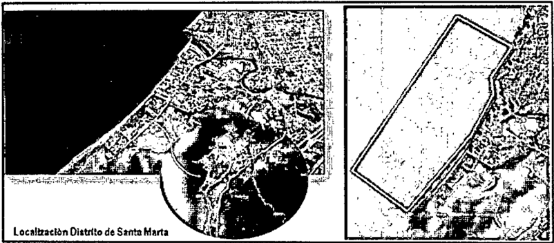

## TRIBUNAL ADMINISTRATIVO DEL MAGDALENA DESPACHO Magistrada ponente: MARÍA VICTORIA QUIÑONES TRIANA

Santa Marta D.T.C.H., treinta (30) de noviembre de dos mil veintidós (2022)

Radicación número:

Actor:

Vinculados:

Medio de control:

Instancia:

Tema:

47-001-2333-000-2016-00482-00

Rodrigo Martínez Silva y Aylin Yasira Serbousek Castro

Nación - Ministerio de Ambiente y Desarrollo Sostenible - Ministerio de Defensa - DIMAR - Distrito de Santa Marta - Corpamag - DADSA

- Departamento del Magdalena - Concesión de Alumbrado Público

Curadurías Urbanas No. 1 y 2 de Santa Marta - Secretaría de Planeación Distrital de Santa Marta - Policía Nacional - Edificio Reserva del Mar - Sociedad AR Construcciones S.A.S. - Fiduciaria Bogotá S.A.

Protección de los derechos e intereses colectivos

Primera

Fenómeno erosivo en Playa Salguero

No observándose motivo de nulidad que invalide lo actuado, se decide sobre la demanda que en ejercicio del medio de control de protección de los derechos e intereses colectivos consagrada en el artículo 144 de la Ley 1437 de 2011 presentaron los señores Rodrigo Martínez Silva y Aylin Yasira Serbousek Castro en contra de la Nación - Ministerio de Medio Ambiente y Desarrollo Sostenible, Ministerio de Defensa - Dirección General Marítima de Santa Marta - DIMAR, Distrito Turístico, Cultural e Histórico de Santa Marta, Departamento Administrativo Distrital de Medio Ambiente - DADMA, Corporación Autónoma Regional del Río Grande del Magdalena = CORPAMAG y la Concesión de Alumbrado Público de Santa Marta tendiente a que se protejan los derechos colectivos al goce de un ambiente sano; a la moralidad administrativa; a la existencia del equilibrio ecológico y el manejo y aprovechamiento racional de los recursos naturales para garantizar su desarrollo sostenible, su conservación, restauración o sustitución. La conservación de las especies animales y vegetales, la protección de áreas de especial importancia ecológica, de los ecosistemas situados en las zonas fronterizas, así como los demás intereses de la

Radicación número: 47-001-2333-000-2016-0482-00 Actor: Rodrigo Martinez Silva y otro comunidad relacionados con la preservación y restauración del medio ambiente; al goce del espacio público y la utilización y defensa de los bienes de uso público; a la seguridad y salubridad públicas; al acceso a una infraestructura de servicios que garantice la salubridad pública; al acceso a los servicios públicos y a que su prestación sea eficiente y oportuna; a la prohibición de la fabricación, importación, posesión, uso de armas químicas, biológicas y nucleares, así como la introducción al territorio nacional de residuos nucleares o tóxicos; a la seguridad y prevención de desastres previsibles técnicamente; y a la realización de las construcciones, edificaciones y desarrollos urbanos respetando las disposiciones jurídicas, de manera ordenada, y dando prevalencia al beneficio de la calidad de vida de los habitantes.

Se destaca que en el desarrollo del proceso se vincularon otras entidades y autoridades.

## I.
RESUMEN DE LA DEMANDA

Los actores mencionaron las siguientes situaciones fácticas (páginas a 9, archivo PDF, cuaderno principal):

Desde el año 2013, inició el desarrollo de proyectos de grandes construcciones que modificaron ostensiblemente el sector de Playa Salguero - Rodadero Sur (entre calles a 27 con carrera primera), para las cuales se procedió a dragar y cambiar el cauce del río Gaira que desemboca a orillas del mar en ese sector.

Esas maniobras, sumadas al fenómeno de sequía ocurrido en los primeros meses de 2015, condujo a que el mencionado río no arrojara suficiente aporte sedimentario como es natural, con lo que se ocasionó un proceso de erosión costera en toda la extensión del área de la zona de playa marítima (con valores máximos de metros de regresión de la línea de costa en la zona norte, 10 metros en la zona sur y 12 metros en la zona intermedia) según estudio aportado por al DIMAR, lo cual se traduce en que la playa empezó a desaparecer en esas proporciones.

En consecuencia, los habitantes de Playa Salguero vienen afrontando:

- Problemas de acercamiento del oleaje marino, al punto que varias propiedades han desaparecido.
- La pérdida de de los mástiles con luminarias instaladas en 2013 por la Concesión de Alumbrado Público de Santa Marta en virtud de un contrato estatal, que también obligaba al contratista a realizar el mantenimiento de la infraestructura de alumbrado público, lo cual

Radicación número: 47-001-2333-000-2016-0482-00 Actor: Rodrigo Martínez Silva y otro genera un detrimento patrimonial de los dineros del distrito, pues vio desperdiciada esa cuantiosa inversión.

- Problemas de salubridad bastante críticos, puesto que la mayoría de las viviendas carecen de alcantarillado y las pozas sépticas han quedado expuestas por el oleaje marino, lo que está ocasionando la contaminación de las aguas y grave afectación de la salud de los pobladores.
- Destrucción de los árboles de mangle, frutales y demás vegetación por la acción de la fuerza del mar.

Las referidas circunstancias evidencian la vulneración de los derechos colectivos por ineficacia y falta de coordinación entre las entidades encargadas de la conservación y preservación de los recursos naturales en el sector de Playa Salguero, lo cual convierte a esta playa en un potencial desastre natural, pues las construcciones en la zona y las circunstancias dañinas no cesan.

Para contrarrestar dicha afectación, los moradores del sector han puesto bultos de arena para rellenar la playa, han llevado arena y lodo desde otros sectores con el mismo fin y los pescadores han invadido las calles para ubicar sus embarcaciones.

Para agotar el requisito de procedibilidad para este medio de control, así como para identificar el impacto generado en el desarrollo ambiental, económico, turístico e inmobiliario de esta problemática, los demandantes enviaron los respectivos derechos de petición a las entidades demandadas.

En cuanto a las pretensiones (páginas y 13, archivo PDF, cuaderno principal):

Se declare que las entidades demandadas vulneran los referidos derechos colectivos a los residentes en Playa Salguero, al no tomar medidas efectivas para evitar la desaparición de la playa ocasionada por la erosión costera en esa zona.

Ordenar las entidades territoriales:

- Ejecutar las acciones tendientes a evitar el daño contingente y hacer cesar el peligro, la amenaza, la vulneración o agravio sobre los derechos e intereses colectivos, así como tomar las medidas para recuperar la playa y los ecosistemas destruidos.
- Tomar medidas urgentes para evitar que continúe el deterioro de los recursos naturales y la desaparición de la playa ocasionada con la erosión costera.

adicación número: 47-001-2333-000-2016-0482-1 ctor: Rodrigo Martínez Silva y otr

- Tomar medidas urgentes que eviten que las pozas sépticas que circundan el sector contaminen el mar por el avance de la erosión costera, tales como conectar todas las viviendas circundantes al alcantarillado de Santa Marta y así evitar el funcionamiento de las referidas pozas.
- Sembrar los árboles destruidos.
- Suspender las obras de construcción en el sector de Playa Salguero hasta tanto no se recupere la playa en debida forma.
- Tomar medidas tendientes a evitar que se vuelvan a presentar estos hechos.
- Condenar en costas a los convocados.
- Integrar un comité de vigilancia del cumplimiento de la sentencia.

## II.
CONTESTACIÓN DE LA DEMANDA

Las entidades y diferentes autoridades demandadas y vinculadas se pronunciaron al respecto en los siguientes términos:

## 2.1. El Departamento Administrativo Distrital del Medio Ambiente - DADMA (páginas 359 a 371, archivo PDF, cuaderno principal)

Aseguró que la erosión costera es un fenómeno natural, consistente en que la playa es ocupada por el mar debido al aumento de su nivel generado por el deshielo y, en general, por el cambio climático que se viene presentando en los últimos años.

Indicó que, en nuestro país, la erosión costera está ocurriendo no sólo en la zona de Playa Salguero, sino en el sector de Boca Grande en Cartagena, en Puerto Colombia, Atlántico, por mencionar algunos.

Sostuvo, entonces, que el fenómeno de la erosión costera no es producto de la acción humana y mucho menos de la negligencia del DADMA, cuando ni siquiera cuenta con el personal capacitado para desarrollar estudios de diagnóstico (oceanográficos o de playa) para planificar las medidas correctivas de tal evento.

Afirmó que Playa Salguero es una zona altamente dinámica y que su margen de arena avanza o retrocede dependiendo de la época, si es de lluvia o de verano. Si no hay lluvias torrenciales no llegan los aportes

: r

Radicación número: 47-001-2333-000-2016-0482-00 Actor: Rodrigo Martinez Silva y otro sedimentarios a la bahía y, por consiguiente, no hay las contribuciones necesarias para mantener la línea de playa.

Consideró que la entidad ha sido diligente al participar en: i) una Mesa Técnica Regional de Control de la Erosión Costera con otras autoridades ambientales para coordinar y dar una solución de fondo a este problema, y ii) en una sesión descentralizada del Concejo Distrital, también con el fin de desarrollar un conjunto de acciones integrales tendientes al control y prevención de la erosión costera en el Magdalena y al mejoramiento de la calidad de vida de sus habitantes, en la que se evidenció la necesidad de coordinación con otras autoridades regionales para encontrar las soluciones y así solicitar los recursos para mitigar el impacto ambiental.

Arguyó que si no se ha dado solución definitiva no es por negligencia de la entidad sino por la complejidad del asunto, ya que no depende solo de las entidades demandadas sino también de los factores de la naturaleza.

Explicó que el DADMA no es la autoridad competente para el manejo de la estructura de alcantarillado y acueducto -labor que corresponde a la empresa prestadora de esos servicios públicos en el Distrito-, ni para otorgar licencias de construcción, puesto que solo tiene a su cargo la evaluación de las medidas de manejo ambiental, con el fin de prevenir, mitigar, corregir o compensar los impactos generados por el desarrollo de algún proyecto, obra o actividad, medidas de prevención, mitigación, corrección y compensación.

Dijo que la encargada de limpiar, mantener y mejorar el curso del río Gaira es la Corporación Autónoma Regional del Magdalena, motivo por el cual no se le puede atribuir al DADMA responsabilidad alguna por su desviación.

Destacó que tiene funciones de máxima autoridad ambiental en la jurisdicción Distrital y que dirige la política ambiental, ecoturística y del sistema ambiental en el área urbana, más no de mitigación del riesgo.

## 2.2. El Distrito Turístico Cultural e Histórico de Santa Marta (páginas 169 a 177, archivo PDF, cuaderno principal)

Propuso las excepciones de:

- Improcedencia del medio de control, por considerar que la única acción que procede en este caso es la de cumplimiento, pues lo que se persigue, de manera clara y sistemática, es el cumplimiento de "normas aplicables con fuerza material de Ley o actos administrativos".
- ії) Carencia total de objeto del medio de control popular respecto de los actos administrativos, como quiera que este no fue diseñado

Radicación número: 47-001-2333-000-2016-0482-00 Actor: Rodrigo Martínez Silva y otro para desvirtuar la presunción de legalidad de aquellos actos, a tal punto que la ley 1437 de 2011 prohibió expresamente al juez popular anularlos.

- ili) Falta de legitimación en la causa por pasiva del Alcalde Distrital de Santa Marta, puesto que las órdenes que se persiguen giran en torno al cumplimiento de las funciones delegadas a las Secretarías de Gobierno y de Planeación Distritales, por lo que serían estas las llamadas a responder en caso de que se logre acreditar alguna afectación a los derechos colectivos invocados.

## 2.3. La Dirección General Marítima, Capitanía de Puerto de Santa Marta DIMAR (páginas 315 a 323, archivo PDF, cuaderno principal)

Aseguró que la DIMAR no tiene la competencia para gestionar la mitigación de riesgos, por cuanto es una función que corresponde a la Oficina de Gestión de Riesgo del Distrito de Santa Marta y a la Unidad Nacional de Gestión del Riesgo, así como tampoco para velar por la preservación ambiental y evitar la contaminación del mar, que corresponde a CORPAMAG.

Afirmó que sus funciones como autoridad marítima se circunscriben a autorizar y controlar la realización de obras de construcción de infraestructura en las costas y en el medio marino y a dirigir, coordinar y controlar las actividades marítimas; así mismo, a otorgar las concesiones y permisos para el uso y goce de los bienes de uso público bajo su jurisdicción, previo el cumplimiento del trámite para ese efecto.

Dijo también que tiene a cargo adelantar y fallar las investigaciones administrativas por construcciones indebidas o no autorizada sobre los referidos bienes, razón por la cual no ha incurrido en omisión alguna.

Arguyó que la valoración y autorización de los estudios para la construcción de las edificaciones en posibles zonas de riesgo es competencia de la Curaduría Urbana.

Con fundamento en lo anterior, propuso la excepción de falta de legitimación en la causa por pasiva. También propuso la de inexistencia de un perjuicio irremediable, cierto e inminente, grave y de urgente atención, pues, para determinar las causas del proceso erosivo en Playa Salguero, se debe realizar un estudio técnico especializado en cabeza de la Oficina de Gestión de Riesgo del Distrito de Santa Marta.

Adicionalmente, alegó la excepción genérica, esto es, la que el juez encuentre probada.

Por lo anterior, solicitó ser desvinculada de la presente acción popular.
Radicación número: 47-001-2333-000-2016-0482-00 Actor: Rodrigo Martinez Silva y otro

## 2.4. La Unión Temporal DISELECSA LTDA- Eléctricas De Medellín S.A., Concesión para el Alumbrado Público de Santa Marta (páginas 247-258 archivo PDF, cuaderno principal)

Dijo que la pérdida de las luminarias obedeció al fenómeno de erosión costera, esto es, a circunstancias de fuerza mayor, por lo que no se le puede atribuir responsabilidad por la vulneración de los derechos colectivos alegados.

Aseguró que, al momento de instalar las luminarias sobre la playa, la obra era viable porque existía una gran extensión de playa para ello, con ocasión de lo cual solicitó la respectiva concesión de playa ante la Capitanía de Puerto, la cual fue otorgada previa verificación de todos los requisitos legales.

Considerando esa situación, estimó que no se le puede atribuir responsabilidad por el detrimento patrimonial indicado en la demanda.

También propuso la excepción de falta de legitimación en la causa por pasiva, con ocasión de que tuvo a su cargo la prestación del servicio de alumbrado público en la ciudad de Santa Marta hasta el de diciembre de 2017, cuando expiró la prórroga del contrato de concesión No. 19 de febrero de 1997.

## 2.5. El Ministerio del Medio Ambiente y de Desarrollo Sostenible (páginas 325 a 351 archivo PDF, cuaderno principal)

Indicó que este Ministerio es el organismo rector de la gestión ambiental y de los recursos naturales renovables, encargado de orientar y regular el ordenamiento ambiental del territorio, de definir políticas y regulaciones a las que se sujetarán la recuperación, conservación, protección, ordenamiento, manejo, uso y aprovechamiento sostenible de los recursos naturales renovables y del ambiente de la Nación, tendiente a asegurar su desarrollo sostenible, de manera que no tiene dentro de sus funciones, objetivos y competencias la ejecución de sus propias políticas.

En desarrollo de las mismas, de cara al fenómeno natural de erosión costera a nivel global, el Ministerio elaboró un "Diagnóstico de Riesgo Ecológico de las Zonas Marino Costeras" y, a través de mesas técnicas implementadas en distintas ciudades costeras, entre ellas Santa Marta, propuso lineamientos técnicos ambientales a tener en cuenta en el desarrollo de proyectos de infraestructura en las zonas marino costeras, con enfoque de gestión del riesgo. Esos lineamientos fueron socializados a las CAR con jurisdicción costeras y, para el caso de Santa Marta, con la Gobernación del Magdalena.

Alegó la falta de competencia para conocer o responder por temas relacionados con prevención y atención de desastres, con la realización y/o y/o suspensión de las construcciones, edificaciones y desarrollos urbanos que no respetan las disposiciones jurídicas, tampoco para evaluar los impactos que generan las construcciones, lo cual también es competencia de las autoridades que otorgan los permisos.

Aseguró que no tiene a su cargo la ejecución de las obras de mitigación de la erosión costera y que tampoco es el encargado de las gestiones tendientes controlar la contaminación, salubridad pública y la recuperación de bienes de uso público ni acceso a servicios públicos.

Por todo lo anterior, propuso la excepción de falta de legitimación en la causa por pasiva.

Explicó que la implementación de las medidas para hacer cesar o evitar la amenaza de la erosión costera en el presente caso corresponde al Sistema Nacional de Gestión del Riesgo de Desastres, en coordinación con la Gobernación, la Alcaldía y CORPAMAG.

Dijo que la prevención del riesgo y de desastres se encuentra a cargo del DADMA, CORPAMAG y la Alcaldía Distrital y que los temas de salud pública se encuentran a cargo de la Alcaldía Distrital y del Ministerio de la Protección Social.

En consecuencia, solicitó su desvinculación del medio control de la referencia.

- 2.6. Corporación Autónoma Regional de Magdalena - CORPAMAG (páginas 58 a 73 archivo PDF, cuaderno principal)

Aseguró que, según la Ley 1523 de 2012, la labor de las Corporaciones Autónomas Regionales, respecto de las emergencias ambientales, es subsidiaria a la de las entidades territoriales, municipios y departamento, según el caso y que, en ejercicio de esas facultades accesorias, la entidad ha adelantado actuaciones que se encuentran consignadas en varios oficios.

Afirmó que la realización de estudios específicos de la problemática erosiva, así como la gestión y asignación de recursos para su manejo, le corresponde a los Comités de Prevención y Atención de Desastres y que la prestación de servicios públicos es de competencia de la Alcaldía Distrital.

Indicó que en el presente caso no se encuentra demostrado que la entidad se encuentre vulnerando los derechos colectivos invocados por el actor y que, por el contrario, ha adelantado actuaciones dentro del marco de sus competencias.

Puso de presente la existencia de otra acción popular que también se tramitaba en el Tribunal Administrativo del Magdalena por el fenómeno de la erosión costera en el sector de Pozos Colorados (radicado 47001 23 31 003 2011 08425 00), por estimar que compartían objeto, causa y derechos colectivos invocados con el de la referencia, por lo que solicitó el agotamiento de jurisdicción, dando aplicación a los principios de economía procesal, celeridad y eficacia.

Solicitó la vinculación de la Gobernación del Magdalena, porque, en su criterio, es la entidad territorial encargada de la gestión del riesgo.

- 2.7. Departamento del Magdalena (vinculado mediante auto del de diciembre de 2018 - páginas 295 a 301 archivo PDF, cuaderno principal)

Propuso la excepción de falta de legitimación en la causa por pasiva, dado que quienes deben responder directamente por la vulneración de los derechos colectivos alegados son las autoridades o entidades encargadas de la conservación y preservación de los recursos naturales, que son las responsables del deterioro del sector de playa salguero, con ocasión de lo cual propuso la de inexistencia de la obligación.

Así mismo, alegó la excepción de inexistencia de vulneración de los derechos colectivos invocados, puesto que no tuvo ninguna participación, por acción ni por omisión, en la causación de la afectación por la que aquí se demandó.

## 2.8. Policía Nacional (páginas a 18 archivo PDF, cuaderno principal.
Vinculada mediante auto del de marzo de 2020)

Propuso las excepciones de falta de legitimación en la causa por pasiva e inexistencia de la obligación, con fundamento en que no se demostró la ocurrencia de alguna omisión en el cumplimento de sus funciones y mucho menos que con ella se haya contribuido a la afectación de los derechos colectivos invocados y a la grave afectación de la cuenca del rio Gaira, en el sector de Playa Salguero.

Indicó que, por el contrario, la prestación del servicio de seguridad pública ha ocurrido conforme a la ley y a la normatividad vigente, con respeto de los derechos de los conciudadanos y garantizando que los mismos convivan en paz.

Sostuvo que la Policía Nacional no es la entidad encargada de la regulación de cauces y corrientes de agua o la construcción y mantenimiento de vías públicas.

1 Obrante en páginas 252 a 255 del archivo PDF, cuaderno principal.

pág. 9

## 2.9. Curaduría Urbana Provisional N.2 (páginas a 9 archivo PDF, cuaderno principal)

Propuso la excepción de falta de legitimación en la causa por pasiva, por estimar que ni el actual curador ni su antecesor otorgaron licencia alguna en favor de la propiedad horizontal Edificio Reserva del Mar, avalando el desvío del cauce del río Gaira o la construcción sobre la jurisdicción marítima de la DIMAR.

Afirmó que la licencia de construcción No.053 y la licencia de Urbanismo No. 007 fueron otorgada el de julio de 2012 por la entonces Curadora, Sara Uribe Salas.

También propuso la excepción genérica, es decir, la que el juez encuentre acreditada.

- 2.10. Constructora AR (Vinculada mediante auto del de noviembre de 2020 - páginas a 34 del archivo PDF 75, cuaderno principal).

Afirmó que el diseño urbanístico del proyecto Reserva del Mar fue aprobado por la Curaduría Urbana de Santa Marta y avalado por la Secretaría de Planeación Distrital y, por tratarse de un proyecto de construcción para uso residencial, no requería de licencia ni plan de manejo ambiental.

Sostuvo que las respectivas licencias y permisos (licencia de construcción No. 053 y Licencia de Urbanismo No. 007) gozan de presunción de legalidad, al no haber sido desvirtuadas con ningún mecanismo judicial y por ajustarse a la normativa urbanística y ambiental vigente.

Aportó la siguiente documentación, con base en la cual considera que actuó de manera legítima:

- Resolución 204 del de julio de 2012, Curaduría Urbana N° 2 otorga Licencia de Urbanismo N° 007 y Licencia de Construcción N° 053 en Modalidad de Obra Nueva.
- Resolución N° 385 del de septiembre de 2014, otorga Modificación a la Resolución N° 204 del de julio de 2012.
- Resolución 595 del de diciembre de 2015, otorga Modificación de Licencia Vigente a la Resolución 204 del de julio de 2012.
- Resolución 424 del de julio de 2015, otorga prorroga a la Resolución 204 del de julio de 2012. - Resolución 262 del de agosto de 2016, otorga segunda prórroga a la Licencia de Construcción y Urbanismo.
- -Resolución 482 del de diciembre de 2016 otorga modificación de licencia vigente.
- Resolución 292 del de septiembre de 2017 otorga revalidación a la licencia de Urbanismo y Construcción.

2 Obrante en archivo PDF 58, cuaderno principal.

- Resolución 411 del de diciembre de 2017 otorga modificación a licencia vigente.
- Resolución 022 de de enero de 2018, otorga aclaratoria a la Resolución 411 de de diciembre de 2017.
- Resolución N° 001 de abril de 2019 otorga aclaratoria a la Resolución 411 de diciembre de 2017. - Resolución 47001-2-19-0411 de de enero de 2020 otorga modificación a la licencia de construcción vigente.
- Un (1) plano A-001 Planta de localización y cuadro de áreas donde se evidencia el área de protección ambiental respetada por el proyecto.
- -Certificados de Disponibilidad y Viabilidad de Servicios Públicos de Acueducto y Alcantarillado Sanitario, expedidos por las Empresas de Servicios Públicos del Distrito de Santa Marta METROAGUA S.A. E.S.P. de fecha de agosto de 2014, 25 de enero de 2016 y por la ESSMAR E.S.P. Rad. 500-978-19".

Adicionalmente, dijo que los referidos permisos no han sido suspendidos por ningún motivo, ni cuentan con antecedentes sancionatorios que den cuenta de la generación de impactos ambientales, ni de ocupación indebida de bienes de uso público; por el contrario, aseguró haber desarrollado un proceso de recuperación de la desembocadura del río Gaira.

## III.
ALEGATOS DE CONCLUSIÓN

Una vez declarada fallida la audiencia de pacto de cumplimiento' y vencido el término probatorio, los argumentos expuestos en esta etapa procesal fueron planteados por las autoridades demandadas y vinculadas en los siguientes términos:

## 3.1. Policía Nacional (archivo PDF 89, cuaderno principal)

Reiteró los argumentos expuestos en la contestación de la demanda e insistió en que no basta con alegar la vulneración de los derechos colectivos, sino que la parte demandante tiene la carga procesal de demostrar los supuestos fácticos de sus pretensiones, sin que se allegara plena prueba en ese sentido.

Destacó que la entidad nada tiene que ver con las graves afectaciones que ocurren en Playa Salguero, pues son responsabilidades ajenas a la Policía Nacional.

- 3.2. La Unión Temporal DISELECSA - Eléctricas De Medellín S.A., Concesión para el Alumbrado Público de Santa Marta (archivo PDF 90, cuaderno principal).

3 Esta etapa procesal se agotó con la realización de las diligencias llevadas a cabo los días de febrero de 2018 y 22 de mayo de 2019, cuando se declaró fallida (ver páginas 230 a 232, archivo PDF, cuaderno principal y 28 a 33, archivo PDF, cuaderno principal).

4 Ver auto del de julio de 2021 (archivo PDF 87, cuaderno principal).

Reiteró los argumentos expuestos en la contestación de la demanda.

## 3.3. Distrito Turístico, Cultural e Histórico de Santa Marta DTCH (archivo PDF 93, cuaderno principal)

Insistió en los mismos tópicos indicados en la contestación al líbelo demandatorio.

## 3.4. La Dirección General Marítima, Capitanía de Puerto de Santa Marta DIMAR (archivo PDF 94, cuaderno principal)

Reiteró lo expuesto en la contestación de la demanda, a lo cual agregó que corresponde a la autoridad de policia y no a la DIMAR garantizar la vigilancia y protección de los bienes de uso público, así como del espacio público en su jurisdicción, en defensa de los intereses de la comunidad.

Dijo también que no tiene a su cargo la recuperación geomorfológica de playas y ecosistemas ocasionados por causas naturales.

## 3.5. Curaduría Urbana Provisional N.2 (archivo PDF 95, cuaderno principal)

Repitió lo dicho en la contestación de la demanda, a lo cual añadió que, a su juicio, no se demostró la vulneración a ningún derecho colectivo y mucho menos que haya sido ocasionado por ese despacho.

## 3.6. Corporación Autónoma Regional de Magdalena - CORPAMAG (archivo PDF 96, cuaderno principal)

Insistió en los argumentos expuesto en la demanda.

## 3.7. Constructora AR (archivo PDF 97, cuaderno principal)

Repitió lo expuesto en la contestación de la demanda, a lo cual agregó que los bienes inmuebles sobre los cuales se desarrolló el proyecto "Reserva del mar" son de carácter privado, situación confirmada por la DIMAR en un procedimiento administrativo sancionatorio que adelantó por la presunta ocupación indebida o no autorizada sobre bienes de uso público de la Nación, promovido por la Capitanía de Puerto de Santa Marta.

Agregó también que el proyecto no tiene antecedentes de fallos sancionatorios por afectaciones ambientales y/o vertimiento de aguas residuales, proferido por autoridad administrativa de control urbano, ambiental o por autoridad judicial.

## 3.8. Ministerio de Medio Ambiente y Desarrollo Sostenible (archivo PDF 98, cuaderno principal)

-'.

Reiteró lo expuesto en la contestación de la demanda y dijo también que la parte demandante tenía la carga de allegar las pruebas que sustentaran la causa eficiente del daño y la omisión concreta de las accionadas, la cual debía estar directamente relacionada con sus facultades y competencias, pero, para el caso de este Ministerio, no lo hizo.

- 3.9. EL concepto del Ministerio Público (archivo PDF 92, cuaderno principal)

El Procurador Judicial II Ambiental y Agrario del Magdalena pidió declarar el agotamiento de jurisdicción respecto de las pretensiones relacionadas con el fenómeno de la erosión costera en Playa Salguero, en virtud de la sentencia del de junio de 2016, dictada por este Tribunal.

Solicitó acceder a las pretensiones de la demanda que guardan relación con la efectiva prestación del servicio público de alcantarillado en el sector, dada la contaminación microbiológica del agua costera que proviene directamente de la insuficiente prestación de ese servicio público.

Requirió que para los proyectos de construcción en Playa Salguero debía exigirse la evaluación previa de diseños sanitarios de las edificaciones, a efectos de evitar mayores afluentes en el sector y vertimientos a la playa y zona costera.

## IV.
CONSIDERACIONES DE LA SALA

## 4.1. Competencia

El Tribunal es competente para conocer en primera instancia la demanda promovida por el señor Rodrigo Martínez Silva y otra, pues la pretensión de protección de derechos e intereses colectivos va dirigida, entre otras, contra autoridades del orden nacional. Lo anterior con base en la regla contemplada actualmente - con la modificación que realizó la Ley 2080 de 2021 - en el numeral 14 del artículo 152 de la Ley 1437 de 2011.

## 4.2. Generalidades de la acción popular

La Constitución Política en su artículo 88 preceptúa que el legislador regulará las acciones populares cuya finalidad es la protección de los derechos e intereses colectivos relacionados con el patrimonio, el espacio, la seguridad y la salubridad pública, la moral administrativa, el ambiente, la libre competencia económica y otros de estirpe similar.

Por lo anterior, la Ley 472 de 1998 en su artículo 2 al cumplir este mandato del constituyente advirtió que las acciones populares son los medios procesales para la protección de tales derechos e intereses y las cuales se promueven con el objetivo de evitar el daño contingente, hacer cesar el peligro, la amenaza, la vulneración o agravio o restituir las cosas a su estado anterior cuando fuere posible.

El artículo 9 ibídem prevé que este medio de control procede contra toda acción u omisión de las autoridades públicas o de los particulares, que hayan violado o amenacen violar los derechos e intereses colectivos.

El consejo de Estados al clarificar los elementos o requisitos sustanciales para que proceda la acción popular, ha establecido los siguientes: i) una acción u omisión de la parte demandada; ii) un daño contingente, peligro, amenaza, vulneración o agravio de derechos o intereses colectivos; peligro o amenaza que no es en modo alguno el que proviene de todo riesgo normal de la actividad humana y iii) la relación de causalidad entre la acción u omisión y la señalada afectación de tales derechos e intereses; dichos supuestos deben ser demostrados de manera idónea en el proceso respectivo.

## 4.3. Problemas jurídicos a resolver

Luego de efectuadas las actuaciones procesales pertinentes, se debe determinar si la comunidad de Playa Salguero está siendo afectada por un proceso de erosión costera y si esa situación afecta los derechos colectivos invocados en la demanda; en tal caso, establecer si las entidades y/o autoridades demandadas y vinculadas dentro del trámite procesal, de acuerdo con sus funciones y competencias, son las responsables de esa afectación y, por tanto, están llamadas a adoptar las medidas tendientes a:

- contrarrestar de forma definitiva los factores estructurales que ocasionan el fenómeno erosivo en el sector de Playa Salguero y con ello evitar la desaparición de la playa y los ecosistemas afectados,
- ii) conectar al sistema de alcantarillado público las viviendas del sector que aún carecen de ese servicio público y que, por tanto, deben utilizar pozas sépticas para la recolección de sus desechos, con el fin de frenar la contaminación de las aguas por la exposición de las mismas, ante el avance de la erosión costera, - ili) suspender las obras de construcción en el sector de Playa Salguero hasta tanto no se recupere la playa en debida forma,
- iv) evitar el detrimento patrimonial por la pérdida de las luminarias instaladas para la prestación del servicio de alumbrado público.

## 4.4. Del agotamiento de jurisdicción (archivo PDF 92 cuaderno principal)

En el concepto del Ministerio Público, el Procurador Judicial II Ambiental y Agrario del Magdalena solicitó la declaratoria del agotamiento de jurisdicción respecto de las pretensiones relacionadas con el fenómeno de la erosión costera en Playa Salguero, en virtud de la sentencia del de junio de 2016, dictada por este Tribunal en el proceso 2011-8425AP.

Sin embargo, se advierte que una solicitud en ese sentido fue negada por el Despacho mediante auto del de agosto de 2019, por considerar que si bien existe similitud entre los hechos de las demandas de procesos analizados (2016-482, 2016-014, 2011-079 y 2011-8425), estos no persiguen las mismas pretensiones.

En ese orden de ideas, esta Sala se atiene a lo decidido en esa providencia en cuanto a la negativa del agotamiento de jurisdicción.

## 4.5. De lo probado en el proceso

Con el acta de visita realizada el de agosto de 2016, por el Departamento Administrativo Distrital del Medio Ambiente - DADMA al sector de Playa Salguero, con ocasión de una queja presentada por el demandante, se evidenció la problemática que aqueja al sector, en los siguientes términos:

- "- Durante la visita se evidenció cómo el sistema de marea de la línea costera de Playa Salguero se ha llevado todo el mangle que anteriormente se presentaba en el sector. Más de 100m sembrado por los pescadores.
- Ha ocurrido vertimiento de aguas negras producto de pozas sépticas en las casas vecinas al sector.
- Toda la situación ha afectado a los pescadores artesanales de la zona.
- Igualmente en la playa se evidencia postes que ha dejado alumbrado público después de la erosión de la zona de playa.
- Los habitantes del sector manifiestan el desvío del río Gaira producto de las construcciones de edificios de la zona.
- La desembocadura del río ha sido tapada, lo que ha afectado a los moradores de la zona.
- No hay zona de playa donde los pescadores puedan dejar sus embarcaciones.

6 Páginas 381 a 398 del archivo PDF, cuaderno principal.
Radicación número: 47-001-2333-000-2016-0482-00

## - Los postes de luminaria han dejado restos de estructuras en toda la línea costera del sector".

Luego de realizar una visita al sector de Playa Salguero, el de octubre de 2016, CORPAMAG emitió el siguiente concepto:

"Con base a la inspección ocular, se evidenció el alto grado de erosión costera en la Playa Salguero, infraestructura de iluminación en mal estado dentro de la superficie marina, afectación a la zona de manglares, la colocación de bultos de arenas utilizadas como protección para evitar que la acción del mar siga afectando sus viviendas por parte de sus propietarios" (subrayas de la Sala).

En el informe técnico de avance de la "Investigación para la gestión y protección de los ecosistemas de la zona marino costera del Departamento del Magdalena en jurisdicción de CORPAMAG"', rendido en septiembre de 2019 por el Instituto de Investigaciones Marinas y Costeras "José Benito Vives de Andréis" - INVEMAR (que es el instituto que genera información técnico científica al respecto), consta que:

"La dinámica estacional de playa Salguero (PF) al sur del espolón muestra una tendencia erosiva dominante. En la comparación de los meses de mayo y agosto de 2019 con los meses de años anteriores, es notable el déficit de los aportes de sedimentos, que se generaliza a lo largo de km de la playa, y el incremento de estos procesos por la influencia del espolón. Estas condiciones no le han permitido a la playa obtener su estabilidad natural, que le permita un balance estacional y su recuperación en los últimos años, destacándose como uno de los sitios críticos por erosión costera del departamento ... Alerta por erosión: la pérdida de la playa entre 2015-2019 ha sido de hasta - 25m, equivalentes a -6m/año, estos procesos pueden acelerar si no se toman medidas de mitigación acordes con dinámica geofísica y ambiental del sector. Se recomienda realizar inicialmente los estudios de alternativas de actuación y manejo relacionados con los efectos del espolón"10 (subrayas de la Sala).

Del concepto técnico rendido por CORPAMAG, el de diciembre de 201911, fundamentado en los informes técnicos elaborados por INVEMAR, en virtud de los convenios entre ambas instituciones, se destaca:

"De acuerdo con las mediciones topográficas realizadas a lo largo de la zona costera durante los meses de marzo, mayo, julio y noviembre los perfiles con mayor variación morfológica asociados a procesos erosivos corresponden a los levantados a ... Playa Salguero (PF), este último presenta un retroceso acelerado y es una de las zonas identificadas

? Página del archivo PDF, cuaderno principal.

° Páginas 575 a 631 del archivo PDF, cuaderno principal.

8 Páginas 128 y 129 del archivo PDF, cuaderno principal.

10 Página 617 del archivo PDF, cuaderno principal.

11 Páginas 485 a 517 del archivo PDF, cuaderno principal.

## como críticas por erosión costera en el departamento del Magdalena" (negrillas y subrayas del documento original).

De acuerdo con INVEMAR-GEO (2014) la morfología del perfil playa Salguero, en el mes de marzo de 2014 presentó una playa trasera de m de amplitud y una pendiente de 12° en el frente de playa. Con relación a estos datos el perfil registró un retroceso acelerado que supera los m, causando casi la pérdida total de la playa trasera y afectaciones a las infraestructuras de alumbrado público. Dentro de los factores que interviene en la erosión del sector se pueden mencionar el déficit en los partes de sedimentos del río Gaira por los bajos caudales y la sedimentación de la desembocadura del mismo durante la mayor parte del año; adicionalmente la construcción de diques y rellenos con material sobre el cauce del río. (...)

La morfología determinada con los perfiles de playa durante los meses de monitoreo muestra mayores variaciones asociadas a procesos erosivos en los sectores denominados .. Playa Salguero (PF). A través de las mediciones realizadas en playa Salguero y observaciones de campo se logró cuantificar con mayor precisión la erosión en este sector e identificar algunas causas que requieren de actividades de mitigación urgentes. (...)

La erosión costera es la penetración del mar hacia el continente, después de evaluar un tiempo suficientemente largo para eliminar la dinámica puntual de sedimentos, las tormentas y los impactos relacionados con el clima. La erosión costera posee elementos naturales y otros de carácter antrópico.

Las construcciones desarrolladas a lo largo de la línea de costa causan un desequilibrio en los procesos naturales que se deben generar en estas zonas, la construcción de áreas de pantano y ciénaga contribuyen a que se presenten efectos adversos para las comunidades que se establecen en estos ecosistemas.

Tal como se puede observar la problemática presente en el sector de playa Salguero, es un problema de Riesgo, esto debido a las estructuras públicas y privadas (Construcciones) que se encuentran expuestas en el sector, esto naturalmente que evidencia la vulnerabilidad de los elementos materiales en el área. (...)

En este orden de ideas de acuerdo a los informes desarrollados por el INVEMAR, el área objeto de desarrollo del presente concepto se encuentra erosionada, presentado distintas tendencias en las dos épocas climáticas (periodo seco y lluvioso), señala el informe que con la construcción del espolón se ha presentado mayor erosión de la parte sur del espolón (espolón y punta gloria). Señala de manera análoga que se presenta acreción en las inmediaciones de la desembocadura del río Gaira, pero en síntesis señala que se presenta mayor erosión que acreción, no obstante de evidenciar mejorías es necesario realizar el análisis que permita desarrollar propuestas para lograr un equilibrio de dicha playa, en este contexto se hace necesario inicialmente revisar las dinámicas surgidas en Radicación número: 47-001-2333-000-2016-0482-00 Actor: Rodrigo Martínez Silva y otro virtud de la construcción del espolón en el año 2016"12 (subrayas de la Sala).

Sobre toda esta situación en Playa Salguero, la señora Rita De Luque Fernández (habitante del sector) rindió testimonio el de enero de 2020, del que se destaca:

"Ya que usted dice que vive ahí al frente y que conoce la problemática, qué quisiera ilustrar al despacho con respecto al tema de la erosión y del espolón que se construyó.

Yo considero que aquí ha habido un sofisma de distracción con el espolón. Por qué digo yo un sofisma de distracción con el espolón? está el rio Gaira, está la calle, 22 y 23; después sigue la, la y la. Ese espolón divide aquí está la y acá está la, entonces hay tres cuadra de este lado y tres cuadras hacia al otro lado hasta la. Antes de que construyeran el dichoso espolón la erosión era más grande de la a la, ósea ahí el mar se comió ..

Yo lo digo porque llevo años viviendo allí y es cierto, hay una erosión natural y eso lo hemos vivido nosotros en nuestra casa todo el tiempo, hay mar de leva, se mete el mar vuelve y se va y hace playa. En mi casa había épocas o hubo épocas de 100 metros 150 metros que nosotros hasta inclusive habíamos enrejado y haciamos sembrados de platano, yuca, piña y todo lo que se podía sembrar ahí. Después empezaron una serie de oleajes y mi mamá empezó a sembrar mangle, eso estaba arborizado era la cosa más preciosa que usted puede conocer, eso era arborizado, había sombra, playa era hermoso" (Minuto:30 a 54:00)

Cual fue el problema de playa Salguero, el progreso, llegaron los edificios, apenas que llegaron los edificios la erosión aumentó, por que aumenta la erosión?, porque específicamente un conjunto que se llama Reserva del Mar ... prometió apartamentos con vista al mar, entonces qué hizo Reserva del Mar, construyó al lado del río pegado al río pero empezó a correr el rio ... Ellos corrieron el cauce del río, por qué? Porque ellos trataron de empezar a tratar de comprar el frente a efectos de poder tener todo ese terreno para ofrecer la playa, mi papá y nosotros que estamos ahí no quisimos vender, nosotros no queríamos irnos de ahí, no quisimos vender; entonces nosotros fuimos como los que les interrumpimos la idea de ellos poder ofrecer esos apartamentos, entonces qué hicieron? hicieron un balcón que va por toda la orilla del rio hasta la desembocadura del casi del río al mar para que la gente fuera por ese balcón y llegara a su playa privada supuestamente y empezaron a acordonar el rio y a desplazarlo y colocaron unas mallas, como unos aluviones para impedir que el río se metiera a su construcción. Que hicieron, hay una cosa que se llama el efecto espejo, qué es el efecto espejo?, antes el río entraba así, de esta forma al mar, el río contribuye Páginas 487, 489, 514 a 516 del archivo PDF, cuaderno principal. https://www.d1tribunaladministrativodelmagdalena.com/index.php/56audiencias/constitucionalidad/pruebas/679-showaudconst-pruebas2020 hacer playa, por qué contribuye hacer playa? porque toda la arena que entra cuando hay subienda y ordinariamente el entra arena al mar, el mar saca lo que no es de él y empieza a sacar toda esa arena y eso permite hacer playa, cuando se hace la construcción ellos ruedan el río y el río ya no entraba así, ya el río pegaba en un cerro y después entraba en diagonal.

Que ocasiono eso? que la playa que está después del espolón de la a la era la que se beneficiaba y hacia playa, mientras la de la a la empezó a comerse, a comerse la, es correcto; empezó a comerse, a comerse, a comerse. La de aquel lado, que es la parte sur, la parte que ahora está erosionada era la que tenía playa y la de nosotros empezó a comerse, comerse, comerse, le pusimos queja a Reserva del Mar, miren lo que están haciendo, ustedes corrieron el río, está pasando esta situación, nos están dejando sin playa, aumentado eso la época de sequía que casi no llovía, entonces la poquita arena que entraba se iba como en un zig zag, llamémoslo así, eso fue el fenómeno que sucedió" (Minuto:20 - 57:30).

Después de eso apareció el dichoso espolón, apareció de la noche a la mañana, hay muchas especulaciones y yo no voy a especular aquí, unos dicen que fue el edificio, otros dicen que fueron los edificios porque como ellos prometieron con playa y hacer playa y no había playa. De noche, no, fueron como tres noches la construcción, los pescadores son los que murmuran, ellos murmuran y cosas así pero no se sabe a ciencia cierta cuál de los dos edificios fue, lo que si dice la gente es que fueron los mismos de las construcciones de los edificios que mandaron hacer eso.

Gracias a ese espolón fue que nosotros hicimos playa, o sea, después de que se construye el espolón es que empezamos hacer... mejoró, no y de aquel lado se comió porque eso es lo que hace el espolón, el de un lado llena y del otro lado come. Entonces de este lado, de la a la, se ha recuperado un poco, un poco no todo, un poco de playa ... llevábamos de sequía muchos años y a partir del 2018 empezaron nuevamente las lluvias y eso ayudó hacer playa y ayudó también el dichoso espolón ese que apareció y eso también ayudó hacer un poco de playa, porque no había, no había nada, nada es nada y decía mi papá esto nunca había pasado, nosotros vivimos ahí hace cuarenta años y el mar se comía y el mar volvía y se cogía y se retiraba y dejaba su playa, era la primera vez que se comía y no se regresaba al mar. Y entonces mi papá discutía mucho con los de Reserva del Mar, ustedes fueron los que con el entorpecimiento que le hicieron a la naturaleza de ese río es que nos tienen aquí esta erosión que está ocasionando que nosotros nos vamos a desaparecer" (Minuto 58:10 - 1:02:50)..

También obra la versión de un ingeniero de INVEMAR, quien en la diligencia de inspección judicial realizada el de febrero de 202014 indicó que:

pág. 19

"Invemar participó en las mesas técnicas de Erosión Costera desde 2016 ... en el 2016 ya se evidencia el problema de la erosión costera, se observaba que era un problema cíclico, observando desde las fotografías aéreas desde los años 70 se veía ya un poco los cambios en las playas están asociados a factores climáticos. Quién es nuestro aportante de sedimentos? es el río Gaira, el río es el que trae todo el material para que se empiece a trabajar en esta senda de trabajo ... Ese sedimento cuando tenemos invierno va a aportase hacia la playa y cuando tenemos las épocas de verano el sedimento que está en el fondo del mar lo va a empezar a traer y es lo que estamos viendo en este proceso de recuperación, un poco al costado sur del espolón, ya hay un poquito más de playa a la que terminamos en noviembre y diciembre del año pasado. De los problemas de 2016 como no se atendió manera oportuna por parte de las autoridades, la misma comunidad decidió crear el espolón. No se tiene conocimiento de la fecha exacta de la generación del espolón. Algunos dicen que es 2016, otros, según unas imágenes que vimos parece que fue 2017. Total, que para mitad de año del 2017 ya estaba el espolón y empezó hacer una recuperación de la playa. ¿Cuál es el efecto del espolón? él va hacer una retención del sedimento de acuerdo con la deriva litoral, cuál es la deriva del litoral? hacia dónde va la corriente que va arrastrando, va llevando los sedimentos, que quién nos los trae? El río Gaira, el río Gaira viene bota los sedimentos y él se está acumulando a donde el espolón frena la deriva, que es al costado norte. Cuál es el efecto del espolón?, por la refracción del oleaje, el espolón se convierte en una barrera dura hacia al costado contrario a donde está la deriva litoral; esta reflexión que hace el mar, el oleaje en ese sector, genera una turbulencia que no permite que se deposite el sedimento, entonces al otro lado costado del espolón vamos a incrementar el problema de la erosión, es lo que vimos, ya la playa no es continua, si no que tiene una forma escalonada, tenemos una parte muy salida, mientras que acá una parte muy corta" (Minuto:12 - 13:36)

¿Es cierto que se desvió el río? Lo que hemos visto en fotografías es que el río, las fotografías aéreas vienen desde los años, fotografías que produce el IGAC, y lo que hemos visto es que el cauce final siempre ha estado saliendo al norte, desde los años hasta acá, son 70 años más o menos, siempre ha estado saliendo al norte; lo que sí se vio por el edificio Reserva del Mar, ellos construyeron muy cerca del cauce de la zona de que tenía que tener de distancia al río, al construir tan cerca ellos ... el río ya no podía migrar en la parte final si no una parte más hacia adentro, hacia donde está el puente, construyeron un jarillón para poder mantener la distancia del río hacia su construcción, los metros legales que les exigen ¿Es una manera de desviar? Es una manera de controlar el cauce, de controlarlo, porque de todas maneras el río siempre ha estado pasando de un lado al otro, en este momento este río no puede tomar hacia el sur porque ya estaría afectando la propiedad, ellos aprovecharon el momento en el cual el río estaba hacia el costado norte para poder hacer el jarillón ... El río qué hace? El río cuando aumenta sus caudales erosiona las orillas, las orillas más inestables, que es a donde empieza a moverse; empieza a buscar salir ... ¿Eso puede

Radicación número: 47-001-2333-000-2016-0482-00 Actor: Rodrigo Martínez Silva y otro estar afectando? si puede estar afectando, tampoco lo hemos medido, esta es una problemática que se discutió en la mesa técnica del de febrero, en el cual había que observar, ya con detalle, qué es lo que está pasando entre al menos entre el puente del río Gaira en la avenida Tamacá hacía acá, hacia la playa (minuto' -16:30').

En la mesa técnica de agosto empezamos de hablar de quitar el espolón, una de las ideas era que se pasaran propuestas de investigación, y el CIOH, a través de Capitanía de Puerto presentó una propuesta en la cual se planteaba hacer el modelo de dispersión de sedimento, que iba a ocurrir si se empezaba a quitar el espolón, a ver si se podía quitar de la misma manera que se instaló, de un día para otro, o si teniamos que hacer un trabajo previo, en ese caso sería hacer un trasbase de arena, es decir pasar la arenas que está aquí contenida, pasarla, o si vamos quitándolo por pedazos, o si definitivamente dejarlo es una buena idea; ... esa es la necesidad de los estudios del modelo de lo que se pasó (minuto:20)

en estos momentos está en manos de Procuraduría, se le entregó al Distrito y a CORPAMAG, CORPOMAG aprobó unos recursos, y está en manos de aprobación del Distrito. Los estudios, con las mesas técnicas de trabajo que se han hecho con la Procuraduría, ya llevamos la tercera mesa técnica, se espera que se evalúe bien la propuesta de investigación, y haya un consenso en INVEMAR, Procuraduría y CORPAMAG, para que la propuesta esté completa y se pueda ejecutar lo más pronto posible sobre todo la modelación de quitar esta estructura. Hay estudios en México donde en los cuales el espolón se podría remover y el mismo mar haría la dispersión del sedimento (Minuto:40 - 19:10)

Los pronósticos de erosión, los casos de erosión estaban a 5 mts por año, obviamente esta playa tiene que buscar un ángulo de estabilidad, es decir una forma en la cual que se construye desde un ambiente muy natural, vamos a tener unos problemas antrópicos, un problema como es el muro que esta allá, que ya son obras abandonadas y que generan esa reflexión del oleaje, que genera erosión en su frente, entonces ya tenemos una playa muy modificada en la cual hay un pronóstico de que está pasando, es complicado, el proceso de erosión va a continuar hasta que la playa encuentre algo de estabilidad, sin embargo donde vemos estabilidad, ya donde terminan las construcciones, como el sistema natural donde se mantiene la vegetación, ese sistema tiene un poco más de estabilidad, frente al comportamiento del río (inaudible), por qué, porque ese sistema permite un transporte y aporte de sedimentos, el aporte de sedimentos (inaudible-brisa)... qué podemos hacer aquí para restituir la vegetación, que nos ayude a retener los sedimentos que trae el viento, que nos ayude hacer una barrera de amortiguación frente a los efectos que va a tener sobre los edificios, y si en su defecto esas obras no funcionan hacemos la evaluación de obras duras, pero con los estudios adecuados (Minuto'- 22':50") (subrayas de la Sala).

Ahora bien, respecto del servicio público de alumbrado público, obra el informe técnico de iluminación de playa Salguero-5, suscrito por la "'Concesión Alumbrado Público de Santa Marta", en el que consta que el proyecto de iluminación fue desarrollado siguiendo todos los requerimientos exigidos por la Capitanía de Puerto de Santa Marta y por la DIMAR.

Sobre el particular, el de mayo de 2011, el Alcalde Distrital de Santa Marta le solicitó a la DIMAR la concesión en área de playa marítima para llevar a cabo el proyecto de iluminación de Playa Salguero y la autorización formal para desarrollar las obras del proyecto.

Lo anterior, teniendo como base el contrato del de febrero de 199717, celebrado entre ese ente territorial y la Unión Temporal Diselecsa LtdaEléctricas de Medellín, para la prestación del servicio de alumbrado público en el Distrito y el mantenimiento de la infraestructura y el otro Si 618 al referido contrato.

El de marzo de 2011, el Director del DADMA certificó que las concesiones otorgadas por la Capitanía de Puerto de Santa Marta en Playa Salguero Rodadero sur no se encontraba sujeto a la expedición de una licencia ambiental y, el de abril siguiente, el Secretario de Planeación Distrital certificó que el terreno de playa solicitado en concesión para la instalación del alumbrado público en Playa Salguero "no está destinado a ningún uso oficial, no está ocupado por otra persona y no ofrece ningún inconveniente al Distrito de Santa Marta"20.

Así, pues, el de mayo de 2012, la DIMAR otorgó permiso de concesión en área de playa de uso público sobre la orilla de la playa para instalar en el sector de Playa Salguero, consistentes en:

- "- 12 torres tipo mástil galvanizadas, con altura de metros cada una.
- 12 bases para mástil en concreto con un área aproximada de.25 m2, para un total de 75 m2.
- 72 luminarias de metal Halide de 1000w de potencia, esto de acuerdo a los estudios de iluminación y con el propósito de lograr la mayor cobertura.
- La interdistancia entre mástiles es aproximadamente entre 65 y 70 m.
- la longitud aproximada sobre la arena a lo largo de la playa del espacio para la instalación de las torres tipo mástil es de 858,52 ml.
- El área aproximada de uso de playa para trabajo en la instalación de mástiles, canalizaciones, registros y acometidas es de 3m x858,52:2576,48m2.
- La distancia aproximada entre la línea de más alta marea hasta la tierra firme es de ml".

15 Página 286 a 288 del archivo PDF, cuaderno principal

17 Página 275 a 281 del archivo PDF, cuaderno principal

16 Página 279 del archivo PDF, cuaderno principal

18 Página 282 a 285 del archivo PDF, cuaderno principal

20 Página 264 del archivo PDF, cuaderno principal

19 Página 263 del archivo PDF, cuaderno principal

21 21 Página 282 del archivo PDF, cuaderno principal

En concordancia con lo anterior, sobre este punto específico, la señora Rita De Luque Fernandez narró en su testimonio:

"cuando hicieron las luminarias del frente de mi casa a las luminarias había metros y de las luminarias a la playa habían, estamos hablando de 80 metros que había cuando construyeron las luminarias.

Después de que la erosión se comió las luminarias, se las comió todas, las tumbó, después era una playa como de dos metros, no había playa, eran dos metros de distancia, ósea nosotros en cualquier momento nos íbamos a desaparecer con el mar y ahora puede haber unos metros de playa por ahí a 30 metros quizás. Del otro lado, hace poco estuve mirando y ya están recuperando un poco".

En el informe detallado de la conexión del sistema de alumbrado público del Sector de Playa Salguero en la costa del mar, suscrito por el Distrito de Santa Marta y remitido el de enero de 2020 quedó consignado que:

- "1. La responsabilidad del mantenimiento de las redes de alumbrado público y luminarias del sector de Playa Salguero está a cargo de ESSMAR- Alumbrado Público de Santa Marta.
2. En la actualidad debido a la erosión costera, de torres para iluminación instaladas inicialmente, solo hay izadas de las instaladas; ya que las otras fueron retiradas en su momento para minimizar cualquier riesgo que se pudiese llegar a generar por el aumento del fenómeno natural.
3. De las torres izadas actualmente, se encuentran al día de hoy torres operando normalmente con el servicio de alumbrado y 2 sin operación.
4. Las dos torres que no están operando, obedecen al retiro de la acometida eléctrica y tuberías por el daño causado debido a la acción de. La marea causó la exposición de las tuberías y conductores eléctricos generando un estado de inseguridad para los bañistas que en esta época (Diciembre - Enero) visitan el lugar.
6. De lo anterior, fueron retiradas las acometidas eléctricas de las torres que se encuentran ubicadas más hacia el norte, colindantes con la calle"22.

De otra parte, sobre el servicio de alcantarillado, obra el informe detallado de la conexión del Sistema de Alcantarillado del Sector de Playa Salguero, suscrito el de enero de 2020 por la Dirección de Alcantarillado de la Empresa de Servicios Públicos del Distrito de Santa Marta ESSMAR ESP:

"... el sistema de alcantarillado en la zona de PLAYA SALGUERO cuenta con un colector de redes sanitarias con diámetro de" PVC, ubicado sobre la Av Tamacá entre calles 22A y 29, este se encuentra diseñado para recibir Página 546 del archivo PDF, cuaderno principal.

y trasportar las aguas residuales de toda la zona aferente que se encuentra sobre la Avenida Tamacá (calle), hasta direccionarlas a la estación de bombeo de aguas residuales SALGUERO, ubicada dentro del edificio Reserva del Mar, realizando su descarga finalmente en la Estación de bombeo de aguas residuales RODADERO.

Es importante resaltar, que algunas edificaciones ubicadas sobre la calle de la playa no están conectadas al sistema de alcantarillado debido a las condiciones hidráulicas y geotécnicas de la zona, por lo que su sistema de evacuación final termina en pozas sépticas.

En la actualidad, las firmas que se encuentran diseñando y construyendo nuevas en esta zona están creando una propuesta para construir una estación de bombeo de aguas residuales de mayor capacidad para poder conectarse al sistema de alcantarillado"23,

Las pruebas de calidad de agua marina DGI-SCI-CAM-001860 aplicadas al sector de Playa Salguero el de noviembre de 2017, por la Unidad de Laboratorios de Calidad Ambiental Marina del INVEMAR, en la que se recolectaron muestras de agua en cinco puntos para análisis de microorganismos indicadores de calidad sanitaria, las cuales arrojaron como resultado que:

"los puntos y 5 presentaron valores de coliformes totales mayores al criterio de calidad establecido por la legislación colombiana para contacto primario (coliformes totales&lt;1000 NMP/100ml) y en lo referente a los coliformes termotolerantes, los puntos, 4 y 5 excedieron el valor permisible (&lt;200 NMP/100ml) para el mismo tipo de contacto.

Los resultados de enterococos totales fecales en los puntos y 5 se encontraron en la categoría D definida por la OMS, la cual indica que la exposición a aguas con valores de enterococos pro encima de 500UFC/100 ml, puede representar un riesgo mayor al 10% de contraer enfermedades gastrointestinales (EGI) y mayor al,9% de adquirir enfermedades respiratorias febriles agudas (ERFA).

Las concentraciones de los microorganismos indicadores, especialmente en los puntos y 5, están relacionadas con las altas precipitaciones que ocurrieron los días anteriores al evento de triatlón de los Juegos Bolivarianos 2017 y que pudieron favorecer las descargas de residuos domésticos a través del río Gaira. Pese a lo anterior, en los puntos, 2 y 3 las concentraciones registradas no representaron un riesgo alto para bañistas de acuerdo a la normatividad colombiana y referencias internacionales" (subrayas de la Sala).

El de agosto de 2020 se llevó a cabo el consejo Distrital de Gestión del Riesgo, con el fin de deliberar sobre la problemática de la erosión costera en Playa Salguero, con la participación de los secretarios de las oficinas Distritales para la Gestión del Riesgo y Cambio Climático, de Planeación, de Gobierno, de Seguridad y Convivencia, de Salud, de Educación y de Página 545 del archivo PDF, cuaderno principal.

25 Archivo PDF, cuaderno principal

24 Páginas a 10 del archivo PDF 92, cuaderno principal.

-

Hacienda, así como el Gerente de Proyectos de Infraestructura, la Directora Jurídica Distrital, Director de la Defensa Civil, el Presidente de la Cruz Roja Seccional Magdalena y delgados del ESSMAR, del IDEAM, de CORPAMAG y Capitán de Fragata, en el que la Capitanía de puerto expuso un análisis multitemporal del año 2014 al 2020, que evidencia el retroceso de la línea de costa, por lo que encontraron necesario realizar un estudio océanográfico con el fin de encontrar las causas que estaban provocando la erosión costera de Playa Salguero y de plantear las alternativas de solución correspondiente. Quedó consignado que esos estudios tendrían una duración de meses y arrojarían cuáles acciones se deben realizar para contribuir a mitigar el riesgo.

La referida capitanía de puerto manifestó también la intención de declarar calamidad pública, con el fin de realizar una serie de obras blandas que reduzcan el impacto en Playa Salguero, mientras que los estudios dan resultado.

El Secretario de la Oficina de Gestión del Riesgo solicitó a los miembros del consejo considerar alguna fuente de financiación que permitiera solventar el dinero necesario para abordar el estudio.

También se hizo referencia a la necesidad de visitar el sector y crear una mesa técnica con personal del consejo de gestión del riesgo y con personal experto, con el fin de determinar las acciones necesarias para reducir un poco el riesgo en la zona mientras se llevan a cabo los estudios y evaluar la viabilidad de la ejecución de obras menores o blandas en la zona lo más pronto posible.

En línea con lo anterior, la DIMAR presentó al Distrito de Santa Marta y a CORPAMAG la propuesta técnica y económica de "ESTUDIO OCEANOGRÁFICO Y DE DISEÑO DE ALTERNATIVAS DE SOLUCIÓN ANTE LA PROBLEMÁTICA DE EROSIÓN COSTERA PARA EL SECTOR DE PLAYA SALGUERO - BAHÍA DE GAIRA, EN LA CIUDAD DE SANTA MARTA" por un valor total de $163'194.000.

Dicha propuesta encuentra justificación en "la necesidad de entender los procesos marinos y costeros que inciden en el área de estudio para cuantificar y plantear las alternativas de solución respectivas que permitan mitigar de manera integral el fenómeno de erosión costera que se viene presentando para el sector de Playa Salguero, de tal forma que sea posible conocer los potenciales efectos de las alternativas, antes de llevar a cabo el proceso de toma de decisiones por parte de la administración nacional y departamental en lo referente a la concesión de recursos de financiación para la construcción de la (s) alternativa(s) de solución contra la erosión que se proponga (n)".

26 Archivo PDF, cuaderno principal
Radicación número: 47-001-2333-000-2016-0482-00

## El estudio desarrollaría los siguientes puntos:

| ENTREGABLE                                          | "ESPECIFICACIONES DEL ENTREGABLE                                                                                                                                                                                                                                                                                                                                                                                                                                                                                                                                   | OBJETIVO ESPECIFICO ASOCIADO               | FECHA DE ENTREGA                                          |
|-----------------------------------------------------|--------------------------------------------------------------------------------------------------------------------------------------------------------------------------------------------------------------------------------------------------------------------------------------------------------------------------------------------------------------------------------------------------------------------------------------------------------------------------------------------------------------------------------------------------------------------|--------------------------------------------|-----------------------------------------------------------|
| Informe final del Proyecto                          | El informe incluye: • Análisis de la dinámica marina en aguas exteriores e intermedias. • Análisis de la dinámica marina y litoral en la costa. • Principales causantes de la erosión costera en el área de estudio. • Efectos en la dinámica litoral para las alternativas de solución propuestas. • Cálculo de las cantidades de obra requeridas, el análisis de precios unitarios (APU) y el presupuesto total de la(s) alternativa(s) seleccionada(5). • Planos generales y de detalle para la(s) alternativa(s) seleccionada(s) en formato digital e impreso. | Asociado a todos los objetivos especificos | 6 meses a partir de la fecha de inicio                    |
| Batimetría de detalle                               | Archivo plano XYZ con la batimetría de detalle y plano batimétrico de detalle del área de estudio en digital.                                                                                                                                                                                                                                                                                                                                                                                                                                                      | Asociado al objetivo específico número   | Disponibles desde el mes a partir de la fecha de inicio |
| Levantamiento de línea de costa y perfiles de playa | Archivos correspondientes a la línea de costa y perfiles de playa levantados en campo en formato SHP.                                                                                                                                                                                                                                                                                                                                                                                                                                                              | Asociado al objetivo específico número   | Disponibles desde el mes a partir de la fecha de inicio |

Mediante auto de mejor proveer de fecha de agosto de 202227, el Tribunal decretó prueba de oficio para mejor proveer, con la finalidad de conocer si se han realizado los estudios técnicos propuestos en el Concejo Distrital de Gestión del Riesgo en agosto de 2020, necesarios para establecer las causas de la erosión costera en el sector de Playa Salguero y las posibles soluciones para contrarrestarla.

En virtud de lo anterior, el Procurador Ambiental y Agrario del Magdalena, allegó copia del proyecto de acuerdo distrital?8 "por el cual de conceden facultades a la alcaldesa del distrito de Santa Marta para celebrar operaciones de crédito público para la financiación de proyectos de construcción de los colectores de alcantarillado del distrito de Santa Marta y se pignoran las rentas que servirían como fuente de pago de esta Radicación número: 47-001-2333-000-2016-0482-00 Actor: Rodrigo Martínez Silva y otro operación", dentro del cual hay un proyecto de obra de mitigación a la erosion en la línea costera en el sector de playa Salguero, en la ciudad de Santa Marta por un valor de $27.000.000.000 así:

## "(...) DESCRIPCIÓN DE LA ZONA DEL PROYECTO

El área de análisis será playa Salguero la cual se encuentra en la desembocadura del río Gaira, el cual se encuentra en jurisdicción de Santa Marta, departamento del Magdalena.

## OBJETIVO GENERAL

Mitigar el riesgo por erosión que se presenta actualmente en el sector de Playa Salguero, distrito de Santa Marta.

## ALCANCE DEL PROYECTO

El alcance del proyecto a ejecutar está encaminado a la mitigación temporal de la erosión en la de línea costera, en el sector de playa Salguero, con la construcción de obras temporales para controlar y disminuir la erosión con la conformación de obras de protección y un plan de choque que garantice y reduzca la erosión costera en la zona de playa Salguero. (...)"

Mediante Oficio No. 1700-12-0129, Corpamag brindó respuesta a una petición que fue elevada por el procurador ambiental, donde se le informó que efectivamente el distrito de Santa Marta elevó solicitud para obtener permiso de ocupación de cauce, playas y lechos para la instalación de dos estructuras blandas en geosintéticos (geotube) en el sector de playa Salguero. Que el alcance del proyecto consiste en realizar la instalación de estructuras confinadas con materiales blandos, los cuales tendrán tiempos cortos para generación acreción de manera eficiente evitando futuras erosiones en la zona. Corpamag consideró viable otorgar el permiso mediante la Resolución No. 4260 de 2022, permiso de ocupación de cauce, playas y lechos de conformidad con lo dispuesto en el Decreto 1076 de 2015.

Por otro lado, a través de Oficio DGI-SCI-GEO-JUR 1002 del de agosto de 202230, INVEMAR brindó respuesta sobre el seguimiento a la erosión costera en playa Salguero, de la cual se resalta:

"(...) A partir de la revisión histórica de imágenes satelitales, es evidente que el sector de playa Salguero naturalmente atraviesa por periodos de acreción y erosión, relacionados a épocas climáticas y fenómenos atmosféricos extremos, de alto impacto regional. Los monitoreos a su vez, han demostrado que en la actualidad, el sector presenta un dominancia de los procesos erosivos y que las intervenciones antrópicas como la redirección de la ronda del río y la instalación del espolón de la calle, han ocasionado un desequilibrio en el sistema afectando negativamente a la zona central de playa Salguero.

Los datos de línea de costa colectados desde marzo del 2017 hasta julio del 2022 permiten calcular el movimiento neto y tasa lineal de regresión en el área de monitoreo (ver anexo y 2). Se observan movimientos netos de,5 m en direccional océano en la zona de la desembocadura del río Gaira con tasas de acreción de,5 m/año, demostrando una acumulación de sedimento que está delimitada por el espolón de la calle. Al sur de la obra se reportan movimientos netos hacia el continente, alcanzando valores de hasta,5 m con tasas de retroceso de hasta m/año, reflejando una dinámica erosiva que se intensifica en la zona central frente a la calle. Este contraste en la dinámica sedimentaria es un efecto esperado a partir de la construcción de la obra, ya que el transporte de sedimentos se da a partir de la deriva litoral que tiene dirección N-S y esta intervención actúa como una barrera que impide la redistribución del material y lo acumula principalmente frente a la fuente. Los resultados demuestran que el efecto erosivo del espolón se mitiga a distancia por lo que los cambios en la zona sur son pocos o imperceptibles e incluso se logra observar movimientos hacia el océano demostrando la acreción de material. (...)

El anexo A, B y C muestra el registro fotográfico del mes de agosto. Se observan diferencias de hasta casi m entre la zona norte y sur del espolón. Los procesos erosivos aumentan en el tiempo y se observa en el mes de abril (anexo D y E) un buen estado de la barrera de sacos en el escarpe y la aparente recuperación del perfil de playa, mientras que, en el mes de agosto (anexo F y G) se observa como los procesos erosivos superaron y desgastaron la barrera ocasionando el retroceso de la línea de costa y en consecuencia la remoción de la vegetación. Por último, dados los impactos identificados por la presencia del espolón de la calle, se recomienda trasladar la solicitud de concepto a la autoridad marítima colombiana -DIMAR, para definir si se remueve total o parcialmente dicha obra. El INVEMAR continua aportando a la recuperación ambiental de las zonas marinas y costeras a través del monitoreo y estudio técnico de las áreas afectadas por procesos erosivos, con la finalidad de crear alternativas basadas en ecosistemas (AbE) que involucren la participación comunitaria para la creación de resiliencia y disminución de la vulnerabilidad.(...)"

Obra en el plenario también, el Oficio No: 14202202315 MD-DIMAR-CP04ARAP del de agosto de 202231, por medio del cual la DIMAR brinda respuesta a una petición formulada por el procurador ambiental, con la finalidad que se informara sobre la radicación de algún proyecto para atender el fenómeno erosivo en la línea de costa del distrito de Santa Marta, en especial en el sector de Playa Salguero. Al respecto la autoridad marítima indicó:

"(...) En relación al primer punto, a la fecha ante la Dirección General Marítima no se ha radicado trámite alguno para autorizar obras de protección costera en el Distrito de Santa Marta, ni en el sector de Playa Salguero; no obstante, la Oficina para la Gestión del Riesgo y Cambio Climático de la Alcaldía Distrital de Santa Marta presentó ante este Despacho el día de marzo de 2022, un estudio oceanográfico inicial y diseño de alternativas de solución ante la problemática de erosión costera para el sector de Playa Salguero consistentes en un sistema de diques y espolones tipo escollera, dicho estudio fue remitido al Centro de Investigaciones Oceanográficas e Hidrográficas del Caribe CIOH, en donde el centro manifestó que, el estudio presentado carecía de aspectos importantes para la construcción de obras de protección costera. Posterior a ello, la Alcaldía Distrital de Santa Marta radicó el día de julio de 2022, un estudio oceanográfico final y de diseño de alternativas de solución ante la problemática de erosión costera para el sector de Playa Salguero consistente en un sistema de Geobags distribuidos en toda la línea costera del sector, dicho estudio se encuentra en revisión científica del CIOH.

Es relevante mencionar que, en este Despacho reposa un estudio oceanográfico y de diseño del plan piloto para la instalación de dos Geobags en el sector de Playa Salguero, presentados por la Alcaldía Distrital de Santa Marta, sin embargo, se reitera que no cuenta con tramite alguno ante esta Entidad, debido a que no se han aportado los requisitos de Ley para el trámite de autorización de obra, los cuales se encuentran establecidos en el Decreto Ley 2324 de 1984 en concordancia con la normatividad marítima.

En respuesta a su segunda petición, se le informa que de parte de la Capitanía de Puerto de Santa Marta, se realizó la sugerencia a la Alcaldía Distrital de Santa Marta de implementar estructuras blancas , para el sector y no el sistema de espolones tipo escollera que se tenían propuestos, teniendo en cuenta una visita técnica realizada el de marzo de 2022 al puerto DRUMMOND COMPANY, en donde se pudo evidenciar la eficiencia de dichos Geobags en la protección y recuperación de la línea costera del sitio donde fueron instalados, sin generar erosión en los sectores aledaños. Posteriormente, el día de abril de 2022, se hizo el acompañamiento in situ al sector de Playa Salguero, con el propósito de evaluar la posibilidad de instalar Geobags en dicho sector, en donde se concluyó instalar dos Geobas pilotos en el sector de Edificio Ambar Oceanic para observar cómo interactúa estas estructuras con el medio marino - costero. (...)"

Corpamag por su parte, indicó que mediante Resolución 4260 del de agosto de 2022, otorgó permiso de cauce, playas y lechos para la instalación de dos estructuras en geosintéticos (geotube en el sector de Playa Salguero...), en el acto administrativo se señalaron los detalles de los materiales y estructura de los geotubos, así como la evaluación técnica de los demás aspectos del proyecto que permitió a la Corporación otorgar el permiso a la alcaldía de Santa Marta por el término de la ejecución de las actividades autorizadas.

La Corporación Autónoma Regional del Magdalena allegó el proyecto de las condiciones ambientales de la zona marino-costera del departamento del Magdalena como herramienta para la gestión y protección de los ecosistemas marinos y costeros en jurisdicción de Corpamag - informe técnico final - convenio interadministrativo No. 451 de 2020

La DIMAR brindó respuesta al requerimiento efectuado por este Tribunal en los siguientes términos:

"(...) Al Primer Punto, me permito indicar que el señor Jefe de la Oficina para la Gestión del Riesgo y Cambio Climático del Distrito de Santa Marta, mediante el oficio N° 47001-140722-080, radicado el día de julio de 2022 en la Capitanía de Puerto de Santa Marta, bajo el SGDEA-SE N° 142022104339, remitió para conocimiento, análisis y sugerencias, los resultados y soportes en medio magnético que complementa el "ESTUDIO OCEANOGRÁFICO Y DE DISEÑO DE ALTERNATIVAS DE SOLUCIÓN ANTE LA PROBLEMÁTICA DE EROSIÓN COSTERA PARA EL SECTOR DE PLAYA SALGUERO - BAHÍA DE GAIRA, EN LA CIUDAD DE SANTA MARTA", que corresponde al informe final versión de la Modelación Oceanográfica obras definitivas, el cual se anexa.

Cabe resaltar que con el oficio interno N° 040945R de fecha de agosto de 2022, esta Capitanía de Puerto remitió al señor Director del Centro de investigaciones Oceanográficas e Hidrográficas del Caribe de la Dirección General Marítima (DIMAR), el mencionado estudio oceanográfico final y de diseño de alternativas de solución ante la problemática de erosión costera en el sector de Playa Salguero - Bahía de Gaira en la ciudad de Santa Marta, presentado por el Jefe de la Oficina para la Gestión del Riesgo de Desastres y Cambio Climático del Distrito de Santa Marta, para el análisis y verificación técnico científica correspondiente.

Al Segundo Punto, me permito señalar que el señor Jefe de la Oficina para la Gestión del Riesgo y Cambio Climático del Distrito de Santa Marta, mediante el oficio N° 47001-030822-099, radicado el día de septiembre de 2022 en esta Capitanía de Puerto, bajo el SGDEA-SE N° 142022105486, remitió el proyecto "Instalación de dos estructuras en geosintéticos (GEOTUBE), en el sector de Playa Salguero, frente al edificio Ambar Oceanic", con sus respectivos anexos,

Radicación número: 47-001-2333-000-2016-0482-00 Actor: Rodrigo Martinez Silva y otro para dar solución a los procesos erosivos, que se presentan en la línea de costa.

Es por ello, que remitió junto con el citado oficio N° 47001-030822099, el Informe (Estudio oceanográfico), batimetrías, evaluación del Río Gaira, Mapas y la Resolución CORPAMAG N° 4260 del de agosto de 2022, mediante la cual la Corporación Autónoma Regional del Magdalena, otorgó permiso de ocupación de cauce a la Alcaldía Distrital de Santa Marta, para la instalación de dos estructuras en geosinteticos (Geotube) en el sector de Playa Salguero, Distrito de Santa Marta - departamento del Magdalena.

Cabe resaltar, que los documentos allegados y radicados el dia de septiembre de 2022 en la capitanía de Puerto, bajo el SGDEA-SE N° 142022105486, se encuentran actualmente en revisión técnico - jurídica por parte de la Capitanía de Puerto de Santa Marta, por lo cual se procederá a informar a la Oficina para la Gestión del Riesgo y Cambio Climático del Distrito de Santa Marta, que deberá presentar la solicitud de trámite para Autorización de Obras de Protección Costera a través de la Sede Electrónica de DIMAR, trámites en línea, adjuntando los requisitos establecidos en el artículo 5.3.3.5. de la Resolución N° 00202019 MD-DIMAR SUBDEMAR-ALIT del de enero de 2019, expedida por la Dirección General Marítima, los cuales son:

ARTÍCULO 5.3.3.5. Declaratoria de calamidad pública. En situación de Calamidad Pública, en virtud de lo establecido en la Ley 1523 de 2012, la ejecución de las obras de protección se someterá al régimen especial que se establezca en el acto administrativo que la declare, y la autorización expedida por la Dirección General Marítima estará sujeta a los siguientes requisitos técnicos:

- Memoria descriptiva del proyecto, indicando la ubicación y linderos de la zona en que se requiere construir, extensión, así como el tipo de obras, método constructivo y cronogramas de trabajo en medio físico y magnético.
- Planos de la construcción proyectada levantados por firmas · personas autorizadas para estos fines, indicando claramente las coordenadas de la totalidad de las áreas a solicitar en el Marco Geocéntrico Nacional de Referencia, Datum Oficial de Colombia.
- Licencia ambiental o Plan de Manejo ambiental, según sea el caso, expedida por la Autoridad Ambiental competente.
- Estudios técnicos de vientos, mareas, corrientes y profundidades, que incluya análisis de escenarios con modelación numérica.
- Parágrafo. De igual forma, se requerirá concepto técnico de viabilidad emitido la Capitanía de Puerto respectiva, respecto a los aspectos que se deban tener en cuenta para el análisis de la solicitud". (...)"

Por su parte, el Concejo Distrital manifestó que, una vez revisado los anexos del proyecto de acuerdo No. 010:de 2022 "por el cual se conceden facultades a la alcaldesa del distrito de santa marta para celebrar operaciones de crédito público para la financiación de proyecto de construcción de colectores de alcantarillado del distrito de Santa Marta y se pignoran las rentas que servirán como fuente de pago de esta operación"; no se registraron en este proyecto los estudio técnicos de oceanografía pendiente a definir las causas de la erosión costera en playa Salguero y que en días anteriores la oficina de Gestión del Riesgo Distrital comunicó que enviaría la documentación referente al tema solicitado por este tribunal y estaban a la espera de esa.

A su vez, el Ministerio de Ambiente y Desarrollo Sostenible indicó que esa cartera formuló el plan maestro de erosión costera PMEC, con apoyo técnico del INVEMAR, DIMAR y SERVICIO GEOLÓGICO COLOMBIANO y el gobierno de los Países Bajos, entre otros, en el que se coincide en la identificación de los puntos mencionados en el asunto de la ciudad de Santa Marta; y que en el marco de la implementación de PMEC se instaló conjuntamente la mesa técnica nacional en la Unidad Nacional de Gestión de Riesgo de Desastre UNGRD y en esa mesa de trabajo se indicaron unas recomendaciones para la formulación de proyectos costeros para prevenir y mitigar la erosión costera.

EI DADSA manifestó que se encuentra participando activamente en la mesa técnica con respecto al fenómenos de erosión costera presente en el sector de playa salguero, la cual es liderada por la Procuraduría Judicial Il Ambiental y Agrario del Magdalena, de igual forma en atención a la sentencia del de junio de 2016 emanada del Tribunal Administrativo del Magdalena y modificada por el consejo de Estado el de julio de 2021 dentro del proceso iniciado por el señor Gabriel Antonio Carrero Torres, de ahí que, la alcaldía distrital de Santa Marta convocó el Concejo Distrital para el de abril de 2022 y en la sesiones se ordenó incluir al sector de playa Salguero en atención a esta acción popular y luego, la alcaldía expidió el Decreto No,. 050 del de abril de 2022 "Por medio del cual se declara la calamidad pública por erosión costera en el distrito turístico, cultural e histórico de Santa Marta en la zona Pozos Colorados y playa Salguero, se declara la urgencia manifiesta y se adoptan otras disposiciones".

El distrito de Santa Marta indicó que, a través del Cuerpo de Bomberos Voluntarios, se adjudicó y ejecutó contrato en figura de prestación de servicios, con el ingeniero civil Dorian Rodríguez González, cuyo objeto consiste en la prestación de servicio para el desarrollo de un análisis técnico de playa salguero; adicionalmente, puso de presente que puso en de riesgo y alternativas de la erosión costera que se presenta en el sector conocimiento de la DIMAR, para su análisis, aprobación de estudios y Radicación número: 47-001-2333-000-2016-0482-00 Actor: Rodrigo Martinez Silva y otro posibles ejecuciones, en diversas correspondencias del proyecto "estudio oceanográfico y de diseño de alternativas de solución ante la problemática de erosión costera para el sector de playa Salguero - Bahía de Gaira, en la ciudad de Santa Marta"; y en la sesión de la comisión segura celebrada el de septiembre de 2022, la jefatura de la OGRICC expuso el referido estudio.

En efecto, está acreditado que mediante el Decreto No. 050 del de abril de 202238, el distrito de Santa Marta declaró la calamidad pública por erosión costera en el distrito de Santa Marta en el sector de Pozos Colorados y Playa Salguero, se declaró la urgencia manifiesta y se adoptaron otras disposiciones. A través del referido decreto se ordenó crear una mesa de trabajo que tendrá como misión dar cumplimiento a lo ordenado en el fallo de segunda instancia proferido por el consejo de Estado dentro de la acción popular con radicado 47001233100020110842501 y en tal sentido "definirá, adoptará y ejecutará el Plan Maestro de Erosión Costera como instrumento de planificación para atender la erosión costera en el área de Pozos Colorados" así como también respecto de la zona de Playa Salguero, decreto que tendría una vigencia de meses.

## 4.6. Análisis del caso en concreto

En el presente asunto, los demandantes solicitaron la protección de los derechos colectivos al goce de un ambiente sano; la moralidad administrativa; la existencia del equilibrio ecológico y el manejo y aprovechamiento racional de los recursos naturales para garantizar su desarrollo sostenible, su conservación, restauración o sustitución. La conservación de las especies animales y vegetales, la protección de áreas de especial importancia ecológica, de los ecosistemas situados en las zonas fronterizas, así como los demás intereses de la comunidad relacionados con la preservación y restauración del medio ambiente; el goce del espacio público y la utilización y defensa de los bienes de uso público; la seguridad y salubridad públicas; el acceso a una infraestructura de servicios que garantice la salubridad pública; el acceso a los servicios públicos y a que su prestación sea eficiente y oportuna; la prohibición de la fabricación, importación, posesión, uso de armas químicas, biológicas y nucleares, así como la introducción al territorio nacional de residuos nucleares o tóxicos; la seguridad y prevención de desastres previsibles técnicamente; y la realización de las construcciones, edificaciones y desarrollos urbanos respetando las disposiciones jurídicas, de manera ordenada, y dando prevalencia al beneficio de la calidad de vida de los habitantes, con ocasión del riesgo inminente al que está expuesta la zona de Playa Salguero por la ocurrencia del fenómeno de la erosión costera.

A efectos de resolver el problema jurídico planteado desde el inicio de las consideraciones, la Sala se referirá a: 1) las conclusiones del Tribunal frente a los elementos probatorios obrantes en el expediente, 2) los derechos colectivos invocados, con el fin de determinar si existe o no afectación de cada uno de ellos, 3) en tal caso, determinar si las entidades y/o autoridades demandadas y vinculadas dentro del trámite procesal, de acuerdo con sus funciones y competencias, son las competentes para la solución efectiva del fenómeno erosivo en Playa Salguero, 4) la falta de legitimación en la causa por pasiva, y 5) las medidas a adoptar.

## 4.6.1. Las conclusiones del Tribunal frente a los elementos probatorios obrantes en el expediente

## 4.6.1.1. Frente a los factores estructurales que ocasionan el fenómeno erosivo en el sector de Playa Salguero

En el sector de Playa Salguero se viene evidenciando, de años atrás, un alto grado de erosión costera, fenómeno consistente en un retroceso de la línea de playa de aproximadamente metros por año, que ocurre por factores naturales como el clima, bajos caudales del río Gaira y déficit de los aportes de sedimentos provenientes del mismo, así como por factores de carácter antrópico, tales como las construcciones desarrolladas a lo largo de la línea de playa, la construcción de diques y rellenos con material sobre el cauce del río, los cuales causan un desequilibrio en los procesos naturales que se deben generar en estas zonas y la consecuente afectación de sus ecosistemas.

Según el documento CONPES 3990 consejo Nacional de Política Económica y Social del de marzo de 2020 "Colombia potencia bioceánica Sostenible 2030"39 , "Respecto al aumento del nivel medio del mar, su principal consecuencia es la erosión costera o cambios en la línea de costa que genera un aumento en la probabilidad de inundaciones por reducción de la superficie terrestre y las dinámicas en las áreas de desembocadura de ríos, además de reducir la disponibilidad de agua dulce de humedales o acuíferos cercanos a la nueva línea de costa y la pérdida de ecosistemas y sus servicios. Lo anterior eleva el riesgo de las comunidades y de la infraestructura ubicadas cerca al mar a sufrir daños por causa de las inundaciones".

Esta problemática representa un riesgo latente para el sector de Playa Salguero y las estructuras que se encuentran en la línea de playa, lo que evidencia la vulnerabilidad del área, a tal punto, que el mar derribó las El presente documento presenta a consideración del CONPES para la Politica Social la distribucior erritorial y sectorial del Situado Fiscal, así como la distribución territorial de la participación d municipios y resguardos indigenas en los Ingresos Co (cco.gov.co)

Radicación número: 47-001-2333-000-2016-0482-00 Actor: Rodrigo Martínez Silva y otro estructuras dispuestas para la prestación del servicio público de alumbrado (postes y luminarias).

Con la sequía de varios años y la construcción de grandes edificios en el sector aumentó la erosión costera. La urbanización Reserva del Mar fue edificada por la Constructora AR, al lado del río Gaira, que naturalmente desplazaba su cauce de un lado al otro y, aprovechando la época en que su corriente se desplazó hacia el costado norte, construyeron un jarillón que les permitió mantenerlo al margen para garantizar la zona de distancia obligatoria entre la obra de urbanización y el río, de manera que cuando este quiso migrar de nuevo al costado sur se encontró con la referida barrera.

Lo anterior, pone en evidencia que la Constructora AR manipuló el cauce del río Gaira y que, por ende, modificó su desembocadura al mar en el sector de Playa Salguero.

Lo anterior, sumado a la época de sequía, ocasionó la disminución del aporte de sedimentos al mar y a la consecuente diminución del área de playa entre las calles y 23 y el aumento de los mismos entre las calles a 26, porque fue hacia estas últimas hacia donde se corrió la desembocadura del río.

Dada esta situación, en el año 2016, personas indeterminadas construyeron "de la noche a la mañana" un espolón en el mar (a la altura de la calle) que, aunado a la época de lluvias, revirtieron la situación arriba descrita, pues recuperaron un poco la playa en el costado sur (de las calles a 23) pero, acrecentaron la pérdida de la misma al costado norte (entre las calles a 26).

Este fenómeno ocurre porque el espolón en el mar frena la deriva, es decir, genera una retención del sedimento que arrastra la corriente marina. Es una barrera dura hacia el costado contrario de la corriente, donde el oleaje genera una turbulencia que impide que el sedimento se deposite, lo que incrementa la erosión de ese lado de la barrera. Del lado contrario, es decir, del lado de la corriente, lo que ocurre es la acumulación de sedimentos hasta lograr la recuperación de là playa.

Estas condiciones no le han permitido a la playa obtener su estabilidad natural, por lo que resulta necesario adoptar medidas de mitigación acordes con la dinámica geofísica y ambiental del sector, para lo cual INVEMAR recomendó inicialmente la realización de estudios de alternativas de actuación y manejo relacionados con los efectos de ese espolón, con el fin de determinar cuál es la mejor opción, si retirarlo de una vez o gradualmente, o si definitivamente resulta mejor dejarlo, adoptando una serie de medidas adicionales tendientes al equilibrio de la playa.

4.6.1.2. Frente a la contaminación de las aguas por la exposición de las pozas sépticas usadas en las viviendas del sector que no están conectadas al sistema de alcantarillado público.

Algunas de las edificaciones ubicadas sobre la calle de la playa en el sector de Playa Salguero no están conectadas al sistema de alcantarillado, esto se debe a las condiciones hidráulicas y geotécnicas de la zona, por lo que su sistema de evacuación final termina en pozas sépticas.

En el año 2016, hubo vertimiento de aguas negras provenientes de las pozas sépticas de las casas vecinas del sector, pero, tal como lo indicó la señora Rita De Luque Fernández en su testimonio, ello ocurrió como consecuencia del paso del huracán Matthew por el Atlántico y no por la erosión costera.

A su paso por Colombia, dicho huracán era de categoría, según la Escala de Vientos de Huracanes y, dada su alta intensidad, generó alerta roja por parte del Instituto de Hidrología, Meteorología y Estudios Ambientales IDEAM, cuantiosos daños y hasta víctimas mortales en la costa caribe.

Sumado a lo anterior, las pruebas de calidad de agua marina aplicadas al sector de Playa Salguero en 2017, para analizar microorganismos indicadores de calidad sanitaria, concluyeron que en dos de los puntos examinados los valores de "enterococos totales fecales" representaban un riesgo para los bañistas de contraer enfermedades gastrointestinales y que ello se debía a "las altas precipitaciones que ocurrieron los días anteriores al evento de triatlón de los Juegos Bolivarianos 2017 y que pudieron favorecer las descargas de residuos domésticos a través del río Gaira" y no a la exposición de las pozas sépticas del sector.

40 Minuto de la audiencia de pruebas realizada el de enero de 2020.

11 Presentación de PowerPoint (pronosticosyalertas.gov.co) "ALERTA ROJA EN EL MAR CARIBE.

El Huracán MATTHEW sigue su tránsito por el mar Caribe colombiano. De acuerdo al último informe del Centro Nacional de Huracanes de Miami (Aviso Publico #13A) el centro del sistema estaba localizado cerca de la latitud.4º norte, longitud 73.1° oeste. Matthew se mueve hacia el oeste a cerca de mph (11 km/h). Los vientos máximos sostenidos están a cerca de 155 mph (250 km/h) con ráfagas más altas. Matthew es un huracán de categoría según la Escala de Vientos de Huracanes de Saffir-Simpson.

POR TIEMPO LLUVIOSO.

En amplios sectores del mar Caribe colombiano, especialmente en el oriente y centro del área, incluyendo zonas localizadas en alta mar y próximas a la costa; se estiman precipitaciones con actividad eléctrica. Por lo anterior, se recomienda a pescadores, turistas y usuarios de embarcaciones de poco calado consultar con las autoridades marítimas y con las Capitanías de puerto en zonas de inminente tempestad.

POR OLEAJE Y VIENTO.

Se advierte inminente aumento en la altura del oleaje (mayor a 9 metros), velocidad del viento (mayor a 50 nudos), especialmente en el centro y oriente del área. Para las zonas costeras, la altura del oleaje podría llegar hasta.0 metros, situación que se enmarca dentro del nivel de peligrosidad ALTA. Esta situación, puede apoyar lluvias con tormentas eléctricas sobre amplios sectores del mar Caribe colombiano para los próximos días. Lo anterior se debe a la incidencia del huracán MATTHEW, el cual se encuentra en el oriente del Caribe nacional con una alta probabilidad de convertirse en Huracán Mayor. Por lo anterior, se recomienda a pescadores, turistas y usuarios de embarcaciones de poco calado consultar con las autoridades marítimas y con las Capitanías de puerto en zonas de inminente tempestad".

Así las cosas, aunque está claro que algunas viviendas del sector carecen del servicio público de alcantarillado y que por ello deben utilizar pozas sépticas para la recolección de sus desechos, no se acreditó que esa situación esté generando la contaminación de las aguas, ni mucho menos que la erosión costera esté ocasionando su exposición y la contaminación de las mismas.

## 4.6.1.3. Frente a la pérdida de las luminarias instaladas para la prestación del servicio de alumbrado público.

El proyecto de iluminación de Playa Salguero se desarrolló siguiendo todos los requerimientos exigidos por la Capitanía de Puerto de Santa Marta y por la DIMAR.

En virtud del contrato del de febrero de 1997, celebrado entre el Distrito de Santa Marta y la Unión Temporal Diselecsa Ltda- Eléctricas de Medellín, para la prestación del servicio de alumbrado público en el Distrito y el mantenimiento de la infraestructura, el alcalde Distrital de Santa Marta le solicitó a la DIMAR la concesión en área de playa para llevarlo a cabo y la autorización formal para desarrollar las obras del proyecto.

Por cumplir con los requisitos, la DIMAR otorgó el permiso de concesión en área de playa de uso público, para instalar torres tipo mástil galvanizadas, con altura de metros cada una, 12 bases para mástil en concreto con un área aproximada de.25 m2 (para un total de 75 m2), 72 luminarias de metal. Se indicó que la distancia aproximada entre la línea de más alta marea hasta la tierra firme era de metros.

En relación con las luminarias, la señora Rita De Luque Fernández narró en su testimonio que, cuando las ubicaron, de su casa a las mismas había una distancia de metros y de estas a la playa había metros más.

Para el año 2020, debido a la erosión costera, de torres para iluminación instaladas inicialmente, sólo habían izadas, puesto que las demás fueron retiradas en su momento al haber sido removidas por la acción del mar. De las que se encontraban elevadas, dos no estaban operando por el retiro de la acometida eléctrica y de las tuberías derivadas de la acción de la marea y por el riesgo que estas generaban para la comunidad, dada la exposición de los conductores eléctricos.

Con lo expuesto queda en evidencia la afectación generada por la erosión costera al servicio público de alumbrado, pero, como viene de explicarse, esa afectación no resulta atribuible a la empresa contratista prestadora del servicio, como quiera esta ejecutó el contrato en las condiciones pactadas con el Distrito de Santa Marta y no existe prueba de que hubiera contribuido con la erosión costera.

4.6.1.4. Frente a la suspensión de las obras de construcción en el sector de Playa Salguero, hasta tanto no se recupere la playa en debida forma.

Además de los factores climáticos, la erosión costera tiene como causa los elementos antrópicos, es decir, la construcción de grandes edificaciones en la línea de playa y las modificaciones que estas generan en la dinámica ambiental y en los ecosistemas marinos y continentales.

En el presente caso, resulta claro que la intervención de la Constructora AR sobre el cauce del río Gaira impactó negativamente el ecosistema y generó el aumento de la erosión costera.

El Edificio Reserva del Mar fue licenciado por la entonces Curadora Urbana de Santa Marta, Sara Uribe Salas, quien expidió la Resolución No. 204 del de julio de 2012 "Por medio de la cual se otorga la Licencia de Construcción No. 053 y Licencia de Urbanismo No. 007".

Dicho proyecto urbanístico conservó los lineamientos urbanísticos autorizados por la referida señora y el arquitectónico constructivo fue objeto de modificación de licencia vigente, obtuvo prórroga y segunda prórroga, así como la una revalidación.

La constructora obtuvo las licencias necesarias por parte de la Curaduría Urbana y esta última sostiene que los archivos de la entidad dan cuenta del cumplimiento de requisitos necesarios para ese efecto, pero, ninguna referencia hicieron a la modificación del cauce del río.

Dada esta situación, resulta clara la grave afectación al medio ambiente y a los demás derechos colectivos invocados ocasionada por la Constructora AR y por la Curaduría Urbana de Santa Marta, por lo que resulta cuando menos censurable la gestión de esta última en cuanto a la expedición de las referidas licencias de construcción y urbanismo.

Por lo anterior, se ordenará a las Curadurías Urbanas de Santa Marta suspender la expedición de licencias de construcción en el sector de Playa Salguero, por lo menos hasta tanto se logre la estabilidad de la playa, como medida provisional tendiente a salvaguardar el medio ambiente costero, contrarrestar la erosión en esa zona y garantizar la protección de los derechos colectivos amenazados y vulnerados.

## 4.6.2. Los derechos colectivos invocados

¡ y ii) El goce de un ambiente sano y la existencia del equilibrio ecológico, el manejo y aprovechamiento racional de los recursos naturales para garantizar su desarrollo sostenible, la conservación de las especies animales y vegetales, la protección de áreas de especial importancia ecológica, de los ecosistemas situados en las zonas fronterizas, así como los demás intereses

Actor: Rodrigo Martínez Silva y otro de la comunidad relacionados con la preservación y restauración del medio ambiente.

Estos derechos colectivos fueron previstos en los literales a) y c) del artículo 4 de la Ley 472 de 1998, en el artículo 79 de la Constitución Política de 1991, así como en el Código dé Recursos Naturales (Decreto 2811 de diciembre de 1974)42.

En el mismo sentido, el Decreto 2811 de 197443, "Por el cual se dicta el Código Nacional de Recursos Naturales Renovables y de Protección al Medio Ambiente" , reconoció la necesidad de implementar medidas y acciones tendientes a preservar, restaurar y conservar el medio ambiente.

Por su parte, la Ley 99 de 1993 estableció que los principios generales que orientan la política ambiental deberán consultar i) los principios universales y de desarrollo sostenible contenidos en la Declaración de Río de Janeiro de junio de 1992; ii) la incorporación de los costos ambientales y el uso de instrumentos económicos para la prevención, corrección y restauración del deterioro ambiental y para la conservación de los recursos naturales renovables; y iii) los estudios de impacto ambiental, en tanto comportan el instrumento básico para la toma de decisiones respecto a la construcción de obras y actividades que afecten significativamente el medio ambiente natural o artificial Decreto 2811 de 1974 "Por el cual se dicta el Código Nacional de Recursos Naturales Renovables у de Protección al Medio Ambiente".

43 "ARTICULO 20. Fundado en el principio de que el ambiente es patrimonio común de la humanidad y necesario para la supervivencia y el desarrollo económico y social de los pueblos, este Código tiene por objeto: 10. Lograr la preservación y restauración del ambiente y la conservación, mejoramiento y utilización racional de los recursos naturales renovables, según criterios de equidad que aseguren el desarrollo armónico del hombre y de dichos recursos, la disponibilidad permanente de éstos y la máxima participación social, para beneficio de la salud y el bienestar de los presentes y futuros habitantes del. Prevenir y controlar los efectos nocivos de la explotación de los recursos naturales no renovables sobre los demás recursos. 30. Regular la conducta humana, individual o colectiva y la actividad de la Administración Pública, respecto del ambiente y de los recursos naturales renovables y las relaciones ue surgen del aprovechamiento y conservación de tales recursos y de ambiente' "ARTÍCULO 1o. PRINCIPIOS GENERALES AMBIENTALES. La Política ambiental colombian seguirá los siguientes principios generales:

El proceso de desarrollo económico y social del país se orientará según los principios universales / desarrollo sostenible contenidos en la Declaración de Río de Janeiro de junio de 1992 sobre Mec Ambiente y Desarrollo.

3. Las políticas de población tendrán en cuenta el derecho de los seres humanos a una vida saludable y productiva en armonía con la naturaleza.

. La biodiversidad del país, por ser patrimonio nacional y de interés de la humanidad, deberá ser protegida prioritariamente y aprovechada en forma sostenible. Las zonas de páramos, subpáramos, los nacimientos de agua y las zonas de recarga de acuíferos serán objeto de protección especial.

5. En la utilización de los recursos hídricos, el consumo humano tendrá prioridad sobre cualquier otro. La formulación de las políticas ambientales tendrá en cuenta el resultado del proceso de investigación científica. No obstante, las autoridades ambientales y los particulares darán aplicación al principio de precaución conforme al cual, cuando exista peligro de daño grave e irreversible, la falta de certeza científica absoluta no deberá utilizarse como razón para postergar la adopción de medidas eficaces para impedir la degradación del medio ambiente.

7. El Estado fomentará la incorporación de los costos ambientales y el uso de instrumentos económicos para la prevención, corrección y restauración del deterioro ambiental y para la conservación de los recursos naturales renovables.

8. El paisaje por ser patrimonio común deberá ser protegido.

Acatando los citados mandatos, la jurisprudencia ha entendido y desarrollado que la noción de medio ambiente comprende los elementos biofisicos y los recursos naturales como el suelo, el agua, la atmósfera, la flora, la fauna, etc., los cuales pueden ser objeto de aprovechamiento por parte del ser humano, siempre que se ejecutan de manera sostenible; de suerte que se satisfagan las necesidades de las generaciones presentes sin comprometer la capacidad de las generaciones futuras para satisfacer sus propias necesidades,

Sobre el particular, La Corte Constitucional ha hecho unos valiosos aportes, inclusive los ha catalogado como derechos humanos de tercera generación, veamos:

"4.7. En su reconocimiento general como derecho, la Constitución clasifica el medio ambiente dentro del grupo de los llamados derechos colectivos (C.P. art. 79), los cuales son objeto de protección judicial directa por vía de las acciones populares (C.P. art. 88). La ubicación del medio ambiente en esa categoría de derechos, lo ha dicho la Corte, resulta particularmente importante, 'ya que los derechos colectivos y del ambiente no sólo se le deben a toda la humanidad, en cuanto son protegidos por el interés universal, y por ello están encuadrados dentro de los llamados derechos humanos de 'tercera generación', sino que se le deben incluso a las generaciones que están por nacer', toda vez que '[lla humanidad del futuro tiene derecho a que se le conserve, el planeta desde hoy, en un ambiente adecuado a la dignidad del hombre como sujeto universal del derecho.

4.8. Ahora bien, aun cuando el reconocimiento que le hace el ordenamiento constitucional es el de un derecho colectivo (C.P. art. 88), dados los efectos perturbadores y el riesgo que enfrenta el medio ambiente, 'que ocasionan daños irreparables e inciden nefastamente en la existencia de la humanidad, la Corte ha sostenido que el mismo tiene también el carácter de derecho fundamental por conexidad, 'al resultar ligado indefectiblemente con los derechos individuales a la vida y a la salud de. La prevención de desastres será materia de interés colectivo y las medidas tomadas para evitar o mitigar los efectos de su ocurrencia serán de obligatorio cumplimiento.

11. Los estudios de impacto ambiental serán el instrumento básico para la toma de decisiones respecto a la construcción de obras y actividades que afecten significativamente el medio ambiente natural o artificial.

10. La acción para la protección y recuperación ambientales del país es una tarea conjunta y coordinada entre el Estado, la comunidad, las organizaciones no gubernamentales y el sector privado. El Estado apoyará e incentivará la conformación de organismos no gubernamentales para la protección ambiental y podrá delegar en ellos algunas de sus funciones.

12. El manejo ambiental del país, conforme a la Constitución Nacional, será descentralizado, democrático, y participativo.

componentes y su interrelación definen los mecanismos de actuación del Estado y la sociedad civil.

14. Las instituciones ambientales del Estado se estructurarán teniendo como base criterios de manejo Sentencia C-401 de 1995.

48 Sentencia C-595 de 2010.

Actor: Rodrigo Martínez Silva y otro las personas'49. La relación entre el derecho a un ambiente sano y los derechos a la vida y a la salud, fue claramente explicada por la Corte en una de sus primeras decisiones, la Sentencia T-092 de 199350, en la que hizo las siguientes precisiones:

'El derecho al medio ambiente no se puede desligar del derecho a la vida y a la salud de las personas. De hecho, los factores perturbadores del medio ambiente causan daños irreparables en los seres humanos y si ello es así habrá que decirse que el medio ambiente es un derecho fundamental para la existencia de la humanidad. A esta conclusión se ha llegado cuando esta Corte ha evaluado la incidencia del medio ambiente en la vida de los hombres y por ello en sentencias anteriores de tutelas, se ha afirmado que el derecho al medio ambiente es un derecho fundamental'.

4.9. De este modo, lo ha señalado la Corte, la actual Carta Política, en armonía con los instrumentos internacionales, atiende entonces a la necesidad universal que propugna por la defensa del medio ambiente y de los ecosistemas, en beneficio de las generaciones presentes y futuras, consagrando una serie de principios y medidas dirigidos a la protección y preservación de tales bienes jurídicos, objetivos que deben lograrse no sólo mediante acciones aisladas del Estado, sino con la participación de los individuos, la sociedad y los demás sectores sociales y económicos del país. En ese sentido, reconoce la Carta, por una parte, la protección del medio ambiente como un derecho constitucional, ligado íntimamente con la vida, la salud y la integridad física, y por la otra, como un deber, por cuanto exige de las autoridades y de los particulares acciones dirigidas a su protección".

Además, la Sección Primera del consejo de Estado5i hizo alusión al contenido de este derecho y resaltó la obligación del Estado y de los particulares de proteger la diversidad e integridad del ambiente, y de prevenir y controlar los factores de deterioro de este. Al respecto, la señaló:

"Para la jurisprudencia constitucional, el ámbito constitucionalmente protegido del ambiente sano se refiere a "aspectos relacionados con el manejo, uso, aprovechamiento y conservación de los recursos naturales, cultural, el desarrollo sostenible, y la calidad de vida del hombre entendido como parte integrante de ese mundo natural"52, En este sentido, el ambiente sano es un derecho colectivo, no solo por su pertenencia al capítulo Título II de la Constitución, que se refiere a los derechos Sentencia C- 595 de 2010. En el mismo sentido se pueden consultar las siguientes sentencias: T092 de 1993, C-432 de 2000, C-671 de 2001, C-293 de 2002, C-339 de 2002, T-760 de 2007 y C486 de 2009.

50 El carácter de derecho fundamental del medio ambiente, dada su relación con derechos de esa indole, fue reiterado por la Corte, entre muchas otras, en las Sentencias C-432 de 2000, C-671 de 2001, C-293 de 2002 y C-595 de 2010.

51 Sentencia de de junio de 2017. Expediente 88001-23-33-000-2014-00040-01(AP)

colectivos y del ambiente, sino por cuanto su contenido es tal que no puede ser asignado a ninguna persona en particular"53\_54.

"(...) la protección del medio ambiente ha adquirido en nuestra Constitución un carácter de objetivo social, que al estar relacionado adicionalmente con la prestación eficiente de los servicios públicos, la salubridad y los recursos naturales como garantía de la supervivencia de las generaciones presentes y futuras, ha sido entendido como una prioridad dentro de los fines del Estado y como un reconocimiento al deber de mejorar la calidad de vida de los ciudadanos" (Artículo 366 C.P.) " I...]"56

"La defensa del medio ambiente constituye un objetivo de principio dentro de la actual estructura de nuestro Estado Social de Derecho. En cuanto hace parte del entorno vital del hombre, indispensable para su supervivencia y la de las generaciones futuras, el medio ambiente se encuentra al amparo de lo que la jurisprudencia ha denominado "Constitución ecológica", conformada por el conjunto de disposiciones superiores que fijan los presupuestos a partir de los cuales deben regularse las relaciones de la comunidad con la naturaleza y que, en gran medida, propugnan por su conservación y protección [...."S758.

En armonía con el derecho al goce de un ambiente sano y el desarrollo sostenible, la Corte Constitucional indicó, que "la Constitución Política de Colombia, con base en un avanzado y actualizado marco normativo en materia ecológica, es armónica con la necesidad mundial de lograr un desarrollo sostenible, pues no sólo obliga al Estado a planificar el manejo y aprovechamiento de los recursos naturales sino que además, al establecer el llamado tríptico económico determinó en él una función social, a la que le es inherente una función ecológica, encaminada a la primacía del interés general y del bienestar comunitario. Del contenido de las disposiciones constitucionales citadas se puede concluir que el Constituyente patrocinó la idea de hacer siempre compatibles el desarrollo económico y el derecho a un ambiente sano y a un equilibrio ecológico"59.

Bajo esa línea de pensamiento, la referida sentencia refirió que la defensa del medio ambiente constituye un objetivo primordial dentro del Estado Social de Derecho, ya que constituye el contexto vital del ser humano, indispensable para la supervivencia de las generaciones presentes y futuras. Todos los habitantes del territorio nacional tienen derecho a gozar de un ambiente sano, lo que genera, por un lado, el deber de velar por su conservación, y por el otro, el derecho de participar en las decisiones que puedan afectarlo. Igualmente, al Estado se le imponen cargas para lograr su protección, como lo son prevenir y controlar los factores de deterioro T-863A/99 M.P Alejandro Martínez Caballero.

55 Sentencia T-254/93. Antonio Barrera Carbonell.

Radicación número: 47-001-2333-000-2016-0482-00 Actor: Rodrigo Martínez Silva y otro ambiental, imponer sanciones legales por conductas lesivas al ambiente y exigir la reparación de los daños causados.

Para la Sala, estos derechos colectivos al goce de un ambiente sano y a la existencia del equilibrio ecológico deben ser objeto de amparo por cuanto los elementos probatorios obrantes en el expediente demuestran con suficiencia el impacto ambiental derivado de la erosión costera en el sector de Playa Salguero y la posibilidad de que ese fenómeno se agrave.

## ili) La moralidad administrativa

Como otros tantos, este derecho no se encuentra definido en las normas constitucionales y legales, pero comporta uno de los derechos colectivos de especial protección, de conformidad con lo previsto en el artículo 88 de la Carta Política y en el literal b) del artículo 4 de la Ley 472 de 1998.

En Sentencia de Unificación del de febrero de 2018, el consejo de Estado analizó su alcance bajo la premisa de que, al no encontrarse definido en la Ley 472 de 1998, se trata de un concepto jurídico indeterminado que debe ser estudiado en cada caso concreto, teniendo en cuenta que al tiempo comporta un principio que debe regir toda la actividad administrativa, asióo:

166. Doctrinaria y jurisprudencialmente se ha considerado a la moralidaa administrativa dentro de una doble dimensión: i) como principio de la función administrativa (artículo 209 CP) y ii) como derecho colectivo (artículo 88 ibidem).

«[...] como principio, la moralidad administrativa orienta la producción normativa infraconstitucional e infralegal a la vez que se configura como precepto interpretativo de obligatoria referencia para el operador jurídico; y como derecho o interés colectivo, alcanza una connotación subjetiva, toda vez que crea expectativas en la comunidad susceptibles de ser protegidas a través de la acción popular [...]»

167. Respecto de la moralidad administrativa, se ha señalado que si bien es un concepto jurídico indeterminado, en todo caso, la actuación de la administración debe estar direccionada a la satisfacción del interés general y realizarse dentro del marco de los fines establecidos por la Constitución y la ley.

168. En ese sentido la Sección Tercera de esta Corporación señaló: «[...] en un Estado pluralista como el que se identifica en la Constitución de 1991 (art. 1), la moralidad tiene una textura abierta, en cuanto de ella pueden darse distintas definiciones. Sin embargo, si dicho concepto se adopta como principio que debe regir la actividad administrativa (art. 209 ibidem), la determinación de lo que debe entenderse por moralidad

Radicación número: 47-001-2333-000-2016-0482-00 Actor: Rodrigo Martínez Silva y otro no puede depender de la concepción subjetiva de quien califica la actuación sino que debe referirse a la finalidad que inspira el acto de acuerdo con la ley».

169. Ahora bien, en sentencia del 1º de diciembre de 2015, la Sala Plena de esta Corporación se pronunció sobre el alcance de ese concepto, así: · La moralidad administrativa está referida a la lealtad del funcionario con los fines de la función administrativa;

- Para que se configure su trasgresión desde el punto de vista del interés colectivo tutelable a través de la acción popular, es necesario que se demuestre el elemento objetivo que alude al quebrantamiento del ordenamiento jurídico y el elemento subjetivo relacionado a la comprobación de conductas amañadas, corruptas, arbitrarias, alejadas de la correcta función pública; y · En cumplimiento del artículo 18 de la Ley 472 de 1998 y el 167 del Código General del proceso, debe existir respecto de tal derecho colectivo una imputación y carga probatoria por parte del actor popular. 170. De manera que, de conformidad con la jurisprudencia actual de esta Corporación, para que se configure la vulneración al derecho colectivo a la moralidad administrativa, prima facie, el análisis tiene un carácter eminentemente objetivo, sin embargo, en algunos casos, puede ser relevante la acreditación del elemento subjetivo. Todo dependerá de las circunstancias concretas".

Bajo este entendimiento, no hay duda de que la actuación administrativa debe estar al servicio del interés general y el cumplimiento de los fines del Estado, evitando (i) el favorecimiento de intereses particulares, (ii) la desviación de poder y (iii) la inobservancia de la ley.

Empero, ello exige un análisis en cada caso particular, para establecer si se configura i) el elemento objetivo, que se verifica teniendo en cuenta si, con la actuación cuestionada, la autoridad administrativa incurrió en la inobservancia o transgresión de la ley y, ii) el elemento subjetivo, consistente en la materialización de conductas amañadas, corruptas y alejadas de la correcta función pública.

Del análisis del material probatorio obrante en el expediente se concluye la vulneración de este derecho colectivo, pues resulta evidente la conducta amañada por parte de la Curadora Urbana de Santa Marta, que es un particular en ejercicio de funciones públicas, al permitir que la Constructora AR modificara el cauce del río Gaira, con lo que facilitó el incremento de la erosión costera en Playa Salguero.

## iv) El goce del espacio público y la utilización y defensa de los bienes de uso público.

El derecho al goce del espacio público y los deberes de las autoridades en torno al mismo están previstos en el artículo 82 de la Constitución Política,

61 El articulo Artículo 82 CP. señala: "/...] es deber del Estado velar por la protección de la integridad del espacio público y por su destinación al uso común, el cual prevalece sobre el interés particular.

T0D**

Actor: Rodrigo Martínez Silva y otro que dispone que es deber del Estado velar por la protección de la integridad del espacio público y por su destinación al uso común, el cual prevalece sobre el interés particular.

Por su parte, el artículo 5 de la Ley 9 de 198962 lo define así:

"Entiéndase por espacio público el conjunto de inmuebles públicos y los elementos arquitectónicos y naturales de los inmuebles privados, destinados por su naturaleza, por su uso o afectación, a la satisfacción de necesidades urbanas colectivas que trascienden, por tanto, los límites de los intereses individuales de los habitantes.

Así, constituyen el espacio público de la ciudad las áreas requeridas para la circulación, tanto peatonal como vehicular, las áreas para la recreación pública, activa o pasiva, para la seguridad y tranquilidad ciudadana, las franjas de retiro de las edificaciones sobre las vías, fuentes de agua, parques, plazas, zonas verdes y similares, las necesarias para la instalación y mantenimiento de los servicios públicos básicos, para la instalación y uso de los elementos constitutivos del amoblamiento urbano en todas sus expresiones, para la preservación de las obras de interés público y de los elementos históricos, culturales, religiosos, recreativos y artísticos, para la conservación y preservación del paisaje y los elementos naturales del entorno de la ciudad, los necesarios para la preservación y conservación de las playas marinas y fluviales, los terrenos de bajamar, así como de sus elementos vegetativos, arenas y corales y, en general, por todas las zonas existentes o debidamente proyectadas en las que el interés colectivo sea manifiesto y conveniente y que constituyan, por consiguiente, zonas para el uso o el disfrute colectivo.".

Y en su artículo 7, señala que compete a los municipios y distritos administrar, defender, desarrollar, mantener y apoyar financieramente el espacio público, el patrimonio inmobiliario y a los alcaldes como primera autoridad de policía en su respectivo municipio y, por lo tanto, el deber legal de hacer cumplir las normas constitucionales y legales.

De esta manera, constituyen el espacio público, entre otros, los elementos arquitectónicos espaciales y naturales de los inmuebles de propiedad privada que por su naturaleza, uso o afectación satisfacen necesidades de uso público, así como las zonas existentes o debidamente proyectadas en las que el interés colectivo sea manifiesto y conveniente y que constituyen, por consiguiente, zonas para el uso o el disfrute colectivo.

En este orden de ideas, se encuentra demostrada la vulneración de este derecho colectivo, pues la erosión costera ataca directamente la existencia de las playas y la estabilidad de las mismas, lo cual afecta necesariamente

Las entidades públicas participarán en la plusvalía que genere su acción urbanística y regularán la utilización del suelo y del espacio aéreo urbano en defensa del interés común [...J".

62 "Por la cual se dictan normas sobre Planes de Desarrollo Municipal, Compra - Venta y Expropiación de Bienes y se dictan otras disposiciones.

la posibilidad de utilizarlas y disfrutarlas como bienes de uso público que

## v y vi) La seguridad y salubridad públicas y el acceso a una infraestructura de servicios que garantice la salubridad pública

Son fines esenciales del Estado según el artículo 2º de la Constitución Política, entre otros, servir a la comunidad, promover la prosperidad general y garantizar la efectividad de los principios, derechos y deberes consagrados en la Constitución.

Establece la disposición en cita que las autoridades de la República están instituidas para proteger a todas las personas residentes en Colombia, en su vida, honra, bienes, creencias y demás derechos y libertades, y para asegurar el cumplimiento de los deberes sociales del Estado y de los particulares.

Como lo ha indicado el consejo de Estado, los derechos colectivos a la seguridad y salubridad públicas se pueden garantizar desde una perspectiva de abstención (negativa o de impedir una conducta) o de promoción (activa o de realización de un comportamiento) en aras de asegurar las condiciones esenciales de salud pública y de tranquilidad que permitan la vida en comunidad y, por consiguiente, faciliten la convivencia pacífica entre los miembros de la sociedad. De manera que su vulneración también puede desprenderse de una actitud activa (actuaciones, reglamentos, contratos, etc.), como pasiva (omisión administrativa) de parte de las autoridades responsables de su guarda y realización efectiva.

Este caso se encuentra acreditada la vulneración al derecho colectivo a la seguridad, pues resulta evidente que la población de Playa Salguero soporta una amenaza latente que va en aumento y que representa la disminución de la línea de playa.

No obstante lo anterior, aunque algunas viviendas del sector de Playa Salguero no cuentan con el servicio de alcantarillado, esa situación no guarda relación con el fenómeno de la erosión costera, que es el asunto bajo análisis en la presente acción popular.

## vii) El acceso a los servicios públicos y a que su prestación sea eficiente y oportuna.

De conformidad con lo dispuesto en los artículos 365 de la Constitución Política y 5.1 de la Ley 142 de 1994, el acceso a una infraestructura de servicios públicos es inherente a la finalidad social del Estado, razón por la cual se debe garantizar el acceso a una infraestructura de servicios

63 Sentencia del de mayo de2014. Expediente 25000-23-24-000-2010-00609-01(AP) Actor: HERMANN GUSTAVO GARRIDO PRADA Y OTROS
Radicación número: 47-001-2333-000-2016-0482-00

Actor: Rodrigo Martínez Silva y otro adecuada para la satisfacción de las necesidades básicas de la comunidad, al respecto el consejo de Estado dijo:

"Los servicios públicos son inherentes a la finalidad social del Estado, quien los podrá prestar, con sujeción al régimen fijado por la ley, directa o indirectamente, por comunidades organizadas o por particulares, pero en todo caso conservando su regulación, control y vigilancia.

"Al municipio como entidad fundamental de la división políticoadministrativa del Estado le corresponde prestar los servicios públicos que determine la ley, construir las obras que demande el progreso local, ordenar el desarrollo de su territorio, promover la participación comunitaria, el mejoramiento social y cultural de sus habitantes y cumplir las demás funciones que le asignen la Constitución y lás leyes".

En el presente caso se encuentra demostrada la vulneración de este derecho colectivo, dado que la infraestructura del servicio público de alumbrado resultó afectada por la erosión costera, lo cual provocó que su prestación se encuentre limitada en ese sector.

viii) La realización de las construcciones, edificaciones y desarrollos urbanos respetando las disposiciones jurídicas, de manera ordenada, y dando prevalencia al beneficio de la calidad de vida de los habitantes.

Conforme lo ha señalado la jurisprudencia del consejo de Estado, este derecho implica "la necesidad de proteger la adecuada utilización, transformación y ocupación del suelo, de manera que las autoridades competentes no actúen en forma arbitraria en contravención del respectivo plan de ordenamiento territorial o instrumento que haga sus veces, a través de acciones que estén fuera de su marco normativo"65.

De igual forma, esa Corporación mediante sentencia de de abril de 201166, determinó que el núcleo esencial del derecho colectivo comprendía los siguientes aspectos: i) respeto y acatamiento del principio de función social y ecológica de la propiedad; ii) protección del espacio público procurando adelantar cualquier tipo de construcción o edificación con respeto por el espacio público, el patrimonio público, y la calidad de vida de los demás habitantes; iii) respetar los derechos ajenos y no abusar del derecho propio; y iv) Atender los procesos de cambio en el uso del suelo, en aras

64 Sentencia del de febrero de 2010, Consejero ponente: Rafael E. Ostau De Lafont Pianeta. Expediente 76001233100020040021201(AP) Inciso segundo artículo 58 C.P.

68 Art. 95 numeral 1 C.P.

del interés común, procurando su utilización racional en armonía con la función social de la propiedad a la cual le es inherente una función ecológica, buscando el desarrollo sostenible .

Así mismo, ese alto Tribunal ha establecido que comprende el acatamiento a los planes de ordenamiento territorial que sirven de guía y mapa para que el desarrollo urbano se haga de manera ordenada, coherente, de tal manera que prevalezca el interés general sobre el particular, y se garantice la aplicación de las disposiciones político - administrativas - de organización física- contenidas en los mismos?o. Así, como el cumplimiento de los preceptos normativos sobre usos del suelo; alturas máximas de construcción; necesidad de obtener licencias de urbanismo y construcción; existencia de conexiones para los servicios públicos domiciliarios, entre otros?1.

Así las cosas, para la Sala es claro que el derecho señalado en el literal m) del artículo 4 de la Ley 472 de 1998, corresponde a la obligación que le impone el legislador a las autoridades públicas y particulares, en general, de acatar plenamente los preceptos jurídicos que rigen la materia urbanística es decir la forma como progresa y se desarrolla una determinada población, en términos de progreso físico y material, asentada en una determinada entidad territorial -bien sea en sus zonas urbanas o ruralescon miras a satisfacer plenamente las necesidades de la población.

## En efecto, dicha Corporación?2 ha manifestado al respecto que:

"El derecho colectivo anteriormente enunciado abarca el respeto del principio de la función social y ecológica de la propiedad de acuerdo con el artículo 58 de la Constitución Política, la protección del espacio público, del patrimonio público y de la calidad de vida de los habitantes, el respeto de los derechos ajenos y el acatamiento a la ley de ordenamiento territorial, planes de ordenamiento territorial y demás disposiciones normativas en materia de uso del suelo, alturas máximas de construcción y demás criterios y límites que determinan las autoridades para construir".

En ese orden de ideas, la vulneración al derecho colectivo de la realización de construcciones, edificaciones y desarrollos urbanos respetando las disposiciones jurídicas, de manera ordenada, y dando prevalencia al beneficio de calidad de vida de los habitantes implica que las autoridades públicas y/o los particulares desconozcan la normativa en materia urbanística y usos del suelo.

69 Art. 30 ley 388 de 1997

70 Art. 50 ley 388 de 1997

Actor: Rodrigo Martinez Silva y otro

En el presente caso se encuentra suficientemente acreditada la vulneración a este derecho colectivo, puesto que la propiedad horizontal Reserva del Mar manipuló el cauce del río Gaira a su conveniencia, dando prevalencia a sus intereses particulares, con la anuencia de la Curaduría Urbana que le otorgó las licencias necesarias para ese efecto.

Resulta del caso reiterar, en este punto, que la falta o disminución de depósito de sedimentos del río al mar es una de las causas determinantes de la erosión costera.

## ix) Derecho a la seguridad y prevención de desastres previsibles técnicamente

Se encuentra regulado en el literal 1) del artículo 4 de la Ley 472 de 1998. De acuerdo con la Ley 1523 de 201273 la gestión del riesgo de desastres es un proceso social orientado a la formulación, ejecución, seguimiento y evaluación de políticas, estrategias, planes, programas, regulaciones, instrumentos, medidas y acciones permanentes para el conocimiento y la reducción del riesgo y para el manejo de desastres, con el propósito explícito de contribuir a la seguridad, el bienestar, la calidad de vida de las personas y al desarrollo sostenible (artículo 1).

El consejo de Estado sobre el alcance de este derecho, ha señalado que la importancia de la dimensión preventiva en el Estado Social de Derecho radica en que el bienestar social debe conseguirse mediante la mitigación de posibles afectaciones a los derechos de las personas, por lo cual corresponde a las entidades públicas tener un modeio que provea medidas y acciones que permitan conocer de antemano los riesgos connaturales a las circunstancias en que se desarrollan las actividades sociales, con miras a disminuir la probabilidad de ocurrencia de desastres. Por lo anterior, este derecho debe ser garantizado desde una perspectiva de promoción que demanda del Estado actuaciones, reglamentos, contratos, entre otros, lo que implica que las entidades con obligaciones de prevención deben tomar las medidas pertinentes y actuar con base en el principio de coordinación establecido en el artículo 209 de la Constitución Política.

Precisamente en el asunto que ocupa la atención de la Sala, la erosión costera representa un riesgo latente de afectaciones más graves en el sector de Playa Salguero, de manera que se requiere conceder el amparo de este derecho colectivo.

## x) La prohibición de la fabricación, importación, posesión, uso de armas químicas, biológicas y nucleares, así como la introducción al territorio nacional de residuos nucleares o tóxicos.

El artículo 81 de la Constitución Política estableció la prohibición de "fabricación, importación, posesión y uso de armas químicas, biológicas y nucleares, así como la introducción al territorio nacional de residuos nucleares y desechos tóxicos"; sin embargo, no se observa relación entre este derecho colectivo y el asunto bajo examen, de manera que en este caso no habrá lugar a amparar su protección.

## 4.6.3. Las autoridades competentes para la solución efectiva del fenómeno erosivo en Playa Salguero

## 4.6.3.1. El Ministerio de Medio Ambiente y Desarrollo Sostenible.

El artículo 59 de la ley 489 de 1998 "Por la cual se dictan normas sobre la organización y funcionamiento de las entidades del orden nacional, se expiden las disposiciones, principios y reglas generales para el ejercicio de las atribuciones previstas en los numerales y 16 del articulo 189 de la Constitución Política y se dictan otras disposiciones" ", define las funciones de los ministerios, así:

- "Articulo 59. Funciones. Corresponde a los ministerios y departamentos administrativos, sin perjuicio de lo dispuesto en sus actos de creación o en leyes especiales:
1. Preparar los proyectos de ley relacionados con su ramo.
2. Preparar los proyectos de decretos y resoluciones ejecutivas que deban dictarse en ejercicio de las atribuciones que corresponden al Presidente de la República como suprema autoridad administrativa y dar desarrollo a sus órdenes que se relacionen con tales atribuciones.
3. Cumplir las funciones y atender los servicios que les están asignados y dictar, en desarrollo de la ley y de los decretos respectivos, las normas necesarias para tal efecto.
4. Preparar los anteproyectos de planes o programas de inversiones y otros desembolsos públicos correspondientes a su sector y los planes de desarrollo administrativo del mismo.
5. Coordinar la ejecución de sus planes y programas con las entidades territoriales y prestarles asesoría, cooperación y asistencia técnica.
6. Participar en la formulación de la política del Gobierno en los temas que les correspondan y adelantar su ejecución.
7. Orientar, coordinar y controlar, en la forma contemplada por las respectivas leyes y estructuras orgánicas, las superintendencias, las entidades descentralizadas y las sociedades de economía mixta que a cada uno de ellos estén adscritas o vinculadas.
8. Impulsar y poner en ejecución planes de desconcentración y delegación de las actividades y funciones en el respectivo sector.
9. &lt;Aparte subrayado CONDICIONALMENTE EXEQUIBLE&gt; Promover, de conformidad con los principios constitucionales, la participación de Radicación número: 47-001-2333-000-2016-0482-00 Actor: Rodrigo Martinez Silva y otro - entidades y personas privadas en la prestación de servicios y actividades relacionados con su ámbito de competencia.
10. Organizar y coordinar el Comité Sectorial de Desarrollo Administrativo correspondiente.
11. Velar por la conformación del Sistema Sectorial de Información respectivo y hacer su supervisión y seguimiento".

Y el artículo 2 del Decreto 3570 de 2011 "Por el cual se modifican los objetivos y la estructura del Ministerio de Ambiente y Desarrollo Sostenible y se integra el Sector Administrativo de Ambiente y Desarrollo Sostenible" estableció las siguientes:

- "Artículo 2. Funciones. Además de las funciones determinadas en la Constitución Política y en el artículo 59 de la Ley 489 de 1998 y en las demás leyes, el Ministerio de Ambiente y Desarrollo Sostenible cumplirá las siguientes funciones:
1. Diseñar y formular la política nacional en relación con el ambiente y los recursos naturales renovables, y establecer las reglas y criterios de ordenamiento ambiental de uso del territorio y de los mares adyacentes, para asegurar su conservación y el aprovechamiento sostenible de los recursos naturales renovables y del ambiente.
2. Diseñar y regular las políticas públicas y las condiciones generales para el saneamiento del ambiente, y el uso, manejo, aprovechamiento, conservación, restauración y recuperación de los recursos naturales, a fin de impedir, reprimir, eliminar o mitigar el impacto de actividades contaminantes, deteriorantes o destructivas del entorno o del patrimonio natural, en todos los sectores económicos y productivos.
3. Apoyar a los demás Ministerios y entidades estatales, en la formulación de las políticas públicas, de competencia de los mismos, que tengan implicaciones de carácter ambiental y desarrollo sostenible, y establecer los criterios ambientales que deben ser incorporados en esta formulación de las políticas sectoriales.

5. Orientar, en coordinación con el Sistema Nacional de Prevención y Atención de Desastres, las acciones tendientes a prevenir el riesgo ecológico.
6. Preparar, con la asesoría del Departamento Nacional de Planeación, los planes, programas y proyectos que en materia ambiental, o en relación con los recursos naturales renovables y el ordenamiento ambiental del territorio, deban incorporarse a los proyectos del Plan Nacional de Desarrollo y del Plan Nacional de Inversiones que el Gobierno someta a consideración del Congreso de la República.

9. Dirigir y coordinar el proceso de planificación y la ejecución armónica de las actividades en materia ambiental de las entidades integrantes del Sistema Nacional Ambiental (SINA), dirimir las discrepancias ocasionadas por el ejercicio de sus funciones y establecer criterios o adoptar decisiones cuando surjan conflictos entre ellas en relación con la aplicación de las normas o con las políticas relacionadas con el uso, manejo y aprovechamiento de los recursos naturales renovables o del ambiente.

10. Ejercer la inspección y vigilancia sobre las Corporaciones Autónomas Regionales, y ejercer discrecional y selectivamente, cuando las circunstancias lo ameriten, sobre los asuntos asignados a estas corporaciones la evaluación y control preventivo, actual o posterior, de los efectos del deterioro ambiental que puedan presentarse por la ejecución de actividades o proyectos de desarrollo, así como por la exploración, explotación, transporte, beneficio y utilización de los recursos naturales renovables y no renovables, y ordenar al organismo nacional competente para la expedición de licencias ambientales a cargo del Ministerio de Ambiente y Desarrollo Sostenible, la suspensión de los trabajos o actividades cuando a ello hubiese lugar.

11. Coordinar, promover y orientar las acciones de investigación sobre el ambiente y los recursos naturales renovables y sobre modelos alternativos de desarrollo sostenible.

19. Las demás señaladas en las Leyes 99 de 1993 y 388 de 1997 que no resulten contrarias a lo dispuesto en el presente decreto".

De manera que el Ministerio de Ambiente y Desarrollo Sostenible tiene a su cargo el diseño de políticas vinculantes en el sector del medio ambiente y la preparación de los proyectos y normas que regulan el sector, así como la coordinación de la ejecución de sus planes y programas con las entidades territoriales a quienes debe prestarles asesoría, cooperación y asistencia técnica. También debe dirigir y coordinar el proceso de planificación y la ejecución amónica de las actividades en materia ambiental de las entidades integrantes del Sistema Nacional Ambiental y coordinar y promover y orientar las acciones de investigación sobre el ambiente y los recursos naturales renovables y sobre modelos alternativos de desarrollo sostenible.

Así mismo, regular el ordenamiento ambiental del territorio nacional, definir las políticas a que se debe sujetar la recuperación, conservación, protección, ordenamiento, manejo, uso y aprovechamiento sostenible de los recursos naturales renovables y del ambiente de la Nación, así como orientar, en coordinación con el Sistema Nacional de Prevención y Atención de Desastres, las acciones tendientes a prevenir el riesgo y, en consecuencia, en virtud de los principios de coordinación, concurrencia y subsidiariedad positiva, es una de las autoridades públicas llamadas a formular, ejecutar, seguir y evaluar políticas, estrategias, planes, programas, regulaciones, instrumentos, medidas y acciones permanentes para el conocimiento y la reducción del riesgo derivado de la erosión costera y para el manejo de desastres.

## 4.6.3.2. El Departamento del Magdalena

En temas medio ambientales, los departamentos tienen entre sus funciones primordiales, la de complementar la labor de los municipios y ser intermediadora entre la Nación y estos a fin de alcanzar los fines del Estado

Social de Derecho, tal cual lo dispone el artículo 298 de la Constitución Política, a saber:

"Artículo 298. Los departamentos tienen autonomía para la administración de los asuntos seccionales y la planificación y promoción del desarrollo económico y social dentro de su territorio en los términos establecidos por la Constitución.

Los departamentos ejercen funciones administrativas, de coordinación, de complementariedad de la acción municipal, de intermediación entre la Nación y los Municipios y de prestación de los servicios que determinen la Constitución y las leyes.

La ley reglamentará lo relacionado con el ejercicio de las atribuciones que la Constitución les otorga".

En este sentido, el régimen departamental contenido en el Decreto 1222 de 1986, modificado por la Ley 617 de 2000, en su artículo 7, determinó las siguientes funciones:

"Artículo 7. Corresponde a los Departamentos:

- a) Participar en la elaboración de los planes y programas nacionales de desarrollo económico y social y de obras públicas y coordinar la ejecución de los mismos. El Departamento Nacional de Pianeación citará a los Gobernadores, al Alcalde Mayor de Bogotá y a los Intendentes y Comisarios para discutir con ellos los informes y análisis regionales que preparen los respectivos Consejos Seccionales de Planeación. Estos informes y análisis deberán tenerse en cuenta para la elaboración de los planes y programas de desarrollo a que se refieren los artículos 76 y 118 de la Constitución Política.
- b) Cumplir funciones y prestar servicios nacionales, o coordinar su cumplimiento y prestación, en las condiciones que prevean las delegaciones que reciban y los contratos o convenios que para el efecto celebren.
- c) Promover y ejecutar, en cumplimiento de los respectivos planes y programas nacionales y departamentales actividades económicas que interesen a su desarrollo y al bienestar de sus habitantes.
- d) Prestar asistencia administrativa, técnica y financiera a los Municipios, promover su desarrollo y ejercer sobre ellos la tutela que las leyes señalen.
- e) Colaborar con las autoridades competentes en la ejecución de las tareas necesarias para la conservación del medio ambiente y disponer lo que requiera la adecuada preservación de los recursos naturales.
- f) Cumplir las demás funciones administrativas y prestar los servicios que les señalen la Constitución y las leyes".

De la norma transcrita, resulta evidente la importancia de los entes territoriales departamentales en la planificación del territorio, la protección y conservación del ambiente, la asistencia técnica a los municipios en temas especializados o complejos y el aporte de recursos económicos suficientes para el desarrollo de los programas y proyectos que ejecutarán en su jurisdicción. En consecuencia, la Ley 1454 de 2011 especificó las competencias de los departamentos en cuanto al ordenamiento territorial, en el numeral 2 del artículo 29, así: !

"Artículo 29. Distribución de competencias en materia de ordenamiento del territorio. Son competencias de la Nación y de las entidades territoriales en materia de ordenamiento del territorio, las siguientes:

## 2. Del Departamento

- a) Establecer directrices y orientaciones para el ordenamiento de la totalidad o porciones específicas de su territorio, especialmente en áreas de conurbación con el fin de determinar los escenarios de uso y ocupación del espacio, de acuerdo con el potencial óptimo del ambiente y en función de los objetivos de desarrollo, potencialidades y limitantes biofísicos, económicos y culturales.
- b) Definir las políticas de asentamientos poblacionales y centros urbanos, de tal manera que facilite el desarrollo de su territorio.
- c) Orientar la localización de la infraestructura física-social de manera que se aprovechen las ventajas competitivas regionales y se promueva la equidad en el desarrollo municipal.
- d) Integrar y orientar la proyección espacial de los planes sectoriales departamentales, los de sus municipios y entidades territoriales indígenas.
- e) En desarrollo de sus competencias, los departamentos podrán articular sus políticas, directrices y estrategias de ordenamiento fisicoterritorial con los planes, programas, proyectos y actuaciones sobre el territorio, mediante la adopción de planes de ordenamiento para la totalidad o porciones específicas de su territorio.
- f) La competencia para establecer las directrices y orientaciones especificas para el ordenamiento del territorio en los municipios que hacen parte de un Área Metropolitana correspondiente a estas, la cual será ejercida con observancia a los principios para el ejercicio de las competencias establecidos en la presente ley.

75 "Por la cual se dictan normas orgánicas sobre ordenamiento territorial y se modifican otras disposiciones."

Radicación número: 47-001-2333-000-2016-0482-00 Actor: Rodrigo Martínez Silva y otro - g) Los departamentos y las asociaciones que estos conformen podrán implementar programas de protección especial para la conservación y recuperación del medio ambiente".

Lo anterior evidencia que los departamentos, por expresa disposición legal, deben actuar de forma activa en la planificación del desarrollo territorial de su territorio, con el fin de determinar los escenarios de uso y ocupación del espacio, de acuerdo con el potencial óptimo del ambiente y en función de los objetivos de desarrollo.

Sumado a lo anterior, la Ley 99 de 1993, "Por la cual se crea el Ministerio del Medio Ambiente, se reordena el Sector Público encargado de la gestión y conservación del medio ambiente y los recursos naturales renovables, se organiza el Sistema Nacional Ambiental, SINA y se dictan otras disposiciones." en el artículo 64 dispuso:

"Artículo 64. Funciones de los Departamentos. Corresponde a los Departamentos en materia ambiental, además de las funciones que le sean delegadas por la ley o de las que se le deleguen a los Gobernadores por el Ministerio del Medio Ambiente o por las Corporaciones Autónomas Regionales, las siguientes atribuciones especiales:

- 1) Promover y ejecutar programas y políticas nacionales, regionales y sectoriales en relación con el medio ambiente y los recursos naturales renovables;
- 2) Expedir, con sujeción a las normas superiores, las disposiciones departamentales especiales relacionadas con el medio ambiente;
- 3) Dar apoyo presupuestal, técnico, financiero y administrativo a las Corporaciones Autónomas Regionales, a los municipios y a las demás entidades territoriales que se creen en el ámbito departamental, en la ejecución de programas y proyectos en las tareas necesarias para la conservación del medio ambiente y los recursos naturales renovables;
- 4) Ejercer en coordinación con las demás entidades del Sistema Nacional Ambiental (SINA) y con sujeción a la distribución legal de competencias, funciones de control y vigilancia del medio ambiente y los recursos naturales renovables, con el fin de velar por el cumplimiento de los deberes del Estado y de los particulares en materia ambiental y de proteger el derecho a un ambiente sano;
- 5) Desarrollar, con la asesoría o la participación de las Corporaciones Autónomas Regionales, programas de cooperación e integración con los entes territoriales equivalentes y limítrofes del país vecino, dirigidos a fomentar la preservación del medio ambiente común y los recursos naturales renovables binacionales;

- 6) Promover, cofinanciar o ejecutar, en coordinación con los entes directores y organismos ejecutores del Sistema Nacional de Adecuación de Tierras y con las Corporaciones Autónomas Regionales, obras y proyectos de irrigación, drenaje, recuperación de tierras, defensa contra las inundaciones y regulación de cauces o corrientes de agua, para el adecuado manejo y aprovechamiento de cuencas hidrográficas;
- 7) Coordinar y dirigir con la asesoría de las Corporaciones Autónomas Regionales, las actividades de control y vigilancia ambientales intermunicipales, que se realicen en el territorio del departamento con el apoyo de la fuerza pública, en relación con la movilización, procesamiento, uso, aprovechamiento y comercialización de los recursos naturales renovables".

Las aludidas funciones que cumplen los departamentos, dan cuenta de que la gestión pública ambiental a ellos encomendada no es residual sino complementaria y que, por tanto, debe coadyuvar a los municipios en el cuidado y protección de los recursos naturales y del ambiente. Lo dicho es ratificado por la Ley 715 de 200176, en los numerales y 10 del artículo 74, a saber:

"Artículo 74. Competencias de los departamentos en otros sectores. Los Departamentos son promotores del desarrollo económico y social dentro de su territorio y ejercen funciones administrativas, de coordinación, de complementariedad de la acción municipal, de intermediación entre la Nación y los Municipios y de prestación de los servicios.

Sin perjuicio de las establecidas en otras normas, corresponde a los Departamentos el ejercicio de las siguientes competencias:

- 74.9 Desarrollar y ejecutar programas y políticas para el mantenimiento del medio ambiente y los recursos naturales renovables.
- 74.10. Coordinar y dirigir con la colaboración de las Corporaciones Autónomas Regionales, las actividades de control y vigilancia ambientales intermunicipales, que se realicen en el territorio del departamento".

Así, la labor del Departamento del Magdalena en materia ambiental y de gestión de riesgo, por expresa disposición legal, debe ser coordinada y concurrente respecto de los municipios de su jurisdicción, por lo que debe participar de manera coordinada con las demás autoridades en el manejo del fenómeno erosivo evitando las consecuencias nocivas de este sobre los 76 "Por la cual se dictan normas orgánicas en materia de recursos y competencias de conformidad con los artículos 151, 288, 356 y 357 (Acto Legislativo de 2001) de la Constitución Política y se dictan otras disposiciones para organizar la prestación de los servicios de educación y salud, entre Radicación número: 47-001-2333-000-2016-0482-00 Actor: Rodrigo Martínez Silva y otro derechos colectivos de la comunidad allí asentada, elaborando un plan de acción específico y efectuando su seguimiento y evaluación.

También tiene a su cargo la planificación y promoción del desarrollo económico y social de su territorio, así como la administración, coordinación y complementación de la acción municipal e intermediación entre la Nación y los municipios y la colaboración con las autoridades competentes en la ejecución de las tareas necesarias para la conservación del medio ambiente y la adecuada preservación de los recursos naturales.

## 4.6.3.3. El Distrito de Santa Marta

El artículo 311 de la Constitución Política concibe al municipio como entidad fundamental de la división político-administrativa del Estado, al que le corresponde la prestación de los servicios públicos que determine la ley, construir las obras que demande el progreso local, ordenar el desarrollo de su territorio, promover la participación comunitaria, el mejoramiento social y cultural de sus habitantes y cumplir las demás funciones que le asignen la Constitución y las leyes.

La Ley 136 de 1994 "Por la cual se dictan normas tendientes a modernizar la organización y el funcionamiento de los municipios", en su artículo 3 dispuso:

ARTÍCULO 30. FUNCIONES DE LOS MUNICIPIOS. &lt;Artículo modificado por el artículo 6 de la Ley 1551 de 2012. El nuevo texto es el siguiente: &gt; Corresponde al municipio:

1. Administrar los asuntos municipales y prestar los servicios públicos que determine la ley.
2. Elaborar los planes de desarrollo municipal, en concordancia con el plan de desarrollo departamental ...
3. Promover el desarrollo de su territorio y construir las obras que demande el progreso municipal...

9. Formular y adoptar los planes de ordenamiento territorial, reglamentando de manera específica los usos del suelo en las áreas urbanas, de expansión y rurales ...
10. Velar por el adecuado manejo de los recursos naturales y del ambiente, de conformidad con la Constitución y la ley.

El artículo 13 de la Ley 768 de 2002 "Por la cual se adopta el Régimen Político, Administrativo y Fiscal de los Distritos Portuario e Industrial de Barranquilla, Turístico y Cultural de Cartagena de Indias y Turístico, Cultural e Histórico de Santa Marta" estableció que "Los Distritos de Cartagena, Santa Marta y Barranquilla ejercerán, dentro del perímetro urbano de la cabecera distrital, las mismas funciones atribuidas a las Corporaciones

Autónomas Regionales en lo que fuere aplicable al medio ambiente urbano, en los mismos términos del artículo 66 de la Ley 99 de 1993".

El artículo 26 de la Ley 1617 de 2013 "Por la cual se expide el Régimen para los Distritos Especiales" estableció que:

"Artículo 26. Atribuciones. Los concejos distritales ejercerán las atribuciones que la Constitución y las leyes atribuyen a los concejos municipales.

Adicionalmente ejercerán las siguientes atribuciones especiales:

2. Dictar, con sujeción a la Constitución y la ley, las normas necesarias para garantizar la preservación y defensa del patrimonio ecológico, los recursos naturales, el espacio público y el medio ambiente con criterios de adaptación al cambio climático.
9. Promover y estimular la industria de la construcción, especialmente la de vivienda, verificando el cumplimiento de las normas de uso del suelo, y la prestación adecuada de los servicios públicos".

Instituyó como atribuciones principales de los alcaldes distritales, las siguientes:

- "Artículo 31. Atribuciones principales. Además de las funciones asignadas en la Constitución, la ley y los acuerdos distritales, al alcalde distrital dentro de la jurisdicción de su distrito le corresponde ejercer las siguientes atribuciones:
1. Orientar la acción administrativa de las autoridades y dependencias distritales hacia el desarrollo territorial integral, considerado como un factor determinante para impulsar el desarrollo económico y mejoramiento social de la población del respectivo distrito.
2. La ejecución de estas políticas deberá coordinarse entre los funcionarios de las entidades distritales, departamentales y los de las instituciones nacionales que estén localizadas en jurisdicción del distrito, en las áreas especiales de acuerdo con su vocación, sean estas públicas o privadas, procurando en tales casos la participación de la comunidad.
3. Presentar proyectos de acuerdo sobre los planes o programas de desarrollo económico y social y de obras públicas, con énfasis en aquellos que sean de especial interés para el distrito, de acuerdo con su vocación.

5. Impulsar el crecimiento económico y garantizar la sostenibilidad fiscal, la equidad social y la sostenibilidad ambiental del distrito para garantizar adecuadas condiciones de vida de la población.
6. Promover la coordinación y la concurrencia de la Nación, las entidades territoriales, las autoridades ambientales y las instancias y autoridades administrativas y de planificación, en el cumplimiento de las obligaciones constitucionales y legales en materia territorial, para lograr el mejoramiento de la gestión distrital ..
7. Promover, orientar y desarrollar el ordenamiento territorial en su jurisdicción.
8. Adelantar la gestión del riesgo con criterios de adaptación al cambio climático.

Parágrafo. Cuando en ejercicio de sus competencias constitucionales o legales alguna autoridad, organismo o entidad deba realizar acciones que conlleven intervención en el territorio del respectivo distrito, se deberá coordinar y concertar lo pertinente con el alcalde distrital. En caso de desacuerdo u oposición del alcalde se acudirá a las instancias correspondientes según la naturaleza del asunto y la de las entidades u organismos afectados".

Conforme a las normas citadas, el Distrito de Santa Marta está obligado a construir las obras que demande el progreso local, ordenar el desarrollo del territorio, elaborar los planes de desarrollo en concordancia con el plan de desarrollo departamental, formular y adoptar los planes de ordenamiento territorial reglamentando los usos del suelo, velar por el manejo adecuado de los recursos naturales y del ambiente y, dentro del perímetro urbano, tiene las mismas funciones atribuidas a las Corporaciones Autónomas Regionales en lo que resulte aplicable el medio ambiente urbano.

A su Concejo le corresponde expedir las normas necesarias para garantizar la preservación y defensa del patrimonio ecológico, los recursos naturales, el espacio público y el medio ambiente, con criterios de adaptación al cambio climático, así como promover y estimular la industria de la construcción, especialmente la de vivienda, verificando el cumplimiento de las normas de uso del suelo.

Su Alcaldesa es el encargada de garantizar la sostenibilidad ambiental del territorio distrital, con el fin de proporcionar condiciones de vida adecuadas a la población.

Si bien en este caso figura como demandado el Departamento Administrativo Distrital de Medio Ambiente - DADMA, lo cierto es que es una dependencia que carece de personería jurídica perteneciente al Distrito de Santa Marta, por lo que en todo caso será este ultimo el llamado a responder, sin perjuicio de que para el cumplimento acuda a aquél en desarrollo de sus funciones.

## 4.6.3.4. La Dirección General Marítima - DIMAR

El artículo 2 del Decreto Ley 2324 de 1984 "Por el cual se reorganiza la Dirección General Marítima y Portuaria." establece que La Dirección General Marítima y Portuaria ejerce su jurisdicción hasta el limite exterior de la zona económica exclusiva, en las siguientes áreas: aguas interiores marítimas, incluyendo canales intercostales y de tráfico marítimo; y todos aquellos sistemas marinos y fluviomarinos; mar territorial, zona contigua, zona económica exclusiva, lecho y subsuelo marinos, aguas supradyacentes, litorales, incluyendo playas y terrenos de bajamar, puertos del país situados en su jurisdicción, islas, islotes y cayos y sobre los ríos que a continuación se relacionan, en las áreas indicadas.

Como funciones, su artículo 5 dispuso las siguientes:

Artículo 5. Funciones y atribuciones. La Dirección General Marítima y Portuaria tiene las siguientes funciones:

1º Asesorar al Gobierno en la adopción de políticas y programas relacionados con las actividades marítimas y ejecutarlas dentro de los límites de su jurisdicción.

20 Dirigir, regular, controlar y promover el desarrollo de la Marina Mercante, la investigación científica marina y el aprovechamiento de los recursos del mar.

19. Aplicar, coordinar, fiscalizar y hacer cumplir las normas nacionales e
2. internacionales tendientes a la preservación y protección del medio marino. (...). Regular, autorizar y controlar las concesiones y permisos en las aguas, terrenos de bajamar, playas y demás bienes de uso público de las áreas de su jurisdicción.
22. Regular, autorizar y controlar la construcción y el uso de las islas y
5. estructuras artificiales en las áreas de su jurisdicción. (...). Autorizar y controlar los trabajos de dragado, relleno y demás obras de ingeniería oceánica en los terrenos de bajamar, playas y demás bienes de uso público de las áreas de su jurisdicción.
27. Adelantar y fallar las investigaciones por violación a las normas de Marina Mercante, por siniestros marítimos, por violación a las normas de reserva de carga, por contaminación del medio marino y fluvial de su jurisdicción, por construcciones indebidas o no autorizadas en los bienes de uso público y terrenos sometidos a la jurisdicción de la Dirección General Marítima y Portuaria, por la violación de otras normas que regulan las actividades marítimas e imponer las sanciones correspondientes.
28. Asesorar al Gobierno sobre acuerdos, convenios y tratados internacionales en materia marítima y velar por su ejecución.
29. En general, desarrollar las actividades y programas que se relacionen con el objeto y fin de la Dirección General Marítima y Portuaria".

Así las cosas, esta Dirección es la encargada de hacer cumplir las normas nacionales e internacionales tendientes a la preservación y protección del medio marino, la investigación científica marina y el aprovechamiento de los recursos del mar, la regulación, autorización y control de las concesiones y permisos en la aguas, terrenos de bajamar, playas y demás bienes de uso público de las áreas de su jurisdicción y de las obras de ingeniería oceánica en los terrenos de bajamar, playas y demás bienes de uso público de las áreas de su jurisdicción.

## 4.6.3.5. La Corporación Autónoma Regional del Magdalena - CORPAMAG

El artículo 30 de la Ley 99 de 1993 "Por la cual se crea el Ministerio del Medio Ambiente, se reordena el Sector Público encargado de la gestión y Radicación número: 47-001-2333-000-2016-0482-00 Actor: Rodrigo Martinez Silva y otro conservación del medio ambiente y los recursos naturales renovables, se organiza el Sistema Nacional Ambiental, SINA y se dictan otras disposiciones" establece que las Corporaciones Autónomas Regionales tendrán por objeto la ejecución de las políticas, planes, programas y proyectos sobre medio ambiente y recursos naturales renovables, así como dar cumplida y oportuna aplicación a las disposiciones legales vigentes sobre su disposición, administración, manejo y aprovechamiento, conforme a las regulaciones, pautas y directrices expedidas por el Ministerio del Medio Ambiente y, en su artículo 31 dispuso sus funciones, así:

"Artículo 31. Funciones. Las Corporaciones Autónomas Regionales ejercerán las siguientes funciones:

- 1) Ejecutar las políticas, planes y programas nacionales en materia ambiental definidos por la ley aprobatoria del Plan Nacional de Desarrollo y del Plan Nacional de Inversiones o por el Ministerio del Medio Ambiente, así como los del orden regional que le hayan sido confiados conforme a la ley, dentro del ámbito de su jurisdicción;
- 2) Ejercer la función de máxima autoridad ambiental en el área de su jurisdicción, de acuerdo con las normas de carácter superior y conforme a los criterios y directrices trazadas por el Ministerio del Medio Ambiente; (...)
- 5) Participar con los demás organismos y entes competentes en el ámbito de su jurisdicción, en | los procesos de planificación y ordenamiento territorial a fin de que el factor ambiental sea tenido en cuenta en las decisiones que se adopten;
- 6) Celebrar contratos y convenios con las entidades territoriales, otras entidades públicas y privadas y con las entidades sin ánimo de lucro cuyo objeto sea la defensa y protección del medio ambiente y los recursos naturales renovables, con el fin de ejecutar de mejor manera alguna o algunas de sus funciones, cuando no correspondan al ejercicio de funciones administrativas;

- 12) Ejercer las funciones de evaluación, control y seguimiento ambiental de los usos del agua, el suelo, el aire y los demás recursos naturales renovables, lo cual comprenderá el vertimiento, emisión o incorporación de sustancias o residuos líquidos, sólidos y gaseosos, a las aguas en cualquiera de sus formas, al aire o a los suelos, así como los vertimientos o emisiones que puedan causar daño o poner en peligro el normal desarrollo sostenible de los recursos naturales renovables o impedir u obstaculizar su empleo para otros usos, estas funciones comprenden expedición de las respectivas licencias ambientales, permisos concesiones, autorizaciones y salvoconductos; (...)) Ordenar y establecer las normas y directrices para el manejo de las cuencas hidrográficas ubicadas dentro del área de su jurisdicción, conforme a las disposiciones superiores y a las políticas nacionales;19)) Promover y ejecutar obras de irrigación, avenamiento, defensa contra las inundaciones, regulación de cauces y corrientes de agua, y de recuperación de tierras que sean necesarias para la defensa, protección y adecuado manejo de cuencas hidrográficas del territorio de su Radicación número: 47-001-2333-000-2016-0482-00 Actor: Rodrigo Martínez Silva y otro jurisdicción, en coordinación con los organismos directores y ejecutores del Sistema Nacional de Adecuación de Tierras, conforme a las disposiciones legales y a las previsiones técnicas correspondientes; Cuando se trate de obras de riego y avenamiento que de acuerdo con las normas y reglamentos requieran de Licencia Ambiental, ésta deberá ser expedida por el Ministerio del Medio Ambiente.

20) Ejecutar, administrar, operar y mantener en coordinación con las entidades territoriales, proyectos, programas de desarrollo sostenible y obras de infraestructura cuya realización sea necesaria para la defensa y protección o para la descontaminación o recuperación del medio ambiente y los recursos naturales renovables;

23) Realizar actividades de análisis, seguimiento, prevención y control de desastres, en coordinación con las demás autoridades competentes, y asistirlas en los aspectos medioambientales en la prevención y atención de emergencias y desastres; adelantar con las administraciones municipales o distritales programas de adecuación de áreas urbanas en zonas de alto riesgo, tales como control de erosión, manejo de cauces y reforestación".

Parágrafo 3. Cuando una Corporación Autónoma Regional tenga por objeto principal la defensa y protección del medio ambiente urbano, podrá adelantar con las administraciones municipales o distritales programas de adecuación de áreas urbanas en zonas de alto riesgo, tales como control de erosión, manejo de cauces y reforestación; así mismo podrá administrar, manejar, operar y mantener las obras ejecutadas o aquellas que le aporten o entreguen los municipios o distritos para esos efectos;

Parágrafo 4. Las Corporaciones Autónomas Regionales realizarán sus tareas ne estrecha coordinación con las entidades territoriales y con los organismos a las que éstas hayan asignado responsabilidades de su competencia"

De manera que la Corporación Autónoma Regional del Magdalena CORPAMAG como máxima autoridad ambiental en el área de su jurisdicción, es la encargada de ejecutar las políticas, planes, programas y proyectos sobre medio ambiente y recursos naturales renovables, ejercer las funciones de evaluación, control y seguimiento ambiental de los usos del agua, el suelo, el aire y los demás recursos naturales renovables.

También le corresponde expedir las licencias ambientales, permisos, concesiones y autorizaciones, así como manejar las cuencas hidrográficas dentro de su jurisdicción, ejecutar, administrar, operar y mantener, en coordinación con las entidades territoriales, proyectos, programas de desarrollo sostenible y obras de infraestructura cuya realización sea necesaria para la defensa y protección, descontaminación o recuperación del medio ambiente y de los recursos naturales renovables.

Así como realizar actividades de análisis, seguimiento, prevención y control de desastres, en coordinación con las demás autoridades competentes y asistirla en ellos aspectos medioambientales de prevención y atención de emergencias y desastres.

## 4.6.3.6. La Curaduría Urbana de Santa Marta

La Constitución Política, en su artículo 210, dispone que "Los particulares pueden cumplir funciones administrativas en las condiciones que le señale la ley" y, respecto de la naturaleza jurídica de los curadores urbanos, la Ley 810 de 2003 "Por medio de la cual se modifica la Ley 388 de 1997 en materia de sanciones urbanisticas y algunas actuaciones de los curadores urbanos y se dictan otras disposiciones", dispone:

"Artículo 9. El artículo 101 de la Ley 388 de 1997 quedará así:

Articulo 101. Curadores urbanos. El curador urbano es un particular encargado de estudiar, tramitar y expedir licencias de parcelación, urbanismo, construcción o demolición, y para el loteo o subdivisión de predios, a petición del interesado en adelantar proyectos de parcelación, urbanización, edificación, demolición o de loteo o subdivisión de predios, en las zonas o áreas del municipio o distrito que la administración municipal o distrital le haya determinado como de su jurisdicción.

La curaduría urbana implica el ejercicio de una función pública para la verificación del cumplimiento de las normas urbanísticas y de edificación vigente en el distrito o municipio, a través del otorgamiento de licencias de urbanización y de construcción.

El ejercicio de la curaduría urbana deberá sujetarse entre otras a las siguientes disposiciones:

4. Los curadores urbanos serán designados para periodos individuales de cinco (5) años y podrán ser designados nuevamente para el desempeño de esta función pública, previa evaluación de su desempeño por parte de los alcaldes municipales o distritales, en todo de conformidad con la ley que reglamente las Curadurías y con los términos y procedimientos que para el efecto reglamente el Gobierno Nacional".

Por su parte, el Decreto 1077 de 2015, del sector Vivienda, Cuidad y Territorio, señala:

"Artículo 2.2.6.6.1.1 Curador urbano. El curador urbano es un particular encargado de estudiar, tramitar y expedir licencias de parcelación, urbanización, construcción y subdivisión de predios, a petición del interesado en adelantar proyectos de esta índole.

Artículo 2.2.6.6.1.2 Naturaleza de la función del curador urbano. El curador urbano ejerce una función pública para la verificación del cumplimiento de las normas urbanísticas y de edificación vigentes, a través del otorgamiento de licencias de parcelación, urbanización, subdivisión y de construcción."

Artículo 2.2.6.6.1.3 Autonomía y responsabilidad del curador urbano. El curador urbano es autónomo en el ejercicio de sus funciones y responsable disciplinaria, fiscal, civil y penalmente por los daños y perjuicios que causen a los usuarios, a terceros o a la administración pública en el ejercicio de su función pública".

El consejo de Estado mediante concepto No. 1309 del de diciembre de 2000, Magistrado Ponente, Dr. Augusto Trejos Jaramillo, estableció respecto a los curadores urbanos lo siguiente:

"Los curadores urbanos son particulares, que colaboran en las atribuciones municipales mediante el ejercicio de un poder legal de carácter administrativo y según el decreto 1052 de 1998 tienen periodo fijo, son nombrados por el alcalde, acceden al servicio mediante concurso de méritos, están sujetos al régimen de requisitos, inhabilidades e incompatibilidades y disciplinario, se posesionan y deben establecer conexión electrónica con los archivos públicos de las oficinas de planeación locales, se les asigna una jurisdicción y su actividad está sujeta a procedimiento administrativo regulado en el mencionado decreto; conforme a la ley de ordenamiento territorial desarrollan competencias policivas de 'control y vigilancia' en el trámite de la expedición de la licencia de urbanismo y construcción".

Mediante Sentencia 00942 de 2017 la Sección Segunda del consejo de Estado, sobre la naturaleza jurídica de los Curadores urbanos, indicó:

"Los curadores urbanos hacen parte de la descentralización por colaboración del Estado, en cuanto son particulares que prestan una función pública, no son servidores públicos y su regulación como regla general fue diferida por el constituyente a la ley".

Es claro que el curador urbano no es un servidor público, sino un particular que ejerce funciones públicas para el cumplimiento de los fines del Estado. Aunque el curador es autónomo en el ejercicio de sus funciones, es responsable disciplinaria, fiscal, civil y penalmente por los daños y perjuicios que causen a los usuarios, a terceros o a la administración pública en el ejercicio de su función pública.

Así las cosas, habrá lugar a conminar a la Procuraduría General de la Nación y a la Fiscalia General de la Nación, para que investiguen la conducta de la curadora de Santa Marta en 2012, la señora Sara Uribe Salas, con la expedición Resolución No. 204 del de julio de 2012 "Por medio de la cual se otorga la Licencia de Construcción No. 053 y Licencia de Urbanismo No. 007", para la construcción del proyecto Reserva del Mar, sus prórrogas y revalidaciones.

## 4.6.3.7. La Procuraduría Delegada para Asuntos Ambientales

La Procuraduría Delegada para Asuntos Ambientales y Agrarios, en los términos del Decreto 262 de 2000 ejerce funciones de carácter preventivo, de control de gestión en el área ambiental, de intervención ante autoridades

, 1

Radicación número: 47-001-2333-000-2016-0482-00 Actor: Rodrigo Martínez Silva y otro administrativas y judiciales, y algunas de carácter disciplinario, en relación con la protección y preservación del medio ambiente, los recursos naturales y los derechos y conflictos que se generan en materia de tierras.

## 4.6.4. De la falta de legitimación en la causa por pasiva

En el desarrollo del proceso algunas entidades y autoridades fueron vinculadas a su trámite. Esta decisión encuentra sustento en lo preceptuado en el inciso final del artículo 18 de la Ley 472 de 1998, que hace referencia a que cuando en el curso del proceso se establezcan otros posibles responsables del hecho u omisión que motiva la demanda, el juez de primera instancia de manera oficiosa ordenará su citación en los mismos términos que se indican para el demandado.

El consejo de Estado? sobre este tópico ha señalado que el ordenamiento : jurídico radicó en cabeza del juez popular la obligación de que ante la verificación de la existencia de otro presunto responsable en la violación o amenaza de los derechos colectivos invocados en la demanda, correspondería a aquél la integración efectiva del respectivo extremo pasivo de la litis, no solo con el propósito de garantizar el derecho de defensa y el debido proceso de las personas que intervienen en el debate judicial sino además, de todas aquellas que pudieran verse cobijadas por los efectos de la decisión judicial. En ese sentido, las vinculaciones que se efectuaron en el proceso en calidad de litisconsorcio necesario por pasiva obedecieron a la citada preceptiva.

Lo precedente no quiere decir que en estado del proceso, el juez popular esté impedido para excluir de la litis a aquellas entidades o autoridades que una vez verificados los elementos probatorios no tengan relación con la afectación de derechos e intereses colectivos o con las obligaciones o medidas que han de imponerse en este fallo para la salvaguarda de tales derechos.

En ese sentido, la Corporación encuentra procedente declarar probada la excepción de falta de legitimación en la causa por pasiva respecto de Policía Nacional, porque de la valoración de las pruebas aportadas al proceso no puede extraerse que guarde alguna relación con la afectación a los derechos colectivos por la que aquí se demandó.

## 4.6.5. Las medidas a adoptar

Advierte la Sala que el cumplimiento coordinado de las funciones a cargo de las entidades demandadas resulta necesario para contrarrestar el Radicación número: 47-001-2333-000-2016-0482-00 Actor: Rodrigo Martinez Silva y otro impacto de la erosión costera en Playa Salguero, así como para mitigar la afectación de los derechos colectivos vulnerados a los pobladores del sector.

En virtud de lo dispuesto en el artículo 3 de la Ley 1523 de 2012 "Por la cual se adopta la política nacional de gestión del riesgo de desastres y se establece el Sistema Nacional de Gestión del Riesgo de Desastres y se dictan otras disposiciones", para el caso son aplicables los principios de coordinación, concurrencia y subsidiariedad en los siguientes términos:

- "(...). Principio de coordinación: La coordinación de competencias es la actuación integrada de servicios tanto estatales como privados y comunitarios especializados y diferenciados, cuyas funciones tienen objetivos comunes para garantizar la armonía en el ejercicio de las funciones y el logro de los fines o cometidos del Sistema Nacional de Gestión del Riesgo de Desastres.
13. Principio de concurrencia: La concurrencia de competencias entre entidades nacionales y territoriales de los ámbitos público, privado y comunitario que constituyen el sistema nacional de gestión del riesgo de desastres, tiene lugar cuando la eficacia en los procesos, acciones y tareas se logre mediante la unión de esfuerzos y la colaboración no jerárquica entre las autoridades y entidades involucradas. La acción concurrente puede darse en beneficio de todas o de algunas de las entidades. El ejercicio concurrente de competencias exige el respeto de las atribuciones propias de las autoridades involucradas, el acuerdo expreso sobre las metas comunes y sobre los procesos y procedimientos para alcanzarlas.
14. Principio de subsidiariedad: Se refiere al reconocimiento de la autonomía de las entidades territoriales para ejercer sus competencias. La subsidiariedad puede ser de dos tipos: la subsidiariedad negativa, cuando la autoridad territorial de rango superior se abstiene de intervenir el riesgo y su materialización en el ámbito de las autoridades de rango inferior, si estas tienen los medios para hacerlo. La subsidiariedad positiva, impone a las autoridades de rango superior, el deber de acudir en ayuda de las autoridades de rango inferior, cuando estas últimas, no tengan los medios para enfrentar el riesgo y su materialización en desastre o cuando esté en riesgo un valor, un interés o un bien jurídico protegido relevante para la autoridad superior que acude en ayuda de la entidad afectada (...)".

Si bien el de agosto de 2020 se llevó a cabo un consejo Distrital de Gestión del Riesgo, con el propósito de deliberar sobre la problemática de la erosión costera en Playa Salguero, con la participación de varias autoridades distritales, el Director de la Defensa Civil, el Presidente de la Cruz Roja Seccional Magdalena y delgados del ESSMAR, del IDEAM, de CORPAMAG y Capitán de Fragata, en el que se evidenció la necesidad de realizar un estudio océano-gráfico (que fue cotizado en ese entoncespor la DIMAR), con el fin de encontrar las causas que estaban provocando la erosión costera de Playa Salguero y de plantear las alternativas de solución correspondientes, lo cierto es que, dos años después, se ignora cuál fue el resultado del mismo, si finalmente se declaró la calamidad pública y si se realizó el referido estudio.

Por otro lado, quedó demostrado que el distrito de Santa Marta elevó solicitud ante Corpamag para obtener permiso de ocupación de cauce, playas y lechos para la instalación de dos estructuras blandas en geosintéticos (geotube) en el sector de playa Salguero. Que el alcance del proyecto consiste en realizar la instalación de estructuras confinadas con materiales blandos, los cuales tendrán tiempos cortos para generación acreción de manera eficiente evitando futuras erosiones en la zona. Corpamag consideró viable otorgar el permiso mediante la Resolución No. 4260 de 2022, permiso de ocupación de cauce, playas y lechos de conformidad con lo dispuesto en el Decreto 1076 de 2015.

En ese orden de ideas, la DIMAR informó que la Oficina para la Gestión del Riesgo y Cambio Climático de la Alcaldía Distrital de Santa Marta presentó ante la autoridad el día de marzo de 2022, un estudio problemática de erosión costera para el sector de Playa Salguero consistentes en un sistema de diques y espolones tipo escollera, dicho estudio remitido al Centros de Investigaciones Oceanográficas e Hidrográficas del Caribe - CIOH, en donde el centro manifestó que, el estudio presentado carecía de aspectos importantes para la construcción de obras de protección costera. Posterior a ello, la Alcaldía Distrital de Santa Marta radicó el día de julio de 2022, un estudio oceanográfico final y de diseño de alternativas de solución ante la problemática de erosión costera para el sector de Playa Salguero consistente en un sistema de Geobags distribuidos en toda la línea costera del sector, dicho estudio se encuentra en revisión científica del CIOH.

También, la DIMAR indicó que, en la entidad reposa un estudio oceanográfico y de diseño del plan piloto para la instalación de dos Geobags en el sector de Playa Salguero, presentados por la Alcaldía Distrital de Santa Marta, sin embargo, reiteró que no cuenta con trámite alguno ante esta Entidad, debido a que no se han aportado los requisitos de Ley para el trámite de autorización de obra, los cuales se

78 "ESTUDIO OCEANOGRÁFICO Y DE DISEÑO DE ALTERNATIVAS DE SOLUCIÓN ANTE LA PROBLEMÁTICA DE EROSIÓN COSTERA PARA EL SECTOR DE PLAYA SALGUERO - BAHÍA DE GAIRA, EN LA CIUDAD DE SANTA MARTA" por un valor total de $163' 194.000.

encuentran establecidos en el Decreto Ley 2324 de 1984 en concordancia con la normatividad marítima.

En virtud de lo anterior, este Tribunal considera pertinente ordenar a la Alcaldesa del Distrito de Santa Marta, que en el término de cinco (5) contados a partir de la ejecutoria de la sentencia, radique ante la DIMAR, si aún no lo hubiere hecho, el estudio oceanográfico y de diseño del plan piloto para la instalación de dos Geobags en el sector de Playa Salguero, aportando y cumpliendo con todos los requisitos de Ley para el trámite de autorización de obra, los cuales se encuentran establecidos en el Decreto Ley 2324 de 1984 en concordancia con la normatividad marítima. La entidad, deberá establecer el plan de acción específico y realizará su seguimiento y evaluación. Todo ello sujeto a términos estrictos.

Asimismo, se ordena a la Alcaldía Distrital de Santa Marta que, en el término de días siguiente a la ejecutoria de esta sentencia, la alcaldía distrital deberá acreditar ante este Tribunal, la entrega final de la obra, autorizada por Corpamag mediante la Resolución No. 4260 del de agosto de 2022 "Por medio de la cual se otorga permiso de ocupación de cauce a la alcaldía distrital de Santa Marta, para la instalación de dos estructuras geosintéticos (geotube) en el sector de Playa Saiguero, distrito de Santa Marta departamento del Magdalena", teniendo en cuenta que el programa general de trabajo se consignó que el proyecto pretendía ser ejecutad en el término de dias, a partir de la autorización emitida por Corpamag.

De igual manera deberá conformarse una mesa de trabajo que efectúe los estudios sobre el estado de la erosión costera en Playa Salguero y sus causas, con el fin de establecer acciones coordinadas que cada una de ellas debe ejecutar en el marco de sus competencias, particularmente sobre los planes de desarrollo, plan de ordenamiento territorial y los presupuestos. Todo ello estructurado en un cronograma estricto, que permita controlar su cumplimiento.

Conforme lo ha dicho el consejo de Estado'9, existen algunos instrumentos de planeación para atender la ocurrencia e impacto de procesos erosivos, los cuales deben ser acogidos e implementados por todas las autoridades vinculadas al momento de desplegar las acciones tendientes a resolver la problemática ambiental, tales como:

Radicación número: 47-001-2333-000-2016-0482-00 Actor: Rodrigo Martinez Silva y otro - i) El Plan Maestro de Erosión Costera estipulado en el artículo 323 de la Ley 1955 de 2019 "Por el cual se expide el Plan Nacional de Desarrollo 20182022", a saber:

"Artículo 323. Plan maestro de erosión costera. El Gobierno nacional implementará el "Plan Maestro de Erosión Costera" para la recuperación de playas, ecosistemas marinos y de manglares como estrategia de fortalecimiento, fomento y promoción del turismo, que a su vez permita contrarrestar el devastador efecto que produce la erosión costera en el litoral Caribe, litoral Pacífico y en el archipiélago de San Andrés, Providencia y Santa Catalina.

Adicionalmente, se deberán crear estrategias que permitan identificar, cuantificar, priorizar y recuperar los ecosistemas afectados como herramienta de desarrollo ambiental, turístico y económico, además de cumplir con la responsabilidad que en materia ambiental deben tener el Estado y sus entidades descentralizadas, fomentando la inclusión del sector privado".

- ii) Los Planes Integrales de Gestión del Cambio Climático Sectoriales y Territoriales, contemplados en la Ley 1931 de 2018, "Por la cual se establecen directrices para la gestión del cambio climático", y definidos en los numerales y 14 del artículo 3 ibídem, así:
- "13. Planes Integrales de Gestión Del Cambio Climático Sectoriales. Los Planes Integrales de Gestión del Cambio Climático Sectoriales (PIGCCS) son los instrumentos a través de los cuales cada Ministerio identifica, evalúa y orienta la incorporación de medidas de mitigación de gases efecto invernadero y adaptación al cambio climático en las políticas y regulaciones del respectivo sector.
14. Planes Integrales de Gestión Del Cambio Climático Territoriales. Los Planes Integrales de Gestión del Cambio Climático Territoriales (PIGCCT) son los instrumentos a través de los cuales las entidades territoriales y autoridades ambientales regionales identifican, evalúan, priorizan, y definen medidas y acciones de adaptación y de mitigación de emisiones de gases efecto invernadero, para ser implementados en el territorio para el cual han sido formulados".
- iii) El Plan de Ordenación y Manejo Integrado de las Unidades Ambientales Costeras (POMIUAC), consagrado en el artículo 5º del Decreto 1120 de 2013, "por el cual se reglamentan las Unidades Ambientales Costeras (UAC) y las comisiones conjuntas, se establecen las reglas de procedimiento y criterios para reglamentar la restricción de ciertas actividades en pastos marinos, y se dictan otras disposiciones.", que dispone:

"Artículo 5. Plan de Ordenación y Manejo Integrado de las Unidades Ambientales Costeras (Pomiuac). Es el instrumento de Radicación número: 47-001-2333-000-2016-0482-00 Actor: Rodrigo Martinez Silva y otro planificación mediante el cual la Comisión Conjunta o la autoridad ambiental competente, según el caso, definen y orienta la ordenación y manejo ambiental de las unidades ambientales costeras.

El Pomiuac se constituye en norma de superior jerarquía y determinante ambiental para la elaboración y adopción de los planes de ordenamiento territorial, de conformidad con lo dispuesto en el artículo 10 de la Ley 388 de 1997 y orienta la planeación de los demás sectores en la zona costera".

Estos instrumentos de planeación hacen parte del Sistema Nacional Ambiental - SINA, como estructura que comprende el conjunto de orientaciones, normas, actividades, recursos, programas e instituciones que permiten la puesta en marcha de los principios generales ambientales contenidos en la Ley 99 de 1993, particularmente del componente destinado a la ordenación y gestión de las Unidades Ambientales Costeras - UAC, cuyo análisis fue abordado por el consejo de Estado en sentencia del de agosto de 20208º, en la que se dijo lo siguiente:

## "VII.3.1. La ordenación y la gestión de las Unidades Ambientales Costeras (UAC). Concretamente, las directrices de conservación, preservación, uso y manejo del medio ambiente marino colombiano yacen en la Política Ambiental para el Desarrollo Sostenible de los Espacios Oceánicos y las Zonas Costeras e Insulares de Colombia (PNAOCI) de 2000, en el Documento CONPES 3164 de 2002, en la Política Nacional del Océano y de los Espacios Costeros de 2007 (PNOEC)81 -actualizada en el año 2017y en el Documento CONPES 3990 de de marzo de 2020.
65. Ante el silencio del legislador, el Ministerio de Ambiente y Desarrollo Sostenible y el CONPES&amp; (órgano colegiado de carácter supra ministerial creado por la Ley 19 del de noviembre de 195883) se encargaron de materia ambiental, económica, administrativa y social que permitirían proteger y conservar el recurso marino.

80 Radicación Número: 13001-23-33-000-2017-00987-01 AP

82 consejo Nacional de Política Económica y Social.

83 "Sobre reforma administrativa".

84 Respecto de la naturaleza normativa de los documentos CONPES, ver el Auto de julio de 2019 (C.P. OSWALDO GIRALDO LÓPEZ radicación 11001-03-24-000-2019-00117-00), la sentencia de de marzo de 2017 (C.P. CARLOS ENRIQUE MORENO RUBIO (E), radicación 11001-03-24-000-201500555-00) y la sentencia de de octubre de 2010, (CP RAFAEL E. OSTAU DE LAFONT PIANETA, 25000-23-24-000-1998-00545-01). Esos actos administrativos no requieren ser acreditados en el proceso judicial por ser una norma de carácter nacional. Expresamente, el artículo 177 del CGP, al regular la prueba de las normas jurídicas, señala que: "El texto de normas jurídicas que no tengan alcance nacional y el de las leyes extranjeras, se aducirá en copia al proceso, de oficio o a solicitud de parte".

66. Precisamente, en el año 2000, el entonces Ministerio de Medio Ambiente formuló la PNAOCI en un contexto en el que 'no existía un marco legal específico con relación a las zonas costeras colombianas', aun cuando 'sí existían normas e instituciones que tienen que ver con su manejo 85.

En cuanto a los principios allí consignados, y dada su directa relación con el caso concreto, cabe destacar los siguientes:

- a) La armonización de la planificación de la base natural costera es indispensable para proteger y conservar las características estructurales y funcionales de sus ecosistemas.
- b) La biodiversidad costera y marina es patrimonio de la Nación y tiene un valor estratégico para su desarrollo presente y futuro, su conservación y uso sostenible requieren enfoque intersectorial y deben ser abordados en forma descentralizada, incluyendo la participación del Estado en todos sus niveles y de la Sociedad Civil.
- c) El agua es la mayor fuerza integradora de los sistemas de recursos costeros y entre estos y los sistemas de cuencas hidrográficas de la Nación.
- d) Los conflictos por uso y acceso a los recursos marinos y costeros en el país son incrementales en el espacio y en el tiempo por lo que se promoverá la disminución del traslado de los problemas ambientales hacia áreas geográficas y hacia otras generaciones.
- e) Los costos ambientales en los procesos productivos que se realizan o tienen incidencia sobre las zonas costeras deberán siempre ser internalizados, creando conciencia sobre la importancia de asumirlos y, por ende, generando una mayor responsabilidad ambiental por la necesidad evidente de conservar y no según la disponibilidad presupuestal para cubrir dichos costos.

Así, los programas de esta política pública están dirigidos a fomentar el ordenamiento ambiental territorial de los espacios oceánicos y zonas costeras e insulares; la sostenibilidad ambiental sectorial; la rehabilitación y restauración de ecosistemas marinos y costeros degradados: la conservación de áreas marinas y costeras protegidas; la conservación de especies, y la evaluación, prevención, reducción y control de fuentes terrestres y marinas de contaminación al mar.

67. Dicha política -y su plan de acción- (periodo 2002 a 2004), fue aprobada a través del Documento CONPES 3164 de de mayo 2002, con un enfoque territorial tripartito: región Caribe Insular, región Caribe Continental y Oceánica, y región Pacífico.

anterior puede consultar en: https://www.minambiente.gov.co/images /BosquesBiodiversidadyServiciosEcosistemicos/pdf/Normativa/Politicas/4268\_161009 polit zonas \_costeras pnaoci.pdf

Estos ejes regionales se convirtieron en el escenario objeto de planificación y ordenamiento ambiental gestionado mediante unidades ambientales, unas de carácter costero (UAC) y otras de carácter oceánico (UAO) .

68. Posteriormente, la Política Nacional del Océano y de los Espacios Costeros de 2007 se enfocó en garantizar la integridad y proyección del territorio marítimo, el desarrollo económico, el fortalecimiento de la gobernanza marítima, el uso sostenible de la biodiversidad marina y la cultura, educación y ciencias marítimas.

Además, entre sus principios, fijó tres parámetros aplicables a la resolución de este caso, a saber:

- a) "El Estado en su actuar, a través de un conjunto de principios y acciones, garantiza el equilibrio entre desarrollo socioeconómico, conservación y aprovechamiento sostenible de sus recursos, todo ello enmarcado en el ejercicio pleno y permanente de la Soberanía Nacional".
- b) "Para el manejo integral del océano y las zonas costeras, se requiere la intervención de diferentes sectores, instituciones y disciplinas cuyo denominador común es el mar, que bajo la coordinación de la CCO concurren en la formulación de planes, estrategias que dan respuesta a los retos emanados de los intereses marítimos nacionales. Esto quiere decir que la PNOEC tiene dos condiciones de acuerdo a su función constitutiva: deber ser una política multisectorial y su objetivo debe ser la optimización de la administración del océano y de las zonas costeras para el bienestar social y desarrollo económico de los colombianos. Además, la PNOEC prevé que la participación de las entidades públicas se presente de manera proactiva, de tal manera que sean generadoras de iniciativas de inversión a partir de un esfuerzo innovador, logrando integrar algunas políticas sectoriales del pasado y así prevean los planes y proyectos del futuro".
- c) "A partir del carácter democrático, participativo y pluralista del Estado Colombiano, se reconoce y fomenta la participación activa de toda la ciudadanía en la planificación, uso y conservación de sus espacios oceánicos y costeros, mediante un plan racional y sostenible de aprovechamiento de sus recursos. Para lo anterior, se prevé la participación de los sectores objeto de políticas públicas relacionadas con el país marítimo, haciendo imprescindible contar con todas las instancias de articulación y regulación, puesto que la experiencia ha demostrado que es esencial la intervención e interacción no solo en la planificación, sino en ejecución, seguimiento y control".
69. Por último, recientemente, el Gobierno nacional formuló el Documento CONPES 3990 de 2020, denominado "COLOMBIA POTENCIA BIOCEÁNICA SOSTENIBLE 2030". Esta política pública busca

85 https://www.minambiente.gov.co/images/normativa/conpes/2002/conpes\_3164.2002.pdf pag. 72 potencializar el desarrollo de nuestros mares y océanos a partir de la evaluación de los resultados de la PNAOACI y la PNOEC.

En tal sentido, el CONPES reconoció que en nuestro país: (i) se presenta una desarticulación interinstitucional para la gobernanza bioceánica; (ii) existen varias deficiencias en los instrumentos de ordenamiento territorial y gestión de los ecosistemas marinos; (iii) hay un desaprovechamiento de los sistemas de información e indicadores para la gestión y toma de decisiones de los asuntos oceánicos; (iv) existe la necesidad de fortalecer y modernizar las capacidades para garantizar la soberanía, la seguridad integral marítima y el control del tráfico marítimo de acuerdo con los estándares mundiales, y (vi) hay una limitada generación de conocimiento, cultura y formación científica, tecnológica e innovación para los temas oceánicos, entre otras problemáticas.

Por todo lo anterior, con el objeto de "proyectar a Colombia como potencia bioceánica para el año 2030, mediante el aprovechamiento integral y sostenible de su ubicación estratégica, condiciones oceánicas y recursos naturales para contribuir al crecimiento y desarrollo sostenible del país", se formuló un plan de acción dirigido a fomentar la gobernanza interinstitucional bioceánica; la soberanía, defensa y seguridad integral marítima; el conocimiento, investigación y cultura marítima; el ordenamiento y gestión de los espacios marinos, costeros e insulares; y el desarrollo de las actividades marítimas y los municipios costeros.

70. Ahora bien, en lo concerniente a las disposiciones normativas sobre ordenación de los mares, la Sala precisa que algunos de los vacíos jurídicos presentes en esta materia fueron solventados por el Gobierno Nacional a través de los Planes Nacionales de Desarrollo 2010-2014 "Prosperidad para todos", ', 2014-2018 "Todos por un nuevo país" y 20182022 "Pacto por Colombia, Pacto por la Equidad"87.

71. Concretamente, el artículo 208 de la Ley 1450 de 2011 indicó que las autoridades ambientales de las zonas marinas eran las Corporaciones Autónomas Regionales y las de Desarrollo Sostenibles de los departamentos costeros. Veamos:

"ARTÍCULO 208. LEY 1450 DE 2011 AUTORIDAD AMBIENTAL MARINA DE LAS CORPORACIONES. Las Corporaciones Autónomas Regionales y las de Desarrollo Sostenibles de los departamentos costeros, ejercerán sus funciones de autoridad ambiental en las zonas marinas hasta el límite de las líneas de base recta establecidas en el Decreto 1436 de 1984, salvo las competencias que de manera privativa corresponden al Ministerio de Ambiente, Vivienda y Desarrollo Territorial y a la Corporación para el Desarrollo Sostenible del Archipiélago de San Andrés, Providencia y Santa Catalina -CORALINA-.

87 Las disposiciones que se citan a continuación están vigentes según lo dispuesto por el artículo 336 de la Ley 1955 de 2019, 'por el cual se expide el Plan Nacional de Desarrollo 2018-2022. "Pacto por Colombia, Pacto por la Equidad"', publicada en el Diario Oficial No. 50.964 de de mayo 2019.

PARÁGRAFO 10. En los sectores en los cuales no se encuentran establecidas las líneas de base recta, la zona marina se fijará entre la línea de costa y hasta una línea paralela localizada a doce (12) millas náuticas de distancia mar adentro, en todos los casos la jurisdicción de la autoridad ambiental será aquella que corresponda a la mayor distancia a la línea de costa.

PARÁGRAFO 20. La línea de límite perpendicular a la línea de costa será establecida por el Ministerio de Ambiente Vivienda y Desarrollo Territorial, o quien haga sus veces, con el apoyo del Instituto de Investigaciones Marinas y Costeras José Benito Vives de Andréis INDEMAR.

PARÁGRAFO 30. El Ministerio de Ambiente, Vivienda y Desarrollo Territorial o quien haga sus veces, y la Dirección General Marítima establecerán los criterios técnicos y administrativos para el otorgamiento de las concesiones, permisos y licencias sobre los bienes de uso público del dominio marino y costero de la Nación. Los criterios establecidos serán adoptados mediante acto administrativo expedido por la Dirección General Marítima y serán de obligatorio cumplimiento por los permisionarios, sean personas naturales o juridicas, nacionales o extranjeros".

- (...). Por su parte, el artículo 24788 de la Ley 1753 de 201589 contempló la necesidad de formular una política integrada para la gestión de zonas marinas, costeras e insulares. Y el artículo 323 de la Ley 1955 de 201990 determinó que:

"ARTÍCULO 323. PLAN MAESTRO DE EROSIÓN COSTERA. El Gobierno nacional implementará el "Plan Maestro de Erosión Costera" para la recuperación de playas, ecosistemas marinos y de manglares como estrategia de fortalecimiento, fomento y promoción del turismo; que a su vez permita contrarrestar el devastador efecto que produce la erosión costera en el litoral Caribe, litoral Pacífico y en el archipiélago de San Andrés, Providencia y Santa Catalina.

Adicionalmente, se deberán crear estrategias que permitan identificar, cuantificar, priorizar y recuperar los ecosistemas afectados como herramienta de desarrollo ambiental, turístico y económico, además de cumplir con la responsabilidad que en materia ambiental deben tener el Estado y sus entidades

88 "ARTÍCULO 247. FORMULACIÓN DE UNA POLÍTICA INTEGRADA PARA LA GESTIÓN DE ZONAS MARINAS, COSTERAS E INSULARES. El Gobierno Nacional, bajo el liderazgo del Departamento Nacional de Planeación, en coordinación con otros ministerios y entidades públicas y el sector privado, formulará y adoptará la política integrada para la gestión de zonas marinas, costeras e insulares del país, la cual incluirá un programa nacional para la prevención, mitigación y control de la erosión costera, propendiendo por la seguridad habitacional y el bienestar de las poblaciones asentadas en estas zonas y el desarrollo sectorial compatible con las dinámicas de dicho fenómeno".

90 "Por el cual se expide el Plan Nacional de Desarrollo 2018-2022. "Pacto por Colombia, Pacto por la 89 "Por la cual se expide el Plan Nacional de Desarrollo 2014-2018 "Todos por un nuevo país".

descentralizadas, fomentando la inclusión del privado". (Negrillas de la Sala) sector

74. En desarrolio de las mencionadas disposiciones, el Gobierno nacional expidió el Decreto 1120 de de mayo de 2013, "por el cual se reglamentan las Unidades Ambientales Costeras (UAC) (...) y se dictan otras disposiciones".

El artículo 5º de la norma ibidem define el Plan de Ordenación y Manejo Integrado de las Unidades Ambientales Costeras (POMIUAC) como "el instrumento de planificación mediante el cual la Comisión Conjunta o la autoridad ambiental competente, según el caso, definen y orienta la ordenación y manejo ambiental de las unidades ambientales costeras".

En cuanto a la adopción del mencionado instrumento, de conformidad con lo dispuesto en el articulo 207 de la Ley 1450 de 2011 y en los artículos y 40 del Decreto Ley 3570, el Decreto 1120, en su artículo 80, prevé lo siguiente:

"Artículo 8º. Adopción. Los Pomiuac y sus respectivas modificaciones, serán adoptados por la comisión conjunta o las autoridades ambientales competentes, según el caso, previo concepto del Ministerio de Ambiente y Desarrollo Sostenible.

Parágrafo 1º. Cuando el Ministerio de Ambiente y Desarrollo Sostenible participe en el proceso de formulación y adopción del Pomiuac, a través de la comisión conjunta, se considera surtida la emisión del aludido concepto. En los casos de Unidades Ambientales Costeras que no sean objeto de Comisión Conjunta, el Ministerio de Ambiente y Desarrollo Sostenible participará en calidad de invitado permanente en el proceso de formulación y adopción del Pomiuac y dentro de la participación en dicho proceso, el Ministerio de Ambiente y Desarrollo Sostenible emitirá el concepto.

Parágrafo 2°. La modificación del Pomiuac se sujetará al procedimiento previsto para las fases de caracterización y diagnóstico, prospectiva y zonificación y formulación y adopción del Plan".". Finalmente, es de mencionar que el MADS, mediante Resolución 0768 de de abril de 2017, adoptó "la Guía Técnica para la Ordenación y Manejo Integrado de la Zona Costera. Este insumo básico permite clasificar las zonas costeras y agotar las distintas fases del POMIUAC?"

- (Negrillas del original).

91 Ibid., "Artículo 2.2.4.2.1.1. Tipos de zonas costeras. La zona costera se clasifica en: [...]. Los demás criterios fijados en la Guía Técnica para la Ordenación y Manejo Integrado de la Zona Costera que adoptará el Ministerio de Ambiente y Desarrollo Sostenible. [..]".

92 Ibid., "Artículo 2.2.4.2.3.3. Fases del POMIUAC. El Pomiuac comprende las siguientes: [...]. PARÁGRAFO. Cada una de las fases de que trata el presente artículo se desarrollará de acuerdo con lo que establezca la Guía Técnica para la Ordenación y Manejo Integrado de la Zona Costera, adoptada por el Ministerio de Ambiente y Desarrollo Sostenible con base en los insumos técnicos del Ideam e Invernar".

Resulta importante enfatizar en la importancia de la implementación del plan maestro para contrarrestar la erosión costera, teniendo en cuenta que este fenómeno no solo afecta el Sector de Playa Salguero, sino toda la línea costera del Departamento del Magdalena, ocasionando un retroceso en las playas, que, se pronostica, seguirá avanzando y que constituye una verdadera amenaza para los pobladores del sector.

Ninguna autoridad por sí sola ha desarrollado actividades capaces de detener o prevenir en forma efectiva la situación descrita y, aunque la DIMAR ha realizado algunas recomendaciones y adelantado algunos estudios que podrían contribuir al diagnóstico, no se ha dado un esfuerzo conjunto y coordinado entre las instituciones distritales, departamentales у nacionales llamadas a dar respuesta al problema con ocasión de sus competencias.

## 5. Condena en costas

En el caso en concreto a juicio de la Sala no se cumplen los presupuestos necesarios para condenar en costas.

En mérito de las consideraciones que anteceden, el Tribunal Administrativo del Magdalena, administrando justicia en nombre de la República y por autoridad de la ley,

## FALLA

PRIMERO. DECLARAR probada la excepción de falta de legitimación en la causa por pasiva respecto de la Nación - Ministerio de Defensa - Policía Nacional.

SEGUNDO. AMPARAR los derechos colectivos al goce de un ambiente sano; a la existencia del equilibrio ecológico y el manejo y aprovechamiento racional de los recursos naturales para garantizar su desarrollo sostenible, su conservación, restauración o sustitución. La conservación de las especies animales y vegetales, la protección de áreas de especial importancia ecológica, de los ecosistemas situados en las zonas fronterizas, así como los demás intereses de la comunidad relacionados con la preservación y restauración del medio ambiente; a la moralidad administrativa; al goce del espacio público y la utilización y defensa de los bienes de uso público; el acceso a los servicios públicos y a que su prestación sea eficiente y oportuna; a la seguridad y prevención de desastres previsibles técnicamente; y la realización de las construcciones, edificaciones y desarrollos urbanos respetando las disposiciones juridicas, de manera ordenada, y dando prevalencia al beneficio de la calidad de vida de los habitantes, respecto de la comunidad residente en el sector de Playa

Salguero, de conformidad con lo expuesto en la parte motiva de la presente providencia. Como consecuencia de lo anterior:

TERCERO. ORDENAR a la Alcaldesa del Distrito de Santa Marta CONVOCAR, en un término máximo de días contados desde la ejecutoria de esta sentencia, radique ante la DIMAR, si aún no lo hubiere hecho, el estudio oceanográfico y de diseño del plan piloto para la instalación de dos Geobags en el sector de Playa Salguero, aportando y cumpliendo con todos los requisitos de Ley para el trámite de autorización de obra, los cuales se encuentran establecidos en el Decreto Ley 2324 de 1984 en concordancia con la normatividad marítima. La entidad, deberá establecer el plan de acción específico y realizará su seguimiento y evaluación. Todo ello sujeto a términos estrictos.

CUARTO. ORDENAR a la Alcaldía Distrital de Santa Marta que, en el término de días siguiente a la ejecutoria de esta sentencia, la alcaldía distrital deberá acreditar ante este Tribunal, la entrega final de la obra, autorizada por Corpamag mediante la Resolución No. 4260 del de agosto de 2022 "Por medio de la cual se otorga permiso de ocupación de cauce a la alcaldía distrital de Santa Marta, para la instalación de dos estructuras geosintéticos (geotube) en el sector de Playa Salguero, distrito de Santa Marta - departamento del Magdalena", teniendo en cuenta que el programa general de trabajo se consignó que el proyecto pretendía ser ejecutad en el término de días, a partir de la autorización emitida por Corpamag.

Posteriormente, siguiendo un estricto cronograma de avances y gestiones, el Comité deberá formular, ejecutar, hacer seguimiento y evaluación de las políticas, estrategias, planes, programas regulaciones, instrumentos, medidas y acciones permanentes para contrarrestar la erosión costera en Playa Salguero y reducir del riesgo derivado de la misma.

QUINTO. ORDENAR a las demandadas que conformen una mesa de trabajo en la que se definirá, adoptará y ejecutará el Plan Maestro de Erosión Costera como instrumento de planificación para atender la erosión costera en Playa Salguero, así como sus causas; determinar las políticas y acciones que debe emprender cada una de las entidades en el marco de sus competencias, particularmente las modificaciones en los planes de desarrollo, ordenamiento territorial y los presupuestos departamental y distrital; las obras que se deban ejecutar a cargo del Departamento del Magdalena, del Distrito de Santa Marta y de CORPAMAG y los compromisos de la DIMAR, del Ministerio del Medio Ambiente, de la Procuraduría Delegada para los Asuntos Ambientales y de la Curaduría Urbana. Exhortándolos para que, al momento de cumplir las órdenes dadas y de desplegar las acciones tendientes a resolver la problemática ambiental, apliquen y articulen los demás instrumentos de planeación dispuestos para atender la ocurrencia e impacto de procesos erosivos, tales como: los Planes

Integrales de Gestión del Cambio Climático Sectoriales y Territoriales y POMIUAC.

La definición y adopción del Plan Maestro de Erosión Costera para Playa Salguero, deberá realizarse en un plazo de meses a partir de la ejecutoria de la sentencia, dentro de los términos específicos que para el efecto determine el comité de verificación, a efecto de que las entidades vinculadas puedan comprometer sus recursos y adaptar sus planes, programas y proyectos para la prevención, control y manejo de los efectos de dicho fenómeno.

SEXTO. ORDENAR la integración de un Comité para la verificación del cumplimiento de la sentencia, el cual estará integrado por este Tribunal a través de la magistrada ponente, quien lo presidirá, la parte demandante, la Procuraduría Delegada ante esta Corporación, la Procuraduría Agraria y Ambiental del Magdalena, CORPAMAG, DIMAR, la Alcaldesa Distrital de Santa Marta, el Gobernador del Departamento del Magdalena, la Curaduría Urbana y la Defensoría del Pueblo.

La Magistrada Ponente convocará a reuniones bimestrales a partir de la ejecutoria del presente fallo, para su verificación y cumplimiento. Previo a la realización de las reuniones, las autoridades deberán presentar informe escrito de las gestiones y actuaciones que han realizado hasta ese momento.

6.1.º ORDENAR a las entidades y autoridades que conforman el respectivo comité de verificación que dentro del marco de sus posibilidades se designe a un delegado específico que sea la persona que coordine o esté en frente de los requerimientos que efectúe el Tribunal Administrativo del Magdalena y las reuniones que se adelanten para la verificación del cumplimiento del fallo. Deberán presentar informes cada dos meses independientemente de las reuniones que se convoquen.

SÉPTIMO. CONMINAR a la Procuraduría General de la Nación y a la Fiscalía General de la Nación, para que investiguen la conducta de la curadora de Santa Marta en 2012, la señora Sara Uribe Salas, con la expedición Resolución No. 204 del de julio de 2012 "Por medio de la cual se otorga la Licencia de Construcción No. 053 y Licencia de Urbanismo No. 007", para la construcción del proyecto Reserva del Mar, sus prórrogas y revalidaciones.

OCTAVO. ORDENAR a las Curadurías Urbanas de Santa Marta SUSPENDER la expedición de licencias de construcción para el sector de Playa Salguero, hasta tanto se logre la estabilidad la playa, como una medida provisional tendiente a salvaguardar el medio ambiente costero, contrarrestar la erosión en esa zona y garantizar la protección de los derechos colectivos amenazados у vulnerados.

NOVENO. NO CONDENAR en costas.

## CÓPIESE, NOTIFÍQUESE Y CÚMPLASE

La presente providencia fue estudiada y aprobada en Sala de la misma

IÑÓNES TRIANA

ADONA

Magistrada

## REPÚBLICA DE COLOMBIA RAMA JUDICIAL DEL PODER PÚBLICO

## TRIBUNAL ADMINISTRATIVO DEL MAGDALENA

Santa Marta, treinta (30) de noviembre del año dos mil veintidós (2022)

## SALVAMENTO DE VOTO DEL DR.
ADONAY FERRARI PADILLA. MAGISTRADA PONENTE DRA. MARIA VICTORIA QUIÑONES TRIANA

SERBOUSEK CASTRO

: 47-001-2333-000-2016-00482-00

Con el respeto y consideración que le profeso a mis ilustres colegas me permito manifestarles que me separo de lo decidido en el sub iuris a través del proveído de calenda treinta (30) de noviembre del año dos mil veintidós (2022), de conformidad con las consideraciones que pasaré a exponer seguidamente.

Pues bien, me permito indicar que, a juicio del suscrito, en el presente asunto se encuentra indebidamente integrado el contradictorio al no disponerse la vinculación de la UNIDAD NACIONAL PARA LA GESTION DEL RIESGO DE DESASTRES, la cual de conformidad con lo dispuesto en el artículo 3 del Decreto 4147 de 2011' tiene como objetivo dirigir la implementación de la gestión del riesgo de desastres, atendiendo las políticas de desarrollo sostenible, y coordinar el funcionamiento y el desarrollo continuo del Sistema Nacional para la Prevención y Atención de Desastres -SNPAD.

Así mismo, es dable destacar que entre las funciones de la UNIDAD NACIONAL PARA LA GESTION DEL RIESGO DE DESASTRES se consagraron las de dirigir y coordinar el Sistema Nacional para la Prevención y Atención de Desastres -SNPAD, hacer seguimiento a su funcionamiento y efectuar propuestas para su mejora en los niveles nacional y territorial; coordinar, impulsar y fortalecer capacidades para el conocimiento del riesgo, reducción del mismo y manejo de desastres, y su articulación con los procesos de desarrollo en los ambitos nacional y territorial del Sistema Nacional para la Prevención y Atención de Desastres -SNPAD, proponer y articular las políticas,

1 "Por el cual se crea la Unidad Nacional para la Gestión del Riesgo de Desastres, se establece su objeto y estructura."

DEMANDADO

: MINISTERIO DE AMBIENTE Y DESARROLLO SOSTENIBLE Y OTROS

: 47-001-2333-000-2016-00482-00 estrategias, planes, programas, proyectos y procedimientos nacionales de gestión del riesgo de desastres, en el marco del Sistema Nacional para la Prevención у Atención de Desastres -SNPAD y actualizar el marco normativo y los instrumentos de gestión del SNPAD; orientar y apoyar a las entidades nacionales y territoriales en su fortalecimiento institucional para la gestión del riesgo de desastres y asesorarlos para la inclusión de la política de gestión del riesgo de desastres en los Planes Territoriales; promover y realizar los análisis, estudios e investigaciones en materia de su competencia; prestar el apoyo técnico, informativo y educativo que requieran los miembros del Sistema Nacional para la Prevención y Atención de Desastres -SNPAD y gestionar con la Unidad Presidencial de Cooperación Internacional de Colombia, la consecución de recursos para fortalecer la implementación de las políticas de gestión del riesgo de desastres en el país.

En este orden de ideas, a juicio del suscrito se debió integrar en debida forma el contradictorio con la vinculación de la UNIDAD NACIONAL PARA LA GESTIÓN DEL RIESGO DE DESASTRES, teniendo en cuenta que, en el proceso de la referencia se impetró el amparo de derechos colectivos al goce de un ambiente sano; la moralidad administrativa; la existencia del equilibrio ecológico y el manejo y aprovechamiento racional de los recursos naturales para garantizar su desarrollo sostenible, su conservación, restauración o sustitución, la conservación de las especies animales y vegetales, la protección de áreas de especial importancia ecológica, de los ecosistemas situados en las zonas fronterizas, así como los demás intereses de la comunidad relacionados con la preservación y restauración del medio ambiente, con ocasión del riesgo inminente de desastre al que está expuesta la zona de Playa Salguero por la ocurrencia del fenómeno de la erosión costera, situación de la cual puede colegirse que a la UNIDAD NACIONAL PARA LA GESTIÓN DEL RIESGO DE DESASTRES le asiste interés directo y legitimo en las resultas del proceso.

Así las cosas, estimo que debió darse aplicación a la preceptiva del artículo 61 del C.G.P. para la integración del contradictorio, con la vinculación de la UNIDAD NACIONAL PARA LA GESTIÓN DEL RIESGO DE DESASTRES.

Por las razones previamente expuestas, efectúo la presente salvedad de voto.

ADONAY FERHARI PADILLA Magistrado
