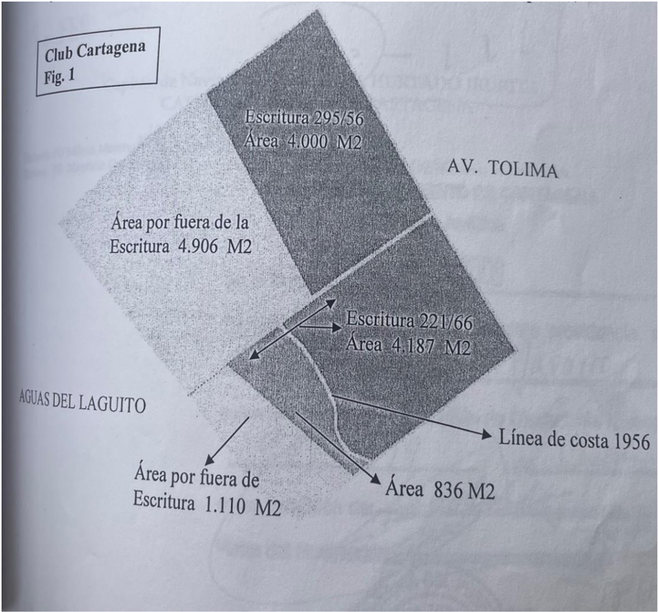

## REPÚBLICA DE COLOMBIA

## consejo DE ESTADO SALA DE LO CONTENCIOSO ADMINISTRATIVO SECCIÓN TERCERA - SUBSECCIÓN B

Bogotá DC, tres (3) de junio de dos mil veinticinco (2025)

Magistrado Ponente:

FREDY IBARRA MARTÍNEZ 13001-23-31-000-2011-00178-01 (63.554) JOSÉ MARÍA CABALLERO SALGUEDO DISTRITO TURÍSTICO Y CULTURAL DE CARTAGENA DE INDIAS Y CLUB DE CARTAGENA ACCIÓN POPULAR APELACIÓN DE SENTENCIA - MORALIDAD ADMINISTRATIVA - PATRIMONIO PÚBLICO

Expediente:

Medio de control:

Asunto:

Síntesis  del  caso:  el  actor  popular  solicita  la  protección  de  los  derechos  colectivos  a  la moralidad  administrativa  y  a  la  defensa  del  patrimonio  público,  los  cuales  considera vulnerados  y  amenazados  con  el  contrato  de  compraventa  celebrado  entre  el  Distrito Turístico  y  Cultural  de  Cartagena  de  Indias  y  la  Corporación  de  Derecho  Privado  Club Cartagena  mediante el cual el primero le transfirió a la segunda  un inmueble, supuestamente  baldío,  denominado  'Polígono  Relleno  Club  Cartagena';  el  tribunal  de primera instancia accedió a la protección solicitada y anuló el referido contrato. Inconformes con  la  decisión,  la  entidad  territorial  y  la  corporación  demandadas  apelan  para  que  se revoque la sentencia de primera instancia y en su lugar se nieguen las pretensiones.

Temas: acción popular / Derechos colectivos a la moralidad administrativa y a la defensa del patrimonio público - elementos de configuración - violación de normas constitucionales y legales con fines indebidos - omitir procedimientos de selección para el suministro de bienes  y  servicios  /  Bienes  de  uso  público  -  zonas  marítimas  y  de  bajamar  -  bienes imprescriptibles, inalienables e inembargables con independencia de acciones antrópicas.

Remitido por competencia el asunto de la referencia por la Sección Primera de la Corporación,  la  Sala  decide  los  recursos  de  apelación  interpuestos  por  la  parte demandada en contra de la sentencia del de octubre de 2017 proferida por el Tribunal Administrativo de Bolívar que accedió parcialmente a las súplicas de la demanda en los siguientes términos:

## ' FALLA:

PRIMERO. CONCÉDESE la protección a los derechos colectivos invocados  por  el  actor  popular,  de  conformidad  con  lo  expuesto  en precedencia.

SEGUNDO. DECLÁRASE que  por  las  razones  expuestas  en  la  parte motiva  de  esta  sentencia,  el  Distrito  de  Cartagena  y  la  Corporación Privada Club de Cartagena, al celebrar el contrato de compraventa de de diciembre de 2007 afectaron los derechos colectivos a la moralidad administrativa y al patrimonio público consagrados en los literales b) y e)

Expediente no. 13001-23-31-000-2011-00178-01 (63.554) Actor: José María Caballero Salguedo Acción popular del artículo 4 de la Ley 472 de 1998, por lo que se ordenarán las siguientes medidas: a) Declárese la nulidad absoluta del contrato de compraventa al que se refiere esta sentencia. b) Ordenar al alcalde del Distrito de Cartagena que, a la mayor brevedad, sin exceder el término máximo de dos (2) meses, se sirva proferir los actos administrativos  que  sean  necesarios  para  darle  cumplimiento  a  la presente sentencia. c)  Ordenar  al  Distrito  de  Cartagena  que  realice  todas  las  gestiones administrativas y demás  diligencias en  la Oficina de  Registro de Instrumentos Públicos de Cartagena para la cancelación de las anotaciones  realizadas  en  el  folio  de  matrícula  inmobiliaria  No.  060170846. d) Ordenar al Distrito de Cartagena y a la DIMAR que a más tardar en el término de seis (6) meses, realice los trámites que sean necesarios para que se recupere el predio a que hace mención la presente providencia. TERCERO. NIÉGANSE las demás pretensiones de la acción popular. CUARTO. ORDÉNASE la conformación de un comité que sirva verificar el cumplimiento de la presente sentencia, y el mismo estará integrado por el Agente del Ministerio Público delegado ante esta Corporación, el actor popular de este proceso, por un representante del Distrito de Cartagena, por un representante de la corporación privada Club de Cartagena y por un representante de la DIMAR. QUINTO. ORDENAR compulsar  copias  de  esta  sentencia  ante  la Procuraduría,  a  la  Contraloría  General  de  la  República,  a  la  Fiscalía General de la Nación con competencia en el Distrito de Cartagena, a fin de que dichas autoridades analicen si hay lugar a abrir alguna investigación  por  considerar  que  alguna  de  las  conductas  a  que  hace alusión esta sentencia y que se endilgan tanto al Distrito de Cartagena como  al  Club  de  Cartagena,  pueda  ser  objeto  de  investigación  fiscal, disciplinaria o penal. SEXTO. DESÍGNASE a la Procuraduría Regional de Bolívar para que vele por el estricto cumplimiento de esta providencia, de conformidad con lo establecido en los artículos 277 numeral 4, 278 de la Constitución Política y el artículo 43 de la Ley 472 de 1998. SÉPTIMO. ENVIAR copia de la presente providencia, a la Defensoría del Pueblo, de acuerdo a lo estipulado en el artículo 80 de la Ley 472 de 2011 (sic) y 282 de la Constitución Política. el  presente  fallo;  una  vez  ejecutoriada  la (fls. 898 y 899 cdno. ppal. -

OCTAVO. NOTIFÍQUESE presente providencia archívese el proceso' negrillas y mayúsculas sostenidas del original).

## 1. La demanda

Mediante escrito del de julio de 2008 , el señor José María Caballero Salguedo interpuso demanda en ejercicio de la acción popular (fl. 1 a 15 cdno. 1) para que se amparen  los  derechos  colectivos  a  la  moralidad  administrativa  y  la  defensa  del patrimonio público establecidos en los literales b) y e) del artículo 4 de la Ley 472 de 1998, respectivamente y, en consecuencia, se acceda a las siguientes súplicas:

PRIMERO. Que se declare vulnerado el derecho colectivo a la moralidad administrativa  y  de  defensa  del  patrimonio  público  de  la  comunidad cartagenera.

SEGUNDO . Que mediante sentencia que haga tránsito a cosa juzgada se determine que  el Distrito Turístico y Cultural de Cartagena  y la Corporación  de  Derecho  Privado  Club  Cartagena,  mediante  contrato celebrado en diciembre de 2007, relacionado con la venta de un inmueble de  propiedad  del  primero  (ubicado  en  el  barrio  Bocagrande  polígono relleno Club Cartagena con folio de matrícula inmobiliaria no. 060-178046, cuyos  linderos  y  medidas  son:  (…),  está  causando  un  detrimento patrimonial a las finanzas públicas de la comunidad cartagenera, y como consecuencia  de  ello  se  deje  sin  efecto  el  contrato  contenido  en  la escritura pública no. 3477 del de diciembre de 2007 otorgada en la Notaría Primera de Cartagena de Indias.

TERCERO .  Que se ordene a las entidades accionadas que cambien y adecúen el precio pactado por la venta del inmueble y lo establezcan por el verdadero valor comercial del mismo, que deberá ser establecido por peritos expertos en la materia, pero que desde ya podemos cuantificar en una suma de dinero superior a los veintitrés mil doscientos cuarenta y siete millones de pesos ($23.247´000.000) m/cte.

CUARTO .  Que  se  ordene  a  los  accionados  que  en  el  evento  de  no pagarse inmediatamente la suma de dinero correspondiente al precio de venta  que  nos  ocupa,  sobre  la  misma  se  establezca  la  generación  de intereses hasta cuando se haga el pago en dinero efectivo.

QUINTO .  Que  en  el  evento  de  no  poderse  realizar  la  venta  porque  el comprador no pueda o no quiera pagar el verdadero precio del inmueble se ordene su inmediata devolución al Distrito de Cartagena.

SEXTO . Que se reconozca en mi favor el incentivo del 15% establecido en el artículo 39 de la Ley 472 de 1998, con base en el mayor valor que

## I.
ANTECEDENTES

reciba el Distrito de Cartagena por la venta del inmueble a la Corporación de Derecho Privado Club de Cartagena o a cualquier otro comprador que en  el  futuro  adquiera  por  su  verdadero  valor  comercial  y/o  por  la reintegración del predio a su patrimonio.

SÉPTIMO . Que se cite a las autoridades de control que, de acuerdo con la ley, el juzgado deba hacer conocer del presente asunto, en especial a la Contraloría Distrital que es el ente directamente encargado de velar por el  patrimonio  de  los  cartageneros' (fls.  2  y  3  cdno.  1  -  negrillas  del original).

## 2. Los hechos

Como fundamentos fácticos de la demanda la parte actora expuso, en síntesis, los siguientes: 1) Los medios de comunicación nacionales y locales informaron de la celebración de  un  contrato  de  compraventa  suscrito  entre  el  Distrito  Turístico  y  Cultural  de Cartagena de Indias y la corporación de derecho privado Club de Cartagena, por medio del cual el primero le transfirió a la segunda un inmueble identificado con folio de  matrícula  inmobiliaria  no.  060-17846,  con  una  extensión  de.749  metros cuadrados, por un valor de ocho mil cuatrocientos sesenta y seis millones ciento cincuenta  y  cuatro  mil  setecientos  veinte  pesos  ($8.466´154.720,oo);  el  negocio jurídico se perfeccionó a través de la escritura pública no. 3477 del de diciembre de 2007 de la Notaría Primera del Círculo de Cartagena. 2) El bien fue enajenado por un valor inferior al del avalúo catastral que corresponde a  trece  mil  ochocientos  cuarenta  y  dos  millones  quinientos  setenta  mil  pesos ($13.842´570.000,oo). 3)  Aunado a lo anterior, en la  mencionada escritura pública de compraventa las partes convinieron que una parte del precio de transferencia se pagaría por parte del Club de Cartagena de la siguiente manera: 'la suma de dos mil cuatrocientos millones de pesos ($2.400´000.000) en consumos de bienes y servicios que efectúe el Distrito Turístico y Cultural de Cartagena a través de sus diferentes dependencias, en los próximos tres años calendarios a iniciarse el primero (1) de enero de 2008, en  el  entendimiento  que  durante  cada  uno  de  esos  años,  dichos  consumos alcanzarán  la  suma  máxima  de  ochocientos  millones  de  pesos  moneda  legal colombiana' (fl. 4 cdno. 1).

- 4) Entre el valor del contrato y el precio real del inmueble hay una diferencia superior a  los  quince  mil  millones  de  pesos  ($15.000´000.000);  el  beneficiario  de  esta desproporción es un club social de naturaleza privada conformado por los miembros de la clase social más privilegiada de la ciudad.

Como fundamento jurídico de la demanda, el actor popular invocó los artículos 88 y 209 de la Constitución Política, la Ley 472 de 1998 y varias providencias proferidas por esta Corporación.

## 3. El trámite de primera instancia

Por auto del de julio de 2000, el Juzgado Quinto Administrativo del Circuito de Cartagena admitió la demanda y ordenó su notificación a las demandadas (fl. 34 cdno. 1).

## 3.1 Distrito Turístico y Cultural de Cartagena de Indias

Se opuso a las pretensiones formuladas por el actor popular (fls. 41 a 47 cdno. 1), adujo que la venta se fundamentó en el Acuerdo no. 030 del de diciembre de 2006 expedido por el Concejo Distrital de Cartagena, por medio del cual se facultó al alcalde de la ciudad para disponer de los bienes baldíos cedidos por la Nación, agregó  que  el  artículo  5  de  esa  normativa  estableció  que  los  ocupantes  o poseedores de baldíos enajenables que demostraran su tenencia por más de cinco (5)  años  tendrían  la  primera  opción  de  compra,  lo  cual  ocurrió  con  el  Club  de Cartagena,  debido  a  que  tenía  el  derecho  preferencial  a  legalizar  el  predio denominado 'Polígono relleno Club Cartagena' ; finalmente, manifestó que entre el Distrito de Cartagena y el Club Cartagena se han realizado varias reuniones para modificar el acuerdo de pago, por el hecho de que el primero considera que no acepta ni puede aceptar que se pague una proporción del valor del inmueble con consumos de bienes o servicios.

## 3.2 Club Cartagena

- 1)  Esta  corporación  de  derecho  privado  contestó  la  demanda  y  formuló  las excepciones  de  i)  ' confianza  legítima' e  ii) 'inexistencia  de  vulneración  a  la moralidad administrativa' (fls. 70 a 78 cdno. 1).

- 2)  En  primer  término,  indicó  que  el  informe  de  avalúo  comercial  urbano  de  las instalaciones  del  Club  Cartagena  -  Bocagrande  del  de  diciembre  de  2007 elaborado por el Instituto Geográfico Agustín Codazzi establece que el valor de la totalidad del terreno y de las construcciones de las instalaciones del club equivale a veintiún mil setecientos sesenta y nueve millones ($21.769´960.000), avalúo sobre el  cual  es  necesario  hacer  dos  precisiones: i) en  la  ficha  catastral  el  inmueble involucra un área equivalente a 11.749 metros cuadrados, sin excluir las construcciones, mejoras y general las adecuaciones que introdujo la corporación de derecho privado y, ii) el IGAC no tuvo en cuenta la Resolución 035 de de febrero de 2008 de la Capitanía de Puerto de Cartagena, en virtud de la cual se determinó que el  Club  Cartagena  ocupa  ilegalmente  una extensión de  playa  equivalente a 6.016 metros cuadrados que forman para del lote adquirido al Distrito mediante la escritura pública no. 3477, decisión que está apelada, pero que, se insiste, no fue valorada al momento de efectuar el avalúo comercial del inmueble.
- 3)  De  otra  parte,  respecto  de  la  confianza  legítima,  puntualizó  que  asumió  una conducta legal, honesta, transparente y compatible con el desarrollo económico y social; agregó, finalmente, 'sin dubitación alguna que los precios por los servicios de gastronomía y demás que tienen los productos brindados por mi poderdante resultan particularmente más bajos que los vigentes en cualquier otro establecimiento  de  la  ciudad  a  donde  'invariablemente  tienen'  que  acudir  las autoridades en desarrollo de su cargo' (fl. 72 cdno. 1).

## 3.3 Nación - Ministerio de Defensa - Dirección General Marítima (DIMAR)

Mediante auto del de mayo de 2009 se ordenó vincular a la DIMAR al proceso (fls. 217 a 219 cdno. 2); la entidad se opuso a las pretensiones formuladas (fls. 224 a 228 cdno. 2) para lo cual propuso la excepción de 'falta de legitimación en la causa por pasiva' , precisó que el de febrero de 2008 el Capitán de Puerto de Cartagena, a través de la Resolución 035 de de febrero de 2008, declaró a la Corporación de  Derecho  Privado  Club  Cartagena  responsable  por  ocupar  ilegalmente  playa marítima y realizar construcciones sobre las mismas sin la debida autorización de la Dirección General Marítima, razón por la cual le impuso una sanción de cien (100) salarios mínimos legales mensuales vigentes; agregó que en contra del citado acto administrativo se interpusieron recursos de reposición y en subsidio apelación, y que el primero se resolvió el de febrero de 2009, en el sentido de confirmar el Apelación de sentencia acto  definitivo  y  conceder  la  apelación  ante  la  Dirección  General  Marítima;  por último, afirmó lo siguiente: 'en caso de emitir un pronunciamiento de fondo dentro de  la  presente  acción  popular,  respetuosamente  se  solicita  tener  en  cuenta  la aplicación del régimen especial de protección de los bienes de uso público, atributos que se ciñen a ser inalienables, imprescriptibles e inembargables, por lo cual no se podría hablar de un justo precio sobre un bien que se encuentra por fuera del comercio ' (fl. 228 cdno. 2 - negrillas del original).

## 4. La sentencia apelada

El Tribunal Administrativo de Bolívar en providencia del de octubre de 2017 (fls. 884 a 899 cdno. ppal.) accedió parcialmente a las súplicas de la demanda, con base en el siguiente razonamiento:

- 1) El contrato de compraventa celebrado entre el Distrito de Cartagena y el Club Cartagena se celebró  de manera  directa,  sin  la  realización  de  licitación  pública, motivo por el cual se desconocieron los artículos 123 de la Ley 388 de 1997 y, 35 y 36 de la Ley 9 de 1989, con independencia de que el Acuerdo Distrital no. 030 del Concejo  Distrital  de  Cartagena  hubiera  autorizado  esa  enajenación  de  forma directa.
- 2)  En  ese  orden  de  ideas,  el  referido  negocio  jurídico  trasgredió  los  derechos colectivos a la moralidad administrativa y a la defensa del patrimonio público.
- 3) De otra parte, en el referido acto jurídico se incorporó un precio muy por debajo del valor real, con lo cual se materializó una lesión enorme de conformidad con el artículo 1947 del Código Civil.
- 4) Adicionalmente, del acervo probatorio se desprende que gran parte de las áreas comprendidas en la escritura pública no. 3477 de 2007 de la Notaría Primera del Círculo  Notarial  de  Cartagena  son  de  uso  público,  debido  a  que  el  terreno  está conformado por lo que en su momento eran aguas y playas marítimas, por lo cual no  constituye  un  bien  baldío  en  tanto  corresponde  estrictamente  a  zonas  de bajamar.

5) En esa perspectiva, con la enajenación de un bien inmueble de propiedad del Distrito de Cartagena -bien de uso público-, a una persona de derecho privado se afecta  el  derecho  al  patrimonio  público  de  los  cartageneros,  además  de  la vulneración a la moralidad administrativa por el hecho de transferir la propiedad de un bien de uso público que debe estar al servicio de la comunidad y no de intereses particulares.

- 6) Con fundamento en lo anterior, es procedente amparar los derechos colectivos invocados en la demanda y, como consecuencia, declarar la nulidad absoluta del contrato de compraventa y ordenar al alcalde de Cartagena que expida los actos necesarios para dar cumplimiento a la sentencia.

## 5. Los recursos de apelación

Inconformes con la decisión, el Distrito Turístico y Cultural de Cartagena de Indias y la Corporación Club Cartagena interpusieron sendos recursos de apelación (fls. 914 a 917 y 931 a 938 cdno. ppal.) los cuales fueron concedidos por auto del de enero de 2018 (fl. 939 cdno. ppal.).

La apoderada judicial del Club Cartagena radicó una solicitud de nulidad de todo lo actuado, la cual fue resuelta por la Sección Primera del consejo de Estado en auto del de mayo de 2018 (fls. 975 a 976 cdno. ppal.); en contra de la providencia se interpuso recurso de súplica que fue rechazado por improcedente y readecuado a reposición, el cual fue decidido mediante auto del de diciembre de 2018 (fls. 997 a 999 cdno. ppal.); luego, a través de proveído del de febrero de 2019 la Sección Primera de la Corporación remitió el asunto por competencia a esta Sección (fl. 1029 cdno. ppal.); posteriormente, los recursos de apelación fueron admitidos en auto del de abril de 2019 (fl. 1034 cdno. ppal.) y, finalmente, a través de providencia del de septiembre de 2019 se aclaró el auto admisorio para indicar que la Corporación Club Cartagena complementó el recurso de apelación a través de memorial de de enero de 2018; sin embargo, no se dijo nada en relación con la solicitud de que se  aceptara  como  complementación  de  la  impugnación  el  memorial  del  de febrero de 2019 radicado por la nueva apoderada judicial de esa corporación, razón para concluir que esa petición se entendió denegada, sin que en contra de la misma se interpusiera recurso alguno (fl. 1040 cdno. ppal.).

## 5.1 Distrito Turístico y Cultural de Cartagena de Indias

Los motivos en los que se sustentó el recurso de apelación son los siguientes:

- 1) A diferencia de lo afirmado en la sentencia de primera instancia, en la actualidad el lote enajenado tiene como frente la boca de 'El laguito', que no tiene en estos momentos conexión con el mar; es 'necesario además mirar el contexto de toda el área que en su momento fue construida por la Andian National Corporation Ltd, desde el Hotel Caribe por todo lo que se conoce como el sector de 'El laguito' era agua (costa) y a través del tiempo se fueron haciendo rellenos para consolidar hoy el terreno que se conoce como la costa que se formó por fenómenos antrópicos y susceptible  de  derecho  de  dominio  como  es  el  caso  del  'Polígono' del  Club Cartagena' .
- 2)  Además,  la  DIMAR  negó  que  esos  terrenos  fueran  actualmente  zonas  de bajamar, pues, si bien en algún momento lo fueron, lo cierto es que en la actualidad no lo son y, por lo tanto, no pueden ser tenidos en cuenta como zona costera o de bajamar.

## 5.2 Corporación Club Cartagena

Los  fundamentos  de  la  impugnación  son,  en  síntesis,  los  que  se  reseñan  a continuación:

- 1)  El  artículo  144  del  CPACA  prohíbe  al  juez  popular  anular  actos  o  contratos estatales,  de  allí  que  erró  el  tribunal  de  primera  instancia  al  adoptar  esa determinación.
- 2) La sentencia omitió referirse a la vigencia del Acuerdo no. 030 de 2006 expedido por  el  Concejo  Distrital  de  Cartagena  de  Indias,  dado  que  la  enajenación  se fundamentó en ese acto administrativo cuya legalidad no fue cuestionada.
- 3) La sentencia de primera instancia anula el contrato de compraventa sobre el bien 'Polígono'; sin embargo,  no  dispuso  la  cancelación  del folio de  matrícula inmobiliaria, a pesar de señalar que ese predio es un bien de uso público.

- 4)  La  sentencia  impugnada  se  basa en  suposiciones, por  cuanto, no  analizó de manera adecuada la Resolución DIMAR 0677-2015 del de noviembre de 2015 en virtud  de  la  cual  se  excluyó  el  inmueble  denominado  'Polígono  Relleno  Club Cartagena' de la condición de bien de uso público, por tratarse de áreas que no tienen las características de playa o bajamar.
- 5)  La  sentencia  omitió  señalar  qué  pasa  con  los  dineros  e  intereses  que  debe reintegrar  el  Distrito  de  Cartagena  al  Club  Cartagena  como  consecuencia  de  la nulidad decretada del contrato de compraventa; asimismo, la providencia ha debido referirse  a  los  efectos  de  la  cláusula  compromisoria  contenida  en  el  contrato  de compraventa, en concordancia con lo establecido en los artículos y 5 de la Ley 1563 de 2012.

## 6. La actuación de segunda instancia

A través de auto del de enero de 2020 (fl. 1043 cdno. ppal.) se ordenó correr traslado a las partes para alegar de conclusión por el término de días y, vencido este, por el mismo lapso correr traslado al Ministerio Público para emitir el respectivo concepto.

En esta etapa intervino,  exclusivamente,  la Corporación  Club de Cartagena  (fls. 1049 a 1069 cdno. ppal.) para aducir lo siguiente:

- 1) El tribunal de primera instancia erró en invocar el artículo 1865 del Código Civil, en el segmento que prevé que no podrá dejarse el precio al arbitrio de uno de los contratantes, ya que en este caso concreto está claro que la fijación del precio de venta no fue resultado de la unilateralidad de los sujetos negociales.
- 2) En relación con la forma de pago del precio con bienes de consumo y servicios, es preciso advertir que los artículos 1849 y 1850 del Código Civil permiten que las partes del contrato de compraventa puedan pactar que el precio se pagará parte en dinero y parte en otra cosa; no existe norma constitucional o legal que impida pactar la entrega de especies como parte del precio convenido y, menos aún es cierto que un pacto en tal sentido afecte de nulidad por objeto ilícito el contrato que contenga cláusulas de ese orden.

- 3) Tampoco es válido afirmar que de la cláusula de precio acordada se derivó un contrato  de  suministro  en  favor  del  Distrito  de  Cartagena,  convención  que desconoció las disposiciones de la Ley 80 de 1993; en efecto, no es admisible, desde  una  perspectiva  lógica  y  legal,  sostener  que  la  definición  de  la  tipología contractual  pueda  determinarse,  simplemente,  a  partir  de  la  observación  de  la cláusula de pago y no como corresponde del análisis de las obligaciones contraídas.
- 4)  El  numeral  2  del  artículo  36  de  la  Ley  9  de  1989  permite  que  las  entidades públicas enajenen sus inmuebles sin que medie licitación pública cuando el contrato de compraventa se celebre con una entidad sin ánimo de lucro; adicionalmente, el citado  Acuerdo  no.  30  del  de  diciembre  de  2006  del  Concejo  Distrital  de Cartagena, acto administrativo que goza de presunción de legalidad, avaló la venta de manera directa en favor de los ocupantes o poseedores de bienes baldíos que fueran enajenables, siempre que se demostrara su tenencia por más de cinco (5) años.
- 5) El tribunal afirmó que el predio objeto del contrato de compraventa corresponde a un terreno de bajamar, conclusión que carece de fundamento jurídico, debido a que el oficio no. 29201201000 MD-DIMAR-SUBDEMA-ALIT es enfático en señalar lo siguiente: 'De acuerdo con el mapa adjunto, se tiene un área de seis mil cincuenta y seis coma treinta y cuatro metros cuadrados (6054,34 m2) correspondientes en su momento a aguas marítimas y playas marítimas, en atención a lo dispuesto en el artículo 167 del Decreto ley 2324 de 1984' (fl.  1067 cdno. ppal. - negrillas del original).
- 6) Finalmente, la providencia no impartió una orden respecto de los derechos que surgen  en  favor  de  la  Corporación  de  Derecho  Privado  Club  Cartagena  en  el escenario de considerarse que adquirió un predio inajenable, por lo cual deben, coherentemente, dictarse las órdenes de restitución del precio pagado, así como también el reconocimiento de las mejoras que sobre el mismo haya efectuado el comprador.

La parte actora, el Distrito de Cartagena y el Ministerio Público guardaron silencio (fl. 1070 cdno. ppal.)

## II.
CONSIDERACIONES DE LA SALA

Cumplidos los trámites propios del proceso, sin que exista causal alguna de nulidad que invalide lo actuado, la Sala resuelve el asunto sometido a consideración  con el siguiente derrotero:  1) objeto de la controversia y anuncio de la decisión, 2) análisis del caso concreto, 3) órdenes necesarias para la protección y la salvaguarda de los derechos colectivos amparados, 4) conclusión y, 5) condena en costas.

## 1. Objeto de la controversia y anuncio de la decisión

El  centro  de  la  controversia  planteada  radica  en  establecer  si  la  parte  actora demostró la violación de los derechos colectivos a la moralidad administrativa y a la defensa del patrimonio público.

La Sala modificará la sentencia impugnada, porque se advierte que en este caso concreto se probó  la violación de  los derechos  colectivos  a la  moralidad administrativa y a la defensa del patrimonio público establecidos en los literales b) y e) del artículo 4 de la Ley 472 de 1998, respectivamente; sin embargo, no era procedente declarar la nulidad del contrato de compraventa celebrado sino adoptar las  medidas  tendientes  a  conjurar  la  vulneración  de  los  derechos  colectivos mencionados.

## 2. Análisis del caso concreto

## 2.1 La normativa aplicable a la controversia y la posibilidad de anular contratos estatales a través de la acción popular) La demanda de acción popular se interpuso el de julio de 2008, esto es, antes de la expedición de la Ley 1437 de 2011 (CPACA), de allí que al asunto objeto de Apelación de sentencia análisis no le resultan aplicables las exigencias y prohibiciones contenidas en el artículo 144 ibidem , según el cual:

'Cualquier  persona  puede  demandar  la  protección  de  los  derechos  e intereses colectivos para lo cual podrá pedir que se adopten las medidas necesarias con el fin de evitar el daño contingente, hacer cesar el peligro, la  amenaza,  la  vulneración  o  agravio  sobre  los  mismos,  o  restituir  las cosas a su estado anterior cuando fuere posible.

Cuando  la  vulneración  de  los  derechos  e  intereses  colectivos provenga de la actividad de una entidad pública, podrá demandarse su protección, inclusive cuando la conducta vulnerante sea un acto administrativo o un contrato, sin que en uno u otro evento, pueda el juez anular el acto o el contrato, sin perjuicio de que pueda adoptar las  medidas  que  sean  necesarias  para  hacer  cesar  la  amenaza  o vulneración de los derechos colectivos .

Antes  de  presentar  la  demanda  para  la  protección  de  los  derechos  e intereses  colectivos,  el  demandante  debe  solicitar  a  la  autoridad  o  al particular  en  ejercicio  de  funciones  administrativas  que  adopte  las medidas  necesarias  de  protección  del  derecho  o  interés  colectivo amenazado o violado. Si la autoridad no atiende dicha reclamación dentro de los quince (15) días siguientes a la presentación de la solicitud o se niega  a  ello,  podrá  acudirse  ante  el  juez.  Excepcionalmente,  se  podrá prescindir de este requisito, cuando exista inminente peligro de ocurrir un perjuicio irremediable en contra de los derechos e intereses colectivos, situación que deberá sustentarse en la demanda' (destaca la Sala) .

En ese orden de ideas, no le asiste razón a la Corporación de Derecho Privado Club Cartagena en sostener que el tribunal de primera desconoció el contenido del citado artículo 144 del CPACA, por cuanto esa norma no es aplicable a la controversia.

2) Ahora bien, en sede de revisión eventual -es decir, con fines de unificación- la Sala Décima Especial de Revisión de la Sala Plena de lo Contencioso Administrativo unificó la jurisprudencia para señalar que, incluso con anterioridad a la expedición de la Ley 1437 de 2011 (CPACA), no es posible que se anulen contratos estatales por parte del juez popular; la regla de unificación establecida fue la siguiente :

' En las acciones populares iniciadas antes de la expedición de la Ley 1437  de  2011, el  juez  no  tiene  la  facultad  de  anular  los  contratos administrativos que considere causa de la amenaza o violación de derechos  colectivos .  En  estos  casos, el  juez  podrá  adoptar  las Apelación de sentencia medidas  materiales  que  los  garanticen;  para  el  efecto,  tiene  la posibilidad de emitir cualquier otra orden de hacer o no hacer que considere  pertinente ,  de  acuerdo  con  el  caso  concreto' (negrillas adicionales).

En otros términos, se determinó que el juez no puede anular contratos estatales, con independencia de que se demuestre que estos vulneran o amenazan derechos o intereses colectivos; no obstante, se avaló la posibilidad de que se dicte cualquier tipo  de  orden de  hacer  o  no  hacer  que  se  considere  pertinente para  conjurar  la trasgresión de los derechos amparados, tales como la suspensión o la cesación de los efectos del respectivo negocio jurídico.

3)  De  otra  parte,  la  Sala  Plena  de  lo  Contencioso  Administrativo  unificó  la jurisprudencia en torno a la imposibilidad de entregar en arrendamiento bienes de uso público, en los siguientes términos:

PRIMERO. SE UNIFICA LA POSICIÓN DE LA JURISDICCIÓN DE LO  CONTENCIOSO ADMINISTRATIVO en  el  siguiente sentido: no es procedente que las autoridades administrativas entreguen bienes de uso público utilizando para ello la fórmula contractual del arrendamiento, por las razones expuestas en la parte motiva de esta providencia' sostenidas del original)) Sin perjuicio del recuento normativo y jurisprudencial anterior, lo cierto es que el juez de la acción popular está facultado a estudiar si un acto administrativo o un contrato estatal vulnera o amenaza un derecho o interés colectivo, caso en el cual está facultado para adoptar todas las medidas u órdenes que sean necesarias - salvo la de anular- para hacer cesar la acción o la omisión lesiva.

5) Por consiguiente, la Sala pone de presente que no era posible que el tribunal de primera instancia declarara la nulidad del contrato de compraventa celebrado entre el Distrito Turístico y Cultural de Cartagena de Indias y la Corporación de Derecho

Privado Club Cartagena.

(negrillas y mayúsculas

No  obstante,  el a  quo sí  estaba  facultado  para  definir  si  el  referido  contrato  de compraventa trasgredió derechos o intereses colectivos y, por lo tanto, si era viable adoptar órdenes de hacer o de no hacer con la finalidad de proteger los mismos; además, es particularmente  relevante  advertir  que,  con  miras  a  definir  si  con  la celebración  del  contrato  de  compraventa  se  lesionó  la  moralidad  administrativa, será  absolutamente  indispensable  verificar  si  ese  acto  jurídico  desconoció  las normas  superiores  y,  en  general,  el  ordenamiento  jurídico  aplicable,  así  como también la finalidad con la cual se suscribió ese negocio jurídico, para efectos de desentrañar si existió un propósito censurable, ilegal o indebido que riña con los postulados  de  la  función  administrativa  establecidos  en  el  artículo  209  de  la Constitución Política.

En ese específico marco conceptual, la Sala estudiará el fondo de la controversia y los  argumentos  expuestos  con  los  recursos  de  apelación  para  definir  si  la vulneración de los derechos e intereses colectivos invocados por el actor popular está o no acreditada en el proceso.

## 2.3 El derecho colectivo a la moralidad administrativa) El primer derecho colectivo cuya protección judicial reclama el actor popular en el presente asunto está consagrado en el literal b) del artículo 4 de la ley 472 de 1998, cuyo texto es el siguiente: ' [a] rtículo.
Derechos e intereses colectivos. Son derechos  e  intereses  colectivos,  entre  otros  los  relacionados  con: (…) b) [l] a moralidad administrativa'.

2) En relación con el contenido y alcance del concepto de moralidad administrativa como interés colectivo susceptible de protección judicial a través de la denominada acción popular, la Sección Tercera del consejo de Estado ha sostenido que la razón de ser de este derecho colectivo radica en la función administrativa la cual está sujeta a una serie de principios dirigidos a garantizar el cumplimiento de los fines del Estado .

3) Adicionalmente, para que pueda predicarse la lesión a este derecho e interés colectivo debe existir, necesariamente, una trasgresión al ordenamiento jurídico, al tiempo que debe acreditarse la mala fe de la administración.

La actuación de la administración debe ser de tal magnitud que desnaturalice la función  pública  ejecutada  y  debe  desembocar  en  la  satisfacción  de  intereses particulares, indebidos e ilegítimos.

Por  lo  tanto,  no  toda  irregularidad  administrativa,  como  tampoco  no  cualquier incumplimiento  o  quebranto  de  la  normatividad  que  rija  o  regule  determinado procedimiento administrativo constituye, per se , violación de la moralidad administrativa, pues, para ello se requiere la existencia o presencia de un elemento que denote un propósito o finalidad contrario a los cometidos para los cuales están instituidos los procedimientos y atribuidas las competencias administrativas, como por ejemplo, el ánimo o interés de satisfacer o alcanzar un interés personal, de grupo o de terceros, que, resulta opuesto o diferente al preestablecido, en cada caso, por el constituyente y el legislador.

En ese sentido se ha pronunciado la Sala Plena del consejo de Estado, además de los elementos objetivos que deben analizarse para establecer la vulneración de ese derecho colectivo es necesario que concurra el elemento subjetivo que implica un juicio  sobre  la  conducta  del  funcionario  para  establecer  el  ánimo  o  interés  de satisfacer o alcanzar un interés personal indebido o ilegítimo para sí o para terceras personas, al respecto ha puesto de presente lo siguiente :

'No se puede considerar vulnerado el derecho colectivo a la moralidad pública sin hacer el juicio de moralidad de la actuación del funcionario para establecer si incurrió en conductas amañadas, corruptas o arbitrarias y alejadas de los fines de la correcta función pública.

Aquí es donde se concreta el segundo elemento. Consiste en que esa  acción  u  omisión  del  funcionario  en  el  desempeño  de  las funciones  administrativas  debe  acusarse  de  ser  inmoral;  debe evidenciarse que el propósito particular del servidor se apartó del cumplimiento del interés general, en aras de su propio favorecimiento o del de un tercero.

Este presupuesto está representado en factores de carácter subjetivo  opuestos  a  los  fines  y  principios  de  la  administración, traducidos en comportamientos deshonestos, corruptos, o cualquier denominación que se les dé; en todo caso, conductas alejadas del interés general y de los principios de una recta administración de la cosa pública, en provecho particular.' (negrillas adicionales).

Por su parte, la Corte Constitucional en sentencia C-643 de de agosto de 2012 con ocasión de juzgar y decidir acerca de la constitucionalidad del artículo 16 de la Ley 1416 de 2010 7 ' [p] or medio de la cual se fortalece al ejercicio del control fiscal' , en cuanto al entendimiento que debe  darse del derecho a la moralidad administrativa  y  del  principio  de  eficacia  de  la  función  administrativa  precisó, puntualmente, lo siguiente:

' Al referirse al principio de la moralidad en la actividad administrativa,  esta  Corporación  ha  sostenido  que  la  misma  no corresponde al fuero interno de los servidores, sino a su relación con  el  ordenamiento  jurídico  a  partir  del  cual  se  esperan  por  la sociedad una serie de comportamientos. En la sentencia C-046 de 1994, así lo explicó:

`(…) el principio de la moralidad que, en su acepción constitucional, no se circunscribe al fuero interno de los servidores públicos, sino que abarca toda la gama del comportamiento que la sociedad en un momento dado espera de quienes manejan los recursos de la comunidad y que no puede ser otro que el de absoluta pulcritud y honestidad. (…)`.

En este orden de ideas, los supuestos sustanciales para que proceda la protección de los derechos e intereses colectivos (antes denominada acción popular) por vulneración del derecho colectivo a la moralidad administrativa son, según jurisprudencia del consejo de Estado, los siguientes: 1. La Acción u omisión debe corresponder al  ejercicio  de  una  función  pública .  2.  La  acción  u  omisión  debe lesionar el principio de legalidad . 3. La desviación en el cumplimiento de la función ha de producir un perjuicio del interés general favoreciendo con ello al servidor público o a un tercero ó 4. La  desviación  del  interés  general  debe  ser  de  tal  magnitud,  que transgreda principios o valores instituidos  previamente  como deberes superiores en el derecho positivo .

(…).2  A  su  turno,  el  artículo  209  superior  indica  que  la  función administrativa debe orientarse, entre otros, por los principios de economía y  eficacia.  El  primero,  en  armonía  con  el  artículo  334,  supone  que  la Administración debe tomar medidas para ahorrar la mayor cantidad de costos en  el cumplimiento  de  sus fines. El segundo  exige  a  la Administración el cumplimiento cabal de sus fines. En conjuntos, estos principios imponen a la Administración el deber de cumplir sus objetivos con una adecuada relación costo-beneficios, en otras palabras, actuar de forma  eficiente .    Al  respecto,  vale  la  pena  resaltar  lo  señalado  en  la sentencia C-035 de 1999:

(…) Para la Corte Constitucional, el principio de eficacia exige que las actuaciones  públicas  produzcan  resultados  concretos  y  oportunos.  Al respecto, ha explicado:

´El artículo 209 de la Constitución impone a las autoridades administrativas el deber de coordinar sus actuaciones para el adecuado cumplimiento de los fines del Estado. Este deber genérico, dirigido a la administración pública, se erige en un límite a los principios de la función administrativa  consagrados  en  el  primer  inciso  del  mismo  artículo.  En efecto, ninguna autoridad podría, so pretexto de seguir o de aplicar un principio que guía la función administrativa - por ejemplo, el principio de economía  o  el  de  celeridad  -,  prescindir  de  la  oportuna  y  necesaria coordinación entre las diferentes autoridades, con miras a evitar decisiones o actuaciones contradictorias en desmedro de la coherencia que debe caracterizar al Estado como un todo y como calificado agente jurídico y moral` 12

Por  último,  en  la  sentencia  C-082  de  1996 ,  dentro  del  análisis  de constitucionalidad del inciso 1º del artículo 52 de la Ley 190 de 1995 , la Corte explicó que la ley puede introducir cambios a la función pública con el propósito de realizar los principios de moralidad, eficacia e imparcialidad, 'siempre y cuando la reglamentación legal no desconozca el núcleo esencial de los derechos de autonomía político-administrativa que la Constitución reconoce a las entidades territoriales.' (se destaca) .

4) En ese marco conceptual y jurisprudencial, la Sala encuentra que en el presente asunto los  elementos subjetivo  y  objetivo  requeridos  para  la  configuración  de  la violación  del  derecho  colectivo  a  la  moralidad  administrativa  se  encuentran acreditados en este caso concreto.

5) En efecto, esta Corporación en decisiones de unificación ha determinado que para  la  configuración  de  la  trasgresión  del  derecho  colectivo  de  la  moralidad administrativa 'desde el punto de vista del interés colectivo tutelable a través de la acción popular, es necesario que se demuestre el elemento objetivo que alude al quebrantamiento del ordenamiento jurídico y el elemento subjetivo relacionado a la comprobación  de  conductas  amañadas,  corruptas,  arbitrarias,  alejadas  de  la correcta función pública' .

Ahora  bien,  en  cuanto  a  la  prueba  de  los  elementos  requeridos  para  tener  por configurada la violación del derecho colectivo de la moralidad administrativa esta Corporación ha determinado lo siguiente:

'De aquí que, la prueba del elemento subjetivo referido a la disposición o el ánimo materializado a través de conductas deshonestas en función de anteponer  los  intereses  particulares,  en  detrimento  de  los  intereses generales, le corresponde a la parte actora, en tanto le incumbe probar el supuesto de hecho de las normas que consagran el efecto jurídico que ellas persiguen y sin que tal conducta se presuma  ante una acusación de haberse pretermitido iniciar un proceso de fiscalización tributaria en un contexto como el que se ha explicado' .

Asimismo, en relación con esa precisa carga probatoria  en materia de acciones populares el artículo 30 de la Ley 472 de 1998 es expreso y claro en determinar que la obligación de demostrar los hechos y pretensiones en la demanda le corresponde a la parte demandante; sin embargo, '(…) si por razones de orden económico o técnico' no  se  pudiera  cumplir  con  esa  carga  procesal,  el  juez  puede  adoptar órdenes para suplir deficiencias, pero, esta no es precisamente la circunstancia que compone este  caso,  pues,  no  se  trata  de  una  situación  de  orden  económico  ni fáctico  que  impidiera  al  demandante  aportar  la  prueba,  concretamente  de  una conducta negligente o deliberada imputable a las entidades demandadas acerca del deber legal que reclama como incumplido y que vulnera el derecho colectivo de la moralidad  administrativa  y,  fundamentalmente,  el  propósito  indebido,  ilegal  o subalterno  en  tal  proceder  para  favorecer  a  los  propios  servidores  públicos concernidos en el asunto o a terceros .

6) El acervo probatorio recaudado en el proceso da cuenta de los siguientes hechos que denotan una violación del interés colectivo a la moralidad administrativa:

Apelación de sentencia a) Mediante escritura pública no. 3477 del de diciembre de 2007 de la Notaría Primera del Círculo de Cartagena, el Distrito Turístico y Cultural de Cartagena de Indias celebró un contrato de compraventa con la Corporación de Derecho Privado Club Cartagena, por medio del cual el aquel se obligó a transferir en favor de esta el derecho dominio sobre 'una porción de un lote de terreno ubicado en el barrio Bocagrande de esta ciudad, denominado Polígono Relleno Club Cartagena, con un área de.749 M2 (…), el predio objeto de la presente venta se identifica con folio de matrícula inmobiliaria no. 060-178046 y la referencia catastral global no. 01-010022-0001-000' (fls. 17 a 21 cdno. 1).

En las cláusulas cuarta y quinta del citado contrato, las partes convinieron el precio y la forma de pago en los términos que se transcriben a continuación:

' CLÁUSULA CUARTA.- VALOR DEL CONTRATO :  El  precio  total  del bien inmueble objeto de la presente venta es la cantidad de OCHO MIL CUATROCIENTOS SESENTA Y SEIS MILLONES CIENTO CINCUENTA Y  CUATRO  MIL  SETECIENTOS  VEINTE  PESOS  ($8.466´154.720) M/LEGAL COLOMBIANA, conforme al avalúo practicado en legal forma y lo  establecido  en  la  Resolución  no.  0941  de  de  diciembre  de  2007 emanada  de  la  Alcaldía  Mayor  del  Distrito  Turístico  y  Cultural  de Cartagena  de  Indias  'por  medio  de  la  cual  se  decide  una  solicitud  de legalización de un predio por venta en los términos del Acuerdo Distrital no. 030 de 2006'.

CLÁUSULA QUINTA.- FORMA DE PAGO : EL COMPRADOR paga AL VENDEDOR la  suma  de  OCHO  MIL  CUATROCIENTOS  SESENTA  Y SEIS MILLONES CIENTO CINCUENTA Y CUATRO MIL SETECIENTOS VEINTE  PESOS  ($8.466´154.720)  M/LEGAL  COLOMBIANA,  de  la siguiente manera: al momento del otorgamiento de la escritura pública de compraventa  la  suma  de  DOS  MIL  CIENTO  DIECISÉIS  MILLONES QUINIENTOS TREINTA Y OCHO MIL SEISCIENTOS SETENTA Y SIETE PESOS ($2.116´538.677) M/LEGAL COL, equivalentes al 25% del precio, de los cuales se compensará la suma de ($959.124.747,78) NOVECIENTOS CINCUENTA Y NUEVE MILLONES CIENTO VEINTICUATRO MIL SETECIENTOS CUARENTA Y SIETE PESOS CON SETENTA Y OCHO CENTAVOS, descompuestos así: NOVECIENTOS DIECISIETE MILLONES CIENTO SETENTA Y SIETE MIL SEISCIENTOS SETENTA  Y  SIETE  PESOS  CON  SETENTA  Y  OCHO  CENTAVOS ($917.177.677,78) correspondientes al pago del impuesto predial unificado  efectuado  por  la  CORPORACIÓN  DE  DERECHO  PRIVADO CLUB  CARTAGENA  al  DISTRITO  TURÍSTICO  Y  CULTURAL  DE CARTAGENA, causados sobre el predio con referencia catastral no. 0101-0022-0001-000 de un área equivalente a 7.749 metros cuadrados del lote de mayor extensión vigencias 1997-2007, por consistir en pago de lo no debido y la suma de CUARENTA Y UN MILLONES NOVECIENTOS CUARENTA Y SIETE MIL SETENTA PESOS M/LEGAL COL ($41´947.070)  deuda  existente  a  cargo  del  DISTRITO  TURÍSTICO  Y CULTURAL con la CORPORACIÓN CLUB CARTAGENA por servicios prestados. La diferencia, o sea, la suma de UN  MIL  CIENTO CINECUENTA  Y  SIETE  MILLONES  CUATROCIENTOS  TRECE  MIL

NOVECIENTOS TREINTA PESOS ($1.157´413.930) M/LEGAL COL en cheque de gerencia girado a la orden del FIDEICOMISO FIDUCIARIA GNB SUDAMERIS ALCALDÍA DISPOSICIÓN DE BALDÍOS al momento del  otorgamiento  de  la  escritura  pública  de  compraventa.  El  saldo restante,  o  sea,  la  suma  de  SEIS  MIL  TRESCIENTOS  CUARENTA  Y NUEVE MILLONES SEISCIENTOS DIECISÉIS MIL CUARENTA Y TRES PESOS  ($6.349.616,043)  M/LEGAL  COL,  así:  B)  Acogiéndose  a  lo dispuesto en el parágrafo primero del artículo 5 del Acuerdo 030 de 2006, la  suma  de  DOS  MIL  CUATROCIENTOS  MILLONES  DE  PESOS ($2.400´000.000)  en  consumos  de  bienes  y  servicios  que  efectúe  el Distrito  Turístico  y  Cultural  de  Cartagena  a  través  de  sus  diferentes dependencias en los próximos tres años calendarios a iniciarse el primero (1) de enero de 2008, en entendimiento que durante cada uno de esos años, dichos consumos alcanzarán la suma máxima de OCHOCIENTOS MILLONES DE PESOS ($800´000.000) M/LEGAL. C) El saldo restante, o sea  la  suma  de  TRES  MIL  NOVECIENTOS  CUARENTA  Y  TRES MILLONES SEISCIENTOS DIECISÉIS MIL CUARENTA Y TRES PESOS M/LEGAL  COL  ($3.943´616.043)  en  tres  cuotas  iguales  de  UN  MIL TRECIENTOS DIECISÉIS MILLONES QUINIENTOS TREINTA Y OCHO MIL SEISCIENTOS OCHENTA Y UN PESOS ($1.316´538.681) M/LEGAL COL, dentro de los treinta y seis meses siguientes, debiéndose efectuar dichos pagos los días de diciembre de 2008, 15 de diciembre de 2009 y 15 de diciembre de 2010 mediante cheque de gerencia (…)' (fls. 18 y 19 cdno. 1 - negrillas y mayúsculas sostenidas del original - subrayado de la Sala).

b) De igual manera, al proceso se allegó copia del Acuerdo Distrital no. 030 de 2006 proferido por el Concejo Distrital de Cartagena de Indias, acto administrativo que dispuso lo siguiente:

' ARTÍCULO 1.  FACULTADES PARA LA DISPOSICIÓN .  Facúltese  al Alcalde Mayor de Cartagena de Indias DTyC para disponer de los bienes inmuebles cedidos por la Nación al Distrito y en especial del artículo 123 de la Ley 388 de 1997 en los términos del presente Acuerdo.

ARTÍCULO 2. CLASIFICACIÓN DE LOS PREDIOS CUYA DISPOSICIÓN SE REGLAMENTA . Para todos los efectos del presente Acuerdo,  los  bienes  que  trata  el  artículo  anterior  determinarán  su condición conforme se disponga: A) En los estudios de baldíos contratados  por  la  Administración  Distrital,  para  lo  cual  se  tendrá  en cuenta la vocación, desarrollo y la condición histórica de los mismos. B) Los  establecidos  en  los  Planes  de  Ordenamiento  Territoriales.  C)  Lo dispuesto  en  la  Ley  768  de  2002.  D)  En  los  casos  establecidos  en  el artículo  3  del  Decreto  59  de  1938,  Ley  388  de  1997  y  demás  normas vigentes y jurisprudencias aplicables.

ARTÍCULO 5. PROCEDIMIENTO PARA LOS CASOS DE VENTAS . En los  casos  en  que  se  trate  de  venta,  la  misma  se  efectuará  por  el procedimiento  de  licitación  pública,  cuando  la  cuantía  sea  superior  a trescientos  (300)  salarios  mensuales  mínimos  legales,  conforme  a  lo previsto en el artículo 33 de la Ley 9 de 1989; seleccionado el comprador y determinadas las condiciones generales del predio, acordado su precio

Apelación de sentencia y forma de pago, el Alcalde procederá a otorgar la respectiva escritura pública de venta con garantía hipotecaria, siempre que el comprador haya cancelado,  por  lo  menos,  el  veinticinco  por  ciento  (25%)  del  precio señalado en dicho acto y haya firmado acuerdo de pago con la Secretaría de Hacienda por el saldo restante de la deuda.

PARÁGRAFO PRIMERO . En los eventos de venta, permutación, aporte, dación en pago, ratificación de la venta, el pago podrá efectuarse total o parcialmente en bienes inmuebles, especies, acciones, derechos, bonos, títulos inmobiliarios o similares; igualmente se podrán estipular pagos a plazos en los términos de este acuerdo.

PARÁGRAFO SEGUNDO . En los casos de permutación, dación en pago, aportación,  ratificación  de  venta  o  arrendamiento,  el  Alcalde  efectuará estos  actos  dispositivos  de  manera  directa  de  conformidad  con  las disposiciones legales pertinentes.

PARÁGRAFO TERCERO . Los ocupantes o poseedores de baldíos que sean vendibles o ratificables de venta en los términos de este Acuerdo y demuestren su tenencia por más de cinco años, tendrán la primera opción de compra y su venta será en forma directa, esta prerrogativa está vigente por  el  término  de  un  año  a  partir  de  la  notificación  que  haga  la administración distrital.

ARTÍCULO 6.- VENTA A PLAZOS .  Las ventas reglamentadas en este acuerdo podrán efectuarse a plazos. Dicho plazo será hasta de treinta y seis (36) meses contados a partir de la fecha de la firma de la respectiva escritura.  El  plazo  definitivo  será  convenido  entre  la  Secretaría  de Hacienda  o  la  entidad  o  persona  encargada  por  el  Distrito  para  la ejecución de esta actividad y el comprador. Las cuotas serán pagaderas en  períodos  mensuales,  trimestrales  o  semestrales,  a  elección  del comprador.  En  la  respectiva  escritura  de  compraventa  se  constituirá hipoteca de primer grado sobre el inmueble vendido y a favor del Distrito para  garantizar  el  pago  de  la  deuda  adquirida,  la  cual  no  generará intereses pero sí el reconocimiento de la actualización tributaria, cuando el plazo exceda de un (1) año (…).

ARTÍCULO 13. ESTÍMULOS TRIBUTARIOS . Las personas o entidades que  en  los  términos  del  presente  Acuerdo  procedan  a  realizar  la legalización de los predios baldíos urbanos que hayan ocupado de buena fe  por  un  término  superior  a  cinco  (5)  años  tendrán  derecho  a  una exención del impuesto predial unificado así: para las viviendas correspondientes a los estratos y 2, por el término de tres (3) años; para los  predios  legalizados  cuyo  avalúo  sea  inferior  a  trescientos  (300) salarios mínimos mensuales, por el término de cuatro (4) años; y para los predios cuya legalización exceda los trescientos (300) salarios mínimos mensuales por el término de cinco (5) años'.

7)  La  Sala  advierte  que  el  parágrafo  primero  del  artículo  5  del  citado  Acuerdo Distrital no. 030 de 2006 expedido por el Concejo Distrital de Cartagena de Indias no  permitió,  en  modo  alguno,  que  el  precio  convenido  se  pagara  a  través  del suministro de bienes y servicios en favor de la entidad pública vendedora; contrario sensu ,  la  norma  es  enfática  en  restringir  las  distintas  modalidades  de  pago diferentes  al  dinero  a  bienes  inmuebles,  especies,  acciones,  derechos,  bonos, títulos inmobiliarios o similares.

- 8) Contrario a lo afirmado por la apoderada judicial de la Corporación de Derecho Privado Club Cartagena, el contenido y alcance de la cláusula quinta del negocio jurídico de compraventa hizo que el acuerdo de voluntades incluyera obligaciones propias de un contrato de suministro o de apoyo logístico en favor del Distrito de Cartagena,  con  lo  cual  se  excedió  el  marco  normativo  contenido  en  el  referido parágrafo  primero  del  artículo  5  del  Acuerdo  no.  030  de  2006  del  Concejo  de Cartagena, con una clara finalidad censurable, indebida, reprochable y cuestionable,  esto  es,  eludir  un  procedimiento  de  selección  para  obtener  el suministro de bienes y servicios por parte de un club social de naturaleza privada en favor de funcionarios públicos pertenecientes a distintas dependencias y áreas administrativas de la alcaldía distrital de Cartagena de Indias.

Tampoco es válido sostener o afirmar que el Acuerdo no. 30 de 2006 del Concejo Distrital de Cartagena al referirse a 'especies' hizo alusión al suministro de bienes y servicios, puesto que esa no es la hermenéutica que se desprende de la norma analizada, en tanto no se especifica que el precio se pueda pagar a través de la prestación  de  servicios  ni  mucho  menos  mediante  el  suministro  de  bienes  o  de apoyo logístico.

- 9)  De  allí  que  con  el  contrato  de  compraventa  celebrado  entre  las  partes  se vulneraron  los  principios  de  igualdad,  transparencia,  imparcialidad,  participación, responsabilidad y publicidad (artículos 209 CP y 3 Ley 489 de 1998); igualmente, dada la naturaleza, el alcance y el contenido del contrato, resulta incuestionable que el negocio jurídico se celebró con violación de los artículos y 30 de la Ley 80 de 1993,  por  cuanto  no  se  siguió  el  procedimiento  de  la  licitación  pública,  lo  cual resultaba imperativo, toda vez que ni el objeto del contrato ni su cuantía daban lugar a que se aplicara una modalidad de selección distinta a esta, que constituía la regla general, sumado al hecho que ese específico procedimiento de contratación estaba previsto, expresa y puntualmente, en el artículo 5 del mencionado acuerdo distrital de otorgamiento de facultades al alcalde mayor del distrito de Cartagena.

En relación con la importancia del procedimiento de selección de licitación pública, esta Sección ha precisado :

' En este orden de ideas, resulta ineludible concluir que la licitación pública  i)  está  regulada  por  normas  en  las  cuales  se  encuentra interesado el orden público , toda vez que ii) está concebida legalmente como el procedimiento que con carácter general debe seguirse con el fin de  seleccionar  al  contratista,  dentro  del  íter  de  formación  del  contrato estatal; iii) tiene por objeto la selección del proponente que ofrezca las condiciones más ventajosas para los fines de interés público perseguidos con la contratación estatal; iv) consiste 'en una invitación a los interesados para que, sujetándose a las bases preparadas (pliego de condiciones), formulen propuestas, de las cuales la administración selecciona y acepta la más ventajosa (adjudicación)'; v) está impuesta en forma obligatoria, salvo  en  los  casos  en  los  cuales  expresamente  el  Legislador  ha exceptuado su realización y vi) la omisión de su trámite cuando el mismo resulta imperativo, se encuentra prohibida por el ordenamiento que rige la contratación estatal -artículo 24-8 de la Ley 80 de 1993-, así como por el artículo 16 del C.C., según el cual '[N]o podrán derogarse por convenios particulares las leyes en cuya observancia están interesados el orden y las  buenas  costumbres'. De  acuerdo  con  tales  premisas,  ha  de sostenerse  que  la  licitación  pública  se  encuentra  regulada  por disposiciones de orden público, incorporadas en el ordenamiento en interés de la colectividad, por manera que en aquellos eventos en los cuales se omita la realización de dicho procedimiento administrativo de selección del contratista, a pesar de no concurrir ninguno de los excepcionales supuestos legales que eximen de la obligatoriedad de dicha exigencia, se incurre en flagrante transgresión de lo normado por los artículos del Código Civil y 24-8 de la Ley 80 de 1993 ; de ahí  que  la  jurisprudencia  de  esta  Sección  haya  considerado  que  la pretermisión del procedimiento de la licitación cuando no existe norma legal  expresa  que  lo  autorice,  conduce  a  la  invalidez  del  contrato  por incurrir en la causal de nulidad absoluta (…)' (resalta la Sala) .

De tal manera que, es evidente que en este caso, la convención desconoció las disposiciones de la Ley 80 de 1993, en tanto que las partes del negocio jurídico no podían derogar las leyes en cuya observancia están interesados el orden público y las  buenas  costumbres  (artículo  16  Código  Civil);  de  otra  parte,  tampoco  es admisible que la modalidad contractual se interprete, única y exclusivamente, por la obligación de transferencia del derecho de dominio y no por la real intención de los contratantes, lo cual desconoce el contenido y alcance del artículo 1618 del Código Civil que prevé: 'Conocida claramente la intención de los contratantes, debe estarse a ella más que a lo literal de las palabras'.

- 10)  En  ese  contexto  fáctico  y  normativo  de  regulación,  muy  a  diferencia  de  lo sostenido  por  la  Corporación  de  Derecho  Privado  Club  de  Cartagena,  no  es admisible, desde una perspectiva lógica y legal, sostener que se equivocó al tribunal de primera instancia al desentrañar la voluntad real y auténtica de los contratantes, cuando es imperativo que el juez constitucional, en aras de definir si con el negocio jurídico  se  amenazó  o  vulneró  la  moralidad  administrativa  y  se  distorsionó  la finalidad de la actuación administrativa, establezca la causa cierta y última de los contratantes.

De  modo  que,  en  este  caso  concreto,  la  causa  y  voluntad  real  de  los  sujetos negociales  fue  velar,  disimular,  yuxtaponer  o  encubrir  un  contrato  estatal  de suministro que no podía ser celebrado de manera directa, so pena de trasgredir varios  principios  constitucionales  y  legales,  propios  del  correcto  ejercicio  de  la función  administrativa  y  con  un  objetivo  o  finalidad  reprochable,  censurable  e indebido, esto es, la prestación de bienes y servicios por parte de un club social de naturaleza  privada  en  favor  de  funcionarios  del  Distrito  Turístico  y  Cultural  de Cartagena de Indias durante tres años consecutivos hasta por un valor global de ($2.400´000.000) en consumos de bienes y servicios a través de sus diferentes dependencias.

- 11) En otros términos, las partes del negocio jurídico se prevalieron de la habilitación contenida  en  el  mencionado  Acuerdo  no.  030  de  2006  del  Concejo  Distrital  de Cartagena  para  perseguir  fines  distintos  a  los  avalados  por  el  citado  acto administrativo, pues, se permitió pagar el precio de un bien de propiedad del distrito mediante  el  suministro  de  bienes  de  naturaleza  suntuosa  como  los  servicios brindados por un club social privado en la ciudad de Cartagena, con elusión de los procedimientos  de  selección  para  esos  efectos  y  sin  que  quedara  acreditada  la necesidad o la justificación para que se incluyera en la convención un pacto de esa naturaleza,  pues,  se  insiste,  no  quedó  establecido  ni  probado  que  el  Distrito  de Cartagena de Indias requería de esa prestación del servicio de bienes y servicios por parte del club social de naturaleza privada.
- 12) En ese orden de ideas, el tribunal de primera instancia acertó en concluir que las  partes  demandadas  lesionaron  el  derecho  e  interés  colectivo  a  la  moralidad administrativa con la celebración del negocio jurídico de compraventa contenido en la escritura pública no. 3477 del de diciembre de 2007 de la Notaría Primera del Círculo  de  Cartagena  por  el  hecho  de  contravenir  normas  superiores  de  rango constitucional y legal, por eludir procedimientos de selección propios para ese tipo de acuerdos de voluntad y, además, por perseguir una finalidad distinta a la avalada por el Acuerdo Distrital no. 030 de 2006, esto es, la correcta destinación de bienes inmuebles cedidos por la Nación a esa entidad territorial.

10) Así las cosas, la Sala confirmará la protección del referido derecho colectivo y, por tanto, ordenará que se adopten las medidas adecuadas para su protección; de otra  parte,  el  análisis  de  si  con  el  contrato  de  compraventa  celebrado  se desconocieron los artículos 123 de la Ley 388 de 1997  y 35 y 36 de la Ley 9 de 1989 ,  son  aspectos  que  deben  analizarse  respecto  de  la  eventual  lesión  o amenaza del segundo derecho o interés colectivo invocado en la demanda, esto es, la defensa del patrimonio público.

## 2.2 El derecho colectivo a la defensa del patrimonio público

- 1) Este derecho colectivo consiste en la potestad y expectativa que se radica en cabeza  de  los  asociados  de  esperar  que  el  conjunto  de  bienes,  derechos  y obligaciones del Estado estén adecuadamente destinados a la finalidad que se les ha señalado constitucional y legalmente, de tal forma que sean asignados según los parámetros fijados por el ordenamiento jurídico, con criterios de eficiencia y rectitud.

La Corporación, acerca del contenido y alcance del derecho objeto de análisis, en oportunidad previa puntualizó :

'Por patrimonio público debe entenderse el conjunto de bienes, derechos y obligaciones que pertenecen al Estado, tanto los que se hallan en cabeza de la Nación como de las personas jurídicas estatales… El derecho o interés colectivo a su defensa viene a ser, entonces, la aptitud o legitimación que tienen todas las personas en Colombia para esperar que tales bienes se preserven  y  se  apliquen  a  los  fines  que  corresponden,  de  modo  que  su tenencia,  uso  y  disposición  se  haga  con  celo  y  cuidado,  por  ende  con sujeción a las disposiciones y formalidades que los regulan, de suerte que el  ' Por la cual se modifica la Ley 9 de 1989, y la Ley 2 de 1991 y se dictan otras disposiciones'.

21  ' Por la cual se dictan normas sobre planes de desarrollo municipal, compraventa y expropiación de bienes y se dictan otras disposiciones'.

Estado no sea privado de los mismos de manera contraria al ordenamiento jurídico…'.

- 2)  En  el  asunto  de  la  referencia,  la  Sala  advierte,  igualmente,  una  violación  o amenaza del patrimonio público, por cuanto, se probó que el inmueble denominado 'Polígono Relleno Club Cartagena', identificado con folio de matrícula inmobiliaria no. no. 060-17846, con una extensión de.749 metros cuadrados, es un bien de uso público por estar ubicado en zonas de playa marítima y de bajamar.
- 3) Al proceso de allegó copia de la Resolución no. 0941 del de diciembre de 2007 proferida  por  la  alcaldía  mayor  del  Distrito  Turístico  y  Cultural  de  Cartagena  de Indias, mediante la cual se dispuso lo siguiente:
3. '1.- Reconocer a favor de la CORPORACIÓN DE DERECHO PRIVADO CLUB CARTAGENA, representada legalmente (…), el derecho preferencial que tiene, conforme al Acuerdo no. 030 de 2006, mediante el procedimiento solicitado de venta para la legalización del predio baldío que en la actualidad ocupa denominado Polígono Relleno Club Cartagena, con un área de.749 M2, cuyos linderos son: (…), que se identifica  con  matrícula  inmobiliaria  no.  060-178046  y  la  referencia catastral no. 01-01-0022-0001-000.
2. La venta se hará sobre el monto establecido por el avalúo comercial, noviembre de 2007, de conformidad con lo dispuesto en el artículo 7 del Acuerdo 030 de 2006, aceptado por el Distrito de Cartagena de Indias.
3.  En  firme  la  presente  resolución,  las  partes  se  obligan  a  suscribir  la escritura pública que formalice la compraventa que aquí se trata, donde se estipularán los plazos para el pago a favor del promitente vendedor Distrito de Cartagena de Indias en los términos dispuestos en el artículo 6 del Acuerdo 030 de 2006, y se disponga la entrega material del inmueble objeto de venta, libre de demandas, arrendamientos, contratos o pleitos pendientes, sometiendo para estos efectos el presente acto administrativo a  reparto  correspondiente  ante  la  Oficina  de  Registro  de  Instrumentos Públicos.
4. La presente resolución debe ser notificada personalmente al interesado y contra la misma procede recurso de reposición' (fls. 67 a 69 cdno. ppal. - mayúsculas fijas del documento original) .

Igualmente,  la  Corporación  de  Derecho  Privado  Club  Cartagena  aportó  con  el escrito de contestación de la demanda el 'informe de avalúo comercial urbano de las  instalaciones  del  Club  Cartagena' (fls.  90  a  136  cdno.  1)  realizado  el  de diciembre de 2007 por el Instituto Geográfico Agustín Codazzi - División de Avalúos, documento en el cual se consignó lo siguiente:

'Solicitante:  la  Corporación  de  Derecho  Privado  Club  Cartagena  y  el Distrito Turístico y Cultural de Cartagena (…).

Tipo  de  inmueble :  se  trata  de  estimar  el  valor  comercial  de  las instalaciones del Club Cartagena, consistentes en dos lotes de terreno y las construcciones levantadas sobre estos dos predios, adicionalmente se  evalúan  las  mejoras  que  se  encuentran  construidas  sobre  un predio considerado baldío que se encuentra en posesión del Club Cartagena ; este informe tiene en cuenta cada una de las dos porciones de lote evaluándolas separadamente de las construcciones sobre ellos levantadas; el  tercer  lote  no  se  avalúa  pero  sí las  constricciones y mejoras sobre él levantadas. El avalúo de este último predio debe ser objeto de un avalúo independiente a este .

## (…) Información catastral

Mediante investigación en los archivos del Instituto Geográfico Agustín Codazzi, Territorial Bolívar, se encontró que las áreas para cada uno de los tres predios analizados son como sigue: para el lote 001 el área de.857,00 metros cuadrados (aquí se encuentran englobadas las áreas del Polígono Relleno.749,00 M2 y las del lote no. 001 que es de.108,00 M2) y para el lote 003 el área es de.187,00 M2.

El lote ubicado en la esquina, tiene como referencia catastral el no. 01-010022-0001-000; el predio que contiene las canchas de tenis tiene como referencia  el  no.  01-01-022-0003-000, el  lote  denominado  Polígono Relleno Club Cartagena tiene una escritura de declaratoria de baldío protocolizada en septiembre de 1999 e identificada con el número 948 en la Notaría Sexta del Círculo Notarial de Cartagena; este último terreno  no  será  tenido  en  cuenta  para  este  avalúo,  su  evaluación debe ser objeto de un avalúo especial solicitado adicionalmente .

- (…) El  avalúo  catastral  para  el  predio  englobado  aparece  como $13´842.570.000 para el lote 001 (incluyendo en este valor el área del Polígono Relleno Club Cartagena ) y de $4.250´771.000 para el lote 003.

Resultado avalúo:

| DESCRIPCIÓN    | ÁREA NETA   | VALOR M2   | VALOR TOTAL     |
|----------------|-------------|------------|-----------------|
| LOTE 001       | 4.108       | 1´278.000  | $5.250´024.000  |
| LOTE 003       | 4.187       | 1´278.000  | $5.350´986.000  |
| CONSTRUCCIONES |             |            |                 |
| TIPO A         | 2.700       | 2´200.000  | $5.940´000.000  |
| TIPO B         | 2.100       | 650.000    | $1.365´000.000  |
| TIPO C         | 343         | 400.000    | $137´200.000    |
| TIPO D         | 3.393       | 350.000    | $1.187´550.000  |
| TIPO E         | 984         | 450.000    | $442´800.000    |
| TIPO F         | 1.400       | 420.000    | $588´000.000    |
| TIPO G         | 632         | 1´200.000  | $758´400.000    |
| TIPO H         | 1.200       | 625.000    | $750´000.000    |
| TOTAL AVALÚO   |             |            | $21.769´960.000 |

## (…)' (fls. 90 a 136 cdno. 1 - mayúsculas sostenidas del original negrillas de la Sala).

Como se advierte, el IGAC no avaluó el lote denominado 'Polígono Relleno Club Cartagena', así como tampoco efectuó una valoración catastral sobre el mismo; por el contrario, se limitó a afirmar que se ese inmueble se considera baldío según  la escritura  pública  no.  948  del  de  septiembre  de  1999 de  la  Notaría  Sexta del Círculo Notarial de Cartagena.

4) En cambio, la DIMAR allegó al expediente el denominado 'Informe técnico sobre el  terreno  ocupado  por  la  Corporación  de  Derecho  Privado  Club  Cartagena, localizado en la calle no. 3-80, en el barrio Bocagrande, Distrito de Cartagena' , elaborado por los peritos Freddy Cervantes Baena y Jorge Orlando Parra Chaura, hidrógrafo y oceanógrafo, respectivamente, prueba técnica que sirvió de fundamento  -junto  con  otros  medios  de  convicción-  para  la  expedición  de  la Resolución 035 del de febrero de 2008 de la Capitanía de Puerto de Cartagena, por medio de la cual se declaró la ocupación ilegal de playa marítima por parte del Club de Cartagena y, como consecuencia, se le impuso una multa de cien (100) salarios mínimos legales mensuales vigentes; en el mencionado informe técnico, los expertos de la DIMAR concluyeron, entre otros aspectos, lo siguiente:

## ' CONCLUSIONES :

-  El área total de los lotes acuerdo escrituras (sic) es de.187 m2 y el área  de  las  medidas  tomadas  en  el  campo  fue  de.203  m2.  Por  lo anterior se establece que las medias tomadas en la inspección pericial exceden en.016 m2 al área registrada en las escrituras públicas nos. 295 y 221.
- Basado en todas las consideraciones registradas en el presente informe, se  afirma  que  el  área  de.016  m2  actualmente  en  posesión  del  Club Cartagena  no  es  el  resultado  de  rellenos  antrópicos.  Sin  embargo,  la Corporación de Derecho Privado Club Cartagena deberá presentar ante la Capitanía de Puerto las escrituras que cobijen dicha área, para legalizar la propiedad de todo el predio que actualmente posee.
- Del área total del terreno medido (14.203 m2), un área de.467,44 m2 de terreno susceptible de propiedad privada se encuentra sometido a la jurisdicción de la DIMAR por encontrarse dentro de los metros de la línea de más alta marea (línea de costa base para el estudio, año 1970) (parágrafo 2 artículo 2 Decreto ley 2324 de 1984) y un área de 8735.56 m2 se encuentra fuera de la jurisdicción de la DIMAR.
- Las construcciones en el terreno bajo la jurisdicción de la DIMAR ocupan un área total de 2599.98 metros y requieren ser legalizadas con permiso de construcción de la DIMAR.

- En el lindero sur del predio y el cuerpo de agua de El Laguito se encontró un área de 1673,70 m2 conformada por playas vegetadas principalmente por pastos y rastreras, las cuales corresponden a bienes de uso público' (fls. 235 a 270 cdno. 2 - mayúsculas sostenidas y negrillas del original) .

Por su parte, la Capitanía de Puerto de Cartagena de Indias profirió la Resolución no. 035 del de febrero de 2008, acto administrativo en el cual se consignó lo siguiente acerca del inmueble en cuestión:

'Hasta  ahora,  lo  que  podemos  apreciar  del  resultado  de  la  peritación realizada es una clara explicación de las inconsistencias presentes en las escrituras públicas que amparan la adquisición de los terrenos del Club Cartagena. De otra parte, el área que excede las medidas contempladas en dichas escrituras fue aprovechada por el Club Cartagena gracias a la acreción presente en la zona, como se demuestra en las gráficas que obran en el informe pericial al que se ha venido haciendo referencia.

Ahora bien, teniendo en cuenta que la escritura pública más antigua data del daño 1956, se tomó como línea de costa aplicable al caso concreto la correspondiente a ese año; precisamente, esta escritura contempla con claridad la existencia de una zona de playa adyacente al lindero sur del predio (…).

De lo anterior podemos concluir que las áreas no comprendidas en las escrituras  públicas  295  de  1956  y  221  de  1966,  fueron  claramente ocupadas  por el Club Cartagena como  resultado de la acreción sedimentaria que tuvo lugar entre 1956 y 1970 en el lindero sur de este establecimiento,  pues  tal  como  se  aprecia  en  los  planos  y  fotografías anexas,  para  el  año  1956  las  áreas  de  las  escrituras  encajaban perfectamente en el terreno, mientras que para 1970 se notaba un exceso en el terreno colindante con el lindero sur del Club, similar al área actual.

(…) En síntesis, si un particular pretende ocupar un bien de uso público sin afectar la finalidad del bien, deberá elevar su solicitud a la autoridad marítima para obtener una concesión o un permiso de construcción en los términos planteados, aspecto que no fue observado por la Corporación de Derecho Privado Club Cartagena' (fls. 271 a 273 cdno. 2) .

La parte resolutiva de la mencionada resolución es la siguiente:

'ARTÍCULO PRIMERO. Declarar que la Corporación de Derecho Privado Club  Cartagena  es  responsable  de  ocupar  ilegalmente  playa  marítima (bien de uso público) y realizar construcciones sobre las mismas, sin la debida  autorización  de  la  Dirección  General  Marítima,  conforme  a  lo establecido en la parte considerativa de este proveído.

ARTÍCULO SEGUNDO. Como consecuencia de lo anterior, impóngase sanción  consistente  en  multa  de  cien  (100)  salarios  mínimos  legales mensuales vigentes a la Corporación de Derecho Privado Club Cartagena, suma que asciende a (…)' (fl. 273 cdno. 2) .

Club Cartagena

Fig. 1

Escritura 295/56

Area.000 M2

Posteriormente, el de febrero de  2009,  la  Capitanía  de  Puerto  de  Cartagena decidió -sin resolución numerada- el recurso de reposición interpuesto por el Club Cartagena en contra de la Resolución 035 de 2008, en el sentido de confirmarla en todas sus partes (fls. 274 a 282 cdno. 2), con apoyo en lo siguiente razonamiento:

'Se  nota  entonces,  una  clara  disposición  de  dichas  áreas  de  manera unilateral  por  parte  del  investigado,  como  si  se  tratara  de  terrenos consolidados  susceptibles  de  propiedad  privada  y  no  de  una  playa marítima.

- 7) Finalmente, la Dirección General Marítima resolvió el recurso de apelación en contra de la mencionada Resolución no. 035 de de febrero de 2007 por medio de resolución -sin numeración- del de marzo de 2015 (fls. 732 a 762 cdno. 3), en la cual se decidió:

' ARTÍCULO 1º. MODIFICAR el artículo primero de la Resolución 035 del de marzo de 2008, proferida por el Capitán de Puerto de Cartagena, el cual queda así:

'Declarar  que  la  CORPORACIÓN  DE  DERECHO  PRIVADO  CLUB CARTAGENA es responsable por la ocupación indebida o no autorizada de  aguas  y  playas  marítimas  sometidos  a  jurisdicción  de  la  Dirección General Marítima en una extensión de.573,7 metros cuadrados'.

ARTÍCULO 2º. CONFIRMAR los artículos restantes de la Resolución 035 de de febrero de 2008, proferida por el Capitán de Puerto de Cartagena dentro de la investigación administrativa adelantada por la construcción indebida o no autorizada en bienes de uso público conforme a lo expuesto en la parte motiva de la presente actuación. (…)') Además, es particularmente relevante advertir que el propio apoderado judicial de la Corporación de Derecho Privado Club Cartagena reconoció esa circunstancia en el escrito de contestación de la demanda, al indicar lo siguiente:

'Concluye finalmente en el hecho quinto [se refiere a los hechos de la demanda] que la diferencia entre el valor del contrato y el valor comercial del  inmueble  es  de  quince  mil  ($15.000´000.000)  millones  de  pesos m/legal col.

Honorable juez, el demandante tan bien intencionado , como equivocado o carente de la información necesaria.

En  efecto,  según  se  desprende  del  documento  informe  de  avalúo comercial urbano de las instalaciones del Club Cartagena (…) Instituto Geográfico  Agustín  Codazzi  -  Subdirección  de  Catastro  -  División  de Avalúos,  diciembre  de  2007,  el  valor  comercial  de  la  totalidad  del terreno  y  las  construcciones  de  las  instalaciones  de  mi  poderdante equivale a veintiún mil setecientos sesenta y nueve millones ($21´769.960.000) novecientos sesenta mil pesos m/legal col. Este valor fue ratificado por la sede central del Instituto Geográfico Agustín Codazzi en la ciudad de Bogotá. Ambos avalúos son exactamente iguales.

Sobre el mismo es preciso hacer dos (2) observaciones así:

- El avalúo practicado por el IGAC se refiere solo al lote integrado por los.749 mts, dentro de los cuales se extienden.300 mts que el perito castigó  en  cuanto  al  precio  por  encontrarse  bajo  la  jurisdicción  de  la DIMAR a los cuales, sin embargo, asignó un valor equivalente a $893.684 pesos m/legal, como zona homogénea geoeconómica 0001 y los.449 mtrs  restantes  le  asignó  un  valor  de  $1.276.000  pesos  con  un  área equivalente a 4.000 mts, pero en la ficha catastral figura con un área equivalente a 11.749 mtrs e involucra el denominado Polígono Relleno Club Cartagena, pero de este avalúo resulta necesario excluir las mejoras, construcciones y en general las adecuaciones que introdujo mi poderdante.
- Para la determinación de ese avalúo por parte del Instituto Geográfico Agustín Codazzi no se tuvo en cuenta el pronunciamiento de la Capitanía de Puerto de Cartagena contenido en la Resolución 035 de de febrero de 2008 en virtud del cual determinó que mi poderdante es responsable de estar ocupando ilegalmente playa marítima que como tal es un bien de uso público en una extensión equivalente a 6.016 mts que forma parte

Actor: José María Caballero Salguedo

Acción popular

Apelación de sentencia del lote adquirido al distrito en la escritura pública 3477. Sabido es que por antonomasia los bienes de uso público obedecen a una calificación contraria a los bienes baldíos, dado que sobre estos últimos no puede transferirse  el  derecho  de  dominio  alguno,  resultan  imprescriptibles  e inembargables  y  sobre  los  primeros  sí.  Si  bien  dicha  resolución  fue recurrida por el suscrito apoderado quien también funge como tal en esa actuación,  ese  acto  administrativo  expedido  por  la  autoridad  marítima constituye una mácula importante en el valor del inmueble adquirido, con el agravante que de conformidad con lo establecido en el artículo 8 del Acuerdo  030  de  2006  el  distrito  no  está  obligado  al  saneamiento  ni  a garantizar la calidad de baldío urbano de ese bien inmueble' (fls. 74 y 75 cdno. 1) .

En esa perspectiva, el apoderado judicial de la Corporación de Derecho Privado Club Cartagena admitió que la naturaleza de la totalidad del predio denominado 'Polígono  Relleno  Club  Cartagena'  no  está  claramente  definida,  pues,  según  la Capitanía  de  Puerto de  Cartagena  ese  inmueble  corresponde  a un  bien de  uso público, de conformidad con lo establecido en el artículo 166 del Decreto ley 2324 de 1984 que prevé:

'Artículo 166. Bienes de uso público. Las playas, los terrenos de bajamar y las aguas marítimas, son bienes de uso público, por tanto intransferibles a cualquier título a los particulares,  quienes  solo  podrán  obtener concesiones, permisos o licencias para su uso y goce de acuerdo a la ley y  a  las  disposiciones  del  presente  Decreto.  En  consecuencia,  tales permisos o licencias no confieren título alguno sobre el suelo ni subsuelo'.

- 9)  En  concordancia  con  lo  anterior,  el  artículo  63  de  la  Constitución  Política establece  las  características  esenciales  de  los  bienes  de  uso  público  en  los siguientes términos: 'Los bienes de uso público, los parques naturales, las tierras comunales de grupos étnicos, las tierras de resguardo, el patrimonio arqueológico de  la  Nación  y  los  demás  bienes  que  determine  la  ley,  son  inalienables, imprescriptibles e inembargables' .
- 10)  En  ese  contexto,  el  predio  denominado  'Polígono  Relleno  Club  Cartagena' comprende áreas de espacio público sobre las cuales no se puede ejercer posesión ni  mucho  menos  realizar  construcciones  sin  la  debida  autorización  de  las autoridades competentes, pues, se insiste, no se trata de un bien baldío como se afirmó  de  manera  errada  en  la  escritura  de  compraventa  no.    3477  del  de diciembre de 2007 de la Notaría Primera del Círculo de Cartagena, por manera que, respecto de ese inmueble no podía darse aplicación a lo previsto en los artículos 123 de la Ley 388 de 1997 y 35 y 36 de la Ley 9 de 1989 que preceptúan:

'Artículo 123º.- De conformidad con lo dispuesto en la Ley 137 de 1959, todos  los  terrenos  baldíos  que  se  encuentren  en  suelo  urbano,  en  los términos  de  la  presente  Ley,  de  los  municipios  y  distritos  y  que  no constituyan reserva ambiental pertenecerán a dichas entidades territoriales.

Artículo 35º.- Derogado Artículo 138 Ley 388 de 1997 decía así: Cuando las entidades públicas enajenen a particulares los inmuebles que hayan adquirido por expropiación o negociación voluntaria directa, el precio de venta no será inferior al avalúo administrativo especial practicado por el Instituto  Geográfico  'Agustín  Codazzi"  o  la  entidad  que  cumpla  sus funciones'.

Artículo 36º.- Las entidades públicas podrán enajenar sus inmuebles sin sujeción al límite establecido en el artículo 35 de la presente Ley y sin que medie licitación pública en los siguientes casos:

1.  Cuando  se  trate  de  una  enajenación  a  otra  entidad  pública.  Esta excepción procederá una sola vez respecto del mismo inmueble.
2. Cuando se trate de una enajenación a una entidad sin ánimo de lucro, siempre y  cuando  medie  la  autorización  del  Gobernador,  Intendente  o Alcalde Mayor de Bogotá, en cuya jurisdicción se encuentre el inmueble. Estas  enajenaciones  estarán  sometidas  a  condición  resolutoria  del derecho de dominio en el evento de que se le dé a los inmuebles un uso o destinación distinto al autorizado.
3.  Cuando  se  trate  de  inmuebles  de  las  empresas  industriales  y comerciales del Estado y las sociedades de economía mixta que hubieren sido adquiridos por la vía del remate, adjudicación o dación en pago.
4. En la venta a los anteriores propietarios, siempre y cuando paguen el valor de los impuestos prediales, complementarios y de valorización del respectivo predio causados desde el momento de la anterior enajenación.
5. En las ventas individuales tales como aquellas que se efectúen dentro de un programa comercial de construcción de viviendas, oficinas o locales que formen parte del conjunto habitacional, y en el de los proyectos de renovación urbana'.

11) Así las cosas, no era jurídicamente viable que el Distrito Turístico y Cultural de Cartagena  de  Indias  y  mucho  menos  la  Corporación  de  Derecho  Privado  Club Cartagena dieran aplicación al Acuerdo no. 030 de 2006, debido a que la naturaleza jurídica  del  inmueble objeto de compraventa no está definida y, por el contrario, existen actos administrativos que permiten dar cuenta que las áreas comprendidas en ese negocio jurídico son bienes de uso público, con independencia del contenido del oficio no. 29201501000 MD-DIMAR-SUBDEMAR-ALIT suscrito el de marzo de 2015 por el Subdirector de Desarrollo Marítimo de la DIMAR, en el cual se precisó lo siguiente: 'De acuerdo con el mapa adjunto, se tiene un área de seis mil cincuenta y seis coma treinta y cuatro metros cuadrados (6056,34 m2) correspondientes en su momento a aguas marítimas y playas marítimas, en atención a lo dispuesto en el artículo 167 del Decreto Ley 2324 de 1984' (fl. 718 cdno. 3).

La expresión 'en su momento' contenida en el citado oficio no tiene la entidad o virtualidad suficiente para desestimar las conclusiones de la Capitanía de Puerto de Cartagena y la Dirección General Marítima que establecieron en el procedimiento administrativo adelantado que la Corporación de Derecho Privado Club Cartagena ocupa de manera ilegal zonas de playa y de bajamar, con independencia de las acciones  antrópicas  y  de  sedimentación  que  se  hayan  presentado  en  la  zona; contrario sensu , el mencionado oficio debe concordarse con los actos administrativos aportados a este expediente que permiten evidenciar, se insiste, que el inmueble denominado 'Polígono Relleno Club Cartagena' comprende zonas de uso público que no podían, en modo alguno, someterse a enajenación.

- 12) En ese orden de ideas, la Sala confirmará la decisión de primera instancia que amparó el derecho colectivo a la protección del patrimonio público, por el hecho de que el contrato de compraventa celebrado entre el Distrito Turístico y Cultural de Cartagena de Indias y la Corporación de Derecho Privado Club Cartagena recayó sobre un bien de uso público de propiedad de la Nación y, por tanto, que goza de las prerrogativas de inembargabilidad, imprescriptibilidad e inalienabilidad.

## 3. Órdenes y determinaciones dirigidas a la protección de los derechos colectivos amparados

- 1) Como se indicó en precedencia, la Sala Décima Especial de Revisión de la Sala Plena de lo Contencioso Administrativo unificó la jurisprudencia para señalar que, incluso con anterioridad a la expedición de la Ley 1437 de 2011 (CPACA), no es posible que se anulen contratos estatales por parte del juez popular, razón por la cual deberá revocarse la orden de primera instancia relativa a la declaración de nulidad absoluta del contrato de compraventa contenido en la escritura no. 3477 del de diciembre de 2007 de la Notaría Primera del Círculo de Cartagena.
- 2)  No  obstante  lo  anterior,  la  Sección  Tercera  ha  acudido  a  figuras  como  la 'cesación de efectos' de los contratos o negocios jurídicos que lesionen o amparen derechos colectivos y que, por lo tanto, sus efectos deban ser retrotraídos con el objetivo de garantizar la protección de los intereses vulnerados; a título simplemente

Apelación de sentencia ilustrativo, la Subsección A de esta Sección profirió la sentencia de de julio de 2018, en el expediente 2000-23-31-000-2010-00478-01, que declaró la cesación de los efectos del convenio de aporte celebrado el de mayo de 2000 y elevado a escritura pública 1134 del de agosto del mismo año, celebrado entre el municipio de  Valledupar  (Cesar)  y  la  Fundación  Festival  de  la  Leyenda  Vallenata,  en  los siguientes términos:

'Así, entonces, con miras a proteger y restablecer los derechos colectivos que se encontraron vulnerados, se mantendrá la decisión de suspender los efectos de los actos administrativos 007 del de abril de 2000 y 010 del de abril de 2000, el primero, porque vulneró el derecho colectivo al goce del espacio público, pues varió el destino del predio 'La Esperanza' al pasarlo de uso público a bien fiscal sin dar cumplimiento a lo dispuesto en el artículo 6 de la ley 9 de 1989 y, el segundo, porque para autorizar al alcalde municipal a transferir el dominio del predio 'La Esperanza' a la Fundación Festival de la Leyenda Vallenata se basó en aquél.

Respecto del acuerdo 042 del de agosto de 1998, la Sala no adoptará ninguna medida, en tanto que en realidad no produjo efectos, por cuanto, para la fecha en que se celebró el convenio por medio del cual se transfirió la  propiedad  del  predio  'La  Esperanza'  a  la  Fundación  Festival  de  la Leyenda Vallenata, las facultades que a través suyo se concedieron ya se habían vencido y, a pesar de lo dicho en el acuerdo 007 de 2000, no pudieron ser prorrogadas, porque también para la fecha de expedición de este último tales facultades habían expirado.

Conforme a lo anterior y en ejercicio de las facultades conferidas al juez de la acción popular por el artículo 34 de la ley 472 de 1998, respecto de las decisiones que puede adoptar para proteger los derechos colectivos que se encuentren amenazados o vulnerados, la Sala modificará la parte resolutiva de la sentencia de primera instancia, en el sentido de señalar que, por ser necesario para garantizar su protección y restablecimiento: i) a partir de la ejecutoria de la sentencia cesarán los efectos del convenio de aporte celebrado el de mayo de 2000, elevado a escritura pública 1134 del de agosto de ese mismo año, ii) la sentencia hará las veces de título traslaticio del dominio y, en consecuencia, deberá ser registrada en la Oficina de Registro de Instrumentos Públicos de Valledupar en los folios de matrícula inmobiliaria 190-814 y 190-95742, para efectos de que la titularidad del bien vuelva a quedar en cabeza del municipio'.

Lo anterior, en concordancia con lo señalado por la Sala Plena de lo Contencioso Administrativo  de  esta  Corporación  en  relación  con  el  carácter  restitutivo  de  la acción popular :

'Las acciones populares se ejercen para evitar el daño contingente, hacer cesar el peligro, la amenaza, la vulneración o agravio sobre los derechos e intereses colectivos, o restituir las cosas a su estado anterior cuando fuere  posible  (ver  art.  2.º  de  la  L.  472)  y  los  principales  elementos definitorios de su naturaleza jurídica se resumen así: (a) Es una expresión concreta el derecho de acción. Es decir, le permite a los titulares solicitar ante el juez competente que mediante orden judicial, provea tutela judicial efectiva  de  los  derechos  e  intereses  colectivos  vulnerados  o  cese  la amenaza  de  ello.  (b)  Es  principal:  La  acción  popular  es  de  carácter principal y en consecuencia autónoma, lo cual implica que no depende de la inexistencia de otras acciones para solicitar la protección del derecho o interés invocado. Muy diferente, por ejemplo, a la acción de tutela, que es eminentemente  residual.  (c)  Es  preventiva:  Porque  procede,  incluso, cuando el derecho o interés colectivo no ha sido vulnerado si se concluye que está amenazado y que es necesario evitar un daño contingente o hacer cesar el peligro. Lo anterior, pese a que las acciones u omisiones sean remotas, ya que lo determinante es que sus efectos persistan frente a  la  amenaza  o  puesta  en  peligro. (d)  Es  eventualmente  restitutiva: Porque el juez de la acción popular puede ordenar que las cosas vuelvan  al  estado  anterior  cuando  fuere  posible .  (e)  Es  actual,  no pretérita.  Ello  significa  que  habrá  carencia  de  objeto  si  ha  cesado  la vulneración o amenaza del derecho colectivo. Por el contrario, procederá este mecanismo de protección - aunque el hecho generador sea anterior y se haya consumado-, si la violación, amenaza o puesta en peligro del derecho o interés colectivo, persiste, sea actual o inminente, o imprescriptible, inalienable, como ocurre con la conservación del patrimonio cultural (…)'.

- 2) De modo que, es perfectamente posible que el juez de la acción popular adopte las medidas de hacer o no hacer dirigidas a conjurar la violación o la amenaza de los derechos o intereses colectivos, tal como se indicó en la sentencia de unificación de  la  Sala  Décima  Especial  de  Decisión  de  la  Sala  Plena  de  lo  Contencioso Administrativo, entre las cuales está la de declarar la cesación de los efectos de actos  jurídicos  que  hayan  vulnerado  los  derechos  colectivos  a  la  moralidad administrativa y a la protección del patrimonio público, sin que esta decisión implique invadir la órbita del juez natural del contrato, pues, finalmente, este será el único que podrá definir si el negocio jurídico es nulo o no.
- 3)  En  efecto,  el  artículo  3  de  la  Ley  472  de  1998  determina,  expresa  e inequívocamente, que las acciones populares son los medios  y remedios procesales para la protección de derechos e intereses colectivos, motivo por el cual se ejercen para evitar el daño contingente, hacer cesar el peligro o 'restituir  las cosas a su estado anterior cuando fuere posible' ; por su parte, el artículo 5 ibidem , impone el deber al juez constitucional de impulsar la  acción  popular  de manera oficiosa  so  pena  de  falta  disciplinaria  y  de  tramitar  el  medio  de  control  de conformidad  con  los  principios  constitucionales  y  legales,  los  cuales  pueden prevalecer,  incluso,  por  encima  de  los  postulados  procesales  contenidos  en  el Código  General  del  proceso.  Finalmente,  el  artículo  34  de  ese  mismo  cuerpo normativo es enfático y contundente en disponer que la sentencia que acoja las pretensiones 'podrá contener una orden de hacer o de no hacer, condenar al pago de perjuicios cuando se haya causado daño a un derecho o interés colectivo en favor  de  la  entidad  pública  no  culpable  que  los  tenga  a  su  cargo, y  exigir  la realización de conductas necesarias para volver las cosas al estado anterior a la vulneración del derecho o del interés colectivo, cuando fuere físicamente posible . La  orden  de  hacer  o  de  no  hacer  definirá  de  manera  precisa  la conducta a cumplir con el fin de proteger el derecho o el interés colectivo amenazado o vulnerado y de prevenir que se vuelva a incurrir en las acciones u omisiones que dieron mérito para acceder a la pretensiones del demandante ' (destaca la Sala).

En esa perspectiva, el juez constitucional de la acción popular no solo puede, sino que, debe decretar todas las medidas y conductas necesarias para volver las cosas al estado anterior a la vulneración del derecho o interés colectivo, con independencia  de  que  no  se  puedan  anular  actos  administrativo  o  contratos estatales,  lo  cual  no  constituye  óbice  para  que  se  adopten  medidas  como suspender,  inaplicar  o  hacer  cesar  los  efectos  de  ese  tipo  de  actuaciones administrativas que resultan lesivas para los derechos colectivos.

- 4) Por consiguiente, la cesación de los efectos de los efectos de la escritura  no. 3477 del de diciembre de 2007 de la Notaría Primera del Círculo de Cartagena es la  única medida idónea en esta oportunidad e instancia para impedir que un particular  se  apropie  de  un  bien  de  uso  público,  tal  como  ocurre  en  este  caso concreto, en el cual no solo se debe amparar el derecho colectivo a la moralidad administrativa,  sino  también  la  protección  del  patrimonio  y  el  espacio  público  y, concretamente, zonas de playa y bajamar que constituyen espacio público de la Nación.
- 5) En tal virtud, la Sala ordenará la cesación de los efectos del mencionado contrato de compraventa y se dispondrá que se retrotraigan los efectos del mismo, lo cual implica  lo  siguiente: i) que  se  cancele  la  anotación  de  la  transferencia  de  la propiedad en el respectivo folio de matrícula inmobiliaria no. 060-17846; ii) que se surtan las restituciones mutuas a que haya lugar en relación con el pago del precio,

Apelación de sentencia salvo en lo que tiene que ver con el suministro de bienes y servicios prestados a las dependencias de la alcaldía de Cartagena de Indias por ser un pacto lesivo a la moralidad administrativa, en tanto que no resulta aplicable el inciso segundo del artículo 48 de la Ley 80 de 1993 , precisamente, porque no se declarará la nulidad absoluta del contrato, aspecto que concierne, única y exclusivamente, al juez natural del negocio jurídico, y iii) que se entreguen a la Nación las áreas de espacio público ocupadas ilegalmente por el Club Cartagena.

## 4. Conclusión

El  actor  popular demostró la violación de los derechos colectivos a la moralidad administrativa y a la defensa del patrimonio público protección se reclama con la demanda, motivo por el cual las medidas, órdenes y determinaciones contenidas en el  acápite  anterior  son  procedentes para conjurar la lesión y amenaza sobre los citados intereses colectivos.

Por  consiguiente,  la  Sala  confirmará  la  decisión  apelada  en  tanto  amparó  los derechos  colectivos  cuya  protección  se  reclama;  sin  embargo,  modificará  las órdenes  adoptadas,  debido  a  que,  según  la  jurisprudencia  unificada  de  esta Corporación, el juez de la acción popular no tiene competencia para anular contratos estatales,  razón  por  la  cual  se  ordenará  la  cesación  de  los  efectos  del  negocio jurídico y se dispondrá que la DIMAR realice todas las gestiones necesarias para la recuperación de las zonas, áreas y bienes de uso público ocupados ilegalmente por la Corporación de Derecho Privado Club Cartagena.

## 5. Condena en costas

La  Sala  se  abstendrá  de  condenar  en  costas  en  tanto  no  se  configuran  los supuestos requeridos para ello, de conformidad con el artículo 38 de la Ley 472 de 1998, cuyo contenido y alcance fue definido en sentencia de unificación de esta 'ARTÍCULO  48.De  los  Efectos  de  la  Nulidad La  declaración  de  nulidad  de  un  contrato  de ejecución sucesiva no impedirá el reconocimiento y pago de las prestaciones ejecutadas hasta el momento de la declaratoria. // Habrá lugar al reconocimiento y pago de las prestaciones ejecutadas del contrato nulo por objeto o causa ilícita, cuando se probare que la entidad estatal se ha beneficiado y únicamente hasta el monto del beneficio que ésta hubiere obtenido. Se entenderá que la entidad estatal se ha beneficiado en cuanto las prestaciones cumplidas le hubieren servido para satisfacer un interés público'.

Corporación  del  de  agosto  de  2019 ,  esto  es,  no  se  advierte  que  la  parte recurrente haya actuado con temeridad o mala fe.

En mérito de lo expuesto, el consejo  DE  ESTADO,  SALA  DE  LO CONTENCIOSO  ADMINISTRATIVO,  SECCIÓN  TERCERA,  SUBSECCIÓN  B , administrando justicia en nombre de la República de Colombia y por autoridad de la ley,

## F A L L A :

- 1º)  Modifícase la  sentencia  de  de  octubre  de  2017  proferida  por  el  Tribunal Administrativo de Bolívar, la cual queda así:

PRIMERO . CONCÉDESE la protección a los derechos colectivos invocados  por  el  actor  popular,  de  conformidad  con  lo  expuesto  en precedencia.

SEGUNDO . DECLÁRASE que  por  las  razones  expuestas  en  la  parte motiva  de  esta  sentencia,  el  Distrito  de  Cartagena  y  la  Corporación Privada Club Cartagena, al celebrar el contrato de compraventa de de diciembre  de  2007  afectaron  los  derechos  colectivos  a  la  moralidad administrativa y al patrimonio público consagrados en los literales b) y e) del artículo 4 de la Ley 472 de 1998, por lo que se ordenarán las siguientes medidas:

- a) Declarar la cesación de los efectos del contrato de compraventa al que se refiere esta sentencia.
- b) Ordenar al alcalde del Distrito de Cartagena que, a la mayor brevedad, sin exceder el término máximo de dos (2) meses, se sirva proferir los actos administrativos  que  sean  necesarios  para  darle  cumplimiento  a  la presente sentencia.
- c) Ordenar al Distrito de Cartagena que en el término de dos (2) meses realice  todas  las  gestiones  administrativas  y  demás  diligencias  en  la Oficina  de  Registro  de  Instrumentos  Públicos  de  Cartagena  para  la cancelación  de  las  anotaciones  realizadas  en  el  folio  de  matrícula inmobiliaria No. 060-170846, relacionadas con el contrato de compraventa  contenido  en  la  escritura  pública  no.  3477  del  de diciembre de 2007 de la Notaría Primera del Círculo de Cartagena.
- d) Ordenar al Distrito de Cartagena y a la DIMAR que a más tardar en el término de seis (6) meses, realice los trámites que sean necesarios para que se recupere el predio a que hace mención la presente providencia, por tratarse de un bien de uso público de titularidad de la Nación.
- e) Ordenar las restituciones mutuas a que haya lugar, especialmente las relacionadas  con  el  pago  del  precio  asumido  por  la  Corporación  de Derecho Privado Club Cartagena, salvo en lo que tiene que ver con el Apelación de sentencia suministro  de  bienes  y  servicios  a  las  dependencias  de  la  alcaldía  de Cartagena de Indias, por ser un pacto lesivo a la moralidad administrativa.

TERCERO . NIÉGANSE las demás pretensiones de la acción popular.

CUARTO . ORDÉNASE la conformación de un comité que sirva verificar el cumplimiento de la presente sentencia, y el mismo estará integrado por el Agente del Ministerio Público delegado ante esta Corporación, el actor popular de este proceso, por un representante del Distrito de Cartagena, por un representante de la corporación privada Club de Cartagena y por un representante de la DIMAR.

QUINTO . ORDENAR remitir copias de esta sentencia a la Procuraduría General  de  la  Nación,  a  la  Contraloría  General  de  la  República,  a  la Fiscalía  General  de  la  Nación  con  competencia  en  el  Distrito  de Cartagena, a fin de que dichas autoridades analicen si hay lugar a abrir alguna investigación por considerar que alguna de las conductas a que hace  alusión  esta  sentencia  y  que  se  endilgan  tanto  al  Distrito  de Cartagena como al Club de Cartagena, pueda ser objeto de investigación fiscal, disciplinaria o penal.

SEXTO . DESÍGNASE a la Procuraduría Regional de Bolívar para que vele por el estricto cumplimiento de esta providencia, de conformidad con lo establecido en los artículos 277 numeral 4, 278 de la Constitución Política y el artículo 43 de la Ley 472 de 1998.

- 2º) Abstiénese de condenar en costas.
- 3º) Ejecutoriada  esta  providencia,  por  Secretaría devuélvase el  expediente  al Tribunal de origen, previas las correspondientes constancias secretariales de rigor.

## NOTIFÍQUESE Y CÚMPLASE

| (Firmado electrónicamente) ALBERTO MONTAÑA PLATA Presidente Magistrado Aclara voto   | (Firmado electrónicamente) FREDY IBARRA MARTÍNEZ Magistrado   |
|--------------------------------------------------------------------------------------|---------------------------------------------------------------|

Constancia. La presente providencia fue firmada electrónicamente por los magistrados de la Subsección B de la Sección Tercera del consejo de Estado en la plataforma SAMAI, en consecuencia, se garantiza la autenticidad, integridad, conservación y posterior consulta de conformidad con los artículos y 2 de la Ley 2213 de 2022.
