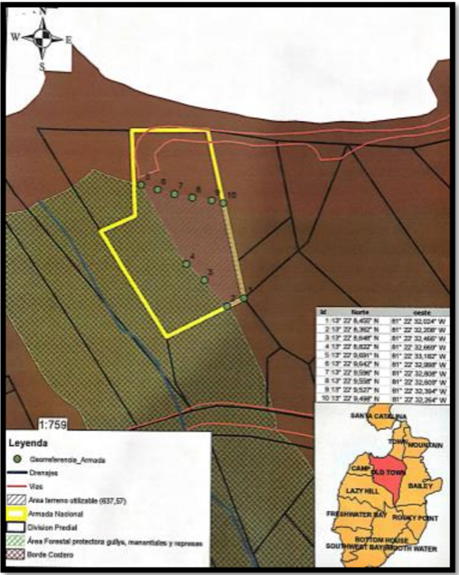
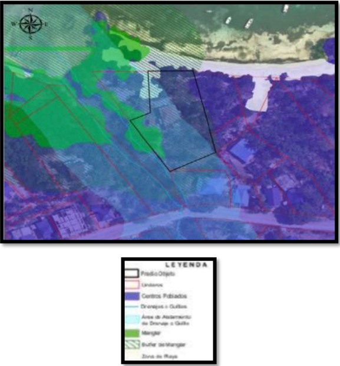
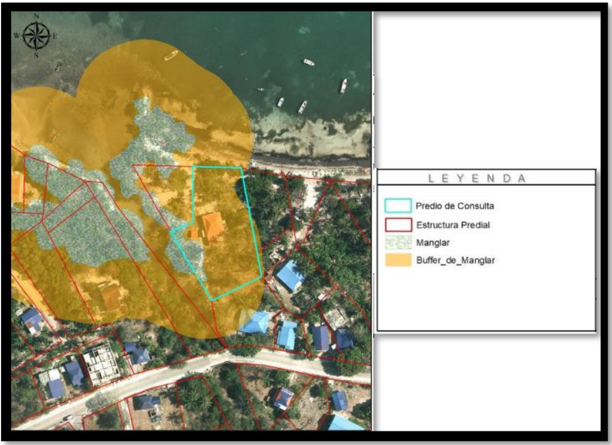
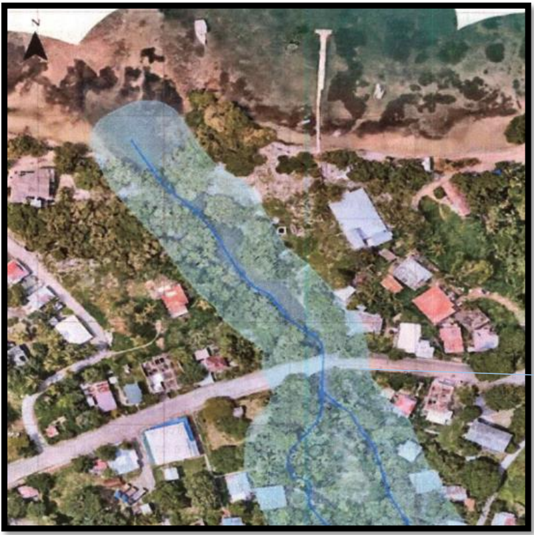
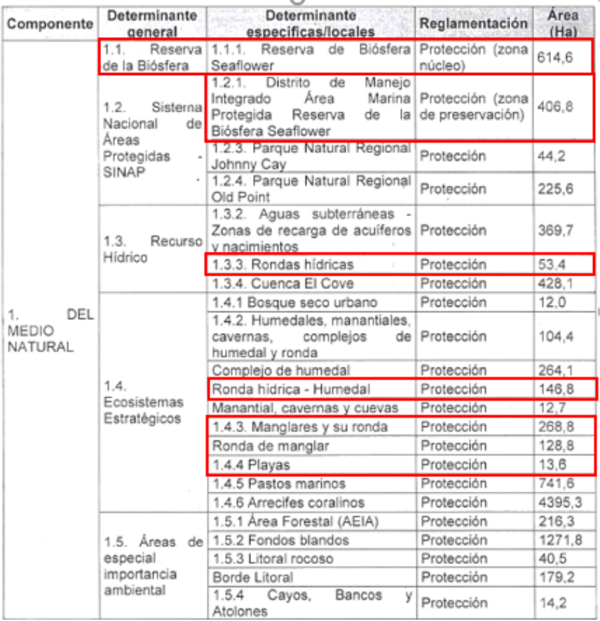

## consejo DE ESTADO SALA DE LO CONTENCIOSO ADMINISTRATIVO SECCIÓN PRIMERA

Bogotá D.C., veintidós (22) de febrero de dos mil veinticuatro (2024)

## Consejero Ponente: GERMÁN EDUARDO OSORIO CIFUENTES

Referencia:

MEDIO DE CONTROL DE PROTECCIÓN DE DERECHOS E INTERESES COLECTIVOS

Radicación núm.:  88001-23-33-000-2021-00041-02

Demandantes:  EDGAR  JAY  STEPHENS,  SANTIAGO  TAYLOR  JAY, MARCELA AMPUDIA SJOGREEN, LING JAY ROBINSON Y JOSEFINA HUFFINGTON ARCHBOLD

Demandados:  MINISTERIO  DE  DEFENSA  NACIONAL  -  ARMADA NACIONAL,  CORPORACIÓN  PARA  EL  DESARROLLO  SOSTENIBLE DEL  ARCHIPIÉLAGO  DE  SAN  ANDRÉS,  PROVIDENCIA  Y  SANTA CATALINA, MUNICIPIO DE PROVIDENCIA Y SANTA CATALINA ISLAS Y MINISTERIO DE DEFENSA NACIONAL - POLICÍA NACIONAL

## Sentencia de segunda instancia

La Sala procede a decidir el recurso de apelación interpuesto por el Ministerio de Defensa Nacional - Armada Nacional en contra de la sentencia de de junio de 2023 , proferida por el Tribunal Administrativo de San Andrés, Providencia y Santa Catalina.

## I.
Antecedentes

## I.1. La demanda.  Los  ciudadanos  Edgar  Jay  Stephens,  Santiago  Taylor  Jay,  Marcela  Ampudia Sjogreen,  Ling  Jay  Robinson  y  Josefina  Huffington  Archbold  demandaron  a  la Armada Nacional, a la Policía Nacional, al municipio de Providencia y Santa Catalina Islas  y  a  la  Corporación  para  el  Desarrollo  Sostenible  del  Archipiélago  de  San Andrés, Providencia y Santa Catalina ,  en ejercicio de la acción popular establecida en el artículo 88 de la Constitución Política y desarrollada por las leyes 472 de 1998 y  1437  de  2011 ,  con  miras  a  obtener  la  protección  de  los  derechos  colectivos previstos en los literales a) y m) del artículo 4.º de la Ley 472.

1 Expediente  digital  Samai,  anotación,  documento  ' 101\_880012333000202100041024EXPEDIENTEDIGI202308301419 25 ', contiene link de carpeta one drive denominada ' 2021-00041 '.

2 Ibidem , documento ' 02Demanda '.

3 ' Por la cual se desarrolla el artículo 88 de la Constitución Política de Colombia en relación con el ejercicio de las acciones populares y de grupo y se dictan otras disposiciones '.

4 ' Por la cual se expide el Código de Procedimiento Administrativo y de lo Contencioso Administrativo '.

## 2.  En su libelo petitorio, la parte actora formuló las siguientes pretensiones:

'[…]  SEGUNDA:  PROTEGER  los  derechos  e  intereses  colectivos  al  medio ambiente sano y al derecho a la realización de las construcciones, edificaciones y  desarrollos  urbanos  respetando  las  disposiciones  jurídicas,  de  manera ordenada,  y  dando  prevalencia  al  beneficio  de  la  calidad  de  vida  de  los habitantes, amenazados por las acciones y omisiones de las demandadas en relación con el proyecto de estación de guardacostas que se pretende llevar a cabo en el predio de registro catastral No. 88564000100000029000100000.

TERCERA: En consecuencia, de lo anterior, se solicita ordenar las siguientes medidas:

## a. Respecto del Ministerio de Defensa Nacional - Armada Nacional

i) ORDENAR al Ministerio de Defensa Nacional - Armada Nacional abstenerse de forma definitiva de construir el proyecto de estación de guardacostas en el predio con registro catastral No. 88564000100000029000100000.

## b. Respecto  de  la Corporación  para  el Desarrollo Sostenible del Archipiélago de San Andrés, Providencia y Santa Catalina (CORALINA)

iii) (sic)  ORDENAR  a  la  Corporación  para  el  Desarrollo  Sostenible  del Archipiélago  de  San  Andrés,  Providencia  y  Santa  Catalina  (CORALINA) mantener la medida de detención del proyecto de estación de guardacostas en el predio catastral No. 88564000100000029000100000 de forma permanente, a  razón  de  las  graves  afectaciones  al  medio  ambiente  que  provocaría  la construcción del proyecto.

iv) (sic) ORDENAR a la Corporación para el Desarrollo Sostenible del Archipiélago  de  San  Andrés,  Providencia  y  Santa  Catalina  (CORALINA) adoptar todas las medidas tendientes a hacer efectiva la medida de detención del proyecto de estación de guardacostas  en el predio catastral No. 88564000100000029000100000.

v) (sic)   ORDENAR a la Corporación para el Desarrollo Sostenible del Archipiélago  de  San  Andrés,  Providencia  y  Santa  Catalina  (CORALINA) DECLARE como zona de protección reforzada la zona de Bowden Gullie y los ecosistemas de manglar de la zona, para evitar futuras construcciones en el lugar.

## c. Respecto de la Alcaldía de Providencia y Santa Catalina - Secretaría de Planeación

i) ORDENAR a la Alcaldía de Providencia y Santa Catalina, y a su Secretaría de  Planeación,  REVOCAR  cualquier  acto  administrativo  emitido  tendiente  a permitir la construcción de dicho proyecto por violar el  Esquema  de Ordenamiento  Territorial  y  sus  normas  de  conservación  ambiental  para ecosistemas claves; o en su defecto abstenerse de expedir permisos sin tener en cuenta el concepto de la autoridad ambiental.

ii) ORDENAR a la Alcaldía de Providencia y Santa Catalina, y a su Secretaría de Planeación, EJERCER sus funciones de control urbanístico, en cuanto a inspección  y  vigilancia  se  refiere,  consagradas  en  el  artículo  2.2.6.4.11  del Decreto 1077 de 2015 (Modificado por el artículo 14 del Decreto Nacional 1203 de  2017).  Ello,  en  aras  de  generar  pautas  claras  de  control  e  interrupción

definitiva de la construcción de la estación de Guardacostas en el predio con registro catastral No. 88564000100000029000100000.

## d. Respecto de la Policía Nacional - Inspector de Policía de Providencia

i) ORDENAR a la Policía Nacional, y al Inspector de Policía de Providencia, EJERCER  sus  funciones  de  control  urbanístico,  en  cuanto  a  inspección  y vigilancia se refiere, consagradas en el artículo 2.2.6.4.11 del Decreto 1077 de 2015 (Modificado por el artículo 14 del Decreto Nacional 1203 de 2017). Todo ello, en  aras  de interrumpir definitivamente la construcción del muelle guardacostas a cargo de la Armada Nacional […]'.

3.  Como  fundamento  de  las  pretensiones,  los  accionantes  manifestaron  que  la Armada Nacional inició un proceso de consulta previa en octubre de 2014 con el pueblo raizal del Archipiélago de San Andrés, Providencia y Santa Catalina respecto del proyecto ' Estación de Control de Tráfico Marítimo en la Isla de Providencia '. Dicho  trámite  culminó  a  través  del  acta  de  de  agosto  de  2015,  en  la  que  la comunidad mostró su desacuerdo con la obra.
4.  Agregaron que el de noviembre de 2020, el huracán IOTA destruyó el 98% de las casas e infraestructuras de la isla y, con ocasión de esta situación, se declaró la existencia de una situación de desastre a través del Decreto 1472 de 2020 .
5.  Mencionaron que la Armada Nacional inició en febrero de 2021 la construcción del  proyecto  de  Estación  de  Guardacostas  en  el  predio  con  código  catastral 88564000100000029000100000.  Sin  embargo,  el  esquema  de  ordenamiento territorial de Providencia y Santa Catalina indica que el 97% de ese lote es una zona de protección de manglar, buffer de manglar, drenaje de Gully (riachuelo) y playa.
6.  Pusieron de presente que el de marzo de 2021, la Armada Nacional emitió un comunicado a través de su página web anunciando la reconstrucción de la Estación de  Guardacostas.  Y,  en  el  mismo  mes,  la  Unidad  Nacional  para  la  Gestión  del Riesgo publicó un 'Plan de Acción Específico' para la atención del desastre y la reconstrucción de la infraestructura que incluye el ' fortalecimiento de la Armada '.
7.  Por ello, el de abril y el de mayo de 2021, la parte actora y los pescadores artesanales de la Cooperativa Fish and Farm solicitaron al municipio de Providencia y Santa Catalina Islas, el cumplimiento del artículo 2.2.6.4.11 del Decreto 1077 de 2015, en relación con ese proyecto de infraestructura.
8.  Advirtieron que el de mayo de 2021, Coralina adoptó una medida preventiva de suspensión de las actividades de construcción, relleno y ocupación indebida del manglar,  buffer  de  manglar  y  del  borde  de  la  desembocadura  de  la  cuenca denominada "Bowden Gullie".

5 ' Por  el  cual  se  declara  la  existencia  de  una  situación  de  Desastre  en  el  Departamento  Archipiélago  de  San  Andrés, Providencia y Santa Catalina '.

## Radicacion: 88001-23-33-000-2021-00041-02 Demandantes: Edgar Jay Stephens y otros Demandados: Ministerio de Defensa Nacional - Armada Nacional y otros.
9. Adujeron que el ente territorial en los oficios  SP0342021,  SP0452021, SP0412021  y  SP0462021  solicitó a la Armada  Nacional suspender dicha construcción.  Sin  embargo,  la  Armada  Nacional  afirmó  que  no  debe  obtener  la autorización  del  ente  territorial  de  la  licencia  de  urbanismo.  En  este  contexto, indicaron que las autoridades de policía no han asegurado el cumplimiento de las medidas preventivas emitidas por la autoridad ambiental aun cuando su competencia abarca el acatamiento de las normas de ordenamiento territorial.

10. En  su  criterio,  ' la  ejecución  del  proyecto  de  Estación  de  Guardacostas  de Providencia  implica  una  violación  del  Esquema  de  Ordenamiento  Territorial  de Providencia y Santa Catalina (Acuerdo 015 de 2000) por dos razones: la primera, porque el proyecto contraviene lo dispuesto por el artículo 18, numeral 2.1.3 del Esquema  de  Ordenamiento  Territorial  sobre  zonas  de  conservación  para  la protección del medio ambiente, conservación de los recursos naturales y defensas del paisaje. (…) La segunda razón, es porque el proyecto va en contra de los usos prohibidos  de  las  zonas  de  conservación,  que  es  la  segunda  clasificación  y  de protección más leve que la anterior '.

11. Además,  ' el  predio  en  el  que  la  Armada  Nacional  pretende  desarrollar  su proyecto, posee en sus inmediaciones varios ecosistemas naturales que son de especial interés y protección ambiental y jurídica. Por un lado, se encuentran los humedales  de  la  microcuenca  Bowden  y  la  desembocadura  del  Bowden  gully (riachuelo Bowden). Por otro lado, se encuentra el ecosistema de manglar '.

## I.2. Actuación procesal en primera instancia. El  magistrado del Tribunal Administrativo de San Andrés, Providencia y Santa Catalina a cargo de la sustanciación del proceso, mediante auto de de diciembre de 2021 , admitió la demanda y ordenó la notificación y el traslado correspondiente a la Armada Nacional (Comando Específico de San Andrés, Providencia y Santa Catalina),  a  la  Policía  Nacional  (Inspección  de  Policía  de  Providencia  Isla),  al municipio de Providencia y Santa Catalina Islas y a la Corporación para el Desarrollo Sostenible del Archipiélago de San Andrés, Providencia y Santa Catalina (Coralina), para  que  contestaran,  propusieran  excepciones  y  aportaran  y/o  solicitaran  la práctica de pruebas. Igualmente, notificó al agente del Ministerio Público. Por último, dispuso comunicar la acción de la referencia a los miembros de la comunidad.

13. Mediante auto de de diciembre de 2021, el a quo decretó la medida cautelar de suspensión de actividades solicitada por la parte actora. La Sección Primera del consejo de Estado, en el auto de de octubre de 2022, confirmó dicha decisión .

7 Expediente  digital  Samai,  anotación,  documento  ' 101\_880012333000202100041024EXPEDIENTEDIGI202308301419 2 5', contiene link de carpeta one drive denominada ' Auto CE '.

## Radicacion: 88001-23-33-000-2021-00041-02 Demandantes: Edgar Jay Stephens y otros Demandados: Ministerio de Defensa Nacional - Armada Nacional y otros.
14. Posteriormente, por auto de de marzo de 2022 , se declaró fallida la audiencia especial de que trata el artículo 27 de la Ley 472 de 1998, al advertir que las partes no acordaron un pacto de cumplimiento.

## I.3. Contestaciones de la demanda

- I.3.1. El  apoderado  judicial  del Ministerio  de  Defensa  -  Armada  Nacional manifestó en el memorial de de enero de 2022 que esa entidad no afectó ni amenazó los derechos colectivos previstos en los literales a) y m) del artículo 4.º de la  Ley  472.  Afirmó  que  se  implementaron  varias  medidas  de  seguridad  en  los alrededores de las instalaciones, con el fin de proteger a la ciudadanía y al territorio insular, de conformidad con los principios de solidaridad y seguridad nacional .
15. Adujo que el constituyente consideró necesaria la organización de una Fuerza Pública (art. 216), conformada por las Fuerzas Militares y el Cuerpo de Policía, con el propósito de brindar protección a las personas y garantizar la efectividad de los derechos consagrados en la Constitución Política. Concretamente, la finalidad de las fuerzas Militares es la defensa de la soberanía, la independencia, la integridad del territorio nacional y la integridad del orden constitucional.
16. Explicó que el demandante no demostró que resulte necesario reubicar o eliminar las  construcciones  militares  o  policiales,  ni  que  el  proyecto  afecte  la  vida,  la seguridad, el turismo, la cultura o el medio ambiente de la isla. Es más, previo a la compra del predio la Armada Nacional verificó en la fase de planeación que el lote cumpliera las respectivas condiciones de uso del suelo.
17. Mencionó que ' la Armada Nacional en concordancia con el Plan de Desarrollo de Guardacostas 2030, inició coordinaciones en el año 2011 a fin de identificar los requerimientos  y  necesidades  a  realizarse  para  la  ejecución  de  un  proyecto  de puesta en funcionamiento de una Estación de Control de Tráfico Marítimo en la Isla de Providencia, proyecto que posteriormente en virtud del Decreto No. 510 del año 2015 'Por el cual se adopta el Plan Estratégico para el Archipiélago de San Andrés, Providencia y Santa  Catalina',  se  estableció  como  uno  de  los  programas estratégicos, en razón a la Defensa y Seguridad Nacional, orientado directamente a  la  adecuada  ocupación  del  suelo,  la  conservación  de  la  biodiversidad  y  la protección de la riqueza natural del país, pudiendo posicionar estos elementos como activos estratégicos '.

18. En consecuencia, ' en julio del año 2017 se suscribió el contrato de obra No. 9677SAPII013-295-2017 cuyo objeto era la construcción de la Estación de Control de Tráfico  Marítimo  de  Guardacostas,  iniciando  la  ejecución  de  la  obra  el  día  de agosto de 2017, que debió ser finalizado en el mes de marzo de 2018; sin embargo, el contratista incumplió sus obligaciones, siendo declarado dicho incumplimiento a

8 Ibidem , documento denominado ' 48ActaAudiencia '.

9 Expediente  digital  Samai,  anotación,  documento  ' 101\_880012333000202100041024EXPEDIENTEDIGI20230830141 925 ', contiene link de carpeta one drive que incluye un documento denominado ' 17ContestaciónMinDefensa '.

través de la Resolución 757 del de julio de 2018'. Precisó que 'en aquel momento el proyecto se estuvo desarrollando sin oposición y sin los actuales señalamientos de incumplimiento de disposiciones ambientales y del esquema de ordenamiento territorial; estos últimos que, motivaron que desde el mes de septiembre de 2021 se suspendiera la ejecución del convenio suscrito entre el Fondo Nacional de Gestión del Riesgo de Desastres y el Comando de la Armada Nacional '.

19. Señaló que la Armada Nacional agotó los requisitos exigibles para construir la Estación de Control de Tráfico Marítimo, incluyendo la consulta previa con el pueblo raizal del Archipiélago de San Andrés, Providencia y Santa Catalina.

20. Puso  de  presente  que  el  artículo  192  del  Decreto  019  de  2012  estableció  un régimen especial en materia urbanística para la Fuerza Armada en virtud del cual la infraestructura militar y policial, destinada para la defensa y seguridad nacional, no requiere de licencia de construcción.

21. Recordó que la clasificación urbanística del citado predio es de centro poblado rural  en  donde  se  permite  el  uso  institucional  del  sector  defensa.  En  esa  zona ' existen varias construcciones particulares, sobre las cuales no se discierne ninguna medida, ni decisión de las Instituciones del Estado, cuando estas deben actuar en identidad de  factores y parámetros  ante  las supuestas  inconsistencias y/o incidencias dentro de los principios de igualdad y debido proceso para la protección del medio ambiente y la organización territorial de Providencia '.

22. Indicó que la Secretaría de Planeación municipal en el certificado de uso del suelo del año 2021 advirtió ' intempestivamente y sin ningún fundamento ' que el predio era parte de zona de protección, aun cuando en el certificado de 2016 únicamente señaló  que  era  un  centro  poblado.  Afirmó  que  es  ' desconcertante  que  esa valoración  porcentual,  solo  es  aplicada  para  el  predio  Institucional  y  no  para  la totalidad de los predios del sector de Old Town '. De lo anterior, coligió que ' existen situaciones  jurídicas  consolidadas  a  favor  del  Ministerio  de  Defensa  Nacional  Armada Nacional '.

23. Agregó  que  la  Armada  Nacional  cumplió  las  obligaciones  derivadas  de  la Resolución 1014 de de noviembre de 2016. Aunado a ello, no es cierto que los factores  ambientales  del  predio  del  debate  judicial  cambiaran  con  ocasión  del huracán IOTA, porque ' no estamos ante un evento de avulsión o aluvión (arrojo o instalación) que creara en el predio una nueva área de manglar que no existiera antes del año 2020 y/o causara la alteración del cauce o dimensiones del Bowden Gullie '.

24. Complementó  que  los  miembros  de  la  Armada  Nacional  no  han  realizado vertimientos,  talas  o  acciones  contaminantes  en  el  sector. Contrario  sensu ,    ' la tubería  (…)  (que)  atraviesa  el  predio  de  propiedad  del  Ministerio  de  Defensa Nacional  -  Armada  Nacional  corresponde  a  un  vertimiento  de  la  red  del  predio colindante identificado con la cédula catastral No.

885640001000000290011000000000 y sobre el cual el día de noviembre de 2021, se efectuó una verificación con el Inspector de Policía del Municipio '.

25. En  su  criterio,  los  impactos  ambientales  alegados  por  Coralina  y  por  la  parte actora carecen de sustento técnico. Adicionalmente, ' no se encuentra en desarrollo ninguna actividad de construcción ni ejecución de obra del proyecto de la Estación de Control de Tráfico Marítimo en la Isla de Providencia ' y, por ello, ' no se encuentra en riesgo de afectación el ecosistema del 'Bowden Gullie', el área de manglar ni ninguno de los factores ambientales que mencionan para el Sector Old Town '.

I.3.2. El  apoderado  de  la Corporación  para  el  Desarrollo  Sostenible  del Archipiélago de San Andrés, Providencia y Santa Catalina , mediante memorial de de enero de 2022 , sostuvo que esa entidad carece de legitimación en la causa por pasiva y ha actuado de forma diligente en el control de los hechos citados en el libelo petitorio.

26. Agregó que la corporación, en el contexto del Sistema Nacional Ambiental, funge como máxima autoridad ambiental del archipiélago. De manera que Coralina está interesada en que la Armada Nacional suspenda las actividades que generan un daño al ecosistema de manglar de la desembocadura de Bowden Gullie.

27. Precisó que la autoridad ambiental en la Resolución 1014 de de noviembre de 2016  ' se  abstuvo  de  decidir  en  relación  con  la  infraestructura  sobre  el  área emergida, toda vez que se determinó que dicha infraestructura se encontraba por fuera  del  área  de  jurisdicción  de  la  DIMAR,  razón  por  la  cual  no  era  objeto  de viabilidad ambiental por parte de CORALINA y, su ejecución estaría sujeta a las normas urbanísticas del Municipio de Providencia y a la obtención de los permisos ambientales requeridos '.

28. Recordó que la actividad de construcción impactó de forma negativa el entorno natural y desconoció el esquema de ordenamiento territorial vigente. En consecuencia, Coralina impuso una medida preventiva de suspensión de actividades por la ocupación de una zona de manglar y de la franja de protección mínima de metros a cada lado del cauce que transcurre en el sector del litigio, tal y como lo dispone el artículo 2.2.1.1.1.8.2 del Decreto 1076 de 2015.

29. En su sentir, antes de declarar como zona de protección reforzada la zona de Bowden  Gullie  y  los  ecosistemas  de  manglar  del  sector,  para  evitar  futuras construcciones  en  el  lugar,  es  necesario  adelantar  los  estudios  exigidos  en  la legislación  actual.  Aun  así,  afirmó  que  ese  territorio  es  refugio  de  especies  de importancia local y nacional, permite el control de la erosión, brinda una función paisajística, protege de los vientos fuertes y conecta otros ecosistemas estratégicos, por las siguientes razones:

10 Ibidem , documento denominado ' 18ContestacionCoralina '.

'[…]  la  microcuenca  Bowden  con  sus 434  hectáreas  constituye  la  más extensa  de  las  once  microcuencas  existentes,  con  una  ocupación  del,8% del área total de Providencia y Santa Catalina y, que al interior de la microcuenca  se  han  identificado  once  humedales,  de  los  cuales  ocho corresponden  a  manantiales  ligados  al  riachuelo  Bowden  y  tres  de  ellos corresponden a represamientos de agua construidos en diferentes épocas para el suministro de agua de la población local; la cual es utilizada para consumo, riego de cultivos y otras actividades vitales.

Del  mismo  modo,  es  cierto  que  este  ecosistema ayuda  a  mantener  el equilibrio de los seres vivos y el entorno donde se relacionan y,  que el Ministerio de Ambiente y Desarrollo Sostenible, a través del artículo 2.2.1.1.18.2 del Decreto 1076 de 2015 definió como ecosistemas prioritarios de protección  del  país  los  humedales,  rondas  hídricas,  zonas  de  recarga  de acuíferos,  manglares,  y  estuarios,  entre  otros,  determinando  además  la necesidad  de  generar  planes  de  manejos  y  gestión  que  garanticen  su conservación.

Además, según el Informe No. 1669-2021 de la Procuraduría General de la Nación  'VISITA  IN  SITU  AL  PROYECTO  DE  CONSTRUCCIÓN  DE  LA ESTACIÓN  DE  CONTROL  DE  TRÁFICO  MARÍTIMO  EN  LA  ISLA  DE PROVIDENCIA' y la actual regulación (Acuerdo 002 de 2019), el muelle se encuentra en una Zona de Conservación (No Take) del Distrito de Manejo Integrado del Área Marina Protegida de la Reserva de Biosfera Seaflower […]'. (Negrilla fuera de texto). Finalmente, propuso las excepciones que denominó: i) ' ausencia de legitimación en la causa y la sustracción de materia en lo que corresponde a la CORPORACIÓN PARA EL DESARROLLO SOSTENIBLE DEL ARCHIPIÉLAGO DE SAN ANDRÉS, PROVIDENCIA Y SANTA CATALINA - CORALINA '; y ii) ' la posibilidad de declarar como zona de protección reforzada la zona de Bowden Gullie y los ecosistemas de manglar de la zona, para evitar futuras construcciones en el lugar '.

- I.3.3. La apoderada del municipio de Providencia y Santa Catalina Islas, en el oficio de de enero de 2022, afirmó que el ente territorial solicitó a la Armada Nacional  la  suspensión  del  proyecto  de  infraestructura,  a  través  de  los  oficios SP0342021  de  de  mayo  de  2021,  SP0452021  de  de  mayo  de  2021, SP0412021 de de mayo de 2021 y SP0462021 de de mayo de 2021 . En consecuencia,  el  municipio  realizó  todas  las  gestiones  de  control  y  vigilancia establecidas en el artículo 2.2.64.11 del Decreto 1077 de 2015.
31. Consideró  que  el  demandante  además  de  afirmar  que  determinados  hechos violan los derechos e intereses colectivos, tiene la carga procesal de demostrar los supuestos fácticos de sus alegaciones.
32. En consecuencia, como medios de defensa, propuso las excepciones de: i) ' falta de  legitimación  en  la  causa  por  pasiva ';  ii)  ' inexistencia  de  vulneración  de  los derechos  colectivos  por  parte  del  municipio ';  iii)  ' inepta  demanda  por  falta  del cumplimiento de los requisitos establecidos en la ley '; y iv) ' ausencia de pruebas '.

11 Ibidem , documento denominado ' 30ContestacionMunicipio '.

I.3.4. El apoderado judicial del Ministerio de Defensa Nacional - Policía Nacional , mediante  escrito  de  de  enero  de  2022 ,  se  opuso  a  las  pretensiones  de  la demanda,  tras  considerar  que  esa  institución  realizó  las  actividades  de  control pertinentes en el marco de sus competencias legales. Adicionalmente, alegó que a la  Policía  Nacional  no  le  corresponde  expedir  las  licencias  de  construcción,  las cuales se presumen legales, hasta que la autoridad competente declare su nulidad.

33. Consideró que corresponde a la administración municipal la expedición de los actos  administrativos  que  permiten  la  ejecución  de  este  tipo  de  proyectos,  y  su control y garantía recae sobre las inspecciones de policía de la isla.

34. Alegó que la demanda no precisó de forma clara cuáles son las circunstancias de  tiempo,  modo  y  lugar  por  las  que  la  Policía  Nacional  sería  responsable  de transgredir  los  derechos  colectivos  cuyo  amparo  solicitaron  los  demandantes. Tampoco  obra  alguna  prueba  que  acredite  lo  anterior  y,  por  ello,  propuso  la excepción de falta de legitimación en la causa por pasiva.

## II.  La sentencia de primera instancia.
35. El Tribunal Administrativo de San Andrés, Providencia y Santa Catalina, mediante sentencia  de  de  junio  de  2023,  amparó  ' los  derechos  colectivos  al  medio ambiente sano y el derecho a la realización de las construcciones, edificaciones y desarrollos urbanos respetando las disposiciones jurídicas, de manera ordenada, y dando prevalencia al beneficio de la calidad de vida de los habitantes de la Isla de Providencia y Santa Catalina '. En consecuencia, resolvió lo siguiente:

'[…] SEGUNDO: (…) ORDENÉSE a la Nación-Ministerio de defensa- Armada Nacional, a que se abstenga de realizar cualquier tipo de construcción dentro de la zona de influencia del buffer de manglar, drenaje de Gully y zona de playa del sector de Old Town, especialmente en lo concerniente al predio identificado con el registro catastral No. 88564000100000029000100000 , en razón de las graves afectaciones ambientales que provocaría la construcción del proyecto Base Estación de Guardacostas en la Isla de Providencia y Santa Catalina .

TERCERO: DECLÁRESE la falta de legitimación en la causa por pasiva de la Corporación  para  el  Desarrollo  Sostenible  del  Archipiélago  de  San  Andrés, Providencia y Santa Catalina -CORALINA-, Municipio de ProvidenciaInspección de Policía y la Policía Nacional.

CUARTO:

Sin lugar a costas en la instancia. […]'.

36. Para  arribar  a  esa  determinación,  el a  quo explicó  primero  que  la  Armada Nacional  era  el  único  sujeto  del  extremo  pasivo  que  contaba  con  legitimación material en la causa, pues las demás entidades demandadas no participaron ' por acción  u  omisión  en  el  hecho  del  cual  se  endilga  la  violación  de  los  derechos Ibidem , documento denominado ' 16ContestacionPona l'.

colectivos,  es  decir,  la  construcción  del  proyecto  de  base  naval  en  la  isla  de Providencia '.

37. Adujo  que  ' CORALINA  y  la  Alcaldía  de  Providencia  y  Santa  Catalina  han realizado las acciones dentro de sus competencias  legales procurando  la suspensión de la construcción del proyecto de base naval antes mencionado incluso con anterioridad a la interposición del presente medio de control, de ello dan fe el acto administrativo 564 del de octubre de 2021 (…) y los múltiples comunicados y misivas emitidos por la Secretaría de Planeación Municipal de Providencia y Santa Catalina con destino al Ministerio de Defensa - Armada Nacional '.
38. Alegó  que  el  actor  popular  confundió  a  ' la  Policía  Nacional  con  la  función  de comisaría  de  policía  a  cargo  de  la  Alcaldía  Municipal  de  Providencia  y  Santa Catalina ', razón por la que la Policía Nacional no detentaba responsabilidades en el caso concreto.
39. Posteriormente, estudió los derechos previstos en los literales a) y m) del artículo 4° de la Ley 472 de 1998 y valoró el acervo probatorio. Mencionó que el proyecto en cuestión no cumplió con las normas urbanísticas aplicables, y tampoco obtuvo todos los permisos ambientales que eran exigibles. En ese contexto, explicó que la parte accionada posee una mera expectativa de un derecho que no se consolidó.
40. Puso de presente que existe una clara distinción entre un derecho adquirido y una  mera  expectativa.  El  concepto  de  mera  expectativa  se  refiere  a  aquellas ' probabilidades de  adquisición futura  de  un  derecho  que,  por  no  haberse consolidado,  pueden  ser  reguladas  con  sujeción  a  parámetros  de  justicia  y  de equidad. (Además,) en las meras expectativas, resulta probable (más no obligatorio) que los presupuestos lleguen a consolidarse en el futuro. (Mientras que) el derecho adquirido se entiende incorporado al patrimonio de la persona, por cuanto se ha perfeccionado durante la vigencia de una ley '.
41. Recordó que el EOT de las islas estableció que el uso principal del predio de la Armada Nacional  es  la  conservación  de  la  flora,  la  constitución  de  una  reserva ictiológica  y  la  conservación  del  entorno  natural.  En  consecuencia, indicó que la Armada Nacional debía tener presente que los atributos del derecho de dominio se encuentran limitados o restringidos por la función ecológica de la propiedad.
42. Advirtió que ' dicha limitación es legítima en el entendido de que se realiza con base en normas existentes en el ordenamiento, necesarias para la protección del derecho  al  medio  ambiente  y  el  desarrollo  sostenible,  puesto  que  no  existe  un mecanismo diferente a la coerción normativa que logre generar un impacto en el comportamiento de los propietarios. Asimismo, la limitación resulta proporcional en sentido estricto, al mantener intacto el núcleo esencial del derecho a la propiedad '.
43. Reconoció  que  ' el  certificado  de  uso  del  suelo  donde  se  ubica  el  predio mencionado  también  está  clasificado  como  'centro  poblado  rural  (…)  con  uso

principal habitacional y uso complementario institucional'. No obstante, el mismo documento hace la salvedad de que la zona igualmente está afectada en su uso por los valores ambientales de 'área de aislamiento de drenaje o Gullie (…), zona de manglar (…), buffer de manglar (…), zona playa (…) y de retiro borde costero' '.

44. Finalmente, mencionó que ' el proyecto base de estación de guardacostas está impactando los ecosistemas de manglares ubicados en el sector de Old Town de la isla de Providencia ', lo cual justificaba la intervención del juez popular en virtud del principio de prevención.

## III. Fundamentos del recurso de apelación.
45. El  apoderado  judicial  del  Ministerio  de  Defensa  Nacional  -  Armada  Nacional, mediante correo electrónico de de junio de 2023, solicitó la revocatoria de la sentencia de primera instancia .

46. Insistió  en  que las Fuerzas Militares, por mandato legal no están obligadas a tramitar  licencia  de  construcción.  Aunado  a  ello,  el  proyecto  hace  parte  del programa  estratégico  de  Defensa  y  Seguridad  Nacional  aprobado  a  través  del Decreto  510  del  año  2015,  ' Por  el  cual  se  adopta  el  Plan  Estratégico  para  el Archipiélago de San  Andrés,  Providencia y Santa Catalina ', en tanto los Guardacostas son la ' Policía en el mar '.

47. Adujo que ' existen una serie de infraestructuras que se encuentran sujetas a un régimen  especial  de  licencias  ambientales,  normas  en  donde  se  establece claramente que no se requiere de expedición de licencia de construcción, para la ejecución de estructuras especiales, dentro de las que se encuentran infraestructura  militar  y  policial,  destinadas  específicamente  para  la  defensa  y seguridad nacional '.

48. Sostuvo que la Armada Nacional tramitó los permisos necesarios para la correcta formulación y desarrollo del proyecto, los cuales a la fecha se encuentran vigentes. Además, en la actualidad esa  institución  ha  efectuado  los  pagos  de  los  cobros correspondientes, tal y como se puede evidenciar en las facturas 2174, 2175, 5006 y  5007.  Concretamente,  se  refirió  a:  i)  ' la  concesión  por  parte  de  la  Dirección General Marítima otorgada por la Resolución No. 0499 de 2017 y la Resolución No. 0092 de 2020, que complementan el proyecto para la formalizaron de la instalación del muelle '; ii) ' los permisos ambientales de aprovechamiento forestal, permiso de vertimientos  de  aguas  residuales  domésticas  y  permiso  de  concesión  de  aguas superficiales '; y iii) el cumplimiento del requisito de consulta previa.

49. Advirtió  que,  antes  de  comprar  el  predio,  se  verificó  que  el  uso  del  suelo autorizado  en  el  EOT  permitía  la  ejecución  del  proyecto,  pues  el  inmueble pertenecía a la ' zona de playa de centro poblado rural ', cuyo uso complementario Expediente  digital  Samai,  anotación,  documento  ' 101\_880012333000202100041024EXPEDIENTEDIGI2023083014 1925 ', contiene link de carpeta one drive que incluye un documento denominado ' 89RecursoApelaciónE20210004102 '.

es el ' institucional ', como lo demuestra la Escritura Pública No. 0564 de de julio de 2011 de la Notaria Única de San Andrés y las certificaciones de usos del suelo ' SP/CUS/155 año 2016 ' y ' SP-184-2018 del de mayo de 2018 '.  Por ello, ' el área positiva para utilizar corresponde a la totalidad de seiscientos treinta y siente punto cincuenta y siete metros cuadrados (637,57 m2) '.

50. En sus propias palabras, explicó que: ' bajo el EOT se estableció que no existía un  mapa  específico  que  demarcara  los  usos  de  suelo  que  se  encontraban permitidos para este sector en controversia (Old Town), así como tampoco este marco normativo prohibió de alguna forma o categorizó la prohibición del uso de Centros  Poblados  Rurales  para  usos  específicos,  como  el  uso  institucional  de interés público, que es el objetivo directo del proyecto'.

51. Cuestionó  la  prueba  relacionada  con  el  daño  al  entono  natural  porque:  i)  las obras que originaron el debate procesal actualmente no están siendo ejecutadas; ii) la parte actora no demostró que las ' construcciones, vertimientos, talas de árbol y manglar ' hayan sido realizadas por los miembros de la Armada Nacional; iii) los informes y conceptos de Coralina son ' irresponsables '  y  ' subjetivos '  porque las afectaciones al entorno natural se originaron en predios aledaños que no han sido objeto de seguimiento por la autoridad ambiental; y iv) la Armada Nacional interpuso recursos en sede administrativa en contra de las decisiones de Coralina.

52. Se  refirió  a  la  presunta  transgresión  de  los  principios  de  igualdad  y  debido proceso  porque 'en  el  Sector  de  Old  Town  existen  varias  construcciones particulares, sobre las cuales no se discierne ninguna medida, ni decisión de las Instituciones  del  Estado,  cuando  estas  deben  actuar  en  identidad  de  factores  y parámetros  ante  las  supuestas  inconsistencias  y/o  incidencias  dentro  de  (esos) principios (…) para la protección del medio ambiente y la organización territorial de Providencia '.

53. Finalmente,  mencionó  que  ' en  el  evento  de  que  no  sean  acogidos  los argumentos de mi representada, ruego (…) se realice pronunciamiento respecto de la  devolución  por  parte  de  la  administración  territorial  y  los  entes  que  dieron viabilidad para la compra del terreno en el que se construiría la base de Control de Guardacostas, pues de lo contrario se caería en un detrimento patrimonial de la entidad que represento, (…) cuantía que a la fecha estaría alrededor de los dos mil millones de pesos moneda legal colombiana ($2.000.000.000.oo) '.

## IV.  Trámite en segunda instancia.
55. Mediante auto de de julio de 2023, el Tribunal Administrativo de San Andrés, Providencia y Santa Catalina concedió ante el consejo de Estado el recurso de apelación interpuesto por la Armada Nacional .

14 Expediente  digital  Samai,  anotación,  documento  ' 101\_880012333000202100041024EXPEDIENTEDIGI2023083014 1925 ', contiene link de carpeta one drive que incluye un documento denominado ' 91Auto042ConcedeApelacion '.

## Demandados: Ministerio de Defensa Nacional - Armada Nacional y otros.
55. Esta autoridad judicial, a través de auto de.° de septiembre de 2023 , admitió el recurso de apelación y advirtió a los sujetos procesales que no había lugar a dar traslado  para  alegar  de  conclusión.  También  informó  al  Ministerio  Público  que  se encontraba habilitado para emitir concepto en la presente causa hasta antes de que el proceso ingresara al despacho para emitir sentencia.

56. Mediante oficio de de septiembre de 2016 , la parte actora insistió en los argumentos propuestos en la demanda y en los alegatos de conclusión de primera instancia. Adujo que ' la consecuencia jurídica de contar con algunos permisos que requiere un  proyecto como  este,  no  es la posibilidad  de  pasar por alto, determinantes ambientales contenidas en el ordenamiento ambiental del territorio del municipio de Providencia y Santa Catalina '. Además, el proyecto no respeta la integridad del territorio ancestral de ese grupo étnico.

57.  El de septiembre de 2016, los señores Maryluz Barragán González, Fabián Mendoza  Pulido  y  Sergio  Pulido  Jiménez,  como  investigadores  del  Centro  de Estudios de Derecho, Justicia y Sociedad (Dejusticia), presentaron un pronunciamiento amicus  curiae en  el  proceso  de  la  referencia .  Los  citados ciudadanos  consideraron  que  la  verificación  previa  realizada  por  la  Armada Nacional de los usos del suelo en su predio no fue suficiente, ya que no consideró todos los aspectos ambientales, especialmente, la presencia de manglares y zonas de  conservación.  Además,  el  hecho  consistente  en  que  el  proyecto  aporte  a  la seguridad nacional, no justifica el incumplimiento de la normatividad ambiental y urbanística. Finalmente, argumentaron que la falta de evidencia directa de los daños ambientales causados por la entidad demandada, no la exime de responsabilidad, porque el proyecto en sí mismo constituye una amenaza para el medio ambiente.

## V.
57. CONSIDERACIONES DE LA SALA

## V.1. Competencia

58. De conformidad con lo establecido en el artículo 37 de la Ley 472 de 1998, en concordancia con lo preceptuado en el artículo 150 del CPACA y en el artículo 13 del  Acuerdo  080  de  2019 ,  la  Sección  Primera  del  consejo  de  Estado  es competente  para  conocer  en  segunda  instancia  de  los  recursos  de  apelación interpuestos en  contra  de  las  sentencias  proferidas  en  primera  instancia  por  los Tribunales Administrativos, en el marco de las acciones populares.

15 Expediente digital Samai, anotación.

17 Entendida  como  las  presentaciones  de  terceros  ajenos  a  la  disputa  que  aportan  a  la  autoridad  judicial  argumentos  u opiniones que pueden servir como elementos de juicio relativos a aspectos de derecho que se ventilan ante la misma (Corte Constitucional. Auto 107 de 2019).

18 ' Mediante el cual se establece la distribución de los negocios entre las secciones de la Sala de lo Contencioso Administrativo del consejo de Estado '.

## V.2. Planteamiento del problema jurídico

59. Los  ciudadanos  Edgar  Jay  Stephens,  Santiago  Taylor  Jay,  Marcela  Ampudia Sjogreen, Ling Jay Robinson y Josefina Huffington Archbold atribuyeron a la Armada Nacional, a la Policía Nacional, a la Corporación para el Desarrollo Sostenible del Archipiélago  de  San  Andrés,  Providencia  y  Santa  Catalina  y  al  municipio  de Providencia  y  Santa  Catalina  Islas,  la  transgresión  de  los  derechos  colectivos previstos  en  los  literales  a)  y  m)  del  artículo  4.º  de  la  Ley  472,  debido  a  la construcción de la ' Estación de Control de Tráfico Marítimo' , ubicada en el sector de Old Town Bay.

60. El  conocimiento  del  proceso  le  correspondió  en  primera  instancia  al  Tribunal Administrativo de San Andrés, Providencia y Santa Catalina; autoridad judicial que amparó las citadas garantías al encontrar que la Armada Nacional no agotó todos los requisitos exigibles para poder construir el muelle de guardacostas. En criterio del a quo, debían prevalecer las determinantes ambientales dispuestas en el EOT para el sector, lo cual impedía alterar los servicios ecosistémicos de la zona.

61. El Ministerio de Defensa Nacional - Armada Nacional, inconforme con la anterior decisión,  interpuso  recurso  de  apelación.  En  la  alzada  afirmó  que  las  fuerzas militares se encuentran sujetas a un régimen especial en virtud del cual no requieren de la expedición de una licencia de construcción o de una licencia ambiental para el desarrollo de infraestructura militar de defensa y seguridad nacional. Agregó que se tramitaron  los  permisos  necesarios  para  la  correcta  formulación  y  ejecución  del proyecto, los cuales a la fecha se encuentran vigentes y ocasionaron obligaciones económicas asumidas en las facturas 2174, 2175, 5006 y 5007. Además, antes de comprar el predio, se verificó que el uso del suelo autorizado en el EOT permitiera ese tipo de obras. Finalmente adujo que no se demostró el daño al entorno natural, y  que  los  demás  miembros  del  extremo  pasivo  transgredieron  los  principios  de igualdad y debido proceso porque en el mismo sector existen otras construcciones y muelles, pero el ente territorial y Coralina solo impidieron a la Armada Nacional el ejercicio de su derecho de propiedad.

62. En ese orden, corresponde a la Sala determinar si la Armada Nacional quebrantó o no los derechos colectivos previstos en los literales a) y m) del artículo 4.º de la Ley  472,  con  ocasión  del  proyecto  denominado  ' Estación  de  Control  de  Tráfico Marítimo '.  Por  ello,  con  miras  a  resolver  el  problema  jurídico,  se  estudiará:  i)  el régimen urbanístico y ambiental aplicable al caso concreto; ii) lo acreditado en el plenario sobre las autorizaciones administrativas que obtuvo la Armada Nacional para la construcción de esa infraestructura; iii) la prueba sobre el daño ambiental; y iv)  la  procedencia  de  los  reparos  relacionados  con  el  pago  de  los  perjuicios causados a las Fuerzas Militares y la transgresión de los principios de igualdad y debido proceso.

## V.2.1. El régimen urbanístico y ambiental aplicable al caso concreto

63. La Armada Nacional afirmó en el primer planteamiento que ' existen una serie de infraestructuras  que  se  encuentran  sujetas  a  un  régimen  especial  de  licencias ambientales,  normas  en  donde  se  establece  claramente  que  no  se  requiere  de expedición de licencia de construcción, para la ejecución de estructuras especiales, dentro  de  las  que  se  encuentran  infraestructura  militar  y  policial,  destinadas específicamente para la defensa y seguridad nacional '.

64.  También  señaló  que  la  construcción  de  la  ' Estación  de  Control  de  Tráfico Marítimo ' hace parte del programa estratégico de Defensa y Seguridad Nacional aprobado a través del Decreto 510 del año 2015 , a saber:

'[…] La Armada Nacional ha vigilado continuamente nuestro mar para garantizar la  seguridad  de  los  pescadores  que  desarrollan  su  actividad  en  esa  área. Actualmente  en  las  zonas  marítimas  de  los  cayos  no  se  cuenta  con plataformas sobre las cuales se puedan disponer estaciones de guardacostas para investigación científica y reparación de embarcaciones de diferente naturaleza, entre otros fines navales, lo cual es prioritario para el archipiélago . […]' (Negrilla fuera de texto). Así pues, para desatar este punto de la controversia, la Sala pone de presente que  al  apelante  le  asiste  la  razón  cuando  señala  que  el  Estado  colombiano  es responsable de mantener la paz e instaurar un sistema jurídico-político estable, en el que sea posible la convivencia ciudadana . Dicho objetivo se le encomendó a la Fuerza Pública  y, por ello, las Fuerzas Militares se encargan de la defensa de la soberanía, la independencia, la integridad del territorio nacional y la salvaguarda del orden constitucional  (artículos.°, 2.°, 3.° y 217 de la Constitución Política).

66. En lo que atañe a la protección del mar territorial, de la zona económica exclusiva y  de  la  plataforma  continental,  la  Ley  10  de  1978 ,  en  su  artículo  11,  confió  al Gobierno  Nacional  la  tarea  de  determinar  cuál  sería  la  autoridad  encargada  de ' proveer la vigilancia y defensa de las áreas marítimas colombianas y alcanzar el debido  aprovechamiento  de  los  recursos  naturales  vivos  y  no  vivos  que  se encuentren en dichas áreas, en beneficio de las necesidades  del pueblo colombiano, y el desarrollo económico del país '.

67. Con ocasión de lo anterior, el Decreto 1874 de de agosto de 1979  creó el Cuerpo de Guardacostas como un organismo dependiente de la Armada Nacional, ' conformado por las unidades a flote y el  equipo asociado que se adquiera y destine para tal fin de acuerdo con el programa elaborado por el comando de la ' Por el cual se adopta el Plan Estratégico para el Archipiélago de San Andrés, Providencia y Santa Catalina '.

22 Las Fuerzas Militares están constituidas por el Ejército, la Armada y la Fuerza Aérea.

23 ' Por medio de la cual se dictan normas sobre mar territorial, zona económica exclusiva, plataforma continental, y se dictan otras disposiciones '.

24 ' Por el cual se crea el Cuerpo de Guardacostas'.

Armada  y  aprobadas  por  los  Ministros  de  Hacienda  y  Crédito  Público,  Defensa Nacional y Agricultura ' (negrilla fuera de texto).

68. El objeto de este cuerpo castrense es: i) contribuir a la defensa de la soberanía nacional; ii) controlar la pesca; iii) colaborar con la dirección general de aduanas en la represión del contrabando; iv) efectuar labores de asistencia y rescate en el mar; v) proteger el medio marino contra la contaminación; vi) proteger a los buques y a sus tripulaciones de acuerdo al derecho internacional; vii) controlar y prevenir la inmigración o emigración clandestinas; viii) contribuir al mantenimiento del orden interno;  ix)  proteger  los  recursos  naturales;  x)  colaborar  en  las  investigaciones oceanográficas e hidrográficas;  xi)  controlar  el  tráfico  marítimo;  xii)  colaborar  en todas aquellas actividades que los organismos del estado realicen en el mar; y xiii) colaborar con los particulares en las actividades legítimas que realicen en el mar .

69. Como puede apreciarse, el Cuerpo de Guardacostas, al ser garante del orden público  en  el  territorio  marítimo  colombiano,  detenta  competencias  sumamente relevantes en el ejercicio del monopolio del poder coactivo del Estado, así como en la conservación y utilización sostenible de los mares y sus recursos.

70. Sin  embargo, en ese contexto de responsabilidades, ' la  Constitución de 1991 consagr(ó) el principio de supremacía del poder civil sobre la función castrense '; postulado en virtud del cual se ' mantiene la tradicional separación y la consecuente subordinación entre los poderes civil y militar ' . Dicha primacía se debe garantizar ' tanto en el diseño de las políticas de seguridad y defensa, como en el cumplimiento de órdenes en cada situación concreta, sin perjuicio del mando operativo a cargo de los oficiales de la Fuerza Pública ' .

71. Esto significa que la Fuerza Pública, en asuntos distintos a los disciplinarios y militares,  está  subordinada a las normas ambientales y urbanísticas que rigen a nivel general. Precisamente ' la condición del militar se sustenta en el acatamiento de la Constitución y las leyes ' , y ' en el respeto y cortesía (…) con las autoridades del Gobierno, autoridades públicas, y el (…) ejecutivo ' .

72. La única excepción que existe en materia urbanística respecto de esa regla se encuentra en el artículo 192 del Decreto 019 de 2012 que estableció un régimen especial del siguiente tenor:

- ' […] ARTÍCULO 192. Régimen especial en materia de licencias urbanísticas. Para  el trámite  de  estudio y expedición  de  las licencias urbanísticas, se tendrá en cuenta lo siguiente:
1. No  se  requerirá  licencia  urbanística  de  urbanización,  parcelación, construcción o subdivisión en ninguna de sus modalidades para:

25 Artículo 2.° del el Decreto 1874.

29 Artículo 14, numeral 6°.

(…) c. La construcción de las edificaciones necesarias para la infraestructura  militar  y  policial  destinadas  a  la  defensa  y  seguridad nacional. 2. No se requerirá licencia de construcción en ninguna de sus modalidades  para  la  ejecución  de  estructuras  especiales,  tales  como: puentes, torres de transmisión, torres y equipos industriales, muelles , estructuras  hidráulicas  y  todas  aquellas  estructuras cuyo  comportamiento dinámico difiera del de edificaciones convencionales.

Cuando este tipo de estructuras se contemple dentro del trámite de una licencia de construcción, urbanización o parcelación no se computarán dentro de los índices de ocupación y construcción y tampoco estarán sujetas al cumplimiento de la Ley 400 de 1997 y sus decretos reglamentarios, o las normas que los adicionen, modifiquen o sustituyan.

(…)  PARÁGRAFO. Lo  previsto  en  el  presente  artículo no  excluye  de  la obligación de tramitar la respectiva licencia de intervención y ocupación del espacio público, cuando sea del caso, de acuerdo con lo definido en el reglamento expedido por el Gobierno Nacional […] '. (Negrilla fuera de texto).

73. Sobre este punto, la Corte Constitucional en la sentencia C-145 de 2015  explicó que ' las licencias de urbanismo son un medio para verificar el cumplimiento de las normas urbanísticas y de sismo resistencia en las obras que se planea ejecutar o legalizar,  pero  no  son  el  único  instrumento  de  control  de  cumplimiento  de  la reglamentación de usos del suelo , por lo cual eximir determinadas obras de este requisito no implica relevarlas del cumplimiento de las disposiciones de los planes  de  ordenamiento  territorial,  los  cuales  tienen  fuerza  vinculante  con independencia de que quienes las realicen deban obtener o no la licencia de urbanismo '.

74. Sin lugar a dudas, el ordenamiento del territorio es una función pública que permite el uso equitativo y racional del suelo, así como la preservación y defensa del patrimonio ecológico (artículos. 1.°, 3.° y 5.° de la Ley 388 de 1997). Por ello, las Fuerzas Militares deben  respetar la función social de la propiedad , independientemente  del  hecho  consistente  en  que  no  cuenten  con  el  deber  de obtener  una  licencia  de  construcción  para  el  desarrollo  de  las  instalaciones  de defensa y seguridad.

75. Ahora bien, ninguna norma de nuestro ordenamiento jurídico señala que esas instituciones  puedan  omitir  el  agotamiento  de  los  permisos  y  autorizaciones  de naturaleza  ambiental.  Por  el  contrario,  el  artículo  107  de  la  Ley  99  de  1993 expresamente reconoce que ' las normas ambientales son de orden público y no podrán ser objeto de transacción o de renuncia a su aplicación por las autoridades o por los particulares '.

31 Ver el artículo 7 (numeral 3) de la Ley 388 y el artículo 29 (numeral 4) de la Ley 1454.

32 ' Por la cual se crea el Ministerio del Medio Ambiente, se reordena el Sector Público encargado de la gestión y conservación del medio ambiente y los recursos naturales renovables, se organiza el Sistema Nacional Ambiental, SINA, y se dictan otras disposiciones '.

76. El  análisis  precedente  conduce  a  una  conclusión  fundamental:  el  Cuerpo  de Guardacostas es la institución castrense encargada de mantener el orden público y la convivencia pacífica al interior del mar territorial, de la zona económica exclusiva y de la plataforma continental de nuestro país, pero no por ello puede desatender la función social y ecológica de los bienes de su propiedad.

77. En  otras  palabras,  el  orden  público  democrático  que  adoptó  la  Constitución Política de 1991 subordinó el poder civil sobre la función castrense y contempló un adecuado respeto y acatamiento de las normas ambientales y urbanísticas. De ahí que la Fuerza Pública deba respetar el ordenamiento territorial y el régimen legal ambiental, aun cuando no esté obligada a agotar el requisito relacionado con la licencia de urbanismo.

## V.2.2. Las autorizaciones que obtuvo la Armada Nacional para el desarrollo del proyecto

78. El apoderado de la Armada Nacional sostuvo que esa institución militar obtuvo los  permisos  necesarios  para  la  correcta  formulación  y  desarrollo  del  proyecto denominado  ' Estación  de  Control  de  Tráfico  Marítimo' .  Mencionó  que  esas autorizaciones se encuentran vigentes y generaron obligaciones económicas que fueron  sufragadas.  Además,  la  Armada  Nacional,  antes  de  comprar  el  predio, verificó que el uso del suelo autorizado en el EOT era compatible con el proyecto, y no existe un mapa específico que demarque los usos del suelo permitidos en ese sector.

79. Para resolver estos reparos, se debe tener en cuenta que la Escritura Pública 0564 de de julio de 2011 de la Notaria Única de San Andrés demuestra que la Armada Nacional  suscribió  en  esa  fecha  un  contrato  de  compraventa  por  el  monto  de 210.000.000  de  pesos  para  la  adquisición  del  predio con  código  catastral 88564000100000029000100000. En ese lugar se pretendía construir la Estación de Guardacostas de Providencia como se evidencia en el siguiente apartado de aquel documento público:

'[…] PRIMERA OBJETO: EL VENDEDOR transfiere a título de compraventa al COMPRADOR con destinación a la Nación - Ministerio de Defensa Nacional Armada Nacional, para la construcción de la Estación de Guardacostas de Providencia el derecho de dominio, propiedad y posesión que tiene y ejerce sobre  el  siguiente  bien  inmueble:  Un  lote  de  terreno  ubicado  en  la Jurisdicción del Departamento Archipiélago de San Andrés, Providencia y Santa Catalina, sector denominado (Isla de Providencia) "PUEBLO VIEJO 97" área de terreno.605:00 M2 . […]' . (Negrilla fuera de texto)

80. El  oficio  12506  de  de  junio  de  2014 ,  suscrito  por  la  Oficina  Jurídica  del Comando de la Armada Nacional, explica cuáles son las características del citado proyecto arquitectónico. Veamos:

'[…] El proyecto de la construcción del muelle de guardacostas en la isla de Providencia se desarrolla en un lote de.272 m2 en el que se tiene proyectada una estación  confortable  que  cuente  entre  otros  espacios  con  zonas  de habitaciones para un promedio de personas […] que contarán con sus respectivas zonas de servicios sanitarios , cocina y comedor , además de las zonas  administrativas  en  las  que  principalmente  se  ubicarán  oficinas  de mando .

MAR CARIBE. Canal natural. Asociación de pescadores de providencia,5, 6. Estructuras a demoler. Muelle actual de la asociación de pescadores.

Otros espacios como la subestación eléctrica , planta de tratamiento de aguas residuales , tanques de abastecimiento de agua , entre otros , están sujetos a la normatividad y factibilidad de los mismos dependiendo del concepto emitido por Coralina y las empresas de servicios públicos.

La  otra  parte  del  proyecto  consiste  en  el muelle  que  en  primera  instancia contará aproximadamente con una longitud de ml (sic) y  en  el  que  se esperan atracar embarcaciones de pequeño troquel […]'. (Negrilla fuera de texto).

Proyecto Estación de Guardacostas - Providencia

MAR CARIBE

Anteproyecto

Zonificación de propuesta inicial

PROPIEDAD PRIVADA

CONVENCIONES

L MODULO COMANU

¿ EDIFICIO ALOMANCENTOS - CAP OPIC - 4S SUBORIC.

L. ALOMMLENTO INFANTES DE MARDIA - OP 1M.

L, MODULO DE COCINA Y COMEDOR, LAVANDERIA, SERV, GENERALES. GAUROIA CONTROL. MUELLE

PLAZA MULTIPLE. ZONA DE EMBARCADERO, CARGUE Y DESCARGUE.

0, TANQUE DE CONELSTIBLE Y MUNTENPEENTO, SUB IA, PTAR PLANTA DESALINIZADORA - TANQUE DE RESERVA

А ПОЛКИ

81. En el plenario se acreditó que, mediante Resolución 1014 de de noviembre de 2014, Coralina otorgó en favor de la Armada Nacional un concepto de viabilidad ambiental para la ocupación del espacio público sumergido que es del siguiente tenor:
2. '[…] ARTÍCULO PRIMERO: Otórguese viabilidad ambiental solicitada por el señor ANDRÉS  VÁSQUEZ  VILLEGAS,  en  calidad  de  comandante  del  COMANDO ESPECÍFICO DE SAN ANDRÉS, PROVIDENCIA Y SANTA CATALINA para la ejecución  del  proyecto  'Estación  de  Control  de  Tráfico  Marítimo'  en  la  Isla  de Providencia, condicionado a la obtención previa por parte del peticionario, de los  permisos  ambientales  señalados,  de  los  demás  permisos  requeridos ante otras instancias y acatar las siguientes obligaciones , dadas las razones expuestas en la parte motiva del presente proveído.

PARÁGRAFO: En mérito de la viabilidad ambiental aquí otorgada, el beneficiario se  obliga  a  guardar  comportamiento  durante  el  desarrollo  de  su  actividad  y  a cumplir con las siguientes disposiciones estipuladas en la Resolución No. 409 del de mayo de 2006:

1. Previo a la construcción del muelle , realizar el análisis de la calidad del agua marina , elaborado por un laboratorio acreditado por el IDEAM, que incluya como mínimo los siguientes parámetros : salinidad, conductividad, temperatura, oxígeno disuelto, pH, turbiedad, aceites y grasas, DBOS, hidrocarburos,  amonio,  nitratos,  nitritos,  fosfatos,  sólidos  suspendidos  totales, enterococos, coliformes totales, coliformes fecales.
2. Durante  la  etapa  de  construcción  del  muelle,  realizar  un  monitoreo mensual de la calidad  del  agua marina por  un  laboratorio  acreditado  por  el IDEAM, para cada uno de los parámetros señalados.
3.  Durante  la  etapa  de  operación  del  muelle,  realizar  monitoreo  cada  seis  (6) meses,  por  un  laboratorio  acreditado  por  el  IDEAM,  para  cada  uno  de  los parámetros señalados.
4.  Una  vez  al  año, realizar  el  monitoreo  de  los  ecosistemas  y  calidad ambiental  del  área  de  influencia  directa  del  proyecto , tanto  en  el  medio marino como el terrestre .

MUELLE

Tomando en consideración la información aportada por el solicitante, y dado que no  hubo  acuerdo  con  la  comunidad  en  el  proceso  de  consulta  previa,  se recomienda adelantar las conciliaciones con la comunidad respecto al proyecto.

En caso de que existan impactos negativos no previstos en el presente, deberán ser informados a Coralina, para que determine las acciones pertinentes.

ARTÍCULO  SEGUNDO: ABSTENERSE  de  decidir en relación con la infraestructura sobre el área emergida , teniendo en cuenta que de acuerdo con la  documentación  final  entregada  por  el  peticionario,  se  determina  que  dicha infraestructura se encuentra por fuera del área de jurisdicción de la DIMAR, por lo tanto NO es objeto de viabilidad ambiental de Coralina, y su ejecución estará sujeta  a  las  normas  urbanísticas  del  municipio  de  Providencia,  como también a la obtención previa por parte del peticionario, de los permisos ambientales requeridos .  […].

ARTÍCULO TERCERO: La viabilidad ambiental que por este acto se otorga, no ampara ningún tipo de obra o actividad diferente a la descrita en esta providencia, así como tampoco contiene permiso de instalación, concesión o autorización para ocupación de zonas o bienes de uso público, que es de competencia de otras autoridades. El beneficiario una vez obtenga permiso por parte de la entidad competente deberá remitir copia del mismo a esta entidad , dentro de los cinco (5) días siguientes a la notificación del acto administrativo.

PARÁGRAFO: De igual forma, es preciso reiterar que la presente evaluación se refiere únicamente a la viabilidad ambiental para la ocupación del espacio público , y por lo tanto no incluye lo referente a otros permisos que se deben gestionar por el  peticionario  ante las  entidades  ambientales  competentes para  la  construcción  y  operación  de  la  Estación  de  Control  de  Tráfico Marítimo , así:

1.  Se  debe  tramitar  el permiso  de  prospección  y  explotación  de  aguas subterráneas , y permiso de concesión de aguas subterráneas ; adicionalmente se debe tramitar permiso de vertimientos para la salmuera (aguas de rechazo) de la citada planta.
2. Se requiere tramitar el permiso de vertimiento para la Planta de Tratamiento de Aguas Residuales propuesta por la operación de la Estación.
3. En caso de requerirlo, se deberá tramitar ante Coralina el permiso de tala y/o reubicación de las especies arbóreas que se requieran. […]' . (Negrilla fuera de texto). El de agosto de 2016, la Secretaría de Planeación de Providencia y Santa Catalina Islas emitió el certificado de uso de suelo SP-CUS-155, en el que clasificó el predio como ' centro poblado rural ',  ' retiro drenajes '  y  ' retiro borde costero '. A partir de esta clasificación la autoridad urbanística local precisó que el área utilizable era de  637.57 metros  cuadrados.  Ese  perímetro se utilizó  en  los  mapas arquitectónicos de la obra previamente citados. Del citado documento se destaca el siguiente apartado:
5. '[…] Una vez consultado el sistema de información geográfica y el esquema de ordenamiento territorial, se verificó que el lote propiedad del señor (a) Armada Expediente  digital  Samai,  anotación,  documento  denominado  ' 35\_8800123330002021000410222EXPEDIENTEDIGI 20230830140520 ' , folio 332 y ss.

UBLICA:759

Leyenda

Geomaleranda\_Amada

Dramajos

Was

1L Anea Terreno otkeatle (637,57)

Armada Nacional

Divisisn Predial

Area Forestal protectora gullys, manantiales y se

Nacional,  ubicado  en  la  Isla  de  Providencia,  sector  de  Old  Town,  y  que  se encuentra identificado con cedula catastral número 885640001000000290001000000000 está clasificado como Centro PobladoRural, Retiro drenajes y Retiro borde costero. (…)

ARTICULO  80. CENTROS  POBLADOS  RURALES . Son  aquellas áreas destinadas principalmente a la vivienda de uso residencial, caracterizado por el mantenimiento de la arquitectura tradicional y la conservación y recuperación de amplios espacios verdes. En estas zonas se busca mantener la Tranquilidad y la seguridad de los habitantes. (…) ARTICULO 82. Usos complementarios permitidos .

1. Institucional y de servicios complementarios a la vivienda. (…)

XD TOWN

## RETIRO DRENAJES

El  artículo  2.2.1.1.18.2.  del  Decreto  Nacional  1076  de  2015  (artículo  3  del Decreto  Nacional  1449  de  1977)  establece  " En  relación  con  la  protección  y conservación de los bosques, los propietarios de predios están obligados a:

1.  Mantener  en  cobertura  boscosa  dentro  del  predio  las  Áreas  Forestales Protectoras. Se entiende por Áreas Forestales Protectoras:
2. (…) b. Una faja no inferior a 30 metros de ancho, paralela a las líneas de mareas máximas, a cada lado de los cauces de los ríos,  quebradas y arroyos,  sean permanentes o no y alrededor de los lagos o depósitos de agua '.

BORDE COSTERO O LITORAL EMERGIDO .  El  artículo  83  del  Decreto  Ley 2811 de 1974 establece " Salvo derechos adquiridos por particulares, son bienes inalienables  e  imprescriptibles  del  Estado:  Una  faja  paralela  a  la línea de mareas máximas hasta de treinta (30) metros de ancho ".

[…]' (Negrilla fuera de texto)

BAREY

83. El de octubre de 2016, la Secretaría de Planeación de Providencia y Santa Catalina  Islas  emitió  un  certificado  de  sismo  resistencia  para  el  desarrollo  del proyecto de la Estación de Control de Tráfico Marítimo de Providencia que señala:

'[…] revisada la documentación aportada por el contraalmirante JOHN CARLOS FLÓREZ  BELTRÁN  COMANDANTE  GUARDACOSTAS  DE  LA  ARMADA NACIONAL, del proyecto construcción estación de control de tráfico Marino de la  Isla  de  providencia  Islas  y  según  informe  de  visita  técnica  de  fecha  de octubre de 2016, los estudios y diseños CUMPLEN con las normas de sismo resistencia del orden nacional, aplicables para el archipiélago de san Andrés, Providencia y Santa Catalina Islas.

Lo  anterior  con  base  en  el  artículo  192  numeral  1  literal  C  del  decreto Nacional 019 de 2012 . […]' (Negrilla fuera de texto). En el plenario también reposa la Resolución 0499-201 MD-DIMAR-SUBDEMARALIT de de julio de 2017, modificada por la Resolución 0092-2020) MD-DIMARSUBDEMAR-ALlT de de marzo de 2020, en la que la Dirección General Marítima otorgó a la Armada Nacional una concesión marítima que comprende un área total de.000 m2, ubicados en jurisdicción de la Capitanía de Puerto de Providencia. El mismo acto autorizó la construcción del muelle de Guardacostas de Providencia para embarcaciones menores.
85. Además,  obra  la  Resolución  193  de  de  junio  de  2020  relacionada  con  la concesión de aguas de mar superficiales , así como la Resolución 1179 de de diciembre de 2016 que resolvió la solicitud de tala, poda y transporte de árboles, junto con  el  Auto  015  de  de  enero  de  2020  conforme  al  cual  Coralina  archivó  un expediente de aprovechamiento forestal, tras advertir el acatamiento de la medida compensatoria de siembra de 60 árboles .
86. Igualmente reposan las Resoluciones 144 de de abril de 2020 y 207 de de julio de 2020, por medio de las cuales Coralina otorgó permiso de vertimientos para el citado  proyecto  por  el  término  de  años ,  previa  instalación  de  un  sistema  de tratamiento de aguas residuales.
87. De las pruebas que se acaban de citar se tiene que  la  Armada  Nacional,  en principio,  obtuvo  una serie  de permisos  y  autorizaciones  en  virtud  de  los  cuales asumió que podía llevar a cabo las citadas obras. Sin embargo, lo cierto es que la autoridad castrense y Coralina debieron advertir que la construcción de la infraestructura del muelle, al ser parte de un aérea protegida del SINAP, estaba sujeta a la obtención del respectivo licenciamiento ambiental.

88. El  de  noviembre  de  2000,  la  UNESCO  declaró  e  incorporó  la  reserva  de biosfera ' Seaflower ' a la Red Mundial de reservas de la Biosfera. En consecuencia, el Expediente digital Samai, anotación, documento ' 101\_880012333000202100041024EXPEDIENTEDI GI20230830141925 ', contiene link de carpeta one drive en la que reposa el documento denominado ' 56MemorialCoralina ', folio 822 y ss.

38 Ibidem, folio 798 y ss.

39 Ibidem, folio 808 y ss.

entonces Ministerio de Ambiente, Vivienda y Desarrollo Territorial, mediante Resolución  107  de  de  enero  de  2005 ,  declaró  una  zona  del  Departamento Archipiélago de San Andrés, Providencia y Santa Catalina como área marina protegida de la Reserva de la Biosfera Seaflower.

89. El  MADS,  mediante  la  Resolución  977  de  de  junio  de  2014 ,  adicionó  la Resolución 107 de 2005 en el sentido de asignar al ' Área Marina Protegida Reserva de Biosfera Seaflower ' la categoría de distrito de manejo integrado. El artículo 2° de la Resolución 977 precisó que: ' el Área de Distrito de Manejo Integrado 'Área Marina Protegida Reserva de Biosfera Seaflower' no incluye las áreas emergidas de la isla de San Andrés , Isla de Providencia y Santa Catalina, el Parque Natural Nacional Old Providence Mc Been Lagoon, el Parque Regional Natural Jhonny Cay y el Parque Regional Natural Old Point ' (negrilla fuera de texto).

90. En consecuencia, el consejo Directivo de Coralina, mediante Acuerdos 025 de de  agosto  de  2005   y  002  de  de  octubre  de  2019 ,  zonificó  y  estableció  la regulación  general  de  usos  dentro  de  las  zonas  que  conforman  el  Área  Marina Protegida a partir de categorías: zona de uso general, zona de uso especial, zona de recuperación y uso sostenible de los recursos hidrobiológicos, zona de conservación  (NO  TAKE),  zona  de  preservación  (NO  ENTRY)  y  zona  de  uso sostenible de pesca artesanal (PA).

91. Respecto de esa área protegida, Coralina advirtió en el escrito de contestación de la demanda que el muelle objeto del litigio hace parte del Distrito de Manejo Integrado del Área Marina Protegida de la Reserva de Biosfera Seaflower, de conformidad con el ' Informe No. 1669-2021 de la Procuraduría General de la Nación 'VISITA IN SITU AL  PROYECTO  DE  CONSTRUCCIÓN  DE  LA  ESTACIÓN  DE  CONTROL  DE TRÁFICO  MARÍTIMO  EN  LA  ISLA  DE  PROVIDENCIA ' y  la  actual  regulación (Acuerdo 002 de 2019) '. Esos documentos señalan que ' el muelle se encuentra en una Zona de Conservación (No Take) del Distrito de Manejo Integrado del Área Marina Protegida de la Reserva de Biosfera Seaflower '  (negrilla fuera  de texto).

92. En ese sentido, desde el punto de vista de la viabilidad jurídica del proyecto de construcción de la Estación de Control de Tráfico Marítimo, se debe considerar que la Autoridad Nacional de Licencias Ambientales, conforme al Decreto 2041 de 2014 ,

40 ' Por medio del cual se delimita internamente el Área Marina Protegida de la Reserva de la Biosfera Seaflower y se dictan otras disposiciones '.

41 " Por medio del cual se adiciona la Resolución 107 del de enero de 2005, con el fin de asignar una categoría de área protegida al "Área Marina Protegida de la Reserva de Biosfera Seaflowar ".

42 " Por medio de la cual se zonifica internamente el Área Marina Protegida de la Reserva de la Biosfera SEAFLOWER, se establece su Reglamentación General de Usos y se dictan otras disposiciones ".

43 ' Por medio del cual se modifican las zonas del Departamento Archipiélago que se destinaran con exclusividad a la pesca artesanal dentro del Área Marina Protegida (AMP) de la Reserva de Biosfera SEAFLOWER y se toman otras disposiciones '. 44 'P or el cual se reglamenta el Título VIII de la Ley 99 de 1993 sobre licencias ambientales '. Compilado en el Decreto Único Reglamentario del Sector Ambiente y Desarrollo Sostenible 1076 de 2015.

'[…] ARTÍCULO 2.2.2.3.2.2. Competencia de la  Autoridad  Nacional  de  Licencias  Ambientales  (ANLA). La  Autoridad Nacional de Licencias Ambientales -ANLA- otorgará o negará de manera privativa la licencia ambiental para los siguientes proyectos, obras o actividades: (…)

compilado  por  el  Decreto  1076  de  2015,  es  responsable  de  aprobar  las  licencias Ambientales  de  los  proyectos,  obras  o  actividades  de  infraestructura  que  estén ubicadas al interior de las áreas protegidas pertenecientes al SINAP.

93. Es más, la zonificación dispuesta en el artículo 1.° de la Resolución 107 de 2005 para la Zona de Conservación (No Take) de esa área protegida es del siguiente tenor:
2. '[…]  Zona  de  Conservación  (NO  TAKE);  unidad  de  conservación  y  manejo sostenible aplicable a aquellas áreas cuyo uso principal será el de protección de la biodiversidad, incluyendo comunidades marinas y procesos ecológicos más representativos del AMP, así como ecosistemas que sean vitales para su desarrollo sostenible. Esta zona incluye además las zonas declaradas como parques regionales naturales y las que en un futuro se declaren.

En esta zona sólo se permitirán actividades de investigación, recuperación y/o  restauración  ecológica  de  ecosistemas  degradados,  monitoreo, educación ambiental, ecoturismo y recreación de bajo impacto . […]'. Por ende, no es cierta la premisa del apelante sobre la obtención de todas las autorizaciones ambientales que eran aplicables, en la medida en que el muelle ocupa y modifica el uso de la zona sumergida del Distrito de Manejo Integrado ' Área Marina Protegida Reserva de Biosfera Seaflower ', cuya viabilidad se evalúa a través de una licencia ambiental.
95. Aunado  a  ello,  la  Secretaría  de  Planeación  de  Providencia,  a  través  de certificado  de  uso  del  suelo  CUS/228/2021  de  de  febrero  de  2021 ,  derogó tácitamente el certificado SP-CUS-1552 de agosto de 2016, según el cual la Armada Nacional  podía  utilizar  637,57  metros  cuadrados  del  predio  del  litigio  para  uso ' institucional '.
96. Ese acto administrativo  aclaró  que,  si  bien  es  cierto  el  predio  de  la  Armada Nacional pertenece a un centro poblado rural con uso complementario institucional, también lo es que el 63% de ese territorio se encuentra en el área de aislamiento de drenaje o gullie, el 10% en zona de manglar, el 87% en buffer de manglar y el 4% en zona playa. Veamos:
4. '[…] Una vez consultado el Sistema de Información Geográfica (SIG), el Esquema de Ordenamiento Territorial (EOT) y la información catastral con la que cuenta esta  dependencia  la  cual  es  suministrada  por  el  Instituto  Geográfico  Agustín Codazzi (IGAC), el predio identificado con número catastral 885640001000000290001000000000, ubicado en la Isla de Providencia, sector de Old Town, está clasificado como Centros Poblados . (…). Los proyectos, obras o actividades de construcción de infraestructura o agroindustria que se pretendan realizar en las áreas protegidas públicas nacionales de  que  trata  el  presente  decreto  o  distintas  a  las  áreas  de  Parques  Nacionales Naturales,  siempre  y cuando  su  ejecución  sea  compatible  con  los  usos  definidos  para  la  categoría  de  manejo respectiva .

Lo anterior no aplica a proyectos, obras o actividades de infraestructura relacionada con las unidades habitacionales y actividades de mantenimiento y rehabilitación en proyectos de infraestructura de transporte de conformidad con lo dispuesto en el artículo 44 de la Ley 1682 de 2013, salvo las actividades de mejoramiento de acuerdo con lo dispuesto el artículo 2.2.2.5.4.4.del presente Decreto. […]' Ibid ., folios 399 y ss.

ARTICULO 80. CENTROS  POBLADOS  RURALES.  Son aquellas áreas destinadas principalmente a la vivienda de uso residencial, caracterizado por el mantenimiento de la arquitectura tradicional y la conservación y recuperación de amplios espacios verdes. En estas zonas se busca mantener la Tranquilidad y la seguridad de los habitantes. (…)

ARTICULO 82. Usos complementarios permitidos.

1. Institucional y de servicios complementarios a la vivienda.

Observaciones:  hecho  cruce  del  predio  con  relación  a  las  áreas  de protección ambiental y otros componentes, se logró determinar que:

-  Un 63% del predio se encuentra en un área de aislamiento de drenaje o gullie ,  un 10% en una zona de manglar y un 87% en buffer de manglar .  Así mismo, un 4% de este se encuentra en una zona playa […]'. (Negrilla fuera de texto). Con base en ello, la Secretaría de Planeación Municipal informó al Capitán de Puerto de Providencia mediante oficio de de marzo de 2021 que:
- '[…] cualquier  tipo  de  construcción,  que  irrespete  las  afectaciones ambientales  señaladas  en  el  predio  identificado  con  número  catastral 88564000100000029000100000,  y  que  se  contienen  en  el  respectivo Certificado de Usos de Suelo, deberán ser suspendidas y posteriormente demolidas […]' . (Negrilla fuera de texto). Más  adelante,  a  través  de  oficio  de  de  marzo  de  2021,  la  Secretaría  de Planeación Municipal del ente territorial reiteró el mismo  requerimiento al comandante de la Estación de Guardacostas, en estos términos:
- '[…] sobre el predio identificado con número catastral 885640001000000290001000000,  donde  se  pretende  construir  la  Base  de Guardacostas que fue rechazada por la comunidad en el trámite de Consulta Previa, en el año 2015, pesa un 97% de afectaciones ambientales, mismas que reiteramos, consisten en '(…)[u]n 63% del predio se encuentra en un área de aislamiento de drenaje o gullie, un 10% en una zona de manglar y un 87% en buffer de manglar. Así mismo, un 4% de este se encuentra en una zona playa.'

Por  ello,  se  informa  que  es  de  antemano  improcedente  expedir  licencia  o autorización  de  construcción  alguna  sobre  dicho  predio,  toda  vez  que  bajo ninguna  circunstancia,  aun  mediando  una  situación  de  desastre,  está  dado construir en '(…)[á]reas o zonas de protección ambiental y en suelo clasificado como de protección por el plan de ordenamiento territorial o en los instrumentos que lo desarrollen y complementen (…)', en los términos del artículo 2.2.6.3.3 del Decreto 1077 de 2015, que se encuentra vigente.

Por lo anterior, se solicita encarecidamente, se suspenda de manera definitiva, cualquier  construcción  de  obra  nueva, que  adelante  la  Armada  Nacional  de Colombia consistente en Base de Guardacostas, en el territorio étnico ancestral de Providencia y Santa Catalina, ya sobre el predio identificado con número catastral  885640001000000290001000000,  y  sobre  cualquier  otro  predio,  y limite  o  circunscriba  la  RECONSTRUCCIÓN  de  sus  instalaciones  al  mismo predio que venían utilizando antes del paso del Huracán Iota, en el sector de Black Sand Bay, por las razones expuestas en la presente comunicación […]' (Negrilla fuera de texto).

UBLICA JULID 2015

 NOVIEMBRE 2020

99. Por su parte, la Subdirección de Calidad y Ordenamiento Ambiental de Coralina, al  realizar  seguimiento y control al cumplimiento de la Resolución 1014 de 2016 mediante concepto técnico 058 de de marzo de 2021 , puso de relieve que la Armada Nacional estaba efectuando labores de construcción del muelle sin informar previamente el inicio de las obras, ' imposibilitando con ello la vigilancia y control ambiental de esa entidad en lo referido al seguimiento que por obligación legal le compete ' .

100.  Se puntualizó que, de conformidad con el artículo 2.2.6.3.3 del Decreto 1077 de 2015, no se podían autorizar actividades de construcción en el predio objeto de controversia, dado que se trata de una zona de protección ambiental al tenor de lo establecido en el Esquema de Ordenamiento Territorial de Providencia .   Asimismo, Coralina  encontró  acreditado  que  la  Armada  Nacional,  en  el  marco  de  la autorización del espacio público sumergido, debía ' realizar el análisis de la calidad del agua marina ' y ' realizar el monitoreo de los ecosistemas y calidad ambiental del área de influencia directa del proyecto, tanto en el medio marino como el terrestre ', pero  ' el  beneficiario  no  ha  presentado  a  esta  Corporación  las  mencionadas acreditaciones, ni soporte alguno respecto a las obligaciones de monitoreo en lo atinente a los parámetros fijados para la autorización de la viabilidad ambiental '.

101.  La autoridad ambiental explicó que el aludido predio presentaba las siguientes vulnerabilidades que ponían en riesgo los servicios ecosistémicos existentes:

'[…]. Luego del paso de huracán IOTA el pasado de noviembre de 2020 y de conformidad al documento análisis preliminar de los impactos del huracán IOTA sobre  las  condiciones  ambientales  y  ecosistemas  marinos  y  costeros  en  el Archipiélago de San Andrés, Providencia y Santa Catalina […] en otros lugares los parches de manglar parecen haber desaparecido casi por completo . […].

Prono a

2221

[ E ] xiste una alta afectación al ecosistema de manglar , así mismo se evidencia la modificación y degradación de las zonas y depósitos de playas remanentes. Es de  precisar  que las  condiciones  y  áreas  que  fueron  tenidas  en  cuenta  al momento de emitir el informe técnico N°  537  de  2016  para  el  concepto  de viabilidad  mediante  la  Resolución  No.  1014  del  de  noviembre  de  2016,  al denominando proyecto 'Estación de Control de Tráfico Marítimo' en la Isla  de Providencia, ha cambiado sustancialmente . […]

[…]. Localizada en el extremo noroccidental de la isla, la microcuenca Bowden con  sus  434  hectáreas constituye  la  más  extensa de  las  microcuencas existentes, con un porcentaje de ocupación del,8% del área total terrestre de Providencia y Santa Catalina. Dentro de los afluentes más importantes está el Gully Bowden de una longitud de,5 kilómetros aproximadamente , que nace en cercanías del High Peak a 350 msnm y ÚNICAMENTE desemboca en la bahía Santa Catalina , tras atravesar el asentamiento de Old Town (Castro et al., 2004). Al interior de la microcuenca se identificaron humedales , de los cuales ocho corresponden a manantiales ligados al Gully Bowden y  tres a represamientos de agua construidos en diferentes épocas para el suministro de la población local […].

La  dinámica  hidrobiológica  de  los  57  humedales  de  Providencia  y  Santa Catalina, es fuertemente dependiente de la funcionalidad de las corrientes existentes en las ocho microcuencas identificadas como áreas de influencia directa de estos ecosistemas . Es por esto, que se deberá tener como criterio la identificación de las áreas importancia socioecológica que garanticen la conservación  de  los  humedales  en  cuanto  a  su  funcionalidad  hidrológica, gemorfológica, biótica, socioeconómica y cultural.

[…] se definieron como áreas de protección los  humedales identificados y los afluentes  que  soportan  su  dinámica  ecológica.  El  Ministerio  de  Ambiente  y Desarrollo Sostenible (2015), a través del artículo 2.2.1.1.18.2 del Decreto 1076 de  2015  define  como ecosistemas  prioritarios  de  protección  del  país los humedales , rondas  hídricas ,  zonas  de  recarga  de  acuíferos, manglares ,  y estuarios, entre otros, determinando además la necesidad de generar planes de manejos y gestión que garanticen su conservación. Adicionalmente, se delimitó como zonas de amortiguación y manejo sostenible un buffer de metros que constituye una barrera frente a tensiones y perturbaciones que afecten el  recurso  hídrico de  humedales intermareales  arbolados  y  subsistemas interiores, naturales o artificiales permanentes.

Con  434  hectáreas  de  extensión,  la  microcuenca  Bowden  integra humedales  y  una  única  desembocadura  en  la  bahía  Santa  Catalina,  tras atravesar el asentamiento de Old Town, todos ellos definidos como áreas de protección .

- […]'. (Negrilla fuera de texto).

102.  A partir de lo anterior, el concepto técnico 058 de de marzo de 2021 incluyó las siguientes recomendaciones:

- '[…].  Que, de  conformidad  al  Esquema  de  Ordenamiento  Territorial del Municipio de Providencia y Santa Catalina, existe un fuerte conflicto toda vez que el  área  se  encuentra  sobre  la  zona  de  retiro  de  drenaje  y  retiro  de  borde costero donde el Esquema de Ordenamiento Territorial restringe las construcciones permanentes .
3.  Teniendo  en  cuenta  las  nuevas  condiciones  y  áreas  post  IOTA, no  se  da cumplimiento a lo  establecido en el artículo 2.2.1.1.1.8.2 del Decreto 1076 de 2015 (Artículo 3 del Decreto 1449 de 1977), donde se establece que se debe dejar una franja no inferior a 30 metros de ancho, paralelas a las líneas de mareas máximas,  a  cada  lado  de  los  cauces  de  ríos,  quebradas  y  arroyos,  sean permanente o no , y alrededor de los lagos o depósitos de agua.
4.  Se  recomienda declarar  el  área ,  incluyendo  el  predio  con  identificación catastral  885640001000000290001000000 zona  de  restauración  y  posterior conservación dada su importancia ecológica expresada con anterioridad en el concepto técnico.
5. Remover  toda la infraestructura y/o inmueble temporal, tensores antrópicos presentes a fin de permitir el proceso de restauración natural del sitio .
6. Realizar los estudios detallados para identificación de Amenazas del área.
7. El Plan de Manejo de la Reserva de la Biosfera de Seaflower cataloga a los manglares como zonas núcleo y de conservación prioritaria . De este modo y dada la fragilidad y las condiciones Post IOTA de este tipo de ecosistemas se recomienda que para todo el municipio de Providencia y Santa Catalina se  realicen procesos  que  incluya programas  de  Protección  y  control , Investigación,  Participación, educación  ambiental ,  capacitación  y  desarrollo comunitario, restauración y restablecimiento de áreas alteradas y deterioradas de manglar , Monitoreo de parámetros estructurales, fenología y regeneración, monitoreo de fauna y flora de las áreas de manglar que se vieron afectadas por el paso del Huracán IOTA . […]'. (Negrilla fuera de texto)

103.  La Alcaldía municipal reiteró el requerimiento de suspensión de obras en el oficio SP0042021 de de marzo de 2021 , de conformidad con la siguiente cartografía que  demuestra  las  limitaciones  ambientales  del  EOT  que  el  proyecto  estaría desconociendo:

49 Expediente digital Samai, anotación, documento '101\_880012333000202100041024EXPEDIENTEDIGI 20230830141925', contiene link de carpeta one drive en la que reposa el documento denominado ' 30ContestacionMunicipio ', folio y ss.

LETENDA

104.  Posteriormente, mediante informe técnico 171 de de mayo de 2021 , Coralina observó que el predio afectado continuaba siendo ocupado de manera indebida, así:

'[…]. El día de mayo de 2021, se procedió a efectuar visita a la instalación del comando especifico de Guarda Costa, ubicado sobre las playas y manglares del sector de Old town, en la cual se evidencia la instalación de un campamento con un total de casa carpas , un área de lavado que cuenta con una máquina de lavado y dos tanques de agua de 250 Its , un área de baño que cuenta con dos duchas móviles y otras dos hechas con cuatro troncos recubiertas con un tipo de plástico , una cocineta instalada en una construcción de material , una casa para dos caninos de aproximadamente meses de edad y finalmente un  área  en  donde  se  evidencia  un  total  de  tanques  de  agua  que  se encontraban a unos mts del estuario formado entre la desembocadura del Gully y el mar . […]'. (negrilla fuera de texto)

[…].  Que,  de  conformidad  a  la  importancia  ecológica  de  esos  ecosistemas, imponer  medida  preventiva  al  comando  especifico  de  guardacostas  por ocupar  una  zona  de  manglar  y  desembocadura  de  la  cuenca  o  Gully . Teniendo en cuenta las nuevas condiciones y áreas post LOTA, no se da cumplimiento a lo  establecido en el artículo 2.2.1.1.1.8.2 del Decreto 1076 de 2015 (Artículo 3 del Decreto 1449 de 1977), donde se establece que se debe dejar una franja no inferior a 30 metros de ancho, paralelas a las líneas de mareas máximas,  a  cada  lado  de  los  cauces  de  ríos,  quebradas  y  arroyos,  sean permanente o no , y alrededor de los lagos o depósitos de agua.

50 Expediente digital Samai, anotación, documento '35\_8800123330002021000410222EXPEDIENTEDIGI202308 30140520' , folios 411 y ss. Anexos de la demanda.

Se recomienda que el área, de "Retiros de Ronda" del Gully o arroyo sea una zona  de  restauración y  posterior  conservación  dada  su  importancia ecológica expresada con anterioridad en el concepto técnico.

Remover toda la infraestructura y/o inmueble temporal, tensores antrópicos presentes a fin de permitir el proceso de restauración natural del sitio .

Realizar los estudios detallados para identificación de Amenazas del área.

El Plan de Manejo de la Reserva de la Biosfera de Seaflower cataloga a los manglares como zonas núcleo y de conservación prioritaria . De este modo y dada la fragilidad y las condiciones Post IOTA de este tipo de ecosistemas se recomienda  se  realicen  procesos  que  incluya programas  de  protección  y control, restauración y restablecimiento de áreas alteradas y deterioradas de manglar, monitoreo de parámetros estructurales, fenología y regeneración, monitoreo de fauna y flora de las áreas de manglar que se vieron afectadas por el paso del huracán IOTA . […]'. (Negrilla fuera de texto)

105.  También la Secretaría de Planeación Municipal, en el oficio SP045-2021 de de mayo de 2021, advirtió a la Armada Nacional que el proyecto no respetaba el Esquema de Ordenamiento Territorial porque:
2. '[…] a través de Certificado de Usos de Suelo CUS228 de 2021, expedido por esta Secretaría, en atención al Acuerdo 015 de 2000 del Concejo Municipal de Providencia y Santa Catalina, quedó determinado que "{...) Un 63% del predio se encuentra en un área de aislamiento de drenaje o qullie, un 10% en una zona de manglar y un 87% en buffer de manglar. Así mismo, un 4% de este se encuentra en una zona playa […]' (Negrilla fuera de texto)
106.  Mediante Resolución 204 de de mayo de 2021 , Coralina impuso la siguiente medida preventiva:
4. '[…]  ARTÍCULO  PRIMERO: Imponer  a  la  ARMADA  NACIONAL  -  COMANDO ESPECIFICO DE SAN ANDRÉS, PROVIDENCIA Y SANTA CATALINA; por las razones expuestas en la parte motiva de la presente resolución, medida preventiva de:
1. SUSPENSIÓN  Y  RETIRO  INMEDIATO  de  todas  las  actividades  de construcción, infraestructura, relleno y ocupación indebida del área y buffer de  manglar  y  el  borde  de  la  desembocadura  de  la  cuenca denominado 'Bowden gullie' en el marco del proyecto 'Estación de Control de Tráfico Marítimo' adelantada  por  la  ARMADA  NACIONAL  -  COMANDO  ESPECIFICO  DE  SAN ANDRES, PROVIDENCIA Y SANTA CATALINA; previniéndole para que en lo sucesivo se  abstenga  de  realizar  cualquier  otra  actividad  que  genere vulneración o daño  con  impactos  irreversibles sobre el  ecosistema manglárico de  la  desembocadura  de  'Bowden  Gullie', debido  a  la  continua compactación  del  suelo  por  efectos  de  relleno,  ocupación  de  material pesado, uso continuo de efecto antrópico, ocupación del borde costero y vertimiento  en  el  cuerpo  de  agua ;  además  de  los  recursos  naturales  ya preexistentes en la zona y se limite al uso exclusivo permitido por el Esquema de Ordenamiento Territorial del municipio de Providencia y Santa Catalina.

Pr

PARÁGRAFO  1°:  La  medida  preventiva  impuesta  en  el  presente  artículo  se levantará cuando cesen las causas que originaron su imposición. […]'. (Negrilla fuera de texto).

107.  Se debe resaltar que los días de mayo y 9 de junio de 2021, Coralina visitó el predio objeto de la controversia. Los resultados de la visita obran en el Informe Técnico 262 de de junio de 2021, conforme al cual la autoridad presenció: i) herramientas de trabajo como carretilla, palas, pico y pala; ii) actividades de relleno con material de escombro; y iii) la ubicación de algunas de las carpas a distancias que no cumplen con lo establecido en el artículo 2.2.1.1.1.8.2 del Decreto 1076 de 2015 . Ese informe contiene el siguiente registro fotográfico de los hallazgos:

Elementos de ocupación

Primera carpa

Tanque negro para agua baño

Segunda carpa

Tercera carpa

Distancia borde Gully.0 mts,5 mts mts.0 mts.0 mts

108.  Consecutivamente,  mediante  informe  técnico  de  seguimiento  481  de  de septiembre  de  2021 ,  Coralina  concluyó  que  ' persisten  las  condiciones  por  las Ibidem , documento denominado ' 18ContestacionCoralina ', folio y ss.

## Radicacion: 88001-23-33-000-2021-00041-02 Demandantes: Edgar Jay Stephens y otros Predio de Consulta

Estructura Predial cuales se impuso el acto administrativo Resolución 204 de 2021 […] en tal sentido […] se recomienda declarar incumplimiento a la medida preventiva […] y ordenar el retiro inmediato de todas las actividades de relleno y ocupación indebida del área y buffer  de  manglar  y  el  borde  de  la  desembocadura  de  la  cuenca  denominado "Bowden  gullie" […]  [además  de] remover  toda  la  infraestructura  y/o  inmueble, tensores antrópicos presentes a fin de permitir el proceso de restauración natural del  sitio […]'.    La  anterior  determinación  tuvo  como  fundamento  las  siguientes consideraciones:

'[…] El predio cuenta con un 63.18% en área de Buffer Drenaje o Guilles.

El predio cuenta con un.34% en área de Manglar sumado a esto con un 86.59% dentro del área de aislamiento del manglar.

Así mismo, de acuerdo con los insumos que reposan en la corporación ambiental con referencia "Zonas de bajamar de la isla de providencia" cuenta con un.81% de este se encuentra en una zona playa o zona de bajamar, cabe aclarar que para las zonas de Agua marítima, Bajamar y Playa Marítima este debe ser solicitado a la entidad que define

100

63.18

10.34

86.59

38.81

2105.50

1330.17

217.79

1823.08

817.15

Detalle

Area Total

Buffer Drenaje o Guilles

Estructura Predial

- (…) En el siguiente recuadro se relacionan las áreas de todos los análisis realizados y donde  posteriormente  veremos  en  el  mapa  anexo  la  unión  de  todas  las restricciones ambientales presentes en el área. Tabla.
- (…)  Tal  como  se  manifiesta  en  el  documento  EXPEDICIÓN  'CANGREJO NEGRO' PROVIDENCIA 2021: RESPUESTA A LOS IMPACTOS DEL HURACÁN IOTA EN LOS ECOSISTEMAS MARINO COSTEROS, RECOMENDACIONES AL proceso DE RESTAURACIÓN Y PRIMERAS ACCIONES IMPLEMENTADAS. Donde se evidencia la Regeneración natural Un total de 127 parcelas aleatorias se evaluaron alrededor de la isla para conocer el estado actual de la regeneración natural en términos de plántulas y propágulos. La mayor densidad de propágulos se registró en Phantom Beach (10 Ind.m-2). Dado el impacto sobre el mangle rojo, se  sugiere  iniciar  procesos  de  restauración  preferenciales  sobre  ese  tipo  de manglar, considerando que cumple un papel fundamental en la defensa costera frente  a  eventos  climáticos  extremos.  Los  procesos  a  emprender  requieren  de planificación  e  inversión  en  adecuación  de  los  sitios  (remoción  selectiva  y acomodo de material vegetal muerto).
5. VISITA DE SEGUIMIENTO AL PREDIO 85640001000000290001000000000
- (…) se evidencia la ubicación del campamento y la instalación de cada elemento, así mismo las áreas de relleno y compactación del suelo que aún persisten, y la construcción de carpa fija sobre base de concreto como se señala a continuación:
- […] por consiguiente [de] la visita conjunta [ 54 ] realizada en campo se tiene:

|    | SUSPENSIÓN Y RETIRO INMEDIATO DE                          | OBSERVACIÓN   |
|----|-----------------------------------------------------------|---------------|
|  1 | Actividades de construcción, Infraestructura, relleno     | PERSISTE      |
|  2 | Ocupación indebida del are buffer de manglar              | PERSISTE      |
|  3 | Ocupación indebida del borde o desembocadura de la cuenca | PERSISTE      |
|  4 | Compactación del suelo por efectos de relleno             | PERSISTE      |

54 Ibid .

|   5 | Uso continuo de efecto antrópico                      | PERSISTE   |
|-----|-------------------------------------------------------|------------|
|   6 | Vertimiento en el cuerpo de agua                      | PERSISTE   |
|   7 | Incumplimiento al Esquema de Ordenamiento Territorial | PERSISTE   |
|   8 | Ocupación de borde costero                            | PARCIAL    |

Nota:  En  cuanto  al  numeral  6,  si  bien  se  evidenciaron  baños  portátiles  para  uso sanitario, aún se mantienen vertimientos producto de cocina, lavado, aire acondicionado.

Así mismo se pudo constatar nuevos agravantes en materia ambiental tales como la  tala  y  disposición  de  aceite  quemado  en  tronco  de  árbol,  sin  embargo,  al momento de consultar con los implicados manifestaron no ser los responsables de dicho hecho.

RECOMENDACIONES Y OBLIGACIONES: […].  Persisten  las  condiciones  por  las  cuales  se  impuso  el  acto  administrativo Resolución 204 de 2021 (…).  Se  recomienda remover  toda  la  infraestructura  y/o  inmueble,  tensores antrópicos presentes a fin de permitir el proceso de restauración natural del sitio , estableciendo un programa de restauración para el ecosistema manglárico en el área toda vez que fue afectado por el huracán y la intervención a su estado inicial previo al huracán.
3. No  se  evidencia  en  el  predio  infraestructura  relacionada  a  planta  de tratamiento de aguas residuales , ni sistemas de captación de aguas superficiales de conformidad a los permisos otorgados resolución 144 de 2020 permiso  de  vertimiento,  corregido  a  través  de  resolución  207  de  2020;  y  la resolución 408 de 2019 para concesión de aguas superficiales.
4. Tal como se manifiesta en el documento EXPEDICIÓN "CANGREJO NEGRO" PROVIDENCIA 2021 […], se recomienda declarar el área, incluyendo el predio con identificación catastral 885640001000000290001000000 zona de restauración con propósito de cumplir con el objeto de conservación que amerita este tipo de ecosistemas .  […].
6. El Plan de Manejo de la Reserva de la Biosfera de Seaflower […], cataloga a los manglares como zonas núcleo y de conservación prioritaria . De este modo  y dada  la  fragilidad  y  las  condiciones  Post  IOTA  de  este  tipo  de ecosistemas se recomienda que para todo el municipio de Providencia y Santa Catalina se realicen procesos que incluya programas de protección y control , investigación, participación, educación ambiental, capacitación y desarrollo comunitario, restauración y restablecimiento de áreas alteradas y UBLICA

OLD TOWN

Demandados: Ministerio de Defensa Nacional - Armada Nacional y otros deterioradas de manglar, monitoreo de parámetros estructurales, fenología y regeneración, monitoreo de fauna y flora de las áreas de manglar que se vieron afectadas por el paso del Huracán IOTA .

7.  Dar  traslado  a  la  Procuraduría  judicial  Ambiental  y  Agraria,  Procuraduría delegada  para  Asuntos  Ambientales  y  Agrarios,  Alcaldía  del  Municipio  de Providencia.
8. Dar traslado a la subdirección jurídica para los trámites pertinentes […]'. (Negrilla fuera de texto)

109.  Mediante Resolución 564 de de octubre de 2021 , Coralina resolvió ' negar el levantamiento de la medida preventiva impuesta mediante Resolución 204 el de mayo de 2021 ', así como mantener la misma 'hasta tanto el administrado cumpla con  las  obligaciones  impuestas  por  la  Corporación  ambiental '.  Expresamente recordó que: ' la medida preventiva impuesta obedeció a la necesidad de conjurar afectaciones  ambientales  detectadas  en  visita  de  Control,  actividades  que  se encuentran amparadas a la luz de la norma ambiental, y pese a que el bien es de naturaleza privada no exime a su propietario o poseedor del cumplimiento de la normatividad ambiental así como al cumplimiento del Esquema de Ordenamiento Territorial, el cual indica que el 93% del predio se encuentra en áreas y buffer de Manglar y en suelo clasificado como de protección '.

110.  En el acervo probatorio obra además el informe de de junio de 2022 , a través  del  cual  la  autoridad  ambiental  allegó,  entre  otras  pruebas  de  oficio,  la siguiente cartografía que demuestra claramente los ecosistemas estratégicos que serían impactados con ocasión del proyecto:

Predio de consulta

Predial

Drenajes

Manglar

111.  Ahora bien, de conformidad con el informe técnico 456 de de julio de 2022 elaborado por la Subdirección de Calidad y Ordenamiento Ambiental de Coralina, se tiene que el predio de la Armada  Nacional presenta 'a parentes procesos de recuperación ' del ecosistema  de  manglar  y,  además,  ' no se evidenciaron actividades constructivas o de intervención por parte de la Estación de Guardacostas en Providencia fuera de las ya evidenciadas en informes anteriores en el área del terreno objeto de seguimiento '. Del citado documento se destacan los siguientes apartados:
2. '[…]  es  necesario impedir  la  continuidad  de  los  tensores  de  efecto antrópico  que  siguen  generando  impactos  negativos  a  la  estructura ecológica del área en especial la evidente compactación del suelo , de tal forma que se garanticen la restauración de los procesos naturales propios de estos ecosistemas.

Durante la visita de seguimiento, se realizó recorrido al predio de referencia, ubicado en la Isla de Providencia, en la cuenca de Bowden sector de Old Town. En el sitio aún se evidencia la instalación de un campamento con un total de un (1) casa tipo carpa grande, dos (2) bañas portátiles móviles, cuatro (4) bidones plásticos para almacenamiento de agua y barreras en el perímetro defierreno con separadores viales plásticos.

- (…) No se encontró presencia de residuos sólidos ni en la zona emergida ni en la zona del arroyo .  De  acuerdo con la información entregada por los delegados de la Estación de Guardacostas en Providencia, se realiza limpiezas regulares  en  el  área  en  las  que  se  extraen  principalmente  residuos  sólidos ordinarios  y  residuos  sólidos  especiales  como  tanques,  llantas,  residuos  de aparatos eléctricos y/o electrónicos (RAEE).

Con  respecto  a  las  condiciones  del  suelo  en  la  zona  donde  se  ubica  el campamento  de  Comando  Específico  de  San  Andrés,  Providencia  y  Santa Catalina, se observó residuos de excavación de la obra de reconstrucción contigua,  que,  según  lo  manifestado  por  los  delegados  la  Estación  de Guardacostas en Providencia, fue ubicado allí de manera temporal para avanzar en dichas obras . En el área donde se ubica la carpa del campamento del comando, se observó vegetación rastrera incipiente.

- (…) Es  necesario  considerar  que  más  del  60%  del  área  del  terreno  se encuentra dentro área de Buffer Drenaje o Guilles (SIG-Coralina, 2021), Y también es una zona de inundación durante mareas altas. Esto se evidencia en la foto, donde es posible ver condiciones de anegación del suelo después de UBLICA

Demandados: Ministerio de Defensa Nacional - Armada Nacional y otros un evento de lluvias, seguimiento realizado el de junio de 2022 registrado en el municipio de Providencia y Santa Catalina.

Para el caso de interés, los manglares ubicados en el sector de Old Town, se consideran  la  tercera  área  de  manglar  más  grande  en  la  isla  de Providencia,  la  recuperación  de  este  ecosistema  es  prioritaria,  esto implica la prevención y/o mitigación de impactos producto de la actividad humana.

Esto, además es coherente con lo ya propuesto en el documento "Plan de Adaptación  al  Cambio  Climático  para  el  Archipiélago  de  San  Andrés, Providencia  y  Santa  Catalina*',  en  el  que  se  definieron  seis  líneas estratégicas para la adaptación al cambio climático en el Archipiélago. La primera línea estratégica es la titulada Ecosistemas para la adaptación con la cual se busca la conservación de los ecosistemas presentes en las islas, entre los cuales se encuentran los manglares, playas, litoral rocoso y humedales del archipiélago; con acciones orientadas a la protección y recuperación a largo plazo,  y  al  mejoramiento  y  mantenimiento  de  sus  funciones  ecológicas  y productivas.

Su función ecológica sustenta la vida de otras especies, por ejemplo, se ha identificado que estos ecosistemas proveen de hábitat y alimento para aves endémicas como el colibrí pecho verde (Anthrecothoraz prevostil henderson), reinita  de  manglar  (Setophage  petechia  armour),  o  el  vireo  de  Providencia (Vireo approximans), entre otras especies migratorias (INVEMARCoralina,2019).

Las  actividades  humanas  que  se  desarrollen  tanto  aguas  arriba  de  la desembocadura como en el terreno contiguo a este ecosistema, deben ser objeto de seguimiento y control por parte de las distintas entidades con competencia en el caso . De tal forma que se garanticen las condiciones mínimas para la conservación de estos ecosistemas. Sumado a esto, dentro del  terreno  objeto  de  seguimiento;  se  encuentran  áreas  de  las  rondas hídricas definidas para ese sector en Providencia

Ronda hídrica sector de Bowden Gully

## […]' . (Negrilla fuera de texto)

112.  Se debe mencionar que el de julio de 2022, el Tribunal Administrativo de San Andrés, Providencia y Santa Catalina realizó una inspección judicial al sector del litigio,  en  compañía  de  la  apoderada  de  Coralina,  del  comandante  Comando  de Alistamiento de Guardacostas, del apoderado de la Armada Nacional, del asesor jurídico del Comando Naval, de un representante de la parte accionante, de una contratista de la Subdirección Mares y Costas y de la subdirectora de Calidad y Ordenamiento  Ambiental  de  Coralina.  En  esa  inspección  los  funcionarios  de  la autoridad  ambiental  explicaron  cómo  se  superponen  cada  una  de  las  capas cartográficas que representan los espacios protegidos en el EOT.

113.  Nótese entonces que la autoridad ambiental y la autoridad urbanística, después de  los  efectos  devastadores  del  huracán  IOTA,  reconocieron  la  importancia  de proteger las determinantes ambientales que obraban en el Esquema  de Ordenamiento Territorial desde el año 2000.

114.El Acuerdo Municipal 015 de de diciembre de 2000, expedido por el Concejo Municipal  de  Providencia  y  Santa  Catalina,  en  su  artículo  4° 58 ,  aclaró  que  ese instrumento de planeación urbanística tendría que armonizarse con la Declaratoria de Reserva de Biosfera de la UNESCO. El artículo 16 59  estableció que la función social y ecológica de la propiedad, el uso adecuado del suelo, y la consolidación del municipio como  parte  integrante  de  la  Reserva  de  Biosfera  Seaflower,  son  objetivos  del desarrollo  territorial  de  ese  territorio.  El  artículo  17  del  EOT  contempló  nueve estrategias de ordenamiento territorial ambiental, a saber:

- '[…] ARTÍCULO 17. ESTRATEGIAS PARA EL LOGRO DE OBJETIVOS. Para el logro de los objetivos propuestos el presente esquema  y  en  particular la Administración  Municipal  desarrollará,  concertará  e  impulsará  con  otros  actores sociales competentes las siguientes estrategias:
1.  Estrategias  para  el  reconocimiento  y  consolidación  del  municipio  como  parte integrante de la Reserva de Biosfera.

57 Expediente  digital  Samai,  anotación,  documento  ' 101\_880012333000202100041024EXPEDIENTEDIGI2023083014 1925 ', documento denominado ' 74MemorialCoralina '.

58 ' ARTICULO 4. PRINCIPIOS DEL ESQUEMA DE ORDENAMIENTO TERRITORIAL MUNICIPAL. El proceso de formulación, gestión y aplicación del Esquema de Ordenamiento Territorial, se realiza bajo los siguientes principios: […].

10. Generación de condiciones para la creación y mantenimiento de la Reserva de Biosfera. Cumplir a través del Esquema de Ordenamiento Territorial con los requisitos solicitados por la UNESCO para la Declaratoria de Reserva de Biosfera . La zonificación propuesta en el Esquema está enmarcada en el esquema general de Zonificación para Reserva de Biosfera de la UNESCO '. (negrilla fuera del texto).

59 ' ARTICULO 16. OBJETIVOS TERRITORIALES DE LARGO Y MEDIANO PLAZO.  Reconocimiento y consolidación del municipio como parte integrante de la Reserva de Biosfera: Contribuir a generar las condiciones requeridas para que el municipio de Providencia y Santa Catalina sea reconocido y se consolide como parte integrante de la Reserva de Biosfera en que se constituye todo el Archipiélago de San Andrés, Providencia y Santa Catalina, a partir de la preservación y desarrollo de sus valores culturales, de conservación de los ecosistemas y el aprovechamiento sostenible de sus recursos naturales y de la preservación de la calidad del medio ambiente .

2. Uso adecuado del suelo: Propiciar el ordenamiento del territorio del municipio de Providencia y Santa Catalina mediante el uso adecuado y racional del suelo, la protección del medio ambiente ,  la preservación y defensa del patrimonio ecológico y cultural , en tal forma que mediante la definición de zonas núcleo y de amortiguamiento, se contribuya a la consolidación de la Reserva de Biosfera ; […].

3. Función social y ecológica de la propiedad: (…) El reconocimiento del municipio como Reserva de Biosfera genera las condiciones para que la propiedad cumpla su función social y ecológica y a la vez, ésta es una condición indispensable para tal reconocimiento ' (negrilla fuera del texto).

- 1.1. Identificación y delimitación, con apoyo de la Autoridad Ambiental, de las zonas que  deberán  ser  declaradas  como  núcleo  y  de  amortiguamiento  como requisito para el reconocimiento y consolidación del municipio como Reserva de Biosfera .
- 1.2.  Identificación  y  delimitación  de  las áreas  de  manejo  especial ,  tanto  en  los centros poblados rurales como en el resto de la zona rural y gestión conjunta con la Autoridad Ambiental para su preservación y manejo. […].
2. Estrategias para el uso adecuado del suelo. […].
- 2.6. Controlar la contaminación de los recursos estratégicos (suelo, agua, aire, paisaje) para la población y para el desarrollo de cualquier actividad e inducir el uso de  tecnologías  limpias  y  adecuadas  en  todas  las  actividades  productivas  y  de servicios. […].
- 2.8. Se prohibirá  y  controlará  el  establecimiento  de  cualquier  proyecto  que genere impactos negativos no mitigables sobre los recursos naturales , para lo cual se buscará asesoría a la Autoridad Ambiental, por parte del municipio.
- 2.9.  El  uso  del  suelo  será  acorde  a  su  capacidad  de  carga  con  el  objetivo  de mantener su aprovechamiento sostenible.
3. Estrategias para lograr la función social y ecológica de la propiedad. […].
- 3.2. Fortalecer la preservación de las áreas protegidas ,  y  control  a  los  centros turísticos y de recreación para el aprovechando y conservación de la diversidad paisajística y la vocación turística del municipio, con participación de los empresarios del turismo y la Autoridad Ambiental. […].
- 3.4. Dar  estricto  cumplimiento  a  las  normas  para  el  uso  adecuado  de  los recursos naturales en coordinación y apoyo de la Autoridad Ambiental de acuerdo con las competencias de ley.
- 3.5. Controlar el uso del suelo con destino a proyectos que generen un impacto negativo no mitigable en los recursos naturales y ambientales y  en el medio social, de acuerdo con las restricciones establecidas por la Autoridad Ambiental y el presente Acuerdo.
- 3.6. Propender por el cumplimiento y desarrollo de la función social y ecológica de la propiedad  como  una condición de la  Reserva de  Biosfera  para  garantizar  el desarrollo sostenible . […]'. (negrilla fuera de texto)
115.  En  desarrollo  del  numeral  1.1.  del  artículo  17,  el  instrumento  enlistó  los ecosistemas de Providencia y Santa Catalina que son núcleo y amortiguamiento de la Reserva de Biosfera, así:
- '[…]  ARTICULO  18.  POLÍTICAS  Y  ACCIONES  PARA  EL  LOGRO  DE  LOS OBJETIVOS. Políticas y acciones para el reconocimiento y consolidación del municipio como parte integrante de la Reserva de Biosfera
- 1.1. Identificación, delimitación y definición de las zonas núcleo y de amortiguamiento del municipio que forman parte de estas zonas en todo el Archipiélago (Ver mapa de N° 13). […].

| ZONA            | UNIDAD EN ZONA INSULAR                                                                                                                                                                                                                                                                                                                                                                                                                                                                                                                                                             |
|-----------------|------------------------------------------------------------------------------------------------------------------------------------------------------------------------------------------------------------------------------------------------------------------------------------------------------------------------------------------------------------------------------------------------------------------------------------------------------------------------------------------------------------------------------------------------------------------------------------|
| NÚCLEO          | Zona de reserva forestal que incluye The Peak, predio de propiedad de la Gobernación, especies de flora y fauna típicas de bosque seco tropical antillano. Manglares presentes en las islas de Providencia y Santa Catalina (Santa Catalina, Town-Jones Point, Southwest Bay, Manchineel Bay y Old Town ). Conservación de flora y reserva ictiológica bosque de manglar ; se incluye el bosque denso destinado a la conservación de reservas hídricas y el matorral de porte medio , conservación del suelo y agua ( mangle blanco , mangle rojo , mangle negro y mangle botón ). |
| AMORTIGUAMIENTO | Todo el resto del área de las islas excepto las denominadas anteriormente como zonas núcleo.                                                                                                                                                                                                                                                                                                                                                                                                                                                                                       |

[…]'. (negrilla fuera de texto)

116.  El numeral 2.1.3. de la misma disposición definió las ' zonas de conservación para la  protección  del  medio  ambiente,  la  conservación  de  los  recursos  naturales  y  la defensa del paisaje ', en estos términos:

- '[…] Corresponden a todas aquellas áreas en donde la cobertura vegetal ofrece una riqueza, grado de conservación y carácter estratégico de los ecosistemas y por lo tanto son de alto valor significativo para la biodiversidad. Su extensión es de 690 has. (33 % del área del municipio). No se incluye en estas zonas la porción marina del PNN McBean Lagoon Old Providence con una extensión de 105 has. […]'.

117.  Acto  seguido,  el  mismo  apartado  normativo  señaló  cuáles  son  las  zonas  y ecosistemas  de  Providencia  y  Santa  Catalina  que  se  subsumen  en  la  referida categoría de conservación ambiental, asignándoles este régimen específico de usos:

- '[…] Estas zonas incluyen las cabeceras de las microcuencas, todos los parches de  manglar  de  las  islas (Santa  Catalina,  Town, Old  Town ,  Southwest  Bay, Manchineel y Parque Nacional Natural McBean Lagoon), y las playas, las márgenes de  protección  de  corrientes  de  agua  superficial ,  The  Peak,  la  represa  de Freshwater Bay y Bowden y la Zona Núcleo de Reserva de Biosfera (Ver mapas N° 3, 8, 14 y 15).

Políticas de uso

En  estas  zonas deben  conservarse  las  coberturas  actuales  y  desarrollarse actividades tendientes a enriquecer los ecosistemas existentes . Es necesario restringir el cambio de uso por implementación de nuevas actividades de producción. Los usos principales de estas zonas serán :

Conservación de ecosistemas :  corresponde a un tipo de uso de la tierra donde persiste la preservación en su estado natural o actual de las condiciones que caracterizan  dichas  áreas  con  sus  valores  paisajístico , y/o  áreas  donde  se manejan criterios de conservación de los recursos físicos y bióticos .

Conservación de recursos hídricos :  corresponde  a  un  tipo  de  uso  de  la  tierra donde persiste la preservación en su estado natural o actual de las condiciones que caracterizan dichas áreas con sus valores paisajístico, y/o áreas donde se manejan criterios de conservación de los recursos hídricos .

Aquellas áreas que a pesar de estar degradadas y ser susceptibles de recuperación que están dentro de las zonas de conservación se deben manejar con el primer

criterio de uso y una vez se supere el estado crítico pasarán a formar parte de las áreas de conservación. […]'. (negrilla fuera de texto)

118.  En el marco de las referidas zonas de conservación ambiental, el artículo 18 del EOT clasificó los manglares y el buffer de manglar como ecosistemas de especial importancia ecológica:

- '[…]  Cabeceras  de  microcuencas  y márgenes  de  protección  de  cauces , de desagües naturales , arroyos permanentes o no (Gullies), lagunas, manantiales y depósitos de agua. Se define una franja de protección a cada lado, a partir de la cota máxima de inundación para cada uno de dichos cauces . En las cabeceras de  las  microcuencas  y  los  nacimientos  se  tendrá  un  diámetro  de  metros  de protección. De especial interés son las Microcuencas de Freshwater Bay Gully, Lazy Hill, Bottom House y Bowden (Ver mapa N° 20).
- Parches de manglar y zonas de bosques protector . Todos los parches de manglar  serán  de  conservación (Santa  Catalina, Old  Town ,  South  West  Bay, Manchineel y Parque Mc´Bean, pertenecientes a las microcuencas de Catalina sur, Bowden Gully , Southwest Bay y Gammadith respectivamente y como se muestra en el mapa No. 15) y bosques especialmente localizados en las microcuencas de  Bowden ( manglar ),  Salt  Creek  (bosques  y  arbustales),  Fres  Water  Gully (bosques), Southwest Bay (manglar), Gamma Dith (bosques, arbustales, manglar), Smooth Water (arbustos densos), Garret Bay (arbustos densos), Santa Catalina Sur (Manglar  y  bosque),  Santa  Catalina  Norte  (bosque). En  estas  áreas  sólo  se permitirá el uso de bosque protector y forman parte de la zona núcleo de la Reserva de Biosfera . […]'. (negrilla fuera de texto)
119.  El  numeral  2.1.6.  del  mismo  precepto  normativo  puso  de  relieve  que  en Providencia  y  Santa  Catalina  existen  zonas  costeras,  playas  y  ecosistemas  de manglar con problemas de erosión acelerados, contaminación, zonas de canteras o sitios de explotación de materiales pétreos, entre otros. Por esa razón, el EOT les otorgó a esas áreas el tratamiento de ' zonas de recuperación '.
120.  Por último, el artículo 18 catalogó los parches de manglar y las zonas de bosques y  márgenes  de  protección  como  áreas  de  manejo  especial  con  uso  exclusivo  de conservación, así:

| ÁREADE MANEJO ESPECIAL                                       | POLÍTICADE USO                                                 |
|--------------------------------------------------------------|----------------------------------------------------------------|
| Parches de manglar zonas de bosques y márgenes de protección | Conservación de ecosistemas, biodiversidad y recursos hídricos |

(negrilla fuera de texto)

121.  De la descripción de las zonas de conservación previstas en el EOT para la protección del medio ambiente, vigente al momento de la expedición de los actos que certificaron cuál era el uso del suelo aplicable en el predio aquí cuestionado, se observa que existen fenómenos geográficos en el predio de la controversia que se adecúan a lo allí descrito, como en efecto se socializó en la inspección judicial de de julio de 2022, a partir de la cartografía avalada por Coralina.

Cargas urbanísticas

Por aumento

de demanda hidrica

Regulación usos de suelo

de funciones ecosistémicas

122.  Aunado a ello, se pone de presente que recientemente el Departamento del Archipiélago de San Andrés, Providencia y Santa Catalina expidió el Decreto 1042 60 de  de  diciembre  de  2023;  acto  administrativo  que  incorporó  la  planificación ambiental  de  ese  territorio  adoptada  por  Coralina  en  el  marco  del  Plan  Único Ambiental  a  Largo  Plazo  -  PULP  2007-2023.  Dicho  plan  se  basa  en  una  visión ecosistémica que comprende: i) el Plan de Gestión Ambiental Regional; ii) el Plan de  Manejo  de  la  Reserva  de  la  Biosfera  Seaflower;  y  iii)  la  Agenda  para  el Archipiélago.

123.  El artículo 5.° del Decreto 1042 indicó que ' el modelo de ordenamiento para San Andrés obedece a una estructura basada en la conservación de la Reserva de la Biósfera Seaflower, los elementos ambientales y el respeto por la visión del pueblo étnico raizal que la habita '. Expresamente se menciona en el numeral 6.2. que ' la regularidad  de  los  eventos  climáticos  que  pueden  causar  daño  a  la  vida,  los ecosistemas y los bienes de la Isla aumentó en los últimos años, razón por la cual es necesario que la Isla se adapte a estos cambios, sumado a las variaciones en las  temporadas  de  lluvias  y  sequias  las  cuales  son  más  intensas '.  Las  cinco acciones de adaptación que contiene el plan son:

124.  El  artículo  10  definió  el  suelo  de  protección  como  ' el  conjunto de elementos bióticos  y  abióticos  que  dan  sustento  a  los  procesos  ecológicos  esenciales  del territorio y brindan la capacidad de soporte para el desarrollo socioeconómico de la población.  La  finalidad  de  este  suelo  es  la  protección  de  estos  elementos  que pueden ser públicos o privados '. Y explicó que ' esta categoría de suelo es trasversal a la clasificación del suelo (urbano, expansión y rural). En consecuencia, su régimen de  planificación  y  gestión  es  diferenciado '.  Acto  seguido  se  clasificaron  esas determinantes ambientales así:

60 " Por medio del cual se adopta la revisión general del plan de ordenamiento territorial para la isla de San Andrés y se dictan otras disposiciones ".

Componente

UBLICA.

DEL MEDIO

NATURAL

Determinante general

Determinante especificas/locales.1.

de la Biósfera.2.

Nacional

Areas

Protegidas

SINAP

.1.1. Reserva de Biósfera.2.1. Distrito de Manejo

Protegida Reserva

Biósfera Seaflower

Johnny Cay

Old Point

Zonas de recarga de acuíferos y nacimientos.3.3. Rondas hidricas.3.4. Cuenca El Cove.4.1 Bosque seco urbano.4.2. Humedales, manantiales, cavernas, humedal y ronda

Complejo de humedal

Ronda hidrica - Humedal

Manantial, cavernas y cuevas.4.3. Manglares y su ronda

Ronda de manglar.4.4 Playas.4.5 Pastos marinos.4.6 Arrecifes coralinos.5.1 Area Forestal (AEIA).5.2 Fondos blandos.5.3 Litoral rocoso

Borde Litoral.5.4

Atolones

## Radicacion: 88001-23-33-000-2021-00041-02 Demandantes: Edgar Jay Stephens y otros Marina

225,6

369.7

|           | Protección                                                | 53.4        |
|-----------|-----------------------------------------------------------|-------------|
| Bancos    | Protección Protección Protección                          | 428,1 12,0  |
| complejos | de Protección Protección Protección Protección Protección | 104,4 264,1 |
|           | de Protección Protección Protección Protección Protección | 146,8 12.7  |
|           | de Protección Protección Protección Protección Protección | 268,8 128,8 |
|           | Protección Protección Protección                          | 13,8 741,6  |
|           | Protección Protección Protección                          | 4395,3      |
|           | Protección                                                | 216,3       |
|           | Protección Protección                                     | 1271,8 40,5 |
|           | Protección                                                | 179.2       |
|           | Protección                                                | 14,2        |

Cayos.

Parágrafo 1. El  suelo  de  protección  está  conformado por las determinantes ambientales  que  definen  reglamentación  especial  para  la  protección  de elementos bióticos y abióticos. (…)

Parágrafo  2. La  Corporación  Autónoma  Regional  del  Archipiélago  de  San Andrés, Providencia y Santa Catalina (CORALINA) llevará a cabo un estudio para evaluar la afectación a los ecosistemas en las áreas que, a la entrada en  vigencia  del  presente  Plan, presenten  construcciones  en  las  zonas correspondientes  a  los  suelos  de  protección  mencionados  en  este artículo . En función de los resultados del estudio, la Secretaría de Planeación realizará la precisión cartográfica correspondiente y, con base  en las disposiciones del presente Plan de Ordenamiento Territorial y sus reglamentaciones, definirá las normas urbanísticas aplicables al área sujeta a la precisión cartográfica. Tras la expedición del acto administrativo correspondiente,  este  deberá  ser  registrado  en  todos  los  planos  de  la cartografía oficial del respectivo plan y en sus instrumentos reglamentarios y complementarios […]'. (negrilla fuera de texto)

125.  Como  se  lee,  ambos  instrumentos  de  ordenamiento  territorial  partieron  del postulado  adoptado  en  la  Ley  99  de  1993  conforme  al  cual,  ' para  garantizar  la planificación integral por parte del Estado, del manejo y el aprovechamiento de los recursos  naturales  a  fin  de  garantizar  su  desarrollo  sostenible,  conservación, restauración  o  sustitución,  conforme  a  lo  dispuesto  en  el  artículo  80  de  la Constitución Nacional, los planes ambientales de las entidades territoriales estarán sujetos a las reglas de armonización '  impartidas por las autoridades ambientales.

126.  Por ello, la Ley 388 de 1997 precisó que 'las determinantes relacionadas con la conservación, la protección del ambiente y los ecosistemas, el ciclo del agua, los 61 Artículo 68.

Hidrico.4.

Ecosistemas

Estratégicos.5. Áreas de especial importancia ambiental

Reglamentación

Protección (zona núcleo)

(Hal

614,6

recursos  naturales  (…)  y  la  gestión  del  cambio  climático' prevalecen  en  la elaboración y adopción de los planes de ordenamiento territorial (artículo 10). Lo que  quiere  decir  que  la  categoría  de  suelo  de  conservación  es  trasversal  a  la clasificación del suelo ya sea urbano, de expansión o rural.

127.  Llama  la  atención  de  la  Sala  que  Coralina  estableció,  a  nivel  local,  en  la Resolución 252 de 2021  el concepto, ámbito de aplicación 63 , tipología y efectos de las determinantes ambientales 64  para el Departamento de Archipiélago de San Andrés,  Providencia  y  Santa  Catalina  y  el  municipio  de  Providencia  y  Santa Catalina. Allí se mencionan la Reserva de Biósfera Seaflower, el Distrito de Manejo Integrado  Área  Marina  protegida  Reserva  de  la  Biósfera  Seaflower,  el  Plan  de ordenamiento  del  recurso  hídrico de  esa  microcuenca 65   y  los  ecosistemas estratégicos constituidos por humedales, manglares y playas, entre otros.

128.  Dichos ecosistemas marino-costeros e insulares son per se zonas de conservación in situ que: i) mitigan los efectos de la erosión costera y los fenómenos del Niño y de la Niña; ii) permiten la gestión adecuada del riesgo de desastres; y iii) contribuyen con el cumplimiento de los compromisos internacionales de Colombia en materia de adaptación y mitigación del cambio climático 66 .

129.  En consecuencia, respecto del reparo de la Armada Nacional conforme al cual cuenta con los permisos necesarios para el desarrollo de aquel proyecto, los cuales se encuentran vigentes y generaron obligaciones económicas, la Sala prohíja las consideraciones que se tuvieron en cuenta en el auto de de octubre de 2022 , cuando esta Sección confirmó la medida cautelar de suspensión de las actividades de construcción de la infraestructura del sub examine ,  en  el  sentido  de  negar el argumento.

62 " Por la cual se identifican, actualizan y compilan las Determinantes Ambientales para la formulación, revisión, ajustes y/o modificaciones de los planes de ordenamiento territorial para el Departamento de Archipiélago de San Andrés, Providencia y Santa Catalina en su territorio emergido y sumergido ".

63 ' ARTÍCULO 2. ALCANCE Y ÁMBITO DE APLICACIÓN. Las determinantes ambientales para la formulación de los planes de  ordenamiento  territorial  que  se  identifican,  actualizan  y  compilan  en  la  presente  resolución,  son  de  obligatorio reconocimiento, cumplimiento e incorporación en los procesos de formulación, revisión, ajuste y/o modificación de los planes de ordenamiento territorial (POT y/o EOT) para el Departamento de Archipiélago de San Andrés, Providencia y Santa Catalina y el municipio de Providencia y Santa Catalina, en su territorio emergido y sumergido que forman parte de la jurisdicción de CORALINA, de conformidad con lo previsto artículo 10 de la ley 388 de 1997 '. 64

ARTÍCULO 23. EFECTO DE LAS DETERMINANTES AMBIENTALES. Para los fines de la presente resolución, se entiende que las  determinantes  ambientales  presentan  diferentes  grados  de  restricción  o  condicionamientos  a  los  usos  del  suelo dependiendo del tipo de determinante y de las regulaciones que sobre ella existen en normas nacionales y/o regionales. En este marco, para cada una de las determinantes se estipulan diferentes niveles de restricción o condicionantes las cuales se encuentran desarrolladas en las fichas técnicas y expedientes incorporados a la presente resolución.

PARÁGRAFO 1. Las determinantes ambientales del ordenamiento del territorio, compiladas en esta resolución, deberán ser incorporadas con carácter obligatorio por las entidades territoriales, en las propuestas de revisión y ajuste de sus planes de ordenamiento territorial (POT y/o EOT) .

Ley 2169 de de diciembre de 2021 ' Por medio de la cual se impulsa el desarrollo bajo en carbono del país mediante el establecimiento de metas y medidas mínimas en materia de carbono neutralidad y resiliencia climática y se dictan otras disposiciones '. Artículo 6, numerales, 7 y 8.

Ley 2243 de de julio de 2022, artículos, 6, 8, 14 y 17.

130.  En dicha providencia se advirtió que la Armada Nacional se encontraba frente a  una  mera  expectativa,  pues  no  tramitó  todos  los  permisos  y  conceptos ambientales y urbanísticos exigibles para el efecto 68 . Además, se estudió cuál es el uso permitido para conservar los manglares y el buffer de manglar del sector, en los siguientes apartes:

'[…] al tenor del Marco Estatutario de la Red Mundial de Reservas de Biosfera 69 , el bosque de manglar, acompañado del bosque protector de los cuerpos hídricos y  el  matorral  de  porte  medio,  se  encuentran  en  « una zona  estrictamente protegida  que  contribuye  a  la  conservación  de  paisajes,  ecosistemas, especies y variación genética ».

Consecuentemente, el EOT de las Islas estableció que el uso principal de las zonas donde se ubican dichos ecosistemas consiste en la conservación de la flora y reserva ictiológica, y en la conservación del suelo, el agua y el mangle blanco, rojo, negro y botón.

Así las cosas, los ecosistemas de manglares que se encuentran en la zona objeto de  la  controversia  fueron  catalogados  como  « zonas  de  conservación  para  la protección del medio ambiente, la conservación de los recursos naturales y la defensa del paisaje ». Lo anterior, teniendo en cuenta que «[…] [su] cobertura vegetal ofrece una riqueza, grado de conservación y carácter estratégico de los  ecosistemas  y  por  lo  tanto  son  de  alto  valor  significativo  para  la biodiversidad ».

Pues bien, conforme a la ley de protección de los ecosistemas de manglar (Ley 2243 de 2022), el régimen de usos establecido por el EOT de Providencia y Santa Catalina  coincide  con  la  « zona  de  preservación »,  la  cual:«[…]  corresponde  a aquellas  áreas  de  manglar  que,  por  su  composición,  estructura  y  función, mantienen  unos  bajos  estados  de  alteración, alta  productividad  biótica , ubicación estratégica y unos servicios ecosistémicos relevantes e insustituibles , y deberán ser manejadas para evitar su alteración , degradación y/o pérdida por  acciones  humanas  directas  o  indirectas, de tal manera que se mantengan íntegras ecológicamente y permitan la expresión de  los  procesos  naturales  en  las  condiciones  más  primitivas  posibles . […]» 70 . (Negrilla fuera de texto).

En  consideración  a  lo  expuesto,  la  Sala  observa  que  la  construcción  de  la Estación de Control de Tráfico Marítimo no cumple con el régimen de usos del suelo previsto por el EOT para la zona de Old Town de la Isla de Providencia .

En este orden de ideas, el Ministerio de Defensa Nacional - Armada Nacional debe tener presente que los atributos del derecho de propiedad sobre el « predio identificado con el N.º de Registro Catastral 88564000100000029000100000 » se encuentran limitados o restringidos por la función ecológica de la propiedad y por los objetivos de restauración y conservación antes mencionados. […]'. (negrilla fuera de texto)

131.   Finalmente, sobre el reparo atinente a la ausencia de un mapa específico que demarque  los  usos  de  suelo  permitidos  para  el  sector  de  la  controversia,  las diferentes cartografías que reposan en el plenario acreditan que el planteamiento no cuenta con vocación de prosperidad.

## V.2.3. La prueba relacionada con el daño ambiental

132.  La Armada Nacional sostuvo en el tercer planteamiento que la parte actora no demostró el daño causado por ese cuerpo militar al entorno natural. Alegó que las obras que originaron el debate procesal actualmente no están siendo ejecutadas y las  ' construcciones,  vertimientos,  talas  de  árbol  y  manglar '  tampoco  fueron realizadas por los miembros de esa institución. A su juicio, los informes y conceptos de Coralina son ' irresponsables ' y ' subjetivos ' en tanto las afectaciones al entorno natural se originaron en predios aledaños que no han sido objeto de seguimiento por la Autoridad Ambiental. Por ello, mencionó que la Armada Nacional interpuso los recursos procedentes en sede administrativa en contra de tales decisiones.

133.  Frente  a  esos  planteamientos,  es  pertinente  recordar  que,  tanto  la  Corte Constitucional 71  como el consejo de Estado 72 , han establecido que la prosperidad de  la  acción  popular  no  depende  de  que  exista  un  daño  o  perjuicio,  pues  la posibilidad de que se infrinja un derecho colectivo es razón suficiente para que el juez  conceda  la  acción  y  adopte  las  medidas  necesarias  para  evitar  que  la vulneración se presente.

134.  Según lo ha señalado el consejo de Estado en forma reiterada 73 , los supuestos sustanciales para la procedencia de las acciones populares son: i) la existencia de una acción u omisión por parte de las autoridades públicas o de los particulares, en relación con el cumplimiento de sus deberes legales 74 , ii) la existencia de un daño contingente, peligro, amenaza, o vulneración de derechos o intereses colectivos; y iii)  la  relación  de  causalidad  entre  la  acción  u  omisión,  y  la  afectación  de  los derechos e intereses mencionados 75 .

135.  En este caso se cumplieron tales supuestos en tanto las obras que afectaban negativamente  el  ecosistema  protegido  dejaron  de  ejecutarse  al  amparo  de  la medida cautelar decretada en este proceso por el Tribunal Administrativo de San Andrés, Providencia y Santa Catalina, y confirmada por esta Sección en el auto de de octubre de 2022.

136.  Como lo afirma el apoderado de la Armada Nacional, dicha institución cuenta con  algunos  permisos  ambientales  que  continúan  vigentes  y  generan  efectos jurídicos. Esto quiere decir que el peligro existente sobre el entorno natural no cesó aun cuando Coralina en el informe técnico 456 de de julio de 2022 verificó la suspensión  de  las  obras  y  el  mejoramiento  de  las  condiciones  ambientales  del sector.

137.  Del contenido de las pruebas citadas en el acápite anterior, la Sala observa que la Armada Nacional desarrolló actividades asociadas a la construcción del proyecto de Estación de Control de Tráfico Marítimo en el sector del Old Town de la Isla de Providencia, y persistió en la ejecución de dichas labores en abierto desconocimiento de la medida preventiva impuesta por Coralina. El Comando de la Armada Nacional en el Archipiélago solo concluyó las actividades que afectaban el equilibrio  del  ecosistema  de  manglares,  como  resultado  de  la  medida  cautelar adoptada durante este proceso judicial.

138.  Se  evidenció  un  interés  activo  en  la  utilización  del  terreno,  apreciable  en  las instalaciones  del  campamento  temporal  que  incluyen  carpas,  zonas  de  lavado, tanques de agua, baños, duchas, cocinas y otras estructuras destinadas a la estancia del cuerpo de Guardacostas. Adicionalmente, se constató que la Armada Nacional desplegó su personal y utilizó diversas herramientas de construcción para llevar a cabo actividades de relleno con material de escombro y compactación del suelo.

139.  Por otra parte, los documentos en los que la autoridad ambiental identificó los impactos ambientales fueron elaborados por el personal técnico de Coralina, con la intervención de ecólogos e ingenieros ambientales y luego de realizar varias visitas directas a la zona afectada. De modo que la Sala no advierte que las apreciaciones documentadas por Coralina carezcan de fundamento técnico y científico.

140.  Adicionalmente, en lo que atañe al impacto generado al recurso hídrico por los habitantes de los predios vecinos, y contrario a lo manifestado por la Armada Nacional, Coralina  reconoció  en  el  informe  técnico  456  de  de  julio  de  2022  que  los vertimientos  cotidianos  realizados  en  el  sector  provenían  de  la  tubería  de  dos propiedades aledañas. Conclusión que no contradice los demás hallazgos identificados  en  sus  informes  sobre  la  compactación  del  suelo  y  el  cambio  de  la cobertura geográfica atribuible a la institución castrense.

141.  Se debe mencionar que la Resolución 204 de de mayo de 2021, en la que Coralina ordenó la suspensión de las acciones que perjudicaban al ecosistema de manglar,  es  de  ejecución  inmediata,  vinculante,  obligatoria  y  no  susceptible  de recursos  en  sede  administrativo  como  lo  sugiere  el  apelante 76 .  Aunado  a  ello,  el presente  recurso  de  apelación  no  es  el  mecanismo  adecuado  para  cuestionar  la veracidad o legalidad de los actos administrativos emitidos por la autoridad ambiental

en el proceso de seguimiento ambiental del proyecto de la Estación de Control de Tráfico Marítimo en la Isla de Providencia. Esos actos administrativos, como la medida preventiva impuesta, gozan de presunción de legalidad y deben cumplirse hasta que sean revocados o modificados.

142.  Así pues, de conformidad con el material probatorio incorporado oportunamente al plenario, los reparos de la Armada Nacional valorados en este acápite no cuentan con  vocación  de  prosperidad,  en  virtud  del  carácter  preventivo  de  las  acciones populares.

## V.2.4. Los reparos relacionados con el pago de los perjuicios causados a las Fuerzas  Militares  y  la  transgresión  de  los  principios  de  igualdad  y  debido proceso

143.  En el último planteamiento la Armada Nacional mencionó que ' en el evento de que no sean acogidos los argumentos de mi representada, ruego (…) se realice pronunciamiento respecto de la devolución por parte de la administración territorial y los entes que dieron viabilidad para la compra del terreno en el que se construiría la base de Control de Guardacostas, pues de lo contrario se caería en un detrimento patrimonial  de  la  entidad  que  represento,  (…)  cuantía  que  a  la  fecha  estaría alrededor de los dos mil millones de pesos moneda legal colombiana ($2.000.000.000.oo)  representado  en  la  adquisición  del  terreno,  consultoría  del proyecto,  construcción  muelle  flotante,  costos  de  permisos  ambientales  y  su seguimiento, entre otros '.

144.  Se  refirió  a  la  presunta  transgresión  de  los  principios  de  igualdad  y  debido proceso  porque 'en  el  Sector  de  Old  Town  existen  varias  construcciones particulares, sobre las cuales no se discierne ninguna medida, ni decisión de las Instituciones  del  Estado,  cuando  estas  deben  actuar  en  identidad  de  factores  y parámetros  ante  las  supuestas  inconsistencias  y/o  incidencias  dentro  de  (esos) principios (…) para la protección del medio ambiente y la organización territorial de Providencia '.

145.  A efectos de resolver el primer punto, cabe mencionar que la acción popular se caracteriza por ' (i) ser una acción constitucional especial , lo que significa que es  el  mecanismo  dispuesto  por  el  constituyente  para  la  protección  de  un  grupo específico de derechos  constitucionales, los  derechos  colectivos , que  el legislador ordinario no puede  suprimir esta vía judicial y que  le aplican, particularmente,  los  principios  constitucionales; (…) (iv) por  ser  también  de carácter restitutorio , en razón a que tiene como finalidad el restablecimiento del uso y goce de los derechos e intereses colectivos ' (negrilla fuera de texto) .

146.  En este escenario judicial se debaten problemas sociales que afectan a todos los habitantes del territorio nacional y, por eso, en el evento de emitir una sentencia

condenatoria, el análisis de responsabilidad que emprende el juzgador no es de naturaleza indemnizatoria frente a derechos particulares.

147.  En efecto, 'los derechos colectivos son aquellos mediante los cuales aparecen comprometidos los intereses de la comunidad, y cuyo radio de acción va más allá de la esfera de lo individual o de los derechos subjetivos previamente definidos por la ley'78. De ahí que el uso, goce y titularidad de esas prerrogativas no recaiga en el patrimonio de un individuo, de una entidad o de un grupo específico de personas.

148.  En segundo lugar, la Sala encuentra que las posibles afectaciones causadas al ecosistema de manglar de Old Town por los propietarios de otros predios vecinos, no es un planteamiento que cuente con vocación de prosperidad para cuestionar la sentencia de primera instancia, porque los hechos vulneradores objeto de análisis en el presente asunto se limitaron, precisamente, a la infraestructura de la Armada Nacional, y no a los impactos causados por otros ciudadanos.

149.  Por lo anterior y a la luz de la situación fáctica expuesta, la Sala confirmará la sentencia proferida el de junio de 2023 por el Tribunal Administrativo de San Andrés, Providencia y Santa Catalina que amparó los derechos reconocidos en los literales a) y m) del artículo 4° de la Ley 472 de 1998.

150.  Por último, según lo previsto en los artículos de la Ley 472 de 1998 y 365 del Código General del proceso y atendiendo el criterio jurisprudencial sostenido en  la  sentencia  de  de  agosto  de  2019,  no  se  condenará  en  costas  en  esta instancia.

En  mérito  de  lo  expuesto,  el  consejo  de  Estado,  Sala  de  lo  Contencioso Administrativo,  Sección  Primera,  administrando  justicia  en  nombre  de  la República de Colombia y por autoridad de la ley,

## F A L L A:

PRIMERO: CONFIRMAR , por las razones expuestas en la parte considerativa de esta  providencia,  la  sentencia  proferida  el  de  junio  de  2023  por  el  Tribunal Administrativo de San Andrés, Providencia y Santa Catalina.

SEGUNDO: SIN COSTAS en esta instancia.

TERCERO:  REMITIR copia  del  presente  fallo  a  la  Defensoría  del  Pueblo,  en cumplimiento de lo dispuesto en el artículo 80 de la Ley 472 de 1998.

CUARTO: DEVOLVER el  expediente  al Tribunal  de origen una vez ejecutoriada esta providencia.

## NOTIFÍQUESE Y CÚMPLASE.

Se deja constancia que la anterior providencia fue leída, discutida y aprobada por la Sala en la sesión de la fecha.

## GERMÁN EDUARDO OSORIO CIFUENTES       OSWALDO GIRALDO LÓPEZ

Consejero de Estado                                      Consejero de Estado

Presidente

## NUBIA MARGOTH PEÑA GARZÓN               HERNANDO SÁNCHEZ SÁNCHEZ

Consejera de Estado Consejero de Estado Aclara voto                                                      Aclara voto

CONSTANCIA: La presente providencia fue firmada electrónicamente por los integrantes de la Sección Primera en la sede electrónica para la gestión judicial SAMAI. En consecuencia, se garantiza la autenticidad, integridad, conservación y posterior consulta, de conformidad con la ley.
