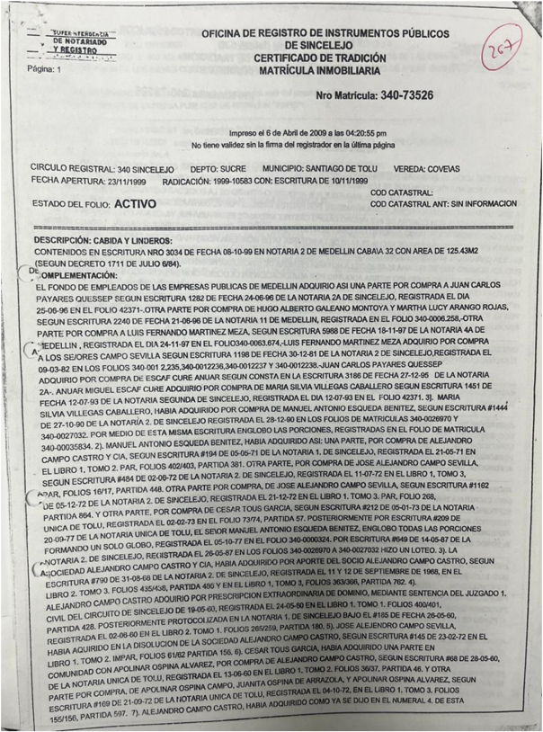
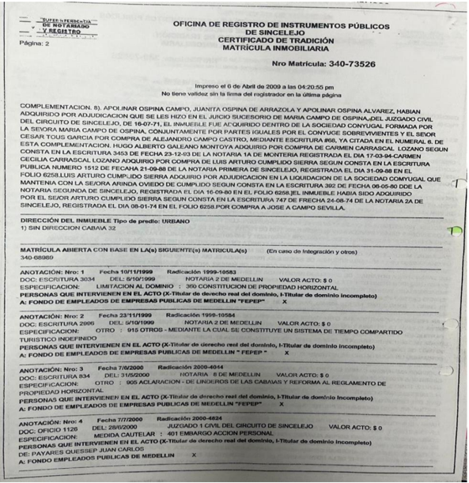
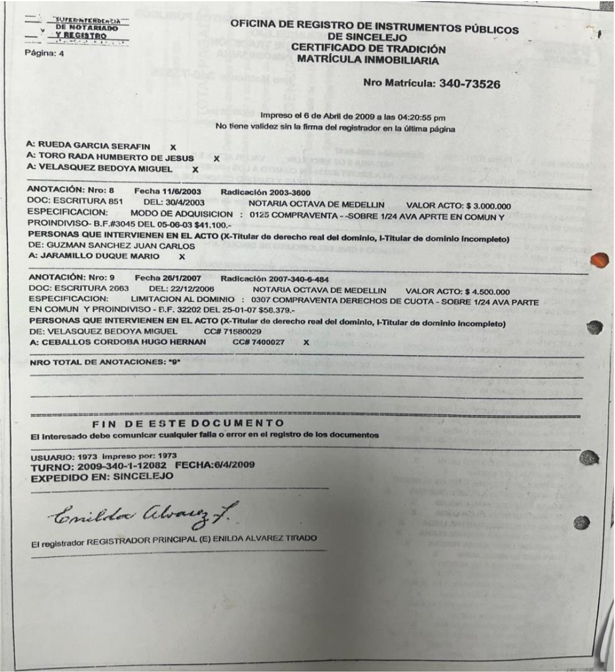
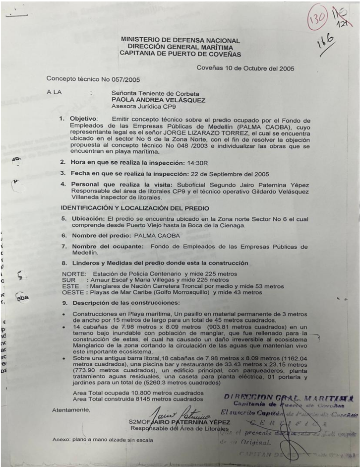
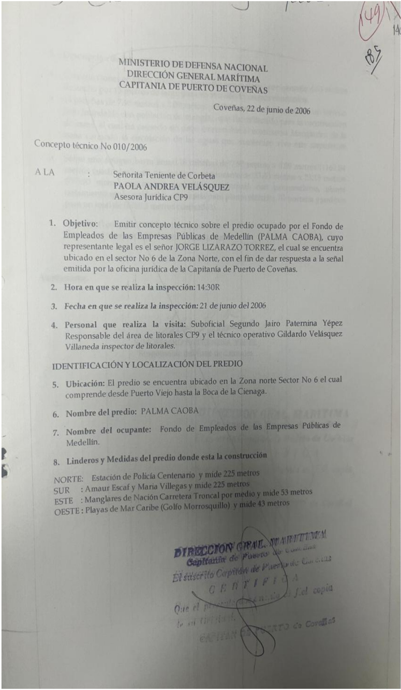
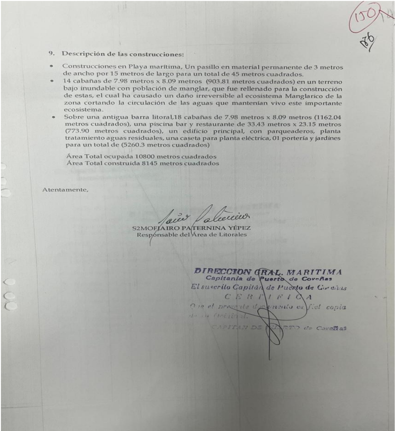

## consejo DE ESTADO SALA DE LO CONTENCIOSO ADMINISTRATIVO SECCIÓN PRIMERA

Bogotá D.C., tres (3) de octubre de dos mil veinticuatro (2024)

## CONSEJERO PONENTE: GERMÁN EDUARDO OSORIO CIFUENTES

Referencia:

Acción de nulidad y restablecimiento

Radicación núm. 70001-23-31-000-2009-00164-01

Tema: Actuación administrativa / notificación y vinculación de terceros / informes técnicos / autoridad marítima

## SENTENCIA DE SEGUNDA INSTANCIA

La  Sala  procede  a  resolver  el  recurso  de  apelación  interpuesto  por  la  parte demandada,  Ministerio  de  Defensa  Nacional -Dirección  General  Marítima -DIMAR, en contra de la sentencia de de mayo de 2019, proferida por el Tribunal Administrativo de Sucre, por medio de la cual se declaró la nulidad de la Resolución 134 de de octubre de 2006 y del acto administrativo sin número de de enero de 2009, a través del cual se resolvió el recurso de apelación confirmando la anterior decisión.

## I.
ANTECEDENTES

## I.1. La demanda

1. El Fondo de Empleado de Empresas Públicas de Medellín -FEPEP, a través de apoderado  judicial,  en  ejercicio  de  la  acción  de  nulidad  y  restablecimiento  del derecho prevista en el artículo 85 del Código Contencioso Administrativo -CCA, presentó  demanda  en  contra  del  Ministerio  de  Defensa  Nacional -Dirección General  Marítima -DIMAR,  con  el  fin  de que  se  hicieran las siguientes declaraciones:

'[…]. Que se declare en su integridad, la Nulidad de la Resolución 134 de de Octubre de 2006, expedida por El (sic) Ministerio de Defensa Nacional Dirección General Marítima -DIMAR- (Capitanía de Puerto de Coveñas), "Por medio de la cual se falla una investigación de carácter administrativo" (ver copia auténtica a folios 153-177, Cuaderno No, anexo); así como de la decisión del de Enero de 2003, mediante la cual se resolvió el recurso de apelación (ver copia autentica (sic) a folios 187-193, Cuaderno No, anexo).

1 Folios a 35 C pp.

- Dirección General Marítima - DIMAR.  Que como consecuencia de lo anterior y a título de Restablecimiento del Derecho:
2. 2.1. Se ordene dejar sin valor, sin efecto alguno, las órdenes y los envíos a otras  autoridades,  que  se  hicieron  en  los  artículos  segundo  al  sexto  de  la Resolución 134 del de Octubre de 2006, expedida por la DIMAR.
3. 2.2.  Se  ordene  dejar  sin  valor,  sin  efecto  alguno,  los  posibles  registros  de limitaciones  al  dominio  del  inmueble  donde  está  construido  el  Condominio Palma Caoba; en caso de haberse hecho los mismos por parte de la Oficina de Registro e Instrumentos Públicos de Sincelejo, debe procederse a ordenar su cancelación, con gastos a cargo de la DIMAR.
4. 2.3. Se le reconozca y permita a los propietarios de los inmuebles, terrenos y construcciones  del  Condominio  Palma  Caoba,  continuar  ejerciendo  sus derechos  plenos  de  dominio  sobre  dichos  bienes,  por  tratarse  de  bienes privados adquiridos a particulares con justo título y buena fe, lo cual no se ha logrado desvirtuar plena y válidamente por autoridad competente.

## Subsidiaria:

En caso de no acceder a la (sic) pretensiones principales, 2.1, 2.2. y 2.3, que se le reconozca al FEPEP, el valor actualizado, de los terrenos y de todas las construcciones, reformas, mejoras, dotaciones, mantenimiento, administración, en que ha incurrido en el terreno objeto de debate, desde el momento de su adquisición, hasta el momento que se le haga el pago de las mismas, así como todos  los  gastos  y  perjuicios  que  se  hayan  ocasionado  o  puedan  llegar  a derivarse de las actuaciones adelantadas por la DIMAR. Todo lo anterior se calcula en la suma aproximada superior a Veintisiete Mil Millones de Pesos ($ 27.000.000 000), correspondientes aproximadamente a: $ 11.723,387.000 por concepto de construcción y dotación, unos $ 11.000.000.000 por concepto del valor aproximado que se tendría que reconocer (devolución) por los derechos de  los  768  copropietarios,  y  cerca  de  $  5.000.000.000  por  concepto  de mantenimiento, administración y demás gastos ejecutados en los presupuestos de los años 2001 a 2009.

3. Se condene a la entidad demandada en costas y agencias en derecho.
4.  Se  ordene  dar  cumplimiento  al  fallo  en  los  términos  consagrados  en  los artículos 176, 177 y 178 del C.C.A […]' (mayúscula y negrilla del original).

## I.1.1. Los hechos de la demanda

2. Como  fundamentos  fácticos  de  las  pretensiones  se  indicaron,  en  síntesis,  los siguientes:
3. El apoderado de la parte demandante señaló que, de acuerdo con las escrituras públicas 1282 de de junio de 1996, 2240 de de junio de 1996 y 5988 de de noviembre de 1997, el FEPEP adquirió tres lotes ubicados en el kilómetro de la vía que conduce de Tolú a Coveñas, en el departamento de Sucre, los cuales fueron englobados mediante escritura pública 046 de de enero de 1998.

2 Folio a 2 C pp.

3 Folios a 6 C pp.

Demandada: Ministerio de Defensa Nacional - Dirección General Marítima - DIMAR. Sostuvo que, luego de cumplir con todos los requisitos, trámites y permisos de las autoridades locales y nacionales, la demandante construyó un complejo como sede vacacional  denominado '[…] Condominio  Palmacaoba […]' que  consta  de cabañas  las  cuales  fueron  vendidas  a  24  copropietarios  en  el  sistema  tiempo compartido, para un total de 768 copropietarios, quienes están sometidos al régimen de propiedad horizontal según las escrituras públicas 3034 de de octubre de 1999 y 834 de de mayo de 2000.
5. Indicó  que,  mediante  auto  de  de  mayo  de  2000,  la  capitanía  de  puerto  de Coveñas de la Dirección General Marítima -DIMAR dio apertura a una investigación en contra del FEPEP sin haber citado, notificado y vinculado a los copropietarios del mencionado condominio.
6. Anotó  que,  a  través  la  Resolución  134  de  de  octubre  de  2006,  la  DIMAR consideró  que  el  terreno  donde  se  construyó  el  condominio  correspondía  a  su jurisdicción por tratarse de zona de playa marítima y terreno de bajamar.
7. Finalmente,  manifestó  que,  mediante  acto  administrativo  sin  número  de  de enero de 2009, la DIMAR resolvió el recurso de apelación en contra de la Resolución 134 confirmándola en todas su partes.

## I.1.2. Fundamentos de derecho y el concepto de violación

## I.1.2.1. Fundamentos de derecho. La parte demandante propuso como cargos de nulidad los relacionados con el desconocimiento de las normas en que debían fundarse los actos acusados, falsa motivación, falta de competencia y desviación de poder, para lo cual señaló como quebrantadas las siguientes disposiciones: (i) Constitución Política, artículos 6°, 29, 121, 122 y 209; (ii) Código Contencioso Administrativo -CCA, artículos 3°, 14, 15, 28, 34, 35, 38, 44, 46, 82, 84 y 267 (iii) Decreto Ley 2324 de 1984, artículos 5° (numeral 27), 15 y 82 y; (iv) Código de Procedimiento Civil -CPC, artículos 57, 140, 236, 237, 238 y 243.

## I.1.2.2. El concepto de violación

## I.1.2.2.1.  Desconocimiento de las normas en que debían fundarse los actos administrativos demandados por violación al derecho de audiencia y defensa. El  apoderado  de  la  parte  demandante  aseguró  que  los  actos  administrativos acusados se encuentran viciados de nulidad, toda vez que la DIMAR decidió una investigación administrativa contra el FEPEP sin citar, notificar y realizar publicidad a terceros interesados y afectados con la decisión, desconociéndose los principios Folio a 27 C pp.

Demandada: Ministerio de Defensa Nacional - Dirección General Marítima - DIMAR de la función administrativa consagrados en el  CCA, aplicables por remisión del artículo 82 del Decreto Ley 2324 de 1984.

10. Advirtió que la demandante construyó el Condominio Palmacaoba que consta de cabañas las cuales fueron vendidas a 24 copropietarios en el sistema tiempo compartido, quienes están sometidos al régimen de propiedad horizontal según las escrituras públicas 3034 de de octubre de 1999 y 834 de de mayo de 2000.

## I.1.2.2.2. Falsa motivación. Mencionó que en los informes técnicos 057 de 2005 y 010 de 2006 elaborados por  la  sección  de  litorales  de  la  DIMAR  se  precisó  que  los  terrenos  objeto  de discusión constituyen bienes de uso público por ser playa marítima y terrenos de bajamar, sin que los mismos cumplieran con los requisitos de ese medio probatorio a luz de lo establecido en el CPC, además fueron emitidos sin motivación y con desconocimiento del derecho de audiencia y defensa.
12. Anotó que, previo al informe técnico de 2006, la oficina de litorales elaboró los informes técnicos 048 de 2003 y 057 de 2005 los cuales fueron anulados por la DIMAR en atención a los escritos de objeción por error grave presentados por la parte demandante, y que el referido informe técnico, reprodujo el informe 057, cambiando solo la fecha en que se presentó la inspección.
13. Advirtió que los conceptos fueron emitidos con desconocimiento del principio de imparcialidad toda vez que fueron realizados por la oficina de litoral de la DIMAR, aun  cuando  en  los  escritos  de  objeción  solicitó  un  peritazgo  por  el  Instituto Geográfico Agustín Codazzi -IGAC, además de otros argumentos que no fueron resueltos, como el relacionado al hecho de que en las inspecciones realizadas no se citó al FEPEP.
14. Puso de presente que el acto administrativo sin número de de enero de 2009, resolvió el recurso de apelación en contra de la Resolución 134 de de octubre de 2006 con fundamento en los informes técnicos 057 de 2005 y 010 de 2006, cuando el primero había sido declarado nulo por la DIMAR y, el segundo no fue objeto de traslado, constituyéndose un desconocimiento del derecho del debido proceso.
15. En ese contexto, concluyó que los informes técnicos utilizados para fundamentar los actos administrativos acusados no cumplieron con los requisitos exigidos para que fueran plena prueba, como lo es que la entidad que los emite sea imparcial, que sea motivado con todos los requerimientos técnicos y sometidos al efectivo ejercicio del derecho de defensa

## I.1.2.2.3. Falta de competencia y desviación de poder. Afirmó que la DIMAR expidió los actos administrativos demandados con falta de competencia por desconocer el término para el ejercicio de la facultad sancionatorio

Demandada: Ministerio de Defensa Nacional -Dirección General Marítima - DIMAR consagrado  en  el  artículo  38  del  CCA,  asimismo,  por  cuanto  dentro  de  sus competencias  no  se  encuentra  la  de  determinar  cuándo  un  bien  puede  ser considerado de uso público, además no tiene facultades para realizar investigaciones sobre bienes de propiedad privada.

17. Explicó que en el presente caso operó la caducidad respecto de las sanciones administrativas, toda vez que la DIMAR inició la actuación el de mayo de 2000 y sólo se decidió la misma en primera instancia el de octubre de 2006, esto es, 6 años después y, que la decisión de segunda instancia fue expedida hasta el de enero de 2009.

18. En ese  contexto,  afirmó que  se  configuró la  caducidad  de  la  potestad sancionatoria  de  años  de  que  trata  el  artículo  38  del  CCA,  por  cuanto  la investigación administrativa desde su inicio hasta la decisión final en firme tuvo una duración de años.

19. Por otra parte, indicó que de acuerdo con el Decreto Ley 2324 de 1984 la DIMAR tiene competencia para vigilar, inspeccionar y adelantar investigaciones administrativas sancionatoria, pero no para declarar o determinar si un bien es de uso público, toda vez que, de acuerdo con los artículos (numerales 10° y 15) y 48 de la Ley 160 de 1994 y el Decreto 2663 de 1994 dicha competencia es del Instituto Colombiano de la Reforma Agraria -INCORA.
20. Además,  señaló  que  existía  prueba  que  los  terrenos  sobre  los  cuales  se construyó el Condominio Palmacaoba son de propiedad privada y no del Estado, toda vez que fueron adquiridos por particulares a través de diferentes escrituras públicas, debidamente registradas.
21. Recordó que, de acuerdo con las escrituras públicas 1282 de de junio de 1996, 2240 de de junio de 1996 y 5988 de de noviembre de 1997, el FEPEP adquirió tres lotes ubicados en el kilómetro de la vía que conduce de Tolú a Coveñas, en el departamento de Sucre, los cuales fueron englobados mediante escritura pública 046 de de enero de 1998.
22. Finalmente, precisó que, luego de cumplir con todos los requisitos, trámites y permisos  de  las  autoridades  locales  y  nacionales,  la  demandante  construyó  un complejo  sede  vacacional  denominado '[…]  Condominio  Palmacaoba  […]' que consta de cabañas las cuales fueron vendidas a 24 copropietarios en el sistema tiempo compartido, quienes están sometidos al régimen de propiedad horizontal según las escrituras públicas 3034 de de octubre de 1999 y 834 de de mayo de 2000.

## II. CONTESTACIÓN DE LA DEMANDA.
24. El  Ministerio  de  Defensa  Nacional -Dirección  General  Marítima -DIMAR contestó  la  demanda   en  la  que  se  opuso  a  las  pretensiones  de  la  parte demandante, para lo cual señaló que las decisiones demandadas están ajustadas a derecho por cuanto los terrenos son de uso público, por lo tanto, inalienables, imprescriptibles e inembargables. Se refirió a cada uno de los cargos de nulidad formulados de la siguiente forma:

## II.1.  Desconocimiento  de  las  normas  en  que  debían  fundarse  los  actos administrativos demandados por violación al derecho de audiencia y defensa. El  apoderado  de  la  DIMAR  aclaró  que  desde  el  inicio  de  la  investigación administrativa se ordenó citar al representante legal del FEPEP quien ejerció su derecho de audiencia y defensa.

25. Explicó que mediante los oficios 1015, 1431 y 1611 de julio, 1° de octubre y 28 de octubre de 1999 la Capitanía de Puerto de Coveñas informó al FEPEP que debía suspender las obras por tratarse de una zona de playa marítima del sector La Martha, del municipio de Tolú, por lo que era de su conocimiento la actuación administrativa adelantada.

## II.2.  Falsa motivación. Mencionó  que  los  conceptos  técnicos  deben  ser  emitidos  por  la  sección  de litorales de la Capitanía de Puerto de Coveñas según las funciones atribuidas a esa sección, de manera que el concepto técnico 010 de 2006 cuenta con plena validez y no resultaba necesario acudir a otras entidades para su elaboración.

27. Recordó que los bienes de uso público como las playas y terrenos de bajamar se  revisten  de  protección  especial  como  la  inoponibilidad  de  los  actos  de enajenación.  En  ese  sentido,  mencionó  que,  de  acuerdo  con  las  fotografías allegadas se corroboraba que el Condominio Palmacaoba se encuentra en bien de uso  público.  Advirtió  que  en  la  actualidad  no  ha  ordenado  el  desalojo,  ni  la demolición de obras, por lo que no se ha consumido hecho dañoso.

## II.3. Falta de competencia y desviación de poder. Sobre  la  configuración  del  fenómeno  jurídico  de  la  caducidad  de  la  potestad sancionatoria prevista en el artículo 38 del CCA, indicó que la interpretación del demandante no aplicaba al caso concreto toda vez que los actos demandados no versan sobre la imposición de una sanción por parte de la autoridad administrativa sino de la determinación o reconocimiento de condición de un bien de uso público bajo su jurisdicción.

5 Folios 284 a 295 C 2.

Demandada: Ministerio de Defensa Nacional - Dirección General Marítima - DIMAR. Frente a la falta de competencia de la DIMAR para determinar cuándo un bien se considera  bien  de  uso  público,  así  como  de  adelantar  una  investigación  sobre propiedad privada, aseguró que se trataba de una apreciación subjetiva, toda vez que son los artículos 63 y 101 de la Constitución Política, el artículo 679 del Código Civil, la Ley 23 de 1982, artículo 83 del Decreto 2811 de 1974 y los artículos 2°, 3° y 5° (numeral 21) y 178 del Decreto 2324 de 1984, los que definen la condición de bien de uso público de las zonas de playa y bajamar.

30. En ese sentido, mencionó que la DIMAR tiene competencia para adelantar las investigaciones por ocupación indebida de bienes de uso público cuando se trata de zonas de playa marítima y terrenos de bajamar, por lo que se trata de la autoridad competente para tal fin.

## III. LA SENTENCIA DE PRIMERA INSTANCIA.
31. El Tribunal Administrativo de Sucre, a través de la sentencia de de mayo de 2019 , decidió:

- '[…] PRIMERO: DECLÁRASE la nulidad de la Resolución No. 134 del de octubre de 2006, expedida la Capitanía de Puerto de Coveñas, a través de la cual se falló una investigación de carácter administrativo y del acto administrativo  del  de  enero  de  2009,  por  el  cual  la  Dirección  General Marítima  resolvió  desfavorablemente  el  Recurso  de  Apelación  interpuesto contra la primera, por lo dicho en la parte motiva.

SEGUNDO: Como consecuencia de lo anterior y a título de restablecimiento del derecho, ORDÉNASE comunicar a la Alcaldía Municipal de Santiago de Tolú, la presente decisión, para lo de su competencia.

TERCERO: NIÉGANSE las demás pretensiones de la demanda.

CUARTO:

Sin condena en costas en esta instancia.

QUINTO: En firme esta decisión, ARCHÍVESE el expediente […]' (mayúscula y negrilla del original).

32. El a quo desagregó los cargos de nulidad, para lo cual mencionó que el problema jurídico a resolver era determinar si la Resolución 134 de de octubre de 2006 y el acto administrativo sin número de de enero de 2009 que resolvió el recurso de apelación  confirmándola,  debían  ser  declarados  nulos  por  considerar  que:  (i)  la DIMAR no  tiene  competencia  para  determinar  cuándo  un  bien  es  o  no  de  uso público, ni para adelantar y fallar investigaciones relativas a la propiedad privada; (ii) así mismo, por haber operado la caducidad de las decisiones adoptadas por la autoridad administrativa; (iii) por la falta de citación, notificación y publicidad de la actuación a terceros interesados, afectados con la decisión y, por último, (iv) por la presunta irregularidad en que se incurrió al emitirse los informes técnicos por parte Folios 398 a 409 C 3.

Demandada: Ministerio de Defensa Nacional - Dirección General Marítima - DIMAR del  área  de  litorales,  documentos  en  los  cuales  la  DIMAR  fundamentó  sus decisiones.

## III.1. Incompetencia de la DIMAR. El a quo señaló que el FEPEP manifestó que existía prueba de que los terrenos sobre  los  cuales  se  construyó  el  Condominio  Palmacaoba  eran  de  propiedad privada  y  no  del  Estado,  por  haber  sido  adquiridos  por  particulares  mediante escrituras públicas debidamente registradas y bajo los principios de la buena fe y confianza legítima, lo que, a su juicio, generaba incompetencia de la DIMAR para adelantar investigaciones, facultad que le correspondía por ley al extinto INCORA.

34. Al  respecto,  manifestó  que  no  se pronunciaría  en  relación  con  la titularidad  y validez de los derechos que adquirió la demandante sobre el predio en cuestión, por no ser de su competencia.
35. Refirió que el Decreto Ley 2324 de 1984, por el cual se reorganiza la Dirección General Marítima -DIMAR, en su artículo 166, relacionó los terrenos de bajamar entre  los  bienes  de  uso  público  y  que  el  artículo  2º ibidem precisó  que  tiene jurisdicción '[…] hasta  el  límite  exterior  de  la  zona  económica  exclusiva  en  las siguientes áreas: aguas interiores marítimas, incluyendo canales intercostales y de tráfico marítimo; y todos aquellos sistemas marino y fluviomarinos; mar territorial, zona  contigua,  zona  económica  exclusiva,  lecho  y  subsuelos  marinos,  aguas supradyacentes, litorales, incluyendo playas y terrenos de bajamar, puertos del país situados  en  su  jurisdicción,  islas,  islotes  y  cayos  y  sobre  los  ríos […] en  una extensión de cincuenta (50) metros medidos desde la línea de la más alta marea y más alta creciente hacia adentro […]'.

36. Aclaró que, por su parte, el artículo 5° ejusdem ,  le  otorgó competencia a ésta autoridad  para  regular,  autorizar  y  controlar  las  concesiones  y  permisos  en  las aguas, terrenos de bajamar, playas '[…] y demás bienes de uso público […]' en las áreas  de  su  jurisdicción,  así  como  lo  facultó  para  fallar  las  investigaciones  por construcciones indebidas o no autorizadas en los bienes de uso público y terrenos sometidos a su jurisdicción.

37. Por  lo  anterior,  estimó  que  la  DIMAR  estaba  facultada  para  iniciar  una investigación  de  carácter  administrativo  por  la '[…] presunta  construcción  no autorizada en terrenos no sometidos bajo la jurisdicción de la Dirección General Marítima contra el "FEPEP", por tratarse de la construcción - ocupación de un bien que consideró de uso público, sometido a su jurisdicción […]'.
38. Aseguró que revisado el contenido de la Resolución 134 del de octubre de 2006, se puedo concluir que, más allá de la declaratoria de bien de uso público del terreno donde fue construido el Condominio Palmacaoba, la finalidad de la entidad era procurar la restitución del dominio del Estado frente al mismo, pues, '[…] en ella se dejó claro que el FEPEP no solicitó permiso de ninguna clase a la Capitanía de 

Puerto para gozar de dicho bien ni legalizó su situación, a pesar de conocer que en su contra cursaba una investigación por presunta construcción no autorizada […]'.

39. En suma, adujo que no se puede predicar falta de competencia de la DIMAR para expedir los actos demandados y que tampoco carecía de facultad para dicho trámite al  ser  el  INCORA el competente, ya que ésta última tenía a su cargo las tierras denominadas baldías, más no las playas y terrenos de bajamar, razón por la cual el cargo de nulidad de los actos administrativos no estaba llamado a prosperar.

## III.2. Caducidad. Aludió a que la parte demandante señaló que había operado la caducidad de la potestad sancionatoria de la DIMAR a la luz de lo preceptuado en el artículo 38 del CCA, toda vez que los fallos no fueron proferidos dentro de los tres (3) años de que trata la referida disposición.
41. Sobre el particular, el a quo mencionó que revisada la actuación administrativa adelantada por la DIMAR, se pudo advertir que ella no tuvo como finalidad imponer una sanción al FEPEP, sino determinar si se levantó una construcción no autorizada sobre un bien de uso público, por lo que, el artículo 38 ibidem no resultaba aplicable al  caso sub  examine ,  razón  por  la  cual  el  cargo  de  nulidad  de  los  actos administrativos no estaba llamado a prosperar.

## III.3. Falta de citación de los terceros interesados. En  cuanto  a  la  falta  de  citación  y  notificación  de  la  actuación  a  terceros interesados y afectados con la decisión, el a quo indicó que la parte demandante dijo que en el procedimiento administrativo adelantado por la DIMAR no se citó al representante  de  la  propiedad  horizontal  y  tampoco  a  los  copropietarios  de  los bienes objeto de la investigación, los cuales tenían un interés directo en el resultado de dicho procedimiento, desconociendo los principios de defensa y contradicción en el marco de un procedimiento administrativo.
43. Al respecto, el a quo recordó que si bien es cierto que el Decreto Ley 2324 de 1984  no  estableció  un  procedimiento  para  llevar  a  cabo  las  investigaciones  por construcciones indebidas o no autorizadas en los bienes de uso público y terrenos sometidos a su jurisdicción, también lo es que de acuerdo con el artículo 82 de la misma disposición se estableció que '[…] l as investigaciones y sanciones por las anteriores infracciones se tramitarán de conformidad con el Código Contencioso Administrativo y en especial con los artículos 28, 29, 34, 35 y 74 […]'.
44. Concretamente, expresó que al artículo 14 del CCA dispuso que '[…] c uando de la misma petición o de los registros que lleve la autoridad, resulte que hay terceros determinados  que  pueden  estar  directamente  interesados  en  las  resultas  de  la decisión, se les citará para que puedan hacerse parte y hacer valer sus derechos […]' .

Demandada: Ministerio de Defensa Nacional - Dirección General Marítima - DIMAR. Aseveró que el caso en estudio se demostró que la DIMAR ordenó citar mediante auto del de mayo de 2000 al representante legal del FEPEP, notificación que fue realizada el día del mismo mes y año, fecha, además, en la que se llevó a cabo diligencia de versión libre del referido representante.

46. Advirtió que en el expediente se encuentra el certificado de tradición y libertad expedido por la Oficina de Registro de Instrumentos Públicos de Sincelejo, esto es, respecto del bien inmueble identificado con la matrícula inmobiliaria 340-73526, en cuya  anotación  1ª  de  de  noviembre  de  1999  se  registró  la  constitución  del régimen  de  propiedad  horizontal  conforme  a  la  escritura  pública  3034  del  de octubre de 1999 de la Notaría 2ª del Círculo de Medellín.
47. Agregó  que  en  la  anotación  2ª  de  de  noviembre  de  1999  se  registró  la constitución de un sistema de tiempo compartido de acuerdo con lo plasmado en la escritura  pública  2996  del  de  octubre  de 1999  de  la  Notaría  2ª  del  Círculo  de Medellín.
48. Finalmente,  aseveró  que  en  la  anotación  7ª  se  registró  la  venta  sobre  una veinticuatroava  parte  en  común  y  proindiviso  del  FEPEP  a  diferentes  personas naturales.
49. Por  lo  anterior,  concluyó  que  para  el  momento  de  la  expedición  de  los  actos acusados sí se encontraba documentada la existencia de terceros interesados, '[…] a quienes no consta en el expediente que se les hubiere notificado el inicio de la actuación  administrativa,  siendo  necesaria  su  vinculación,  por  tratarse  de  una persona jurídica distinta conformada por los propietarios de los bienes de dominio particular, a la luz de lo preceptuado en el Art. 32 ibidem, constituida mucho antes que se iniciara la investigación -8 de octubre de 1999-[…]'.

50. Puso de presente que no podía perderse de vista que mediante escritura pública 2996 de de octubre de 1999 de la Notaría 2ª del Círculo de Medellín, se constituyó un sistema de tiempo compartido turístico sobre el Condominio Palmacaoba y, en tal medida, '[…] también serían terceros interesados los titulares del derecho sobre el período vacacional de tiempo compartido, sin que obre prueba acerca del inicio de la notificación de la actuación administrativa, a su representante […]'.

51. En ese contexto, arguyó que la DIMAR debió vincular al representante legal de la  propiedad  horizontal,  en  virtud  de  lo  normado  en  el  artículo  14  citado,  a  los copropietarios  de  las  cabañas  y/o  al  representante  legal  del  establecimiento  del sistema de tiempo compartido turístico, para garantizar los principios de defensa y contradicción de las actuaciones administrativas, por lo que la resolución demandada '[…] nació viciada de nulidad por atentar contra el debido proceso, en particular contra el derecho de defensa y audiencia. En virtud de lo anterior el cargo prospera […]'.

Dirección General Marítima - DIMAR

## III.4. Irregularidad de los informes técnicos. Finalmente, en lo que atañe a la irregularidad de los informes técnicos, los cuales según la parte demandante se constituyeron en el fundamento y prueba única de la decisión expedida por la DIMAR, el a quo consideró que el concepto técnico 57 de 2005  había  sido  declarado  nulo  dentro  del  proceso  administrativo  por  la  misma DIMAR y que el concepto técnico de 2006, era una reproducción literal de aquel, el cual no fue objeto de traslado a los propietarios del condominio.

53. Anotó que el concepto técnico de 2006 rendido por el área de litorales el de  junio  de  2006  carece  de  los  fundamentos  técnicos  en  sus  conclusiones, contrariando lo preceptuado en el numeral 6° del artículo 237 del CPC; así como tampoco  se  corrió traslado del mismo  a  los interesados en la actuación administrativa  por  el  término  establecido  en  el  artículo  238 ibidem para  que solicitaran su complementación o aclaración, o lo objetaran por error grave.

54. Adicionalmente, subrayó que el acto administrativo que resolvió el recurso de apelación se fundamentó en los conceptos técnicos 057 de de octubre de 2005 y 10 de de junio de 2006, siendo que a través del primero se resolvió la objeción por error grave propuesta por la parte demandante contra el concepto técnico 048 de de junio de 2003, el cual mediante auto de de mayo de 2006 fue declarado nulo.

55. Por las anteriores razones, el a quo estimó que debía declararse la nulidad de los actos administrativos acusados y de acuerdo con el artículo 132 del Decreto Ley 1355 de 1970, a título de restablecimiento del derecho, se debía ordenar comunicar esta decisión a dicho ente territorial para lo de su competencia.

## IV.
55. RECURSO DE APELACIÓN

56. Mediante escrito de de julio de 2019 , el apoderado del Ministerio de Defensa Nacional -Dirección General Marítima -DIMAR presentó recurso de apelación con el fin de obtener la revocatoria de la sentencia de de mayo de 2019 proferida por el  Tribunal  Administrativo  de  Sucre,  para  lo  cual  señaló  cuatro  argumentos  de incomodad a saber:

## IV.1.  Falta  de  legitimación  en  la  causa  para  alegar  la  irregularidad  de  la actuación administrativa por falta de notificación a los terceros interesados

57. Mencionó que la parte demandante solicitó declarar la nulidad de las decisiones que  resuelven  el  proceso  administrativo  sancionatorio  en  que  se  declaró  la responsabilidad administrativa por la construcción indebida o no autorizada sobre bienes de uso público de propiedad de la Nación del FEPEP, argumentando que no Folios 511 a 525 C 3.

Demandada: Ministerio de Defensa Nacional -Dirección General Marítima - DIMAR fueron vinculados a la actuación los terceros que pudieran ser perjudicados con la actuación.

58. Indicó que, si bien es cierto que el artículo 14 del CCA, vigente a la fecha de la actuación,  contemplaba  el  deber  de  comunicar  a  los  terceros  interesados  en  el asunto objeto de la investigación, se hace necesario tener en cuenta que frente a la nulidad por falta o indebida notificación establecida en el artículo 143 del CPC y artículo 133 del CGP sólo podrá alegarse por la persona afectada.

59. Expresó que los terceros presuntamente afectados eran los llamados a impetrar el  incidente  de  nulidad  dentro  de  la  actuación  administrativa  adelantada  por  la autoridad marítima, lo que no sucedió.

60. Agregó  que  el  llamado  a  acudir  ante  la  Jurisdicción  de  lo  Contencioso

Administrativo  es  el  tercero  cuyo  derecho  le  fue  presuntamente  cercenado  por causa de irregularidad cometida dentro de la actuación administrativa adelantada por la autoridad marítima y no por cualquier sujeto procesal.

## IV.2. Inexistencia de violación del derecho al debido proceso de los terceros y/o particulares posiblemente afectados por la decisión administrativa

61. Aseveró  que  no  es  cierto  que  la  Dirección  General  Marítima

Capitanía  de Puerto  de  Coveñas  haya  vulnerado  el  derecho  al  debido  proceso  en  el  trámite administrativo  adelantado  sobre  la  construcción  del  condómino  denominado

Palmacaoba  de  propiedad  del  FEPEP,  por  el  hecho  de  no  notificar  a  posibles terceros o particulares afectados con una decisión administrativa.

62. Subrayó  que  la  apertura  de  la  investigación  de  carácter  administrativo  por construcción no autorizada en predios de la Nación se efectuó mediante auto de de mayo del año 2000, fecha en la cual los predios ocupados de manera ilegal se registraban a nombre del FEPEP.

63. Puntualizó que  el  señor  Jorge  Iván  Clavijo  Franco  en  su  condición  de representante  legal  conocía  de  la  apertura  de  la  investigación  tal  y  como  lo manifestó en versión libre rendida dentro del proceso.

64. Argumentó que a pesar del conocimiento que tenía el mencionado representante legal de la apertura de la investigación, continuó con la construcción del condominio y siguió con los trámites de constitución de propiedad horizontal, razón por la cual fue declarado responsable administrativamente por la autoridad marítima mediante la Resolución 134 del de octubre de 2006, expedida por la Capitanía de Puerto de Coveñas, confirmada mediante acto administrativo sin número de de enero de 2009, expedida por el Director General Marítimo de la DIMAR.

65. Por  lo  anterior,  concluyó  que  no  es  de  recibo  que  el  investigado  alegue  en instancias  judiciales  la  falta  de  notificación  a  posibles  terceros  o  particulares

Demandada: Ministerio de Defensa Nacional -Dirección General Marítima - DIMAR afectados  con  la  decisión  administrativa  o  investigación  administrativa,  toda  vez que,  al  momento  de  tener  conocimiento  de  tal  circunstancia  debió  suspender  la construcción  de  dicho  condominio  y no  constituir  propiedad  horizontal  y,  en  ese sentido, no podía alegar dicha culpa a su favor.

## IV.3. Inexistencia de irregularidades en los fundamentos  técnicos  del concepto técnico de de junio de 2006. Manifestó que luego de realizar una inspección del lugar donde se adelantaba la investigación administrativa,  esto  es,  en  la  zona  Norte,  sector  (La  Martha)  del municipio de Coveñas, y luego de describir las construcciones levantadas por el Fondo de Empleados de Empresas Públicas de Medellín, se elaboró el concepto técnico de de junio de 2006, el cual concluyó que en el predio objeto de la actuación administrativa se presentan características de playa marítima, de acuerdo con los parámetros establecidos en el artículo 167 del Decreto Ley 2324 de 1984.

67. Señaló que el representante legal de la sociedad investigada tuvo conocimiento del  informe  técnico  en  comento,  así  mismo  contó  con  la  oportunidad  legal  de controvertirlo, en garantía del derecho de defensa y contradicción.

## IV.4.  Improcedencia  de  la  orden  de  comunicar  la  decisión  a  la  Alcaldía Municipal de Santiago de Tolú

68.  La  recurrente señaló su desacuerdo con la decisión adoptada por el Tribunal Administrativo de Sucre, la cual ordena, a título de restablecimiento del derecho del demandante, comunicar a la Alcaldía Municipal de Santiago de Tolú la declaración de nulidad de las decisiones tomadas en el proceso administrativo adelantado por la Autoridad Marítima.

69. Argumentó que la autoridad municipal no está supeditada a los procedimientos llevados a cabo por la DIMAR para iniciar sus propios procesos policivos, los cuales son de su competencia y están destinados a la protección y defensa de los bienes de la Nación.

## V.
69. TRÁMITE DE SEGUNDA INSTANCIA

70. El  recurso  de  apelación  fue  concedido  por  la  magistrada  sustanciadora  de  la primera instancia mediante auto de de agosto de 2019 .

71. Remitido y repartido el proceso entre los diferentes Despachos que integran la Sección Primera del consejo de Estado, a través de autos de de septiembre de 2019 y 13 de noviembre de 2019   se  admitió  el  recurso  interpuesto  y  se  corrió traslado  a  las  partes  para  que  presentaran  sus  alegatos  de  conclusión  y,  al Folios 537 C 3.

9 Folio y 8 C 4.

## VI.1. Competencia

72. De conformidad con el artículo 129 del CCA , la Sección Primera del consejo de Estado es competente para decidir el recurso de apelación interpuesto en contra de la sentencia dictada en primera instancia por el Tribunal Administrativo de Sucre, en concordancia con lo dispuesto en el Acuerdo 80 de 2019 , que contiene las reglas de reparto entre las distintas secciones de la Corporación.

## VI.2. La formulación del problema jurídico

73. De  acuerdo  con  las  prescripciones  del  artículo  328  del  CGP ,  aplicable  por remisión  del  artículo  267  del  CCA  y  en  los  términos  del  recurso  de  apelación interpuesto por la parte demandada, la Sala debe analizar la presunta la falta de legitimación en la causa de la parte demandante para alegar la irregularidad por falta de notificación a terceros en la actuación administrativa, si se desconoció el derecho al debido proceso de los terceros posiblemente afectados; si los conceptos técnicos que fundamentaron la decisión de la administración prestan irregularidades y; si era procedente comunicar la declaratoria de nulidad a la Alcaldía Municipal de Santiago de Tolú.

74. Para  los  fines  anteriores,  la  Sala  abordará:  (i)  identificación  de  los  actos administrativos acusados; (ii) el análisis del caso concreto y; (iii) conclusión.

## VI.2.1. La identificación de los actos demandados

75. El Fondo de Empleados de Empresas Públicas de Medellín -FEPEP demandó la Resolución 134 de de octubre de 2006 y el acto administrativo sin número de de enero de 2009 que resolvió el recurso de apelación en contra de la primera , expedidas por el capitán de puerto de Coveñas y el director general marítimo de la DIMAR, cuyos textos son los siguientes:

10 '(…) El consejo de Estado, en Sala de lo Contencioso Administrativo conocerá en segunda instancia de las apelaciones de las sentencias dictadas en primera instancia por los Tribunales Administrativos y de las apelaciones de autos susceptibles de este medio de impugnación, así como de los recursos de queja cuando no se conceda el de apelación o se conceda en un efecto distinto del que corresponda, o no se conceda el extraordinario de revisión (…)'.

13 Folios 153 C pp a 177 C 2 y 187 a 199 C 2.

12 Artículo  328. '[…]  Competencia  del  superior.  El  juez  de  segunda  instancia deberá  pronunciarse  solamente  sobre  los argumentos expuestos por el apelante, sin perjuicio de las decisiones que deba adoptar de oficio, en los casos previstos por la ley […]' . Antes artículo 357 del CPC.

Ministerio Público para que rindiera concepto. A lo cual, las partes y el Ministerio Público guardaron silencio.

## VI.
CONSIDERACIONES DE LA SALA

## VI.2.1.1. Resolución 134 de de octubre de 2006

'[…] Coveñas, 31 OCT. 2006 RESOLUCIÓN No. 134 /CP-OFJUR

Por medio de la cual se falla una investigación de carácter administrativa.

EL  SUSCRITO  CAPITÁN  DE  PUERTO  DE  COVEÑAS  EN  USO  DE  SUS ATRIBUCIONES  LEGALES  Y  EN  ESPECIAL  LAS  CONFERIDAS  POR  EL DECRETO-LEY 2324/84 Y,

## CONSIDERANDO:

Que la Dirección General Marítima ejerce jurisdicción hasta el límite exterior de la  zona  económica  exclusiva,  en  las  siguientes  áreas:  aguas  interiores marítimas, incluyendo canales intercostales y de trafico (sic) marítimo; y todos aquellos  sistemas  marinos  y  fluviomarinos,  mar  territorial,  zona  económica exclusiva, lecho y subsuelo marino, aguas suprayacentes, litorales, incluyendo playas y terrenos de bajamar, islas, islotes y cayos.

La Dirección General Marítima es una dependencia del Ministerio de Defensa Nacional  agregada  al  Comando  de  la  Armada  Nacional,  y  es  la  autoridad marítima  que  ejecuta  las  políticas  del  Gobierno  en  esta  materia,  y  tiene  por objeto  dirigir,  coordinar  y  controlar  las  actividades  marítimas,  promoverlas  y estimular su desarrollo artículo 1 Decreto Ley 2324/84.

Mediante las señales N° 061522R Octubre/99 y 221632R Marzo/00 DILIT -CP, se puso en conocimiento de esta Capitanía que en inspección practicada al predio  ubicado  en  la  Zona  Norte,  sector  Nurnero (sic),  LA  MARTHA,  se encontró una construcción en material que se esta (sic) desarrollando en  el complejo vacacional PALMACAOBA en zona de playa marítima terrenos que se encuentran sometidos bajo la jurisdicción de la Dirección General Marítima (sic)

El despacho mediante auto de fecha de Mayo de 2000, inicia investigación de carácter administrativo por construcción no autorizada en un lote de terreno de  la  Nación  contra  el FONDO  DE  EMPLEADOS  PUBLICOS DE  LAS EMPRESAS PUBLICAS DE MEDELLÍN .

Para el perfeccionamiento de la investigación fueron ordenadas y practicadas las siguientes pruebas:

## A.
TESTIMONIALES:

- B. DOCUMENTALES:

- C. TÉCNICOS

CONCEPTO TÉCNICO suscrito por el Responsable del área de litorales en el cual  se  determina  la  jurisdicción  de  la  Dirección  General  Marítima  sobre  el terreno  ocupado por el inculpado dentro del cual se destacan los siguientes aspectos:

## Radicación núm.: 70001-23-31-000-2009-00164-01 Demandante: Fondo de Empleados de Empresas Públicas de Medellín FEPEP

FUNDAMENTO  LEGAL: La  oficina  jurídica  mediante  señal  N°  211021R junio/06

## UBICACIÓN DEL PREDIO:

Nombre; 'PA LMACAO BA'.

Ubicación: el predio objeto de la inspección se encuentra ubicado en la zona norte, sector N° 06 el cual comprende desde Puerto Viejo hasta la boca de la Cienaga (sic)

## Linderos y Medidas:

Norte: Estación de policía Centenario y mide 225 metros. Sur: Amaur Escaf y María Villegas y mide 225 metros. Este: Manglares de la Nación Carretera troncal por medio y mide metros. Oeste: Playas de mar Caribe (Golfo de Morrosquillo) y mide metros.

## DESCRIPCIÓN DE LAS CONSTRUCCIONES:

- Construcciones en playa marítima, un pasillo en material permanente de metros de ancho por metros de largo para un total de metros Cuadrados.
- 14 cabañas de,98 metros x 8.09 metros (903.81 metros cuadrados) en un terreno  bajo  inundable  con  población  de  manglar,  que  fue  rellenado  para  la construcción de estas, el cual ha causado un daño irreversible al ecosistema manglarico (sic) de la zona cortando la circulación de las aguas que mantenían vivo este importante ecosistema.
- Sobre una antigua barra litoral, 18 cabañas de.98 metros x 8.09 metros (1162.04 metros cuadrados), una piscina bar y restaurante de.43 metros x 23.15 metros (773.90 metros cuadrados), un edificio principal con parqueaderos,  planta  tratamiento  aguas  residuales,  una  caseta  para  planta eléctrica, 01 portería y jardines para un total de (5260.3 metros cuadrados).

## ÁREA TOTAL OCUPADA 10800 METROS CUADRADOS.

ÁREA TOTAL CONSTRUIDA 8145 METROS CUADRADOS.

CONSIDERACIONES DEL SEÑOR CAPITÁN DE PUERTO PARA FALLAR

## VALORACIÓN DE PRUEBAS:

De las pruebas practicadas al terreno en especial la prueba técnica, se le da el valor de plena prueba por ajustarse a los procedimientos y reunir los requisitos legales.

A  pesar  de  que  fueron  aportados  como  prueba  por  parte  del  investigado escrituras  publicas (sic) para  hacer  ver  su  calidad  de  propietario,  no  fue presentado  por  parte  de  el (sic) inculpado  título  originario  expedido  por  el Estado  que  no  haya  perdido (sic) su  eficacia  legal  siempre  y  cuando  sea anterior a 1873.

## Demandante: Fondo de Empleados de Empresas Públicas de Medellín -

## Radicación núm.: 70001-23-31-000-2009-00164-01 FEPEP

Por lo tanto y como se indico (sic) anteriormente, los terrenos sobre los cuales están las construcciones son Bienes de Uso Público bajo la jurisdicción de la DIMAR,  por  lo  tanto  estas  deben  ser  autorizadas  mediante  concesiones  y permisos otorgados por la DIMAR, por lo que se encuentra probado dentro de la investigación que el bien sobre el cual se encuentra la construcción realizada por el FONDO DE EMPLEADOS DE EMPRESAS PÚBLICAS DE MEDELLÍN es un bien de uso publico (sic) de la nación.

Tampoco se puede aducir el hecho de que sobre el bien se tengan escrituras, ya que sería constitucionalmente inadmisible que los particulares que ocupan e!  bien  de  uso  publico (sic) mencionado  puedan  ser  propietarios  de  este; cuando existe una expresa prohibición constitucional de que ello suceda. En el mismo sentido dicha situación sería incompatible con las normas ambientales mencionadas en párrafos anteriores, las cuales se han visto trasgredidas por el detrimento ecológico quo se ha presentado.

De otra parte a este despacho no le corresponde anular los títulos aportados como prueba por el inculpado pues no es competencia de la autoridad marítima por eso esta instancia resolvió que una vez en firme la resolución enviaría copia de la misma a la procuraduría delegada en lo civil; así mismo el estatuto de registro de instrumentos públicos (Decreto 1250/70) establece en su artículo 2° que  "están  sujetos  a  registro:  1.  Todo  acto,  contrato,  providencia  judicial, administrativa  o  arbitral  que  implique  constitución,  declaración,  aclaración, adjudicación, modificación, limitación, gravamen, medida cautelar, traslación o extinción de dominio u otro derecho real principal o accesorio sobre bienes , salvo la cesión del crédito hipotecario o prendario", sin embargo, el registro no incluye los bienes cuyas características , han sido descritas por la ley como de uso publico (sic) .

Esto muestra que la teoría de la comercialidad de los bienes se rompe cuando se  trata  de  bienes  de  uso  publico (sic) .  No  es  valido (sic) entonces  exigir matricula de tales bienes para determinar si son de uso publico (sic) ,  puesto que  tales  bienes,  por  sus  especiales  características  están  sometidos  a  un régimen jurídico especial, el cual tiene rango directamente constitucional . […] Así  según  la  corte,  los  bienes  de  dominio  público  se  distinguen  "por  su afectación al dominio publico (sic) , por motivos de interés general (C.N., Artículo 1) relacionados con la riqueza nacional, el uso publico (sic) y el espacio publico (sic) , "en particular, sobre los bienes de uso publico (sic) , la corte señalo (sic) e n  esa  misma  sentencia  que  estos  son  inalienables,  imprescriptibles  e inembargables.

## RESPONSABILIDAD DEL INCULPADO

Encuentro el despacho que el Fondo de Empleados de las Empresas Publicas (sic) de Medellín no solicitaron permiso de ninguna clase a esta Capitanía con el  fin  de  gozar  del  bien de uso publico (sic) ,  ni  tampoco como prueba en el paginario  del  expediente  quiso  en  ningún  momento  legalizar  su  situación, estando enterado que cursaba una investigación sobre el terreno que afirma y aporta mediante escritura pública haber adquirido.

El Código de Procedimiento Civil en su artículo 249 nos indica que el juez podrá deducir indicios de la conducta procesal de las partes. La indiciaria es la prueba indirecta por excelencia, como que a partir de algo conocido, y por virtud de una operación apoyada en las reglas de la lógica y en las máximas de la experiencia se  establece  la  existencia  de  una  cosa  desconocida.  Por  eso,  si  del  hecho indiciario no se tiene un convencimiento pleno, la deducción viene a ser contra

Demandada: Ministerio de Defensa Nacional - Dirección General Marítima - DIMAR evidente.  Pero  la  eficacia  probatoria  del  indicio  también  depende  de  la intensidad  o  del  vigor  con  que  se  manifieste  el  enlace  entre  el  factum probandum y el factum probans.  Entre mas (sic) ceñida  a  la  lógica  y  a  las máximas de  la  experiencia  se  vea  la  inferencia,  mayor  será  la  significación probatoria del indicio.

Conviene recordar que, evidentemente, las pruebas en general, y los indicios en particular, deben ser apreciados en conjunto, armonizando o entretejiendo unos con otros. Mas, en lo que a los indicios concierne, para que esta tarea pueda ser cumplida de manera correcta, la existencia del hecho indiciario no le debe ofrecer ninguna duda al fallador.

Como ya se ha precisado anteriormente para poder alegar propiedad sobre este tipo  de  bienes  es  necesario  que,  de  acuerdo  con  la  normatividad  expuesta, exhibirse titulo (sic) originario expedido por el Estado, que no haya perdido (sic) su eficacia legal siempre y cuando sea anterior a la vigencia del Código Fiscal de 1873. Es claro para este despacho que Fondo de Empleados de EMPRESAS PUBLICAS  DE  MEDELLÍN  nunca  presentaron  dichos  títulos  Io  que  hace presumir indicios graves en su contra.

En mérito de lo expuesto podemos concluir que los mencionados señores son responsables de la violación a la normatividad en materia de bienes de uso público, por cuanto adelantaron obras en terrenos considerados por la ley como zona de bajamar y playa marítima sometidos bajo la jurisdicción de la Dirección General Marítima sin haber obtenido la respectiva autorización por parte de la autoridad designada para el otorgamiento de tales permisos.

Por lo anteriormente expuesto, el Capitán de Puerto de Coveñas:

ARTICULÓ (sic) PRIMERO: Determinar  que  el  área  de.800  Metros Cuadrados metros cuadrados  es Bien de Uso Público, terreno ubicado en el sector No zona norte (La Martha) el cual comprende desde puerto viejo hasta la boca de la Ciénaga, cuyas medidas y linderos quedaron consignados en la parte  considerativa  de  la  presente  Resolución  corresponde  a  zona  de  playa marítima y terreno de Bajamar jurisdicción de la Dirección General Marítima conforme  a  la  ley,  donde  se  adelantaron  obras,  por  parte  del  Fondo  de Empleados  de  Empresas  Publicas (sic) de  Medellín  sin  autorización  de  la autoridad marítima.

ARTÍCULO  SEGUNDO: Envíese  copia  de  la  presente  Resolución  a  la Alcaldía  del  Municipio  de  Coveñas  (sucre)  para  que  ordene  a  quién corresponda  proceda  a  recuperar  el  Bien  de  Uso  Público  Ilegalmente construido, cuyas medidas y linderos quedaron consignados en la parte considerativa de esta Resolución .

ARTICULO  TERCERO: Ordenar  al  Fondo  de  Empleados  de  Empresas Publicas (sic) ,  y  demás personas que ostenten títulos de propiedad sobre el terreno precitado, que se abstengan, de realizar cerramientos que impidan el libre paso de los particulares y de las autoridades, de actuar tal forma que se deteriore el equilibrio ecológico del terreno desconociendo la función ecológica de la propiedad y de perfeccionar cualquier contrato que implique la transferencia parcial o total de la propiedad del inmueble, sin que el adquiriente esté plenamente informado acerca de la destinación del bien al uso público.

ARTICULO  CUARTO: Una  vez  en  firme  envíese  copia  de  la  presente Resolución a la Procuraduría Provincial para lo de su competencia.

ARTICULO  QUINTO: Una  vez  en  firme  envíese  copia  de  la  presente Resolución a la Procuraduría delegada en lo Civil para lo de su competencia.

ARTICULO SEXTO: Una  vez  en  firme,  envíese  a  la  Oficina  de  Registro  de Instrumentos  Públicos  de  Sincelejo,  para  que  registre  en  sus  libros  las limitaciones al dominio del inmueble, cuya ubicación y linderos fueron descritos en la parte motiva de la presente providencia […]' (mayúsculas, subrayas y negrillas del original).

## VI.2.1.2. Acto administrativo sin número de de enero de 2009

## '[…] DIRECCION GENERAL MARÍTIMA

## Bogotá, D.C., 23 ENE 2009

Procede el Despacho a resolver el recurso de apelación interpuesto por el señor JORGE IVÁN CLAVIJO FRANCO, representante legal del Fondo de Empleados de Empresas Públicas de Medellín, en contra de la Resolución No. 134 del de octubre de 2006, proferida por el Capitán de Puerto de Coveñas, dentro de la investigación administrativa por construcciones indebidas o no autorizadas en los terrenos sometidos bajo jurisdicción de la Dirección General Marítima, previos los siguientes:

## ANTECEDENTES.
1. El de mayo de 2000, el Capitán de Puerto de Coveñas abrió investigación administrativa en contra del Fondo de Empleados de las Empresas Públicas de Medellín,  FEPEP,  por  la  presunta  ocupación  y  construcciones  indebidas  en terrenos  de  uso  público  y  de  propiedad  de  la  Nación,  sujetos  al  control  y jurisdicción de la Dirección General Marítima.
2. Mediante Resolución No. 134 del de octubre de 2006, el Capitán de Puerto de Coveñas, determinó que en el área de 10800 metros cuadrados, ubicados en el sector No. 6 zona norte -La Martha-, bienes de uso público materia de esta investigación, fueron adelantadas obras por parte del Fondo de Empleados de Empresas Públicas de Medellín, sin autorización de la Autoridad Marítima.
3.  El  de  noviembre  de  2006,  el  señor  JORGE  IVÁN  CLAVIJO  FRANCO, interpuso recurso de apelación, en contra de la citada Resolución, el cual fue concedido el de enero de 2007, por el Capitán de Puerto de Coveñas.

## CONSIDERACIONES DEL CAPITAN DE PUERTO DE COVEÑAS

De acuerdo con lo dispuesto en el numeral 8, del artículo 8° del Decreto 1561 de 2002, son funciones de las Capitanías de Puerto, investigar, aún de oficio, las infracciones a las leyes, decretos y reglamentos que regulen las actividades marítimas y dictar los fallos de primer grado e imponer las sanciones respectivas en la jurisdicción asignada.

El Capitán de Puerto de Coveñas, en desarrollo de la investigación administrativa adelantada por construcciones indebidas o no autorizadas en los

Demandada: Ministerio de Defensa Nacional - Dirección General Marítima - DIMAR terrenos  sometidos  bajo  la  jurisdicción  de  la  Dirección  General,  practicó  las siguientes pruebas:

VERSIÓN LIBRE

Diligencia de versión libre rendida el de abril de 2005, por el señor JORGE IVÁN CLAVIJO FRANCO, obrante a folios 105 y 106. DOCUMENTALES

## […] PERICIALES. Concepto Técnico No. 057 del de octubre de 2005, emitido por el Suboficial Segundo JAIRO PATERNINA YÉPEZ, Responsable del Área de Litorales de la Capitanía de Puerto de Coveñas, obrante a folios 115 y 116, en el que concluyó lo siguiente:
2. "Construcción en playa marítima, un  pasillo  en  material  permanente  de metros de ancho por metros de largo para un total de metros cuadrados.

14 cabañas de.98 metros x 8.09 metros (903.81 metros cuadrados) en un terreno  bajo  inundable  con  población  de  manglar,  que  fue  rellenado  para  la construcción de estas, el cual ha causado un daño irreversible al ecosistema manglarico de la zona, cortando la circulación de las aguas que mantenían vivo este importante ecosistema.

Sobre  una  antigua  barra  litoral,  18  cabañas  de.98  metros  'x  8.09  metros (1162.04 metros cuadrados), una piscina bar y restaurante de.43 metros x 23.15 metros (773.90 metros cuadrados), un edificio principal coti parqueaderos,  planta  de  tratamiento  de  aguas  residuales,  una  caseta  para planta  eléctrica,  01  portería  y  jardines  para  un  total  de  (5260.3  metros cuadrados)

Área total ocupada 10800 metros cuadrados

Área total construida 8145 metros cuadrados.". Concepto Técnico No. 010 del de junio de 2006, emitido por el Suboficial Segundo JAIRO PATERNINA YÉPES, donde confirma el concepto No. 057 del de octubre de 2005, obrante a folios 140 y 141.

## DECISIÓN

Una vez valorada la totalidad de las pruebas, mediante Resolución No. 134 del de octubre de 2006, el Capitán de Puerto de Coveñas determinó que el área de  10800  metros  cuadrados  ubicado  en  el  sector  No.  6  zona  norte , cuyas medidas  y  linderos  quedaron  consignados  en  la  parte  considerativa  de  la Resolución sancionatoria, donde se adelantaron obras por parte del Fondo de Empleados de Empresas Públicas de Medellín FEPEP, sin autorización de la Autoridad  Marítima,  corresponde  a  zona  de  playa  marítima  y  terreno  de bajamar, jurisdicción de la Dirección General Marítima conforme a la ley.

## FUNDAMENTOS DEL APELANTE

El señor JORGE IVÁN CLAVIJO FRANCO, representante legal del Fondo de Empleados de Empresas Públicas de Medellín, FEPEP, mediante escrito del de  noviembre  de  2006,  obrante  a  folios  169  y  170,  sustenta  el  recurso  de

- Dirección General Marítima - DIMAR apelación,  contra  la  Resolución  No  134  del  de  octubre  de  2006,  con  los siguientes argumentos:

1. Considera que la Dirección General Marítima incurre en error al determinar como bienes de uso público,  sin  contar  con  sustento  legal  ni  de  hecho,  los terrenos sobre los cuales se encuentra construido el condominio Palmacaoba, adquiridos de buena fe mediante escritura pública, que no corresponden a playa marítima ni son terrenos de bajamar, por cuanto no quedan al descubierto al bajar la más alta marea.
2.  Previa  entrada  en  vigencia  del  Decreto  Ley  2324  de  1984,  ya  existían construcciones sobre los citados terrenos, específicamente una Cabaña donde habitaba la familia del señor BERCELIO MARTÍNEZ, frente al primer proyecto de  cabañas  de  Palmacaoba  y  hace  alusión  a  la  carretera  Tolú  -  Coveñas ubicada frente a las construcciones citadas y entre éstas y la playa marítima.
3. Se puede presumir que los bienes en cuestión son privados, ya que sobre las primeras  construcciones  que  hubo  en  ellos,  hay  sentencia  de  prescripción adquisitiva del dominio.
4. Estima que es incompetente la Alcaldía de Coveñas, para realizar la restitución del bien de uso público, solicitado en la Resolución No. 134 del de octubre de 2006.

Por lo anteriormente expuesto, concluye que las construcciones hechas por el Fondo representando, no lo están en bienes de uso público, como quiera que no son terrenos de bajamar ni afines.

## CONSIDERACIONES DEL DIRECTOR GENERAL MARÍTIMO AL RESOLVER EL RECURSO DE APELACIÓN

Procede el despacho de conformidad con el numeral 5° artículo 2° del Decreto 1561  de  2002,  a  resolver  el  recurso  de  apelación  interpuesto  por  el  señor JORGE IVÁN CLAVIJO FRANCO, representante legal del Fondo de Empleados de Empresas Púbicas de Medellín, FEPEP, contra la Resolución No. 134 del de octubre de 2006, proferida por el Capitán de Puerto de Coveñas.

Este  Despacho,  considera  que  se  debe  tener  en  cuenta  el  régimen  jurídico reconocido a nivel doctrinario, legal y jurisprudencial al cual esta (sic) sometido esta clase de bienes […]

## FRENTE A LOS ARGUMENTOS DEL APELANTE.
Frente al argumento de que la Dirección General Marítima incurre en error al determinar  que  los  terrenos  sobre  los  cuales  se  encuentra  construido  el condominio Palmacaoba, adquiridos de buena fe mediante escritura pública, no corresponden a playa marítima y terrenos de bajamar, considera esta Dirección que se trata de una mera apreciación subjetiva que no cuenta con sustento legal ni probatorio.

En el caso sub examine, se trata de un condominio vacacional construido por el FONDO  DE  DE (sic) EMPLEADOS  DE  EMPRESAS  PÚBLICAS  DE MEDELLÍN, FEPEP, en el predio ubicado en la zona norte, sector No. 6 (La Martha) en Coveñas, a una distancia aproximada de.5 metros desde la línea de más alta marea.

El artículo 167 del Decreto Ley 2324 de 1984, define como costa nacional, una zona de dos (2) kilómetros de ancho paralela a la línea de la más alta marea, donde la Dirección  General  Marítima  ejerce  jurisdicción,  en  los  términos  del parágrafo 2°, del artículo 2° ibidem:

'Las costas de la Nación y las riberas del sector de los ríos de su jurisdicción en una extensión de cincuenta (50) metros medidos desde la línea de la más alta marea y más alta creciente adentro, están sometidos a la Dirección General Marítima".

Igualmente, establece el numeral 2°, del artículo 167, ibidem, que constituye playa marítima la "zona de material no consolidado que se extiende hacia tierra desde  la  línea  de  la  más  baja  marea  hasta  el  lugar  donde  se  presenta  un marcado cambio en el material, forma fisiográfica o hasta donde se inicie la línea de vegetación permanente, usualmente límite efectivo de las olas de temporal."

Es claro que la cercanía de la ubicación del condominio vacacional "Palmacaoba" respecto de  la  línea  de  la  más  alta  marea  y  en  razón  de  las características físicas del terreno sobre el cual se encuentra construido, se trata de un bien de uso público por ser playa marítima, sometido a la jurisdicción de la Autoridad Marítima Nacional.

Del estudio de las pruebas obrantes en la investigación, se resalta el concepto técnico  No.  057  del  de  octubre  de  2005,  emitido  por  el  Suboficial Segundo JAIRO PATERNINA YEPES, quien tras efectuar una inspección del  lugar,  al  describir  las  construcciones  hechas  por  el  FONDO  DE  DE (sic) EMPLEADOS DE EMPRESAS PÚBLICAS DE MEDELLÍN FEPEP, en el citado predio, estableció lo siguiente:

"Construcciones  en  playa  marítima,  un  pasillo  en  material  permanente  de metros de ancho por metros de largo para un total de metros cuadrados.

14 cabañas (...) en un terreno bajo inundable con población de manglar, que fue rellenado para la construcción de estas, el cual ha causado un daño irreversible al ecosistema manglárico de la zona, cortando la circulación de las aguas que mantenían vivo este importante ecosistema (...)" (Cursiva fuera de texto).

Luego no hay duda que los terrenos objeto de discusión, constituyen bienes de uso público por ser playa marítima, respecto de los cuales no es posible adquirir su dominio por cuanto pertenecen a la Nación, siendo inoponibles los actos de enajenación que recaigan sobre ellos, como se señaló anteriormente. Por este motivo carecen de validez tanto las escrituras públicas por medio de las cuales el  FONDO  DE  DE (sic) EMPLEADOS  DE  EMPRESAS  PÚBLICAS  DE MEDELLÍN FEPEP, adquirió el dominio de los predios aludidos, como las que presuntamente le transfirieron el dominio a los posteriores compradores.

Ahora bien, en relación con la buena fe bajo la cual el FONDO DE DE (sic) EMPLEADOS  DE  EMPRESAS  PÚBLICAS  DE  MEDELLÍN  FEPEP,  ejecutó dicha compraventa, vale la pena señalar algunos aspectos.

El artículo 83 Constitucional preceptúa:

## Radicación núm.: 70001-23-31-000-2009-00164-01 Demandante: Fondo de Empleados de Empresas Públicas de Medellín -FEPEP Demandada: Ministerio de Defensa Nacional -Dirección General Marítima - DIMAR

"Las  actuaciones  de  los  particulares  y  de  las  autoridades  públicas  deberán ceñirse  a  los  postulados  de  la  buena  fe,  la  cual  se  presumirá  en  todas  las actuaciones que aquellos adelanten ante éstas".

Cabe  indicar  que  frente  al  texto  del  referido  artículo  83,  los  alcances  de  la presunción de la buena fe, señaló la Corte Constitucional, en sentencia No. C529 de 2000 M.P. Doctor Antonio Barrera Carbonell, aludiendo a pronunciamientos anteriores de la Corporación que "La buena fe, de conformidad  con  el  artículo  83  de  la  Carta  Política  se  presume,  y  dicha presunción  solamente  se  desvirtúa  con  los  mecanismos  consagrados  por  el ordenamiento jurídico vigente".

En armonía con el anterior recuento sobre las orientaciones con constitucionales, plasmadas en los antecedentes del artículo 83 de la carta y los pronunciamientos de la Corte Constitucional, cabe reiterar entonces que la incorporación explícita  del  principio  de  la  buena  fe  en  el  texto  constitucional significa,  que  las  actuaciones  de  los  particulares  así  como  las  que  ellos sostengan con las autoridades hayan de estar presididas por los dictados de dicho principio. Además, teniendo en cuenta los términos mismos del artículo constitucional, cabe señalar que la presunción de buena fe que allí se establece respecto de las gestiones que los particulares adelanten ante las autoridades es simplemente legal y por ende susceptible de prueba en contrario.

El artículo 768 del Código Civil consagra lo que se debe entender por buena fe en  lo  que  tiene  que  ver  con  la  posesión:  "La  buena  fe  es  la  conciencia,  de haberse  adquirido  el  dominio  de  la  cosa  por  medios  legítimos,  exentos  de fraudes y de otro vicio".

Y en el inciso segundo, al referirse a los títulos traslaticios de dominio, precisa que en estos, "la buena fe supone la persuasión de haberse recibido la cosa de quien tenía la facultad de enajenarla y de no haber habido fraude ni otro vicio en  el  acto  o  contrato".  Es  decir,  la  buena  fe  se  basa,  en  este  caso,  en  el convencimiento de que en la celebración del acto o contrato, la ley no se violó. Pues se viola la ley cuando se comete fraude o cuando existen vicios en el contrato, ya afecten éstos el consentimiento de uno de los contratantes o las formas propias del negocio jurídico.

Por  lo  anterior,  no  es  admisible  por  esta  Dirección  dar  viabilidad  a  los argumentos del apelante, al manifestar que actuó de buena fe y el justo título de que ese predio era de su propiedad, ya que contraviene los principios legales y constitucionales del ordenamiento jurídico.

2.  Frente  al  argumento  de  la  preexistencia  de  construcciones  en  el  terreno, anteriores a la expedición del Decreto Ley 2324 de 198, como se ha venido mencionando, sobre los terrenos de playa y bajamar no existe la posibilidad de apropiación privada. Por su naturaleza, son bienes de uso público, calidad que no  es  nueva,  se  ha  reconocido  desde  tiempos  coloniales  y  se  ha  venido plasmando en las diferentes Cartas Políticas.
3.  En cuanto a lo señalado por el apelante en relación con la sentencia que declaró la prescripción adquisitiva de dominio de los terrenos aludidos y con fundamento en la cual argumenta que se trata de un bien privado, se debe señalar que, igualmente carece de validez en la medida en que se encontraba viciado  el  acto  que  la  origino,  al  recaer  sobre  un  bien  no  susceptible  de enajenación.

Demandada: Ministerio de Defensa Nacional - Dirección General Marítima - DIMAR.  Por  último,  en  relación  con  el  envío  de  una  copia  de  la  actuación administrativa adelantada a la Alcaldía de Coveñas para efectos de ordenar al competente  adelantar  los  trámites  necesarios  para  la  restitución  del  bien, considera esta Dirección que dicha entidad cuenta con tal facultad, según lo establecido en el artículo 132 del Código Nacional de Policía.

En mérito de lo anteriormente expuesto, el Director General Marítimo,

ARTÍCULO 1°. CONFIRMAR en todas sus partes la Resolución 134 CP -OFJUR  del  de  octubre  de  2006,  proferida  por  el  Capitán  de  Puerto  de Coveñas, de conformidad con la parte motiva del presente proveído.

ARTÍCULO 2°. NOTIFICAR personalmente por conducto de la Capitanía de Puerto  de  Coveñas,  el  contenido  del  presente  fallo  al  doctor  JORGE  IVÁN CLAVIJO  FRANCO, […] representante  legal  del  Fondo  de  Empleados  de Empresas Púbicas de Medellín, FEPEP, dentro de los cinco (5) días hábiles siguientes al envío de la citación o, subsidiariamente, por edicto que se fijara por el término de diez (10) días hábiles, de conformidad con lo establecido en los artículos y 45 del Código Contencioso Administrativo.

ARTÍCULO 3°. - Devolver el presente expediente a la Capitanía de Puerto de Coveñas, para la correspondiente notificación y cumplimiento de lo resuelto.

ARTICULO 4°. - Una vez ejecutoriado el presente fallo, envíese copia del mismo con la respectiva constancia, a la División de Litorales y Áreas Marítimas y al Grupo  Legal  Marítimo  de  esta Dirección  […] (mayúsculas  y  negrilla  del original) .

## VI.2.2. Análisis del caso concreto

## VI.2.2.1.  Falta de legitimación en la causa para alegar la irregularidad de la actuación administrativa por falta de notificación a los terceros interesados

76. La recurrente argumentó que la falta de vinculación de terceros afectados en la actuación analizada debía ser  alegada por ellos dentro del procedimiento administrativo, de conformidad con lo dispuesto en los artículos 143 del CPC y 133 del CGP y que los terceros eran los únicos legitimados para acudir a la Jurisdicción de lo Contencioso Administrativo.

77. Para resolver, la Sala pone de presente que el FEPEP fue destinatario de las resoluciones emitidas por la DIMAR, razón por la cual le otorga plena legitimación para demandarlas. De acuerdo con la jurisprudencia de esta Sección, el destinatario de un acto administrativo es la persona cuyo interés ha sido directa y expresamente afectado,  lo  que  le  otorga  la  calidad  de  parte  interesada  con  capacidad  para presentar una demanda de nulidad y restablecimiento del derecho.

78. El artículo 85 del CCA establece que cualquier persona que considere que sus derechos han sido vulnerados por un acto administrativo tiene la legitimación para solicitar su nulidad. En este caso, el FEPEP ha sido directamente afectado por las resoluciones que declararon los terrenos del Condominio Palmacaoba como bienes de  uso  público,  por  lo  cual  se  encuentra  habilitado  para  cuestionar  dichas decisiones.

79. Ahora bien, la recurrente afirmó que si bien es cierto que el artículo 14 del CCA, vigente a la fecha de la actuación, contemplaba el deber de comunicar a los terceros interesados  la  actuación  objeto  de  la  investigación, también  lo  es  que  tal circunstancia  sólo  podía  ser  alegada  por  la  persona  afectada  en  el  trámite administrativo.

80. Al respecto, la Sala considera que el argumento de apelación no está llamado a prosperar en virtud del principio general del derecho procesal atinente a que nadie puede  defenderse  de  lo  que  no  conoce.  Si  los  terceros  afectados  no  fueron notificados de la actuación administrativa, no resulta procedente exigirles que dentro del procedimiento debieron alegar la falta de notificación o vinculación.

81. Imponer esa carga sería exigir lo imposible y generaría una clara vulneración de sus derechos fundamentales, especialmente el derecho a la defensa y al debido proceso consagrados en el artículo 29 de la Constitución Política.  Esto  también encuentra sustento en el principio '[…] nemo auditur pr opriam turpitudinem allegans […]', esto es, nadie puede beneficiarse de su propia culpa, en este caso, la falta de notificación imputable a la DIMAR.

82. De otra parte, no era procedente sustentar el argumento de alzada en el artículo 143 del CCP, en tanto el mismo regula la nulidad por falta de notificación en el ámbito judicial, cuando lo correcto era acudir al artículo 3º del CCA, el cual prevé que los vicios de procedimiento, como la falta de notificación a terceros, pueden ser saneados en cualquier momento del proceso administrativo, ya sea de oficio o a petición de parte interesada.

83. Finalmente, se estima que si bien es cierto que la DIMAR cuando contestó la demanda no argumentó la falta de legitimación del FEPEP para alegar en sede judicial la nulidad de los actos acusados por la falta de notificación y vinculación de los terceros en la actuación administraba, también lo es que la Sala  considera que el FEPEP sí podía invocar dicha circunstancia en su condición de propietaria de los terrenos analizados por la autoridad marítima, además tal irregularidad, como se considerará en el numeral siguiente de esta providencia, afecta de manera directa la legalidad de los actos administrativos acusados cuyo destinatario también fue la parte demandante.

84. La omisión de notificar y vincular a los terceros interesados no es un simple vicio formal, sino una afectación sustancial al debido proceso que desvirtúa la legalidad de los actos administrativos impugnados y cuyo destinario es precisamente la parte demandante.

## VI.2.2.2.  Inexistencia  de  violación  del  derecho  al  debido  proceso  de  los terceros y/o particulares posiblemente afectados por la decisión administrativa

85. En el presente caso, el apoderado de la Dirección General Marítima -DIMAR inconforme con la sentencia de primera instancia, presentó recurso de apelación con el fin de obtener su revocatoria.

86. Como argumento de la apelación señaló que la Capitanía de Puerto de Coveñas no vulneró el derecho al debido proceso al omitir la notificación a terceros en el marco  de  la  investigación  administrativa  relacionada  con  la  construcción  no autorizada del condominio Palmacaoba. Precisó que el señor Jorge Iván Clavijo Franco, en su calidad de representante legal del FEPEP, tenía conocimiento de la apertura de dicha investigación y, pese a ello, continuó con las obras y los trámites para la constitución de la propiedad horizontal.

87. Asimismo,  consideró  que  no  resulta  válido  que  el  investigado  alegue,  en instancias judiciales, la falta de notificación a terceros o particulares presuntamente afectados, al conocer de la situación de ocupación de las áreas de espacio público.

88. Para resolver, la Sala advierte que el Decreto Ley 2324 de 1984, por el cual se reorganiza la Dirección General Marítima - DIMAR en el artículo 82 estableció que las investigaciones y sanciones que adelante la autoridad marítima se tramitarán de conformidad con lo dispuesto en el CCA. La norma en comento es del siguiente tenor:

- […] Artículo  82.  Procedimientos.  Las  investigaciones  y  sanciones  por  las anteriores infracciones se tramitarán de conformidad con el Código Contencioso Administrativo y en especial con los artículos, 28, 29, 34, 35 y 74 […]' (negrilla fuera de texto).

89. Como  se  observa,  el  artículo transcrito dispuso  que  el  trámite para  la investigación, determinación y aplicación, cuando hubiere lugar, de las sanciones disciplinarias  o  multas  por  infracciones  o  violaciones  a  normas  relativas  a  las actividades marítimas debe regirse especialmente por los artículos, 28, 29, 34, 35 y 74 del CCA.

90. Es  así  que  el  artículo  28 ibidem consagró  el  deber  de  la  administración  de comunicar la existencia  de  la  actuación  a  los  particulares  que  pudieren  resultar afectados, tal y como se observa a continuación:

- […] Artículo 28. Deber  de  Comunicar . Cuando  de  la actuación administrativa iniciada de oficio se desprenda que hay particulares que pueden resultar afectados en forma directa, a estos se les comunicará la existencia de la actuación y el objeto de la misma .

En  estas  actuaciones  se  aplicará,  en  lo  pertinente ,  lo  dispuesto  en  los artículos, 34 y 35 […]' (negrilla fuera de texto).

91. Tal disposición se remite a lo dispuesto en los artículos, 34 y 35 ejusdem , normas que son del siguiente tenor:
2. '[…] Artículo 14. Citación de terceros . Cuando de la misma petición o de los registros que lleve la autoridad, resulte que hay terceros determinados que pueden estar directamente interesados en las resultas de la decisión, se les  citará para que puedan hacer parte y hacer valer sus derechos. La citación se hará por correo a la dirección que se conozca si no hay otro medio más eficaz.

En el acto de citación se dará a conocer claramente el nombre del peticionario y el objeto de la petición.

- Si  la  citación  no  fuere  posible,  o pudiere  resultar  demasiado  costosa  o demorada, se hará la publicación de que trata el artículo siguiente […]'.
- '[…] Artículo  15.  Publicidad. Cuando de la misma petición aparezca que terceros  no  determinados  pueden  estar  directamente  interesados  o resultar afectados con la decisión, el texto o un extracto de aquélla que permita identificar  su  objeto  se  insertará  en  la  publicación que  para  el efecto tuviere la entidad, o en un periódico de amplia circulación nacional o local, según el caso […]'.
- '[…] Artículo 34. Pruebas. Durante la actuación administrativa se podrán pedir y decretar pruebas  y allegar informaciones, sin requisitos ni términos especiales, de oficio o a petición del interesado […]'.
- '[…] Artículo 35. Adopción de decisiones. Habiéndose dado oportunidad a los interesados para expresar sus opiniones, y con base en las pruebas e informes disponibles,  se  tomará  la  decisión  que  será  motivada  al  menos  en  forma sumaria si afecta a particulares.
- En  la  decisión  se  resolverán  todas  las  cuestiones  planteadas,  tanto inicialmente como durante el trámite.

Cuando el peticionario no  fuere titular  del  interés  necesario  para  obtener  lo solicitado  o  pedido,  las  autoridades  negarán  la  petición  y  notificarán  esta decisión a quienes aparezcan como titulares del derecho invocado, para que puedan hacerse parte durante la vía gubernativa, si la hay.

Las notificaciones se harán conforme lo dispone el capítulo X de este título […]' (negrilla fuera de texto).

92. Significa lo anterior que la DIMAR, en el trámite administrativo, estaba en la obligación  de  acatar,  entre  otros,  los  siguientes  deberes:  (i)  comunicar  la existencia de la actuación administrativa (artículo 28); (ii) brindar respeto a las Página: 1

CIRCULO REGISTRAL: 340 SINCELEJO

FECHA APERTURA: 23/11/1999

ESTADO DEL FOLIO: ACTIVO

:OMPLEMENTACIÓN:

MATRÍCULA INMOBILIARIA

COD CATASTRAL:

COD CATASTRAL ANT: SIN INFORMACION garantías relacionadas con los derechos de defensa y contradicción (artículo 35); (iv)  motivar  debidamente  la  decisión  (artículo  35,  inc.1);  (v)  notificar  el  acto definitivo (artículos al); (vi) indicar expresamente los recursos procedentes contra el mismo (artículo 47).

93. Conforme con lo anterior, la Sala constató que en el procedimiento administrativo adelantado por la DIMAR se expidió auto de apertura de investigación de fecha de mayo de 2000 , a través del cual la Capitanía de Puerto de Coveñas avocó el conocimiento  de  la  investigación  por  la  presunta  construcción  no  autorizada  en terrenos sometidos bajo su jurisdicción en contra del FEPEP y que mediante oficio 0683  DIMAR  CP-  OFJUR   se  citó  a  su  representante  legal  para  que  rindiera declaración dentro de la mencionada investigación.

94. Se encuentra igualmente dentro del plenario el certificado de tradición y libertad expedido  por  la  Oficina  de  Registro  de  Instrumentos  Públicos  de  Sincelejo  del inmueble identificado con la matrícula inmobiliaria 340-73526, tal y como se observa a continuación:

PUBLICA NUMERO 1512 DE FECHA 21-09-88 DE LA NOTARIA PRIMERA DE SINCELEJO, REGISTRADA EL DIA 31-09-88 EN EL MANTENIA CON LA SE/ORA ARINDA OVIEDO DE CUMPLIDO SEGUN CONSTA EN LA ESCRITURA 392 DE FECHA 06-05-80 DDE LA FOLIO 6258.LUIS ARTURO CUMPLIDO SIERRA ADQUIRIO POR ADJUDICACION EN LA LIQUIDACION DE LA SOCIEDAD COMYUGAL QUE T

POR EL SE/OR ARTURO

NOTARIA SEGUNDA DE SINCELEJO, REGISTRADA EL DIA 16-09-80 EN EL. FOLIO 6258.JEL INMUEBLE HABIA SIDO ADQUIRIDO) SIN DIRECCION CABAM

MATRÍCULA ABIERTA CON BASE EN LA(s) SIGUIENTE(8) MATRICULA(s)

ANOTACION, NO. T

Fecha 10/11/1999

DOC: ESCRITURA 3034

Radicacion 1738-10305

DEL COSa

NOTARIA DE MEDELLA

LIMITACION AL DOMINIO.

360 CONSTITUCION DE PROPIEDAD HORIZONTAL

A: FONDO DE EMPLEADOS DE EMPRESAS PUBLICAS DE MEDELLIN "FEPEP-

ANOTACIÓN: Nro: 2

P0cho 2371/1988

Kaoicacion 1988-10009

DOC: ESCRITURA 2906 OFE S10/100 NOTARIA DE MEOFILIN VALOR ACTO: 5 0 ESPECIFICACION OTRO : 015 OTROS - MEDIANTE LA CUAL SE CONSTITUYE UN SISTEMA DE TIEMPO COMPARTIDO TURISTICO INDEFINIDO PERSONAS QUE INTERVIENEN EN EL ACTO (X-Titular de derecho real del dominto, 1-Titular de dominto incompleto) A: FONDO DE EMPLEADOS DE EMPRESAS PUBLICAS DE MEDELLIN " FEPEP * ANOTACIÓN: Nro: 3 DOC: ESCRITURA 834 DEL: 31/5/2000 FSPECIFICACION OTRO NOTARIA DE MEDELLIN VALOK ACTO: SO : 905 ACLARACION - DE LINDEROS DE LAS CABAS Y REFORMA AL REGLAMENTO DE PROPIEDAD HORIZONTAL PERSONAS QUE INTERVIENEN EN EL ACTO (X-Titular de derecho real del dominio, k-Titular de dominio Incompleto) A: FONDO DE EMPLEADOS DE EMPRESAS PUBLICAS DE MEDELLIN "FEPEPANOTACIÓN: Nro: 4 Radicación 2000-4824 DEL: 28/6/2000 JUZGADO CIVIL DEL CIRCUITO DE SINCELEJO VALOR ACTO: $ 0

MEDIDA CAUTELAR : 401 EMBARGO ACCION PERSONAL

DOC: OFICIO 1126

PERSONAS QUE INTERVIENEN EN EL ACTO (*-Titular de derecho real del dominio, 1-Titular de dominte Incompleto)

A: FONDO EMPLEADOS PUBLICAS DE MEDELLIN

DE NOTARIADO

Página: 3

ANOTACIÓN: Nro: 5

DOC: ESCRITURA 1940

31 Y 32, LADESCRIPCION DE LOS BIENES COMUNES Y SU CUADRO DE AREAS Y CUADRO CUADRO DE AREAS GENERALES PRIVADAS

NOTACION: ro: 6

DEL: 18/12/2001

C: OFICIO 1607

Se cancela la anotación No, 4

PERSONAS QUE INTERVIENEN EN EL ACTO (X-Titular de derecho real del dominio, /-Titular de dominio incompleto)

Radicación 2001-9095

JUZGADO CIVIL DEL CIRCUITO DE SINCELEJO

CANCELACION : 790 CANCELACION EMBARGOS CON ACCION PERSONAL

A: FONDO DE EMPLEADOS PUBLICOS DE LAS EMPRESA PUBLICAS DE MEDELLIN

ANOTACIÓN: Nro: 7

Fecha 26/12/2001

DOC: ESCRITURA 568

Radicación 2001-9278

MODO DE ADQUISICION : 101 COMPRAVENTA - SOBRE 1/24 AVA PARTE EN COMUN Y PROINDIVISO

DE: FONDO DE EMPLEADOS DE EMPRESAS PUBLICAS DE MEDELLIN -FEPEP-

DEL: 9/4/2001

VALOR ACTO: $116.850.000

A: ALFARO VELASQUEZ BERTA LUZ

A: ALZATE GALLEGO ELISA

A: ALZATE GALLEGO SOFIA

A: CASTRII.LON DE RESTREPO OLIVA DE JESUS

A: CORREA GIRALDO RUBEN DARIO

A: CEBALLOS LONDOÑO ELKIN DE JESUS

A: ECHEVERRI VERGARA FERNANDO DE JESUS

•* GIRALDO GOMEZ GUSTAVO LEON

• GIRALDO CASTRILLON DIANA CATALINA

A: GOMEZ GIRALDO FABIOLA

A: GUTIERREZ MONTOYA ISABEL CRISTINA

A: GUTIERREZ ARISTIZABAL CARLOS ALBERTO

A: GUZMAN SANCHEZ JUAN CARLOS

A: JARAMILLO BOTERO MARTHA LUCIA

*: JARAMILLO BEDOYA OLGA LUCIA

A: JARAMILLO VARGAS BEATRIZ ELENA

A: MEJIA RUIZ GABRIEL JAIME

A: LALINDE GALLEGO MARIA TERESA

A: MEJIA OROZCO OS CAR ALBERTO

A: MERINO SANCHEZ FERNANDO DE JESUS

A: MEJIA OROZCO GABRIEL JORGE

A: MORALES ZAPATA GUILLERMO

A: OLANO RUIZ BLANCA LUCIA

A: OCHOA DE CEBALLOS BEATRIZ ELENA

A: OLANO RUIZ MARGARITA MARIA

A: PELAEZ LOPEZ OSCAR DE JESUS

A: ORREGON DE MEJIA MARIA EUSENIA

A: RESTREPO LOPEZ LUIS JAIRO

No tiene validez sin la firma del registrador en la última página

VALOR ACTO: S0

= JUEGATERDEAZIA

Página: 4

A: RUEDA GARCIA SERAFIN

A: TORO RADA HUMBERTO DE JESUS

A: VELASQUEZ BEDOYA MIGUEL

ANOTACIÓN: Nro: 8

DOC: ESCRITURA 851

PROINDIVISO-B.F.#3045 DEL 05-06-03$41.100.-

MODO DE ADQUISICION : 0125 COMPRAVENTA --SOBRE 1/24 AVA APRTE EN COMUN Y PERSONAS QUE INTERVIENEN EN EL ACTO (X-Titular de derecho real del dominio, I-Titular de dominio incompleto)

DE: GUZMAN SANCHEZ JUAN CARLOS

ANOTACIÓN: Nro: 9

DOC: ESCRITURA 2663

DEL: 22/12/2006

Radicación 2007-340-6-484

NOTARIA OCTAVA DE MEDELLIN

EN COMUN Y PROINDIVISO - E.F. 32202 DEL 25-01-07 $58.379.-

LIMITACION AL DOMINIO : 0307 COMPRAVENTA DERECHOS DE CUOTA - SOBRE 1/24 AVA PARTE

DE: VELASQUEZ BEDOYA MIGUEL

CC# 71580029

A: CEBALLOS CORDOBA HUGO HERNAN

CC# 7400027 X

NRO TOTAL DE ANOTACIONES: *9*

FIN DE ESTE DOCUMENTO

El interesado debe comunicar cualquier falla o error en el registro de los documentos

USUARIO: 1973 impreso por: 1973

EXPEDIDO EN: SINCELEJO

TURNO: 2009-340-1-12082 FECHA:6/4/2009

El registrador REGISTRADOR PRINCIPAL (E) ENILDA ALVAREZ TIRADO

. De  la  lectura  del  certificado  de  tradición  y  libertad  respecto  del  inmueble identificado con la matrícula inmobiliaria No. 340-73526, ubicado en Santiago de Tolú, Sucre, bajo la jurisdicción del Círculo Registral de Sincelejo, la Sala encuentra que el mismo ha estado sujeto a diversas operaciones jurídicas desde su apertura el  de  noviembre  de  1999,  entre  las  cuales  se  observa  la  constitución  de  la propiedad horizontal del condominio, la creación del sistema de tiempo compartido, compraventas de partes indivisas y limitaciones de dominio.

96. En efecto, se tiene que el de noviembre de 1999, mediante escritura pública 3034 otorgada en la Notaría 2ª del Círculo de Medellín, se constituyó propiedad horizontal sobre el inmueble, lo que muestra una limitación al dominio, en la cual se estableció la organización de las áreas comunes y privadas del inmueble, dividiendo legalmente las unidades que lo componen. El FEPEP aparece como el titular de la propiedad original, y la constitución del régimen de propiedad horizontal refleja el interés  en  la  utilización  y  explotación  colectiva  del  bien  inmueble  para  fines residenciales o turísticos.

97. Se  tiene,  igualmente,  que  el  de  noviembre  de  1999,  mediante  la  misma escritura  pública  3034,  se  constituyó  un  sistema  de  tiempo  compartido  sobre  el inmueble, permitiendo que los copropietarios o interesados adquirieran derechos de uso sobre las unidades indivisas del inmueble durante determinados períodos del año.

98. El de junio de 2000, mediante escritura pública 315 de la Notaría 2ª del Círculo de Medellín, se realizó una aclaración sobre los linderos de las cabañas, así como una reforma del reglamento de propiedad horizontal del inmueble, precisando las áreas comunes y privadas y garantizando que el régimen de propiedad horizontal fuera adecuado a la realidad del inmueble.

99. El  de  julio  de  2000,  el  Juzgado  1º  Civil  del  Circuito  de  Sincelejo  ordenó, mediante Oficio 1126, el embargo del inmueble en virtud de una acción personal iniciada por Juan Carlos Payares Quessep en contra del FEPEP.

100. Con posterioridad, el de noviembre de 2000, mediante escritura pública 1940 de la Notaría 8ª del Círculo de Medellín, se realizó una nueva aclaración sobre los linderos de las cabañas y las áreas comunes del condominio, la cual consistió en ajustar  la  escritura  original  para  garantizar  que  los  linderos  y  las  áreas  de  uso compartido quedaran debidamente precisados.

101. El  de  diciembre  de  2001,  el  Juzgado  1º  Civil  del  Circuito  de  Sincelejo, mediante Oficio 1607, ordenó la cancelación del embargo previamente ordenado y el de abril de 2001, mediante escritura pública 568 de la Notaría 8ª del Círculo de Medellín, se llevó a cabo una compraventa sobre 1/24 parte en común y proindiviso del inmueble. En este acto, se registró una compraventa a favor de varias personas, entre  las  que  se  encuentran:  Alfaro  Velásquez  Berta  Luz,  Álzate  Gallego  Elisa, Astrillón  de  Restrepo  Oliva  de  Jesús,  Ceballos  Londoño  Elkin  de  Jesús,  Correa Giraldo  Rubén  Darío,  Echeverri  Vergara  Fernando  de  Jesús,  Giraldo  Castrillón Diana Catalina,  Gómez Gómez Gustavo León, Gómez Giraldo Fabiola, Grajales Restrepo  Isabel  Cristina,  Guzmán  Sánchez  Juan  Carlos,  Jaramillo  Bedoya  Olga Lucía, Jaramillo Vargas Beatriz Elena, Mejía Orozco Gabriel Jorge, Mesa Zapata Guillermo, Olano Ruiz Blanca Lucía, Restrepo Ruiz Gabriel Jaime, Ángel Ruiz Gloria María, Reyes Ocampo María Eugenia, Pérez López Oscar de Jesús y Restrepo López Luis Jairo, lo que les otorgó participación en las áreas comunes y privadas del bien.

102. El  de  junio  de  2003,  mediante  escritura  pública  851  de  la  Notaría  8ª  de Medellín,  se  realizó  una  nueva  compraventa  de  una  parte  indivisa  (1/24)  del inmueble en común y proindiviso. Los adquirentes, Mario Jaramillo Lugo y Juan Carlos Guzmán Sánchez, compraron derechos sobre el inmueble.

103. Teniendo en cuenta lo anterior, la Sala advierte que la constitución del régimen de propiedad horizontal del condominio ocurrió en noviembre de 1999, seis meses antes de que se emitiera el auto de apertura de investigación,  lo cual ocurrió en mayo de 2000, por lo que para el momento en que se abrió la investigación ya existía un  régimen  de  propiedad  horizontal  constituido,  de  manera  que  la  Capitanía  de Puerto de Coveñas debió haber notificado directamente al representante legal de la persona jurídica  que administraba  la propiedad  horizontal,  en  calidad  de  tercero determinado con un interés directo en el resultado del procedimiento administrativo.

104. Ciertamente,  al  ser  la  propiedad  horizontal  la  administradora  de  las  áreas comunes  del  condominio,  su  participación  era  necesaria  para  salvaguardar  los derechos de los propietarios que ya formaban parte de la misma.

105. Si bien es cierto que algunos de los compradores de las fracciones indivisas adquirieron el derecho de propiedad hasta el de abril de 2001, esto es, un año después de la apertura de la investigación, también lo es que para ese momento ya existía  un  sistema  de  tiempo  compartido  y  la  propiedad  horizontal  estaba debidamente constituida, por lo que, a efectos del debido proceso, al momento de su adquisición, los nuevos copropietarios también debieron haber sido considerados como interesados en la actuación administrativa.

106. La Sala destaca que los actos acusados se expidieron el de octubre de 2006 y el de enero de 2009, fechas en las que los copropietarios ya habían consolidado su  derecho  de  propiedad  desde  hacía  varios  años,  por  lo  que  para  cuando  las decisiones  administrativas  fueron  emitidas,  estos  terceros  adquirentes  tenían derechos sobre el inmueble viéndose afectadas por la decisión de la DIMAR sin haber tenido la oportunidad ejercer su derecho de audiencia y defensa.

107. De esta manera, la omisión en la notificación y participación de los copropietarios  en  el  proceso  constituye  una  vulneración  al  derecho  al  debido proceso y a las garantías de defensa y contradicción que debieron ser respetadas por  la  Capitanía  de  Puerto  de  Coveñas.  Al  no  haberse  notificado  a  estos copropietarios, se omitió un deber fundamental de informarles sobre la existencia de la actuación administrativa que podría afectar sus derechos de propiedad.

108. Bien lo consideró el a quo cuando señaló que la falta de notificación tanto a la propiedad  horizontal  constituida  desde  noviembre  de  1999  como  a  los  nuevos copropietarios (adquirentes de las fracciones indivisas) representa una omisión que vulnera el derecho al debido proceso.

109. La  recurrente  señala  que  no  se  vulneró  el  derecho  al  debido  proceso  en  el trámite administrativo porque no era necesario notificar a terceros o particulares afectados con la decisión administrativa, al respecto la Sala estima que contrario a lo  afirmado  por  ella,  los  artículos  y  28  del  CCA  son  claros  en  establecer  la obligación de la administración de notificar a los terceros determinados que puedan estar directamente interesados en la actuación administrativa.

110. Igualmente, la recurrente sostiene que la apertura de la investigación de carácter administrativo por construcción no autorizada en predios de la Nación se efectuó mediante auto de de mayo del año 2000, fecha en la cual los predios ocupados de manera ilegal se registraban a nombre del FEPEP. Puntualmente, indicó que el señor Jorge Iván Clavijo Franco en su condición de representante legal del FEPEP conocía de la apertura de la investigación tal y como lo manifestó en versión libre rendida dentro del proceso.

111. Sobre el particular, la Sala reitera que para el momento de la apertura de la investigación  administrativa  el  de  mayo  de  2000,  ya  existía  un  régimen  de propiedad horizontal debidamente constituido desde noviembre de 1999, por lo que la  Capitanía  de  Puerto  de  Coveñas  tenía  la  obligación  legal  de  notificarla  como tercero determinado afectado.

112. A  pesar  de  que  el  representante  legal  del  FEPEP  estuviera  informado  de  la actuación,  ello  no  es  óbice  para  que  la  autoridad  marítima  no  notificara  a  los copropietarios que adquirieron derechos sobre el inmueble y que, al no haber sido vinculados, no pudieron participar ni defender sus derechos en el procedimiento administrativo.

113. Para la Sala tampoco es de recibo que la autoridad marítima alegue que la falta de  notificación  debía  ser  subsanada  por  el  FEPEP,  dado  que  los  derechos  de propiedad de los terceros no están condicionados al actuar del representante legal de dicha persona jurídica.

114. Además, el artículo 3º del CCA establece que, en virtud del principio de eficacia, los  procedimientos  administrativos  deben  orientarse  a  alcanzar  su  finalidad, removiendo  de  oficio  los  obstáculos  puramente  formales  y  evitando  decisiones inhibitorias y que las nulidades derivadas de vicios de procedimiento pueden ser saneadas en cualquier momento, ya sea de oficio o a petición del interesado.

115. Así pues, la administración contaba con herramientas legales para sanear dicha omisión, en cumplimiento del principio de eficacia, esto es, al estar habilitado para corregir el error procedimental en cualquier momento, y de esta forma asegurar que se respetaran los derechos de todos los terceros interesados en el procedimiento administrativo.

116. Para  la  Sala  lo  anterior  resulta  suficiente  para  sostener  que  el  trámite administrativo  objeto  de  análisis  estuvo  viciado  por  las  irregularidades  en  la comunicación del inicio de la actuación a la propiedad horizontal y los copropietarios del condominio Palmacaoba, además no se demostró la imposibilidad de la parte demandada de realizar tal notificación acorde con lo señalado en los artículos,

15 y 28 del CCA, de manera que el argumento de apelación no está llamado a prosperar.

## VI.2.2.3.  Inexistencia  de  irregularidades  en  los  fundamentos  técnicos  del concepto técnico de de junio de 2006

117. El recurrente manifestó que luego de realizar una inspección del lugar donde se adelantaba la investigación administrativa, esto es, en la zona Norte, sector (La Martha)  del  municipio  de  Coveñas,  y  luego  de  describir  las  construcciones levantadas  por  el  Fondo  de  Empleados  de  Empresas  Públicas  de  Medellín,  se elaboró debidamente el concepto técnico de de junio de 2006, el cual concluyó que en el predio objeto de la actuación administrativa se presentan características

Demandada: Ministerio de Defensa Nacional - Dirección General Marítima - DIMAR de playa marítima, de acuerdo con los parámetros establecidos en el artículo 167 del Decreto Ley 2324 de 1984.

118. Señaló que el representante legal de la sociedad investigada tuvo conocimiento del  informe  técnico  en  comento,  así  mismo  contó  con  la  oportunidad  legal  de controvertirlo, en garantía del derecho de defensa y contradicción.

119. Al  respecto,  la  Sala  encuentra  que  dentro  de  la  actuación  administrativa  se elaboró el concepto técnico 048 del de junio de 2003, el cual fue emitido por el Jefe  de  la  Sección  de  Litorales  CP  con  destino  a  la  Capitanía  de  Puerto  de Coveñas, en el que se concluyó que '[…] el predio objeto del presente concepto técnico  se  encuentra  ubicado  en  la  Zona  Norte,  Sector  N°  6,  al  lado  del  C.A.I. CENTENARIO de la Policía Nacional y en su totalidad hace parte de los bienes de uso público de la Nación, bajo la jurisdicción de la Dirección General Marítima, por ser una zona de playa marítima y bajamar […]'.

120. A través del auto del de octubre de 2003 se ordenó correr traslado del referido concepto  técnico,  razón  por  la  que  se  remitió  comunicación  de  la  misma  fecha dirigida al representante legal del FEPEP, quien presentó escrito de objeción por error grave de la siguiente forma :

'[…] el mencionado concepto técnico se limita a hacer una descripción de la zona en la cual se encuentra ubicado el Condominio Palmacaoba, sin que su conclusión se sustente en razones técnicas ni jurídicas válidas . Constituye un hecho notorio que entre la playa del Golfo de Morrosquillo y la tierra  firme  existió  la  carretera  que  unía  a  Tolú  con  Coveñas  y  que  esa construcción fue objeto de la arremetida del mar hasta el punto de deteriorarse y llegar a ser inservible, lo que llevó a la construcción de la actual. Para contener los efectos de la erosión marina que con ímpetu penetraba apoderándose cada día más de la tierra firme, surgió la necesidad de construir los espolones tal como  está  hoy  en  día,  pero  para  todos  los  que  alguna  vez  tuvieron  la oportunidad  de  conocer  el  sector  donde  se  levanta  el  centro  recreacional "Palmacaoba", es innegable que la marea más alta nunca fue más allá de la franja de arena que se puede observar al frente hacia el mar del terreno de propiedad del Fondo de Empleados y que actualmente gracias a los espolones ni siquiera llega a los límites o linderos del lado del mar del lote donde fueron construidas las cabañas de Palmacaoba.

Esto significa que si el mar jamás llegó en la alta marea más allá de ese límite, mal puede decirse que la zona posterior sea un terreno de bajamar, pues la definición que de éstos trae la ley así lo enseña.

Por otra parte, desde mucho tiempo atrás en uno de los lotes adquiridos por el Fondo, el comprado a Galeano, fueron levantadas las cabañas LLAO LLAO y que fueron demolidas para levantar las que el Fondo construyó y en ese lote existía vegetación de árboles permanentes al igual que en lote adquirido de Luis Fernando Martínez con una construcción de vieja data que fue demolida para dar asiento a las cabañas de ese lado y también existía vegetación de árboles permanentes, circunstancias estas que no tuvo en cuenta la comisión de funcionarios de la División de Litorales al practicar su inspección, pues Folios 104 a 106 C 1.

Demandada: Ministerio de Defensa Nacional - Dirección General Marítima - DIMAR debió  indagar  sobre  este  tópico  y  así  evitar  un  pronunciamiento  sin fundamento  en  cuanto  a  que  el  terreno  no  presenta  "ningún  marcado cambio en el material ni en su forma fisiográfica" como si esta última fuese el único factor determinante en la calificación.

En consecuencia, el Centro Recreacional "Palmacaoba" está construido en un bien de propiedad privada sobre el cual no tiene jurisdicción Dimar. Adicionalmente, no es válido predicar lo aseverado por la División de Litorales de esa Capitanía, si se tiene en cuenta que los dos lotes adyacentes a cada lado muestran un material consolidado y la existencia de vegetación permanente, y estimar que la franja de 225 metros de longitud que corre a su lado y con una anchura de y 43 metros, corresponda a una conformación diferente.

Por  otra  parte,  cómo  es  posible  que  el  Estado  a  través  de  diferentes  entes otorgue licencias y perciba tributos en relación con el lote en cuestión, como lo hizo Carsucre para otorgar licencia ambiental para la construcción del pozo para obtener el agua para uso del centro o la oficina de Planeación de Tolú que otorgó  la  licencia  de  construcción,  o  la  Tesorería  del  Municipio  de  Tolú  que percibe  el  impuesto  predial  o  las  Oficinas  Notariales  y  de  Registro  que autorizaron el otorgamiento de las respectivas escrituras y su registro percibiendo  para  ello  cuantiosas  sumas  de  dinero  por  concepto  de  tasas  y contribuciones.

Conclusión: como la franja de terreno donde se levantan las construcciones del centro recreacional  Palmacaoba,  ni  antes  de  la  construcción  de  la  carretera vieja  ni  después  fueron  terrenos  de  bajamar,  porque  lo  que  determina  esa condición es la alta marea, la cual nunca fue más allá de la antigua carretera, pues  cuando  el  mar  comenzó  a  erosionar  hacia  tierra  se  construyeron  los espolones para evitar el daño que la erosión causa.

Dejo en éstos términos el concepto de la comisión de la División de Litorales de esa  capitanía  y  solicito  se  decrete  un  peritazgo  por  parte  de  la  entidad especializada con función competente como lo es el instituto Geográfico Agustín Codazzi.

Para efectos de la anterior objeción, solicito sean tenidos como pruebas todos los documentos portados a la DIMAR en fechas anteriores, así como nuestra comunicación FEPEP-362 del de junio de 2000, la cual anexamos para su rápida referencia y cuya documentación e información se encuentra en poder de  la  DIMAR,  la  cual  no  fue  examinada  ni  tenida  en  cuenta  en  el  concepto técnico […]' (negrilla fuera de texto).

121. Para resolver la objeción, la autoridad marítima elaboró el concepto técnico 057 de de octubre de 2005, en el cual se plasmó las siguientes consideraciones :

18 Folio 130 C 1.

Id ac

DE 40- eba

A LA MINISTERIO DE DEFENSA NACIONAL

DIRECCIÓN GENERAL MARÍTIMA

Asesora Jurídica CP. Objetivo:

encuentran en playa marítima.

2. Hora en que se realiza la inspección: 14:30R

IDENTIFICACIÓN Y LOCALIZACIÓN DEL PREDIO. Nombre del predio: PALMA CAOBA

SUR. Descripción de las construcciones:

este importante ecosistema.

Area Total ocupada.800 metros cuadrados

Area Total construida 8145 metros cuadrados

Anexo: plano a mano alzada sin escala

122. Frente al anterior concepto técnico se presentó escrito de objeción por error grave  en el sentido de que el mismo no corresponde a las cabañas construidas en desarrollo de la segunda etapa del proyecto del condominio.

123. Cabe advertir que la oficina de litorales de la DIMAR mediante auto de de mayo de 2006 anuló los informes técnicos 048 de de junio de 2003 y 057 de de octubre de 2005, ello  en atención  a  los  escritos  de  objeción  por  error  grave presentados por la parte demandante y al hecho de que no se había garantizado el debido proceso y el derecho de defensa del FEPEP .

124. Ahora bien, con posterioridad, se elaboró el concepto técnico de de junio de 2006  por el área de litorales de la DIMAR, el cual, de acuerdo con la Resolución

19 Folios 135 y 136 C 1.

21 Folios 149 y 150 C 1.

20 Folio 140 C 1.

121

A LA. Hora en que se realiza la inspección: 14:30R

IDENTIFICACIÓN Y LOCALIZACIÓN DEL PREDIO

Medellín.

140

134 del de octubre de 2006, fue considerado como la prueba técnica fundamento de la decisión administrativa acusada. El concepto es del siguiente tenor:

. Descripción de las construcciones:

150,

Demandada: Ministerio de Defensa Nacional - Dirección General Marítima - DIMAR ecosistema.

125. La parte demandante argumentó que el anterior concepto técnico incumplió los requisitos de ese medio probatorio establecido en el CPC, además que el mismo reprodujo los conceptos técnicos anulados que fueron emitidos sin motivación y con desconocimiento del derecho de audiencia y defensa.

126. Al respecto y de la lectura del concepto técnico, la Sala encuentra que, como bien lo consideró el a quo , el mismo no precisa los fundamentos técnicos y, mucho menos, las conclusiones de la inspección. En efecto, si bien es cierto que se realizó una  visita  al  predio  y  se  aportó  información  sobre  su  ubicación,  linderos  y ocupantes, también lo es que no menciona si se recibió y valoró información de los terceros  interesados  y  si  se  permitió  la  participación  del  FEPEP  durante  la inspección,  por  lo  que  no  cumple  totalmente  con  las  exigencias  legales,  lo  que afecta su valor probatorio y la posibilidad de ser considerado una prueba detallada, clara y precisa dentro del proceso administrativo.

127. Sobre el particular, la Sala recuerda que el artículo 34 del CCA dispone que durante la actuación administrativa se podrán pedir y decretar pruebas y allegar informaciones,  sin  requisitos  ni  términos  especiales,  de  oficio  o  a  petición  del interesado. Por su parte, de conformidad con el artículo 57 ibidem , los medios de prueba en las actuaciones administrativas se regirán por lo dispuesto en el CPC.

128. En cuanto a la prueba técnica o pericial, el artículo 237 del CPC señala que la misma  debe  ser  clara,  precisa  y  detallada,  además  que  debe  explicar  los exámenes, experimentos e investigaciones efectuados, al igual que los fundamentos técnicos, científicos o artísticos de las conclusiones, supuestos que, como se concluyó líneas atrás, no fueron acatados por la autoridad marítima.

129. Aunado a ello, dentro del plenario no se encuentra prueba alguna que permita señalar que del mismo se corrió traslado a las partes, esto es, para que solicitarán su adición, complementación, aclaración o lo objetaran por error grave, tal y como lo concluyó el juez de instancia.

130. La parte recurrente se limitó a señalar que el representante legal del FEPEP tuvo  conocimiento  del  informe  técnico  en  comento,  así  mismo  contó  con  la oportunidad  legal  de  controvertirlo,  en  garantía  del  derecho  de  defensa  y contradicción, sin aportar medio probatorio que respaldara tal afirmación.

131. La Sala pone de presente que el artículo 177 ejusdem señala que '[…] incumbe a las partes probar el supuesto de hecho de las normas que consagran el efecto jurídico  que  ellas  persiguen  […]' ,  lo  que  implica  que  la  parte  demandada  debía aportar los medios de convicción que demuestren dicha notificación efectiva.

132. Ahora bien, llama la atención de la Sala que en el acto administrativo sin número de  de  enero  de  2009,  a  través  del  cual  se  resolvió  el  recurso  de  apelación presentado en contra de la Resolución 134 de de octubre de 2006, se señaló como prueba técnica para fundamentar la decisión el concepto técnico 057 del de octubre de 2005 el cual se elaboró para resolver  la objeción por error grave propuesta por la parte demandante en contra del concepto técnico 048 del de junio de 2003, el cual, como se destacó, fue anulado mediante auto del de mayo de 2006.

133. Por  lo  anterior,  para  la  Sala  el  concepto  técnico  057  de  2005  no  podía  ser utilizado como fundamento para la decisión administrativa, toda vez que al haber sido anulado cualquier referencia de dicho documento carecía de validez jurídica, ya que, por disposición de la propia autoridad marítima el mismo había perdido toda fuerza vinculante.

134. En  suma,  la  Sala  encuentra  la  autoridad  administrativa  no  motivó  real  y adecuadamente la decisión administrativa de 2009, en tanto que el concepto técnico Artículo 57. '[…] Serán admisibles todos los medios de prueba señalados en el Código de Procedimiento Civil […]'.

057 de 2005 elaborado para resolver una objeción sobre el concepto técnico 048 de 2003, fue anulado dentro de la propia actuación administrativa.

135. Por su parte, el concepto técnico de 2006, que fundamentó la Resolución 134  de  2006,  no  cumplió  con  los  requisitos  legales  de  claridad,  precisión  y fundamentación técnica necesarios para ser considerado una prueba válida, lo que afecta su valor probatorio.

136. Asimismo,  se  evidenció  que  no  se  garantizó  adecuadamente  el  derecho  de defensa y contradicción de la parte demandante, ya que no se demostró que el concepto técnico de 2006 se haya notificado, privando a la parte interesada de la oportunidad de controvertirlo, razón por la cual los argumentos del recurrente no están llamados a prosperar.

## VI.2.2.4.  Improcedencia  de  la  orden  de  comunicar  la  decisión  a  la  Alcaldía Municipal de Santiago de Tolú

137.  La recurrente señaló su desacuerdo con la decisión adoptada por el Tribunal Administrativo de Sucre, la cual ordena, a título de restablecimiento del derecho del demandante, comunicar a la Alcaldía Municipal de Santiago de Tolú la declaración de nulidad de las decisiones tomadas en el proceso administrativo adelantado por la autoridad marítima.

138. Argumentó que la autoridad municipal no está supeditada a los procedimientos llevados a cabo por la DIMAR para iniciar sus propios procesos policivos, los cuales son de su competencia y están destinados a la protección y defensa de los bienes de la Nación.

139. Al respecto, la Sala considera que no es de recibo el argumento de la recurrente en cuanto a que, como bien lo puso de presente el a  quo ,  el  procedimiento  de restitución de los bienes inmueble de uso público de que trata el artículo 132 del Decreto Ley 1355 de 1970, debe ser adelantado por los Alcaldes Municipales:

- '[…]  Artículo  132. -Cuando  se  trate  de  la  restitución  de  bienes  de  uso público , como vías públicas urbanas o rurales o zona para el paso de trenes, los alcaldes, una vez establecido, por los medios que estén a su alcance, el carácter  de  uso  público  de  la  zona  o  vía  ocupada,  p rocederán a dictar la correspondiente resolución de restitución que deberá cumplirse en un plazo no mayor de treinta días. Contra esta resolución procede recurso de reposición  y  también  de  apelación  para  ante  el  respectivo  gobernador  […]' (negrilla fuera de texto).

140. Llama la atención de la Sala que la recurrente señala que es improcedente la orden  impartida  por  el  juez  de  instancia  cuando  en  los  actos  acusados  ante  el argumento de la parte demandante relativa a la incompetencia de la Alcaldía de Coveñas para realizar la restitución del bien de uso público, la DIMAR consideró que ese era el trámite que debía realizarse razón por la cual ordenó '[…] el envío de una copia de la actuación administrativa adelantada a la Alcaldía de Coveñas

Demandada: Ministerio de Defensa Nacional -Dirección General Marítima - DIMAR para efectos de ordenar al competente adelantar los trámites necesarios para la restitución  del  bien,  considera  esta  Dirección  que  dicha  entidad  cuenta  con  tal facultad, según lo establecido en el artículo 132 del Código Nacional de Policía […]' .

141. Por lo tanto, la Sala encuentra coherente la decisión del Tribunal de ordenar la comunicación  de  la  decisión  a  la  Alcaldía  en  cuanto  la  nulidad  de  los  actos acusados, razón por la cual el argumento de apelación no está llamado a prosperar.

## VI.2.3. Conclusión

142. Por lo expuesto, la Sala concluye que el Fondo de Empleados de Empresas Públicas de Medellín -FEPEP estaba plenamente legitimado para demandar los actos administrativos emitidos por la Dirección General Marítima -DIMAR, dado que fue directamente afectado por las resoluciones que declararon los terrenos del Condominio Palmacaoba como bienes de uso público.

143. La omisión en la notificación y vinculación de los terceros interesados, como los copropietarios  del  condominio,  constituye  una  irregularidad  procedimental  que vulneró el derecho de defensa de los mismos. La falta de notificación impidió que los terceros ejercieran sus derechos durante el procedimiento administrativo.

144. La  Sala  evidenció  irregularidades  en  los  informes  técnicos  utilizados  por  la DIMAR,  que  carecían  de  fundamentación  adecuada  y  no  fueron  puestos  a disposición  de  las  partes  interesadas  para  ser  controvertidos,  razones  por  las cuales se confirmará la decisión de instancia, tal y como en efecto se dispondrá en la parte resolutiva de esta providencia.

145. Finalmente, la Sala no condenará en costas como quiera que no se evidenció temeridad ni mala fe en la actuación procesal, de acuerdo con lo establecido en el artículo  171  del  CCA,  en  concordancia  con  los  artículos  365  y  366  del  CGP, aplicables al caso por la remisión del artículo 267 del CCA.

En  mérito  de  lo  expuesto,  el  consejo  de  Estado,  Sala  de  lo  Contencioso Administrativo,  Sección  Primera,  administrando  justicia  en  nombre  de  la República y por autoridad de la Ley,

## FALLA:

PRIMERO: CONFIRMAR la  sentencia  de  de  mayo  de  2019,  proferida  por  el Tribunal Administrativo de Sucre, de conformidad con las consideraciones expuestas en la parte motiva de esta providencia.

SEGUNDO: No se condena en costas,  de conformidad con las consideraciones expuestas en la parte motiva de esta providencia.

TERCERO: Ejecutoriada esta providencia, DEVOLVER el expediente al Tribunal de origen.

## NOTIFÍQUESE Y CÚMPLASE,

Se deja constancia que la anterior providencia fue leída, discutida y aprobada por la Sala en la sesión de la fecha.

GERMÁN EDUARDO OSORIO CIFUENTES          OSWALDO GIRALDO LÓPEZ

Consejero de Estado                                          Consejero de Estado

Presidente

NUBIA MARGOTH PEÑA GARZÓN                   HERNANDO SÁNCHEZ SÁNCHEZ Consejera de Estado                                                  Consejero de Estado

CONSTANCIA : La presente providencia fue firmada electrónicamente por los integrantes de la Sección Primera en la sede electrónica para la gestión judicial SAMAI. En consecuencia, se garantiza la autenticidad, integridad, conservación y posterior consulta, de conformidad con la ley.
